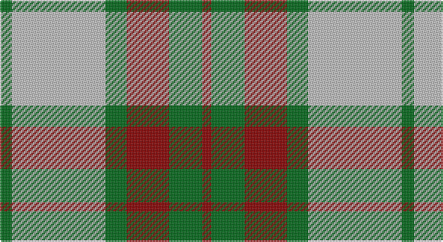

This page is one **sett** — a single exact thread-count. It belongs to the [tartan](/setts/g4lb31g7r14g11r3/)
(the same proportion at any scale), whose colour order is pattern [GWGRGR](/stripes/gwgrgr/).

Sourced from register-of-tartans.  It is a [6 stripe tartan](/stripes/stripes6/).

Original link https://www.tartanregister.gov.uk/tartanDetails.aspx?ref=1413

2 attestations — the source records this cloth was collapsed from (oldest owns this page)

<ul>
<li>01/01/2002 — Gleneagles USA (Dalgleish) (register-of-tartans, <a href="https://www.tartanregister.gov.uk/tartanDetails.aspx?ref=1413">record</a>)</li>
<li>pre 2002 — Gleneagles USA (Corporate) (tartans-authority, <a href="http://www.tartansauthority.com/tartan-ferret/display/5032/">record</a>)</li>
</ul>

## Register references

External register numbers recorded for this tartan.

- Scottish Register of Tartans: [1413](https://www.tartanregister.gov.uk/tartanDetails.aspx?ref=1413)
- Scottish Tartans Authority (ITI): 5032

## Thread count
G/8 N62 G14 DR28 G22 DR/6

One full sett is **266 threads**.

## Palette

Palette: <strong>Tartan Register</strong>
<table><thead><tr><th>Colour</th><th>Threads</th><th>Shade</th><th>Base</th><th>OKLCh</th></tr></thead><tbody><tr><td>G/</td><td style="text-align:right;font-variant-numeric:tabular-nums">8</td><td><code style="background-color:#006818;">#006818</code> <small style="color:#888">#006818</small></td><td>G <code style="background-color:#006100;">#006100</code></td><td><small style="color:#888">oklch(45.0% 0.142 145.0)</small></td></tr><tr><td>N</td><td style="text-align:right;font-variant-numeric:tabular-nums">62</td><td><code style="background-color:#C0C0C0;">#C0C0C0</code> <small style="color:#888">#C0C0C0</small></td><td>W <code style="background-color:#F7F7F7;">#F7F7F7</code></td><td><small style="color:#888">oklch(80.8% 0.000 89.9)</small></td></tr><tr><td>G</td><td style="text-align:right;font-variant-numeric:tabular-nums">14</td><td><code style="background-color:#006818;">#006818</code> <small style="color:#888">#006818</small></td><td>G <code style="background-color:#006100;">#006100</code></td><td><small style="color:#888">oklch(45.0% 0.142 145.0)</small></td></tr><tr><td>DR</td><td style="text-align:right;font-variant-numeric:tabular-nums">28</td><td><code style="background-color:#880000;">#880000</code> <small style="color:#888">#880000</small></td><td>R <code style="background-color:#CC0000;">#CC0000</code></td><td><small style="color:#888">oklch(39.4% 0.162 29.2)</small></td></tr><tr><td>G</td><td style="text-align:right;font-variant-numeric:tabular-nums">22</td><td><code style="background-color:#006818;">#006818</code> <small style="color:#888">#006818</small></td><td>G <code style="background-color:#006100;">#006100</code></td><td><small style="color:#888">oklch(45.0% 0.142 145.0)</small></td></tr><tr><td>DR/</td><td style="text-align:right;font-variant-numeric:tabular-nums">6</td><td><code style="background-color:#880000;">#880000</code> <small style="color:#888">#880000</small></td><td>R <code style="background-color:#CC0000;">#CC0000</code></td><td><small style="color:#888">oklch(39.4% 0.162 29.2)</small></td></tr></tbody></table>

# Sample pattern

## Nearest tartans

The nearest existing variants by ΔTartan distance, with this tartan at the top so the swatches line up against it.

ΔTartan

Tartan

Sett

—

<a href="/ttd/edit/#slug=g4lb31g7r14g11r3~x2">Gleneagles USA (Dalgleish)</a> <a class="nn-out" href="/variants/s6/g4lb31g7r14g11r3~x2/" title="open its dictionary page">↗</a>

1.04

<a href="/ttd/edit/#slug=y22dy2y2dy2y2dy14w16dy3~x2&amp;base=g4lb31g7r14g11r3~x2">Snaefell (District)</a> <a class="nn-out" href="/variants/s8/y22dy2y2dy2y2dy14w16dy3~x2/" title="open its dictionary page">↗</a>

1.08

<a href="/ttd/edit/#slug=lo22do2lo2do2lo2do15w17do3~x2&amp;base=g4lb31g7r14g11r3~x2">Turnberry Manx Snaefell Family Tartan</a> <a class="nn-out" href="/variants/s8/lo22do2lo2do2lo2do15w17do3~x2/" title="open its dictionary page">↗</a>

1.11

<a href="/ttd/edit/#slug=lo24dy3lo3dy3lo3dy20w22dy4~x2&amp;base=g4lb31g7r14g11r3~x2">Baillie Dress</a> <a class="nn-out" href="/variants/s8/lo24dy3lo3dy3lo3dy20w22dy4~x2/" title="open its dictionary page">↗</a>

1.20

<a href="/ttd/edit/#slug=r4lo30k6w13k13w3~x2&amp;base=g4lb31g7r14g11r3~x2">Thomson Camel</a> <a class="nn-out" href="/variants/s6/r4lo30k6w13k13w3~x2/" title="open its dictionary page">↗</a>

1.24

<a href="/ttd/edit/#slug=dy22do3dy3do3dy3do9lb28do3lb6~x2&amp;base=g4lb31g7r14g11r3~x2">Kildonan Brown (Fashion)</a> <a class="nn-out" href="/variants/s9/dy22do3dy3do3dy3do9lb28do3lb6~x2/" title="open its dictionary page">↗</a>

1.25

<a href="/ttd/edit/#slug=r4ly30k6w13k13w3~x2&amp;base=g4lb31g7r14g11r3~x2">Thomson, Camel (Fashion)</a> <a class="nn-out" href="/variants/s6/r4ly30k6w13k13w3~x2/" title="open its dictionary page">↗</a>

1.26

<a href="/ttd/edit/#slug=g1lb4dy12lb3dy6lb12g1lb1~x4&amp;base=g4lb31g7r14g11r3~x2">O'Neill Pipe Band 1970 (Corporate)</a> <a class="nn-out" href="/variants/s8/g1lb4dy12lb3dy6lb12g1lb1~x4/" title="open its dictionary page">↗</a>

1.26

<a href="/ttd/edit/#slug=y9do1y1do1y1do7w7do2~x4&amp;base=g4lb31g7r14g11r3~x2">Grey Watch, Dress</a> <a class="nn-out" href="/variants/s8/y9do1y1do1y1do7w7do2~x4/" title="open its dictionary page">↗</a>

1.30

<a href="/ttd/edit/#slug=r2lo20k5w10k10w2~x2&amp;base=g4lb31g7r14g11r3~x2">Thompson Camel Clan Tartan</a> <a class="nn-out" href="/variants/s6/r2lo20k5w10k10w2~x2/" title="open its dictionary page">↗</a>

1.33

<a href="/ttd/edit/#slug=k3g25o3k15lr24g3~x2&amp;base=g4lb31g7r14g11r3~x2">Un-named (D C Dalgliesh) #3</a> <a class="nn-out" href="/variants/s6/k3g25o3k15lr24g3~x2/" title="open its dictionary page">↗</a>

## Neighbour map

Every grey dot is one of 14360 variants placed by the first two principal components of the ΔTartan feature space (44% of its variance). Red is this tartan; blue dots are its nearest — click one to open its page.

<svg viewBox="0 0 640 380" role="img" style="max-width:100%;height:auto;border:1px solid #e0e0e0;border-radius:4px;display:block" xmlns="http://www.w3.org/2000/svg"><image href="/nn/cloud.v1.png" width="640" height="380"/><a href="/variants/s8/y22dy2y2dy2y2dy14w16dy3~x2/"><circle cx="247.0" cy="190.4" r="4" fill="#3465a4"><title>Snaefell (District)</title></circle></a><a href="/variants/s8/lo22do2lo2do2lo2do15w17do3~x2/"><circle cx="221.8" cy="175.9" r="4" fill="#3465a4"><title>Turnberry Manx Snaefell Family Tartan</title></circle></a><a href="/variants/s8/lo24dy3lo3dy3lo3dy20w22dy4~x2/"><circle cx="211.0" cy="202.2" r="4" fill="#3465a4"><title>Baillie Dress</title></circle></a><a href="/variants/s6/r4lo30k6w13k13w3~x2/"><circle cx="189.7" cy="187.9" r="4" fill="#3465a4"><title>Thomson Camel</title></circle></a><a href="/variants/s9/dy22do3dy3do3dy3do9lb28do3lb6~x2/"><circle cx="235.1" cy="180.5" r="4" fill="#3465a4"><title>Kildonan Brown (Fashion)</title></circle></a><a href="/variants/s6/r4ly30k6w13k13w3~x2/"><circle cx="185.0" cy="184.4" r="4" fill="#3465a4"><title>Thomson, Camel (Fashion)</title></circle></a><a href="/variants/s8/g1lb4dy12lb3dy6lb12g1lb1~x4/"><circle cx="303.3" cy="192.0" r="4" fill="#3465a4"><title>O'Neill Pipe Band 1970 (Corporate)</title></circle></a><a href="/variants/s8/y9do1y1do1y1do7w7do2~x4/"><circle cx="215.5" cy="202.7" r="4" fill="#3465a4"><title>Grey Watch, Dress</title></circle></a><a href="/variants/s6/r2lo20k5w10k10w2~x2/"><circle cx="175.6" cy="191.0" r="4" fill="#3465a4"><title>Thompson Camel Clan Tartan</title></circle></a><a href="/variants/s6/k3g25o3k15lr24g3~x2/"><circle cx="179.5" cy="206.9" r="4" fill="#3465a4"><title>Un-named (D C Dalgliesh) #3</title></circle></a><circle cx="239.4" cy="211.1" r="5" fill="#c00000"/></svg>

ID: /variants/s6/g4lb31g7r14g11r3~x2/
