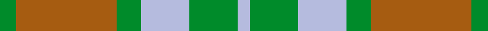

This is one **variant** — a specific cloth: this exact thread count and colourway, with its own
provenance below. It is one weaving of the [sett](/setts/g4o25g6lb12g12lb3/) (the scale-free proportion — the
same cloth at any scale or shade), whose colour order is pattern [GRGWGW](/stripes/grgwgw/).

Sourced from weddslist.  It is a [6 stripe tartan](/stripes/stripes6/).

Original link [http://www.weddslist.com/cgi-bin/tartans/pg.pl?source=sts](http://www.weddslist.com/cgi-bin/tartans/pg.pl?source=sts)

Dataset <small>— provenance for this record, inherited from the source manifest</small>

<dl class="dataset-prov">
<dt>source</dt><dd><a href="/sources/weddslist/">Weddslist</a></dd>
<dt>data captured from</dt><dd><a href="https://github.com/thetartan/tartan-database/blob/master/data/weddslist/data.csv">https://github.com/thetartan/tartan-database/blob/master/data/weddslist/data.csv</a></dd>
<dt>data date</dt><dd>2016-11-17 <small>(dataset default)</small></dd>
<dt>licence</dt><dd><a href="https://creativecommons.org/licenses/by-nc-nd/4.0/">CC BY-NC-ND 4.0</a></dd>
</dl>

Capture chain <small>— the hands this data passed through, oldest first; each capture carries its own licence</small>

<ol class="capture-chain">
<li><a href="https://www.weddslist.com/tartans/">Weddslist</a> <small>the living privately compiled reference</small></li>
<li><a href="https://github.com/thetartan/tartan-database">thetartan/tartan-database</a> <small>2016-2017</small> · <a href="https://creativecommons.org/licenses/by-nc-nd/4.0/">CC BY-NC-ND 4.0</a> <small>Levko Kravets's frozen compilation — the capture we vendored, and where its CC licence text came from</small></li>
<li>this dictionary <small>captured 2026-06-10 · commit 5bf86c7566</small> <small>each re-capture is a git commit to data/sources</small></li>
</ol>

## Thread count
G/8 O50 G12 LB24 G24 LB/6

One full sett is **234 threads**.

## Palette
<table><thead><tr><th>Colour</th><th>Shade</th><th>OKLCh</th></tr></thead><tbody><tr><td>LB</td><td><code style="background-color:#B5BBDE;">#B5BBDE</code> <small style="color:#888">#B5BBDE</small></td><td><small style="color:#888">oklch(79.9% 0.050 277.6)</small></td></tr><tr><td>G</td><td><code style="background-color:#008B2A;">#008B2A</code> <small style="color:#888">#008B2A</small></td><td><small style="color:#888">oklch(55.4% 0.170 145.9)</small></td></tr><tr><td>O</td><td><code style="background-color:#A65C11;">#A65C11</code> <small style="color:#888">#A65C11</small></td><td><small style="color:#888">oklch(55.0% 0.125 58.3)</small></td></tr></tbody></table>

# Sample pattern

## Nearest tartan variants

The nearest existing variants by ΔTartan distance, with this cloth at the top so the swatches line up against it.

ΔTartan

Threads

Variant

Sett

—

234

<a href="/variants/s6/g4o25g6lb12g12lb3~x2/">Canadian Fancy</a>

<a href="/ttd/edit/#slug=g4dy25g6db12g12db3~x2&amp;base=g4o25g6lb12g12lb3~x2" title="compare in the TTD">1.40</a>

234

<a href="/variants/s6/g4dy25g6db12g12db3~x2/">Canadian Fancy</a>

<a href="/ttd/edit/#slug=g2b10o15g10b2~x4&amp;base=g4o25g6lb12g12lb3~x2" title="compare in the TTD">1.57</a>

296

<a href="/variants/s5/g2b10o15g10b2~x4/">Harmony, 6</a>

<a href="/ttd/edit/#slug=o28g2o4db18g23db2g3oi4~x2~o2102055-oi2104058&amp;base=g4o25g6lb12g12lb3~x2" title="compare in the TTD">1.79</a>

272

<a href="/variants/s8/o28g2o4db18g23db2g3oi4~x2~o2102055-oi2104058/">Dalbraith-Eastern Western Motor Group</a>

<a href="/ttd/edit/#slug=dg3lb12dg10lb6dg8g6dg8o23oi3~x2~dg1806142-g2408144-o2005046-oi2007033&amp;base=g4o25g6lb12g12lb3~x2" title="compare in the TTD">2.18</a>

304

<a href="/variants/s9/dg3lb12dg10lb6dg8g6dg8o23oi3~x2~dg1806142-g2408144-o2005046-oi2007033/">Lawrence's Seven Pillars of Khaki</a>

<a href="/ttd/edit/#slug=o2g10dy15o10g2~x4&amp;base=g4o25g6lb12g12lb3~x2" title="compare in the TTD">2.88</a>

296

<a href="/variants/s5/o2g10dy15o10g2~x4/">Harmony 6</a>

<a href="/ttd/edit/#slug=dg2r1dg8r5g5r1g2~x4~dg1405139-g2104115&amp;base=g4o25g6lb12g12lb3~x2" title="compare in the TTD">3.00</a>

176

<a href="/variants/s7/dg2r1dg8r5g5r1g2~x4~dg1405139-g2104115/">Glen Esk (Fashion)</a>

<a href="/ttd/edit/#slug=r2ly1t8r1g7ly1r2~x6&amp;base=g4o25g6lb12g12lb3~x2" title="compare in the TTD">3.01</a>

240

<a href="/variants/s7/r2ly1t8r1g7ly1r2~x6/">Cercle de Fermieres de St-Elie . . .</a>

<a href="/ttd/edit/#slug=g3b3g19b18r19b3~x2&amp;base=g4o25g6lb12g12lb3~x2" title="compare in the TTD">3.16</a>

248

<a href="/variants/s6/g3b3g19b18r19b3~x2/">MacNab 1</a>

<a href="/ttd/edit/#slug=lb60g9r7ly12g33ly33lb26&amp;base=g4o25g6lb12g12lb3~x2" title="compare in the TTD">3.21</a>

274

<a href="/variants/s7/lb60g9r7ly12g33ly33lb26/">Supporter.com</a>

<a href="/ttd/edit/#slug=dg2r1dg8r5g5r1g2~x4~dg1504144-g1903114&amp;base=g4o25g6lb12g12lb3~x2" title="compare in the TTD">3.23</a>

176

<a href="/variants/s7/dg2r1dg8r5g5r1g2~x4~dg1504144-g1903114/">Glen Esk (1993)</a>

## Neighbour map

Every grey dot is one of 13621 variants placed by the first two principal components of the ΔTartan feature space (42% of its variance). Red is this tartan; blue dots are its nearest — click one to open its page.

<svg viewBox="0 0 640 380" role="img" style="max-width:100%;height:auto;border:1px solid #e0e0e0;border-radius:4px;display:block" xmlns="http://www.w3.org/2000/svg"><image href="/nn/cloud.v1.png" width="640" height="380"/><a href="/variants/s6/g4dy25g6db12g12db3~x2/"><circle cx="298.4" cy="279.4" r="4" fill="#3465a4"><title>Canadian Fancy</title></circle></a><a href="/variants/s5/g2b10o15g10b2~x4/"><circle cx="303.1" cy="296.5" r="4" fill="#3465a4"><title>Harmony, 6</title></circle></a><a href="/variants/s8/o28g2o4db18g23db2g3oi4~x2~o2102055-oi2104058/"><circle cx="286.8" cy="207.4" r="4" fill="#3465a4"><title>Dalbraith-Eastern Western Motor Group</title></circle></a><a href="/variants/s9/dg3lb12dg10lb6dg8g6dg8o23oi3~x2~dg1806142-g2408144-o2005046-oi2007033/"><circle cx="187.8" cy="229.8" r="4" fill="#3465a4"><title>Lawrence's Seven Pillars of Khaki</title></circle></a><a href="/variants/s5/o2g10dy15o10g2~x4/"><circle cx="290.5" cy="290.2" r="4" fill="#3465a4"><title>Harmony 6</title></circle></a><a href="/variants/s7/dg2r1dg8r5g5r1g2~x4~dg1405139-g2104115/"><circle cx="301.5" cy="264.7" r="4" fill="#3465a4"><title>Glen Esk (Fashion)</title></circle></a><a href="/variants/s7/r2ly1t8r1g7ly1r2~x6/"><circle cx="241.7" cy="234.1" r="4" fill="#3465a4"><title>Cercle de Fermieres de St-Elie . . .</title></circle></a><a href="/variants/s6/g3b3g19b18r19b3~x2/"><circle cx="250.2" cy="270.4" r="4" fill="#3465a4"><title>MacNab 1</title></circle></a><a href="/variants/s7/lb60g9r7ly12g33ly33lb26/"><circle cx="292.6" cy="255.1" r="4" fill="#3465a4"><title>Supporter.com</title></circle></a><a href="/variants/s7/dg2r1dg8r5g5r1g2~x4~dg1504144-g1903114/"><circle cx="318.0" cy="270.5" r="4" fill="#3465a4"><title>Glen Esk (1993)</title></circle></a><circle cx="301.4" cy="273.4" r="5" fill="#c00000"/><text x="320" y="376" text-anchor="middle" font-size="11" fill="#999">ground</text><text x="11" y="190" text-anchor="middle" font-size="11" fill="#999" transform="rotate(-90 11 190)">complexity</text></svg>

ID: /variants/s6/g4o25g6lb12g12lb3~x2/
