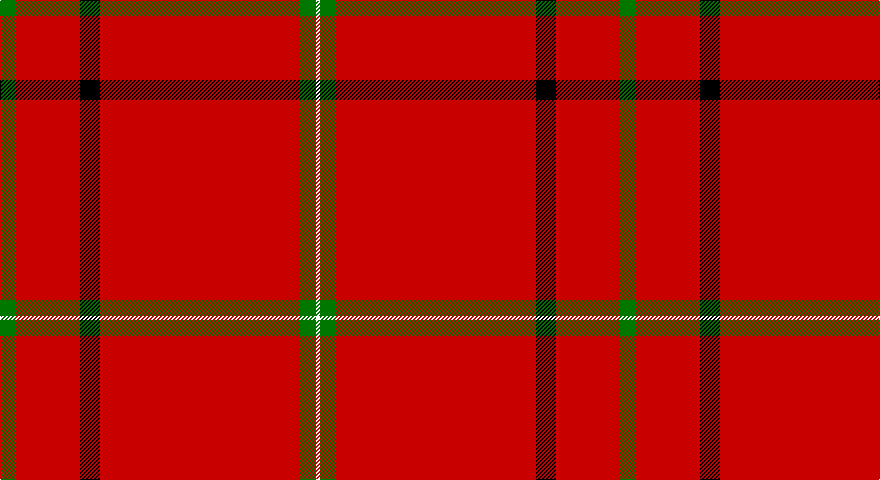

This page is one **sett** — a single exact thread-count. It belongs to the [tartan](/setts/g4r16k5r50g4w1/)
(the same proportion at any scale), whose colour order is pattern [GRKRGW](/stripes/grkrgw/).

Sourced from register-of-tartans.  It is a [6 stripe tartan](/stripes/stripes6/).

Original link https://www.tartanregister.gov.uk/tartanDetails.aspx?ref=614

2 attestations — the source records this cloth was collapsed from (oldest owns this page)

<ul>
<li>01/01/1972 — Chalet (register-of-tartans, <a href="https://www.tartanregister.gov.uk/tartanDetails.aspx?ref=614">record</a>)</li>
<li>1972 — Chalet (Fashion) (tartans-authority, <a href="http://www.tartansauthority.com/tartan-ferret/display/4489/">record</a>)</li>
</ul>

## Register references

External register numbers recorded for this tartan.

- Scottish Register of Tartans: [614](https://www.tartanregister.gov.uk/tartanDetails.aspx?ref=614)
- Scottish Tartans Authority (ITI): 4489

## Thread count
G/16 R64 K20 R200 G16 W/4

One full sett is **620 threads**.

## Palette

Palette: <strong>Tartan Register</strong>
<table><thead><tr><th>Colour</th><th>Threads</th><th>Shade</th><th>Base</th><th>OKLCh</th></tr></thead><tbody><tr><td>G/</td><td style="text-align:right;font-variant-numeric:tabular-nums">16</td><td><code style="background-color:#007800;">#007800</code> <small style="color:#888">#007800</small></td><td>G <code style="background-color:#006100;">#006100</code></td><td><small style="color:#888">oklch(49.6% 0.169 142.5)</small></td></tr><tr><td>R</td><td style="text-align:right;font-variant-numeric:tabular-nums">64</td><td><code style="background-color:#C80000;">#C80000</code> <small style="color:#888">#C80000</small></td><td>R <code style="background-color:#CC0000;">#CC0000</code></td><td><small style="color:#888">oklch(52.3% 0.215 29.2)</small></td></tr><tr><td>K</td><td style="text-align:right;font-variant-numeric:tabular-nums">20</td><td><code style="background-color:#000000;">#000000</code> <small style="color:#888">#000000</small></td><td>K <code style="background-color:#000000;">#000000</code></td><td><small style="color:#888">oklch(0.0% 0.000 0.0)</small></td></tr><tr><td>R</td><td style="text-align:right;font-variant-numeric:tabular-nums">200</td><td><code style="background-color:#C80000;">#C80000</code> <small style="color:#888">#C80000</small></td><td>R <code style="background-color:#CC0000;">#CC0000</code></td><td><small style="color:#888">oklch(52.3% 0.215 29.2)</small></td></tr><tr><td>G</td><td style="text-align:right;font-variant-numeric:tabular-nums">16</td><td><code style="background-color:#007800;">#007800</code> <small style="color:#888">#007800</small></td><td>G <code style="background-color:#006100;">#006100</code></td><td><small style="color:#888">oklch(49.6% 0.169 142.5)</small></td></tr><tr><td>W/</td><td style="text-align:right;font-variant-numeric:tabular-nums">4</td><td><code style="background-color:#FCFCFC;">#FCFCFC</code> <small style="color:#888">#FCFCFC</small></td><td>W <code style="background-color:#F7F7F7;">#F7F7F7</code></td><td><small style="color:#888">oklch(99.1% 0.000 89.9)</small></td></tr></tbody></table>

# Sample pattern

## Nearest tartans

The nearest existing variants by ΔTartan distance, with this tartan at the top so the swatches line up against it.

ΔTartan

Tartan

Sett

—

<a href="/ttd/edit/#slug=g4r16k5r50g4w1~x4">Chalet</a> <a class="nn-out" href="/variants/s6/g4r16k5r50g4w1~x4/" title="open its dictionary page">↗</a>

0.91

<a href="/ttd/edit/#slug=r65w1r6k8g8r6k3r11~x2&amp;base=g4r16k5r50g4w1~x4">Gudbrandsdalen, Rondastakken #2</a> <a class="nn-out" href="/variants/s8/r65w1r6k8g8r6k3r11~x2/" title="open its dictionary page">↗</a>

1.31

<a href="/ttd/edit/#slug=ly2k3r31w1~x4&amp;base=g4r16k5r50g4w1~x4">Riddick Furya</a> <a class="nn-out" href="/variants/s4/ly2k3r31w1~x4/" title="open its dictionary page">↗</a>

1.38

<a href="/ttd/edit/#slug=r72k8r4g16r7o2~x2&amp;base=g4r16k5r50g4w1~x4">MacAndrew Dress (Name)</a> <a class="nn-out" href="/variants/s6/r72k8r4g16r7o2~x2/" title="open its dictionary page">↗</a>

1.38

<a href="/ttd/edit/#slug=r39dg6r2dg3w1~x2&amp;base=g4r16k5r50g4w1~x4">MacGregor #2</a> <a class="nn-out" href="/variants/s5/r39dg6r2dg3w1~x2/" title="open its dictionary page">↗</a>

1.43

<a href="/ttd/edit/#slug=r42db4ly1db6dg1db1dg1r12~x2&amp;base=g4r16k5r50g4w1~x4">Inverness Earl of</a> <a class="nn-out" href="/variants/s8/r42db4ly1db6dg1db1dg1r12~x2/" title="open its dictionary page">↗</a>

1.45

<a href="/ttd/edit/#slug=r72k6lb2k11ly2db2ly2r18~x2&amp;base=g4r16k5r50g4w1~x4">Princess Elizabeth (Royal)</a> <a class="nn-out" href="/variants/s8/r72k6lb2k11ly2db2ly2r18~x2/" title="open its dictionary page">↗</a>

1.46

<a href="/ttd/edit/#slug=r20k1ly3k1r60k30r48k4~x2&amp;base=g4r16k5r50g4w1~x4">Barkwell (Personal)</a> <a class="nn-out" href="/variants/s8/r20k1ly3k1r60k30r48k4~x2/" title="open its dictionary page">↗</a>

1.50

<a href="/ttd/edit/#slug=r114g10w3g16ly3g3ly3r28~x2&amp;base=g4r16k5r50g4w1~x4">Duke of Sussex (Earl of Inverness)</a> <a class="nn-out" href="/variants/s8/r114g10w3g16ly3g3ly3r28~x2/" title="open its dictionary page">↗</a>

1.55

<a href="/ttd/edit/#slug=r42k4w1k6ly1db1ly1r12~x2&amp;base=g4r16k5r50g4w1~x4">Princess Elizabeth</a> <a class="nn-out" href="/variants/s8/r42k4w1k6ly1db1ly1r12~x2/" title="open its dictionary page">↗</a>

1.56

<a href="/ttd/edit/#slug=r65w2r3ri4dg11r3dg3r11&amp;base=g4r16k5r50g4w1~x4">Gudbrandsdalen, Rondastakken</a> <a class="nn-out" href="/variants/s8/r65w2r3ri4dg11r3dg3r11/" title="open its dictionary page">↗</a>

## Neighbour map

Every grey dot is one of 14360 variants placed by the first two principal components of the ΔTartan feature space (44% of its variance). Red is this tartan; blue dots are its nearest — click one to open its page.

<svg viewBox="0 0 640 380" role="img" style="max-width:100%;height:auto;border:1px solid #e0e0e0;border-radius:4px;display:block" xmlns="http://www.w3.org/2000/svg"><image href="/nn/cloud.v1.png" width="640" height="380"/><a href="/variants/s8/r65w1r6k8g8r6k3r11~x2/"><circle cx="614.9" cy="101.1" r="4" fill="#3465a4"><title>Gudbrandsdalen, Rondastakken #2</title></circle></a><a href="/variants/s4/ly2k3r31w1~x4/"><circle cx="598.1" cy="143.6" r="4" fill="#3465a4"><title>Riddick Furya</title></circle></a><a href="/variants/s6/r72k8r4g16r7o2~x2/"><circle cx="561.8" cy="132.8" r="4" fill="#3465a4"><title>MacAndrew Dress (Name)</title></circle></a><a href="/variants/s5/r39dg6r2dg3w1~x2/"><circle cx="626.0" cy="145.8" r="4" fill="#3465a4"><title>MacGregor #2</title></circle></a><a href="/variants/s8/r42db4ly1db6dg1db1dg1r12~x2/"><circle cx="605.6" cy="102.8" r="4" fill="#3465a4"><title>Inverness Earl of</title></circle></a><a href="/variants/s8/r72k6lb2k11ly2db2ly2r18~x2/"><circle cx="549.6" cy="84.6" r="4" fill="#3465a4"><title>Princess Elizabeth (Royal)</title></circle></a><a href="/variants/s8/r20k1ly3k1r60k30r48k4~x2/"><circle cx="559.2" cy="132.6" r="4" fill="#3465a4"><title>Barkwell (Personal)</title></circle></a><a href="/variants/s8/r114g10w3g16ly3g3ly3r28~x2/"><circle cx="599.5" cy="109.3" r="4" fill="#3465a4"><title>Duke of Sussex (Earl of Inverness)</title></circle></a><a href="/variants/s8/r42k4w1k6ly1db1ly1r12~x2/"><circle cx="542.8" cy="72.1" r="4" fill="#3465a4"><title>Princess Elizabeth</title></circle></a><a href="/variants/s8/r65w2r3ri4dg11r3dg3r11/"><circle cx="611.8" cy="119.8" r="4" fill="#3465a4"><title>Gudbrandsdalen, Rondastakken</title></circle></a><circle cx="603.9" cy="114.5" r="5" fill="#c00000"/></svg>

ID: /variants/s6/g4r16k5r50g4w1~x4/
