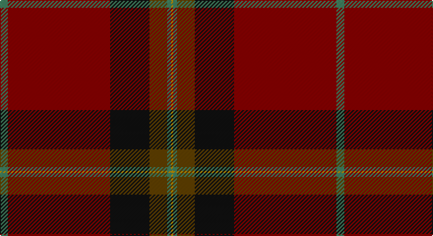

This page is one **sett** — a single exact thread-count. It belongs to the [tartan](/setts/g4r52k20dy9g2lo1/)
(the same proportion at any scale), whose colour order is pattern [GRKGGY](/stripes/grkggy/).

Sourced from tartans-authority.  It is a [6 stripe tartan](/stripes/stripes6/).

Original link http://www.tartansauthority.com/tartan-ferret/display/10719/

## Register references

External register numbers recorded for this tartan.

- Scottish Register of Tartans: [10719](https://www.tartanregister.gov.uk/tartanDetails?ref=10719)
- Scottish Tartans Authority (ITI): 10719

## Thread count
G/8 DR104 K40 T18 G4 DY/2

One full sett is **342 threads**.

## Palette

Palette: <strong>Tartan Register</strong>
<table><thead><tr><th>Colour</th><th>Threads</th><th>Shade</th><th>Base</th><th>OKLCh</th></tr></thead><tbody><tr><td>G/</td><td style="text-align:right;font-variant-numeric:tabular-nums">8</td><td><code style="background-color:#408060;">#408060</code> <small style="color:#888">#408060</small></td><td>G <code style="background-color:#006100;">#006100</code></td><td><small style="color:#888">oklch(54.8% 0.084 160.1)</small></td></tr><tr><td>DR</td><td style="text-align:right;font-variant-numeric:tabular-nums">104</td><td><code style="background-color:#880000;">#880000</code> <small style="color:#888">#880000</small></td><td>R <code style="background-color:#CC0000;">#CC0000</code></td><td><small style="color:#888">oklch(39.4% 0.162 29.2)</small></td></tr><tr><td>K</td><td style="text-align:right;font-variant-numeric:tabular-nums">40</td><td><code style="background-color:#101010;">#101010</code> <small style="color:#888">#101010</small></td><td>K <code style="background-color:#000000;">#000000</code></td><td><small style="color:#888">oklch(17.3% 0.000 89.9)</small></td></tr><tr><td>T</td><td style="text-align:right;font-variant-numeric:tabular-nums">18</td><td><code style="background-color:#604000;">#604000</code> <small style="color:#888">#604000</small></td><td>G <code style="background-color:#006100;">#006100</code></td><td><small style="color:#888">oklch(39.8% 0.083 76.8)</small></td></tr><tr><td>G</td><td style="text-align:right;font-variant-numeric:tabular-nums">4</td><td><code style="background-color:#408060;">#408060</code> <small style="color:#888">#408060</small></td><td>G <code style="background-color:#006100;">#006100</code></td><td><small style="color:#888">oklch(54.8% 0.084 160.1)</small></td></tr><tr><td>DY/</td><td style="text-align:right;font-variant-numeric:tabular-nums">2</td><td><code style="background-color:#BC8C00;">#BC8C00</code> <small style="color:#888">#BC8C00</small></td><td>Y <code style="background-color:#F2BF00;">#F2BF00</code></td><td><small style="color:#888">oklch(66.8% 0.137 84.1)</small></td></tr></tbody></table>

# Sample pattern

## Nearest tartans

The nearest existing variants by ΔTartan distance, with this tartan at the top so the swatches line up against it.

ΔTartan

Tartan

Sett

—

<a href="/ttd/edit/#slug=g4r52k20dy9g2lo1~x2">Jack (Personal)</a> <a class="nn-out" href="/variants/s6/g4r52k20dy9g2lo1~x2/" title="open its dictionary page">↗</a>

1.29

<a href="/ttd/edit/#slug=lo1ri45dt23w1dt6r2lo1r2lo1~x2&amp;base=g4r52k20dy9g2lo1~x2">Arbroath Smokie</a> <a class="nn-out" href="/variants/s9/lo1ri45dt23w1dt6r2lo1r2lo1~x2/" title="open its dictionary page">↗</a>

1.37

<a href="/ttd/edit/#slug=dg2lo1dg11r50lo12db2lo4db2~x2&amp;base=g4r52k20dy9g2lo1~x2">Slessor (Personal)</a> <a class="nn-out" href="/variants/s8/dg2lo1dg11r50lo12db2lo4db2~x2/" title="open its dictionary page">↗</a>

1.57

<a href="/ttd/edit/#slug=r4k2dg28r38k1ly4~x2&amp;base=g4r52k20dy9g2lo1~x2">Wcwm 9275 5471-1</a> <a class="nn-out" href="/variants/s6/r4k2dg28r38k1ly4~x2/" title="open its dictionary page">↗</a>

1.63

<a href="/ttd/edit/#slug=r36dg18r4dg6k1lr2~x2&amp;base=g4r52k20dy9g2lo1~x2">MacGregor</a> <a class="nn-out" href="/variants/s6/r36dg18r4dg6k1lr2~x2/" title="open its dictionary page">↗</a>

1.63

<a href="/ttd/edit/#slug=r36dg18r4dg6k1lr2&amp;base=g4r52k20dy9g2lo1~x2">MacGregor</a> <a class="nn-out" href="/variants/s6/r36dg18r4dg6k1lr2/" title="open its dictionary page">↗</a>

1.68

<a href="/ttd/edit/#slug=y8r6k4r64o1k28r6y40r6k4~x2&amp;base=g4r52k20dy9g2lo1~x2">Laporte</a> <a class="nn-out" href="/variants/s10/y8r6k4r64o1k28r6y40r6k4~x2/" title="open its dictionary page">↗</a>

1.70

<a href="/ttd/edit/#slug=oi64dr9o11dr4lb2lo2n5dr2lo13~x2&amp;base=g4r52k20dy9g2lo1~x2">Down, County</a> <a class="nn-out" href="/variants/s9/oi64dr9o11dr4lb2lo2n5dr2lo13~x2/" title="open its dictionary page">↗</a>

1.76

<a href="/ttd/edit/#slug=r26n4r1p2dg1n4dg14w2~x2&amp;base=g4r52k20dy9g2lo1~x2">Redpath, Robert A (Personal)</a> <a class="nn-out" href="/variants/s8/r26n4r1p2dg1n4dg14w2~x2/" title="open its dictionary page">↗</a>

1.77

<a href="/ttd/edit/#slug=r6lo1r24dg6db2k1db2k1db12r1~x2&amp;base=g4r52k20dy9g2lo1~x2">MacEdward (MacGregor Hastie)</a> <a class="nn-out" href="/variants/s10/r6lo1r24dg6db2k1db2k1db12r1~x2/" title="open its dictionary page">↗</a>

1.79

<a href="/ttd/edit/#slug=o36k3dy3r1dy3k3o4dy6k1r2~x4&amp;base=g4r52k20dy9g2lo1~x2">Moulin</a> <a class="nn-out" href="/variants/s10/o36k3dy3r1dy3k3o4dy6k1r2~x4/" title="open its dictionary page">↗</a>

## Neighbour map

Every grey dot is one of 14360 variants placed by the first two principal components of the ΔTartan feature space (44% of its variance). Red is this tartan; blue dots are its nearest — click one to open its page.

<svg viewBox="0 0 640 380" role="img" style="max-width:100%;height:auto;border:1px solid #e0e0e0;border-radius:4px;display:block" xmlns="http://www.w3.org/2000/svg"><image href="/nn/cloud.v1.png" width="640" height="380"/><a href="/variants/s9/lo1ri45dt23w1dt6r2lo1r2lo1~x2/"><circle cx="432.7" cy="100.2" r="4" fill="#3465a4"><title>Arbroath Smokie</title></circle></a><a href="/variants/s8/dg2lo1dg11r50lo12db2lo4db2~x2/"><circle cx="458.8" cy="116.0" r="4" fill="#3465a4"><title>Slessor (Personal)</title></circle></a><a href="/variants/s6/r4k2dg28r38k1ly4~x2/"><circle cx="412.8" cy="158.5" r="4" fill="#3465a4"><title>Wcwm 9275 5471-1</title></circle></a><a href="/variants/s6/r36dg18r4dg6k1lr2~x2/"><circle cx="450.0" cy="156.5" r="4" fill="#3465a4"><title>MacGregor</title></circle></a><a href="/variants/s6/r36dg18r4dg6k1lr2/"><circle cx="450.0" cy="156.5" r="4" fill="#3465a4"><title>MacGregor</title></circle></a><a href="/variants/s10/y8r6k4r64o1k28r6y40r6k4~x2/"><circle cx="394.1" cy="130.0" r="4" fill="#3465a4"><title>Laporte</title></circle></a><a href="/variants/s9/oi64dr9o11dr4lb2lo2n5dr2lo13~x2/"><circle cx="389.9" cy="96.8" r="4" fill="#3465a4"><title>Down, County</title></circle></a><a href="/variants/s8/r26n4r1p2dg1n4dg14w2~x2/"><circle cx="346.6" cy="140.2" r="4" fill="#3465a4"><title>Redpath, Robert A (Personal)</title></circle></a><a href="/variants/s10/r6lo1r24dg6db2k1db2k1db12r1~x2/"><circle cx="393.8" cy="141.8" r="4" fill="#3465a4"><title>MacEdward (MacGregor Hastie)</title></circle></a><a href="/variants/s10/o36k3dy3r1dy3k3o4dy6k1r2~x4/"><circle cx="503.3" cy="128.5" r="4" fill="#3465a4"><title>Moulin</title></circle></a><circle cx="446.2" cy="136.2" r="5" fill="#c00000"/></svg>

ID: /variants/s6/g4r52k20dy9g2lo1~x2/
