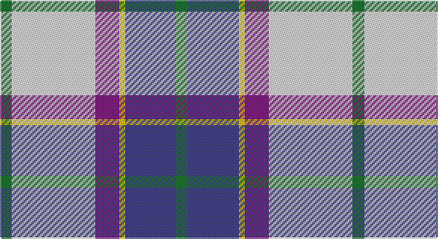

This page is one **sett** — a single exact thread-count. It belongs to the [tartan](/setts/g4w28dp8ly2db17g4/)
(the same proportion at any scale), whose colour order is pattern [GBYBWG](/stripes/gbybwg/).

Sourced from register-of-tartans.  It is a [6 stripe tartan](/stripes/stripes6/).

Original link https://www.tartanregister.gov.uk/tartanDetails.aspx?ref=2814

## Provenance

Earliest known date: 1984. Sample loaned by Dr. D.G. Teall in 1985

## Also known as

This cloth is also recorded under:

- Manx, dress

2 attestations — the source records this cloth was collapsed from (oldest owns this page)

<ul>
<li>01/01/1981 — Manx Dress (register-of-tartans, <a href="https://www.tartanregister.gov.uk/tartanDetails.aspx?ref=2814">record</a>)</li>
<li>undated — Manx Dress District Tartan (house-of-tartan, <a href="http://www.house-of-tartan.scotland.net/house/TartanViewjs.asp?colr=Def&tnam=748">record</a>)</li>
</ul>

## Register references

External register numbers recorded for this tartan.

- Scottish Register of Tartans: [2814](https://www.tartanregister.gov.uk/tartanDetails.aspx?ref=2814)
- Scottish Tartans Authority (ITI): 748
- Scottish Tartans World Register: 748

## Thread count
G/8 LN56 P16 Y4 DB34 G/8

One full sett is **236 threads**.

## Palette

Palette: <strong>Tartan Register</strong>
<table><thead><tr><th>Colour</th><th>Threads</th><th>Shade</th><th>Base</th><th>OKLCh</th></tr></thead><tbody><tr><td>G/</td><td style="text-align:right;font-variant-numeric:tabular-nums">8</td><td><code style="background-color:#006818;">#006818</code> <small style="color:#888">#006818</small></td><td>G <code style="background-color:#006100;">#006100</code></td><td><small style="color:#888">oklch(45.0% 0.142 145.0)</small></td></tr><tr><td>LN</td><td style="text-align:right;font-variant-numeric:tabular-nums">56</td><td><code style="background-color:#E0E0E0;">#E0E0E0</code> <small style="color:#888">#E0E0E0</small></td><td>W <code style="background-color:#F7F7F7;">#F7F7F7</code></td><td><small style="color:#888">oklch(90.7% 0.000 89.9)</small></td></tr><tr><td>P</td><td style="text-align:right;font-variant-numeric:tabular-nums">16</td><td><code style="background-color:#780078;">#780078</code> <small style="color:#888">#780078</small></td><td>B <code style="background-color:#2A418A;">#2A418A</code></td><td><small style="color:#888">oklch(40.2% 0.185 328.4)</small></td></tr><tr><td>Y</td><td style="text-align:right;font-variant-numeric:tabular-nums">4</td><td><code style="background-color:#E8C000;">#E8C000</code> <small style="color:#888">#E8C000</small></td><td>Y <code style="background-color:#F2BF00;">#F2BF00</code></td><td><small style="color:#888">oklch(81.9% 0.168 93.7)</small></td></tr><tr><td>DB</td><td style="text-align:right;font-variant-numeric:tabular-nums">34</td><td><code style="background-color:#2C2C80;">#2C2C80</code> <small style="color:#888">#2C2C80</small></td><td>B <code style="background-color:#2A418A;">#2A418A</code></td><td><small style="color:#888">oklch(35.0% 0.138 276.6)</small></td></tr><tr><td>G/</td><td style="text-align:right;font-variant-numeric:tabular-nums">8</td><td><code style="background-color:#006818;">#006818</code> <small style="color:#888">#006818</small></td><td>G <code style="background-color:#006100;">#006100</code></td><td><small style="color:#888">oklch(45.0% 0.142 145.0)</small></td></tr></tbody></table>

# Sample pattern

## Nearest tartans

The nearest existing variants by ΔTartan distance, with this tartan at the top so the swatches line up against it.

ΔTartan

Tartan

Sett

—

<a href="/ttd/edit/#slug=g4w28dp8ly2db17g4~x2">Manx Dress</a> <a class="nn-out" href="/variants/s6/g4w28dp8ly2db17g4~x2/" title="open its dictionary page">↗</a>

0.35

<a href="/ttd/edit/#slug=g4w28p8ly2db17g4~x2&amp;base=g4w28dp8ly2db17g4~x2">Manx, dress</a> <a class="nn-out" href="/variants/s6/g4w28p8ly2db17g4~x2/" title="open its dictionary page">↗</a>

0.82

<a href="/ttd/edit/#slug=w8g5t10dp24w30g2lp2~x2&amp;base=g4w28dp8ly2db17g4~x2">Shiel, Purple (Dance)</a> <a class="nn-out" href="/variants/s7/w8g5t10dp24w30g2lp2~x2/" title="open its dictionary page">↗</a>

0.87

<a href="/ttd/edit/#slug=r15t98db72ly25db8w15&amp;base=g4w28dp8ly2db17g4~x2">Afternoon Tea / Earl Grey</a> <a class="nn-out" href="/variants/s6/r15t98db72ly25db8w15/" title="open its dictionary page">↗</a>

0.88

<a href="/ttd/edit/#slug=w28t19dbi19w4db2lp2dbi7~x2&amp;base=g4w28dp8ly2db17g4~x2">St Andrews Dress, Earl of.. District Tartan</a> <a class="nn-out" href="/variants/s7/w28t19dbi19w4db2lp2dbi7~x2/" title="open its dictionary page">↗</a>

0.90

<a href="/ttd/edit/#slug=w28t19dbi19w4db2p2dbi7~x2&amp;base=g4w28dp8ly2db17g4~x2">St. Andrews Dress, Earl of (Danc</a> <a class="nn-out" href="/variants/s7/w28t19dbi19w4db2p2dbi7~x2/" title="open its dictionary page">↗</a>

0.92

<a href="/ttd/edit/#slug=w8b5t10dp24w30b2dg2~x2&amp;base=g4w28dp8ly2db17g4~x2">Shiel, Magenta (Dance)</a> <a class="nn-out" href="/variants/s7/w8b5t10dp24w30b2dg2~x2/" title="open its dictionary page">↗</a>

0.94

<a href="/ttd/edit/#slug=r2db14k6g1w12g1w2~x4&amp;base=g4w28dp8ly2db17g4~x2">Davidson (Wedding) (Personal)</a> <a class="nn-out" href="/variants/s7/r2db14k6g1w12g1w2~x4/" title="open its dictionary page">↗</a>

0.95

<a href="/ttd/edit/#slug=t17k12w9m2w9g1w2~x4&amp;base=g4w28dp8ly2db17g4~x2">Ferguson Dress</a> <a class="nn-out" href="/variants/s7/t17k12w9m2w9g1w2~x4/" title="open its dictionary page">↗</a>

0.96

<a href="/ttd/edit/#slug=t34db24w18r3w18g2w3~x2&amp;base=g4w28dp8ly2db17g4~x2">Ferguson, dress</a> <a class="nn-out" href="/variants/s7/t34db24w18r3w18g2w3~x2/" title="open its dictionary page">↗</a>

0.96

<a href="/ttd/edit/#slug=g4w28db14ly2t17g4~x2&amp;base=g4w28dp8ly2db17g4~x2">Allanton Dress (Fashion)</a> <a class="nn-out" href="/variants/s6/g4w28db14ly2t17g4~x2/" title="open its dictionary page">↗</a>

## Neighbour map

Every grey dot is one of 14360 variants placed by the first two principal components of the ΔTartan feature space (44% of its variance). Red is this tartan; blue dots are its nearest — click one to open its page.

<svg viewBox="0 0 640 380" role="img" style="max-width:100%;height:auto;border:1px solid #e0e0e0;border-radius:4px;display:block" xmlns="http://www.w3.org/2000/svg"><image href="/nn/cloud.v1.png" width="640" height="380"/><a href="/variants/s6/g4w28p8ly2db17g4~x2/"><circle cx="183.8" cy="152.4" r="4" fill="#3465a4"><title>Manx, dress</title></circle></a><a href="/variants/s7/w8g5t10dp24w30g2lp2~x2/"><circle cx="197.8" cy="138.1" r="4" fill="#3465a4"><title>Shiel, Purple (Dance)</title></circle></a><a href="/variants/s6/r15t98db72ly25db8w15/"><circle cx="185.4" cy="169.2" r="4" fill="#3465a4"><title>Afternoon Tea / Earl Grey</title></circle></a><a href="/variants/s7/w28t19dbi19w4db2lp2dbi7~x2/"><circle cx="169.1" cy="156.3" r="4" fill="#3465a4"><title>St Andrews Dress, Earl of.. District Tartan</title></circle></a><a href="/variants/s7/w28t19dbi19w4db2p2dbi7~x2/"><circle cx="169.1" cy="156.4" r="4" fill="#3465a4"><title>St. Andrews Dress, Earl of (Danc</title></circle></a><a href="/variants/s7/w8b5t10dp24w30b2dg2~x2/"><circle cx="207.5" cy="141.0" r="4" fill="#3465a4"><title>Shiel, Magenta (Dance)</title></circle></a><a href="/variants/s7/r2db14k6g1w12g1w2~x4/"><circle cx="148.7" cy="139.6" r="4" fill="#3465a4"><title>Davidson (Wedding) (Personal)</title></circle></a><a href="/variants/s7/t17k12w9m2w9g1w2~x4/"><circle cx="155.2" cy="151.5" r="4" fill="#3465a4"><title>Ferguson Dress</title></circle></a><a href="/variants/s7/t34db24w18r3w18g2w3~x2/"><circle cx="158.4" cy="150.7" r="4" fill="#3465a4"><title>Ferguson, dress</title></circle></a><a href="/variants/s6/g4w28db14ly2t17g4~x2/"><circle cx="161.8" cy="164.8" r="4" fill="#3465a4"><title>Allanton Dress (Fashion)</title></circle></a><circle cx="180.7" cy="151.3" r="5" fill="#c00000"/></svg>

ID: /variants/s6/g4w28dp8ly2db17g4~x2/
