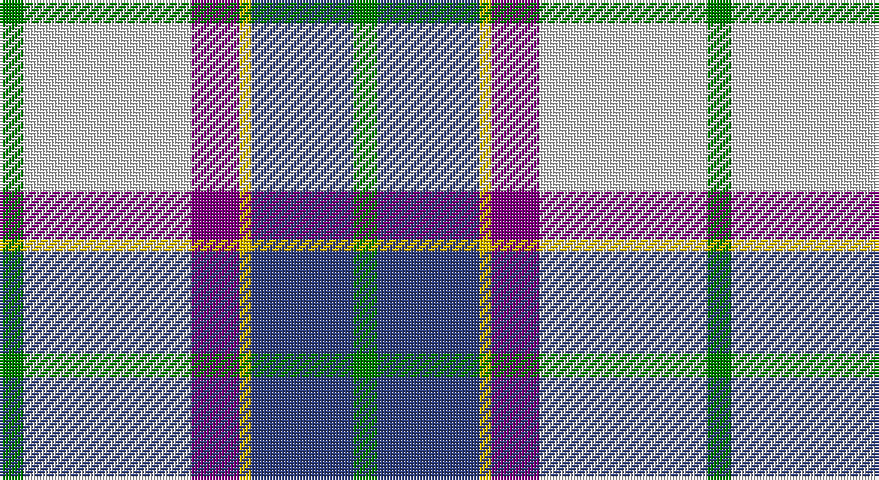

This page is one **sett** — a single exact thread-count. It belongs to the [tartan](/setts/g4w28p8ly2db17g4/)
(the same proportion at any scale), whose colour order is pattern [GBYBWG](/stripes/gbybwg/).

Sourced from weddslist.  It is a [6 stripe tartan](/stripes/stripes6/).

Original link http://www.weddslist.com/cgi-bin/tartans/pg.pl?source=sts

## Thread count
G/8 LN56 P16 Y4 B34 G/8

One full sett is **236 threads**.

## Palette

Palette: <strong>Tartan Dictionary</strong> <small style="color:#888">(1 of 5 colours)</small>
<table><thead><tr><th>Colour</th><th>Threads</th><th>Shade</th><th>Base</th><th>OKLCh</th></tr></thead><tbody><tr><td>G/</td><td style="text-align:right;font-variant-numeric:tabular-nums">8</td><td><code style="background-color:#008000;">#008000</code> <small style="color:#888">#008000</small></td><td>G <code style="background-color:#006100;">#006100</code></td><td><small style="color:#888">oklch(52.0% 0.177 142.5)</small></td></tr><tr><td>LN</td><td style="text-align:right;font-variant-numeric:tabular-nums">56</td><td><code style="background-color:#E0E0E0;">#E0E0E0</code> <small style="color:#888">#E0E0E0</small></td><td>W <code style="background-color:#F7F7F7;">#F7F7F7</code></td><td><small style="color:#888">oklch(90.7% 0.000 89.9)</small></td></tr><tr><td>P</td><td style="text-align:right;font-variant-numeric:tabular-nums">16</td><td><code style="background-color:#800080;">#800080</code> <small style="color:#888">#800080</small></td><td>B <code style="background-color:#2A418A;">#2A418A</code></td><td><small style="color:#888">oklch(42.1% 0.193 328.4)</small></td></tr><tr><td>Y</td><td style="text-align:right;font-variant-numeric:tabular-nums">4</td><td><code style="background-color:#F0C000;">#F0C000</code> <small style="color:#888">#F0C000</small></td><td>Y <code style="background-color:#F2BF00;">#F2BF00</code></td><td><small style="color:#888">oklch(82.7% 0.169 90.5)</small></td></tr><tr><td>B</td><td style="text-align:right;font-variant-numeric:tabular-nums">34</td><td><code style="background-color:#304080;">#304080</code> <small style="color:#888">#304080</small></td><td>B <code style="background-color:#2A418A;">#2A418A</code></td><td><small style="color:#888">oklch(39.4% 0.109 270.2)</small></td></tr><tr><td>G/</td><td style="text-align:right;font-variant-numeric:tabular-nums">8</td><td><code style="background-color:#008000;">#008000</code> <small style="color:#888">#008000</small></td><td>G <code style="background-color:#006100;">#006100</code></td><td><small style="color:#888">oklch(52.0% 0.177 142.5)</small></td></tr></tbody></table>

# Sample pattern

## Nearest tartans

The nearest existing variants by ΔTartan distance, with this tartan at the top so the swatches line up against it.

ΔTartan

Tartan

Sett

—

<a href="/ttd/edit/#slug=g4w28p8ly2db17g4~x2">Manx, dress</a> <a class="nn-out" href="/variants/s6/g4w28p8ly2db17g4~x2/" title="open its dictionary page">↗</a>

0.35

<a href="/ttd/edit/#slug=g4w28dp8ly2db17g4~x2&amp;base=g4w28p8ly2db17g4~x2">Manx Dress</a> <a class="nn-out" href="/variants/s6/g4w28dp8ly2db17g4~x2/" title="open its dictionary page">↗</a>

0.75

<a href="/ttd/edit/#slug=db2w14p4ly1g8db2~x2&amp;base=g4w28p8ly2db17g4~x2">Manx Laxey, dress green</a> <a class="nn-out" href="/variants/s6/db2w14p4ly1g8db2~x2/" title="open its dictionary page">↗</a>

0.75

<a href="/ttd/edit/#slug=g4w28db14ly2t17g4~x2&amp;base=g4w28p8ly2db17g4~x2">Allanton Dress (Fashion)</a> <a class="nn-out" href="/variants/s6/g4w28db14ly2t17g4~x2/" title="open its dictionary page">↗</a>

0.77

<a href="/ttd/edit/#slug=w8b5t10dp24w30b2dg2~x2&amp;base=g4w28p8ly2db17g4~x2">Shiel, Magenta (Dance)</a> <a class="nn-out" href="/variants/s7/w8b5t10dp24w30b2dg2~x2/" title="open its dictionary page">↗</a>

0.78

<a href="/ttd/edit/#slug=w8g5t10dp24w30g2lp2~x2&amp;base=g4w28p8ly2db17g4~x2">Shiel, Purple (Dance)</a> <a class="nn-out" href="/variants/s7/w8g5t10dp24w30g2lp2~x2/" title="open its dictionary page">↗</a>

0.81

<a href="/ttd/edit/#slug=w8g5dp10t24w30g2lp2~x2&amp;base=g4w28p8ly2db17g4~x2">Shiel, Purple V2 (Dance)</a> <a class="nn-out" href="/variants/s7/w8g5dp10t24w30g2lp2~x2/" title="open its dictionary page">↗</a>

0.89

<a href="/ttd/edit/#slug=w14dp4ly1g8db2~x2&amp;base=g4w28p8ly2db17g4~x2">Manx Laxey Dress Green</a> <a class="nn-out" href="/variants/s5/w14dp4ly1g8db2~x2/" title="open its dictionary page">↗</a>

0.89

<a href="/ttd/edit/#slug=t8w28lo3g3t8k9t4~x2&amp;base=g4w28p8ly2db17g4~x2">MacTavish of Dunardry (Clan)</a> <a class="nn-out" href="/variants/s7/t8w28lo3g3t8k9t4~x2/" title="open its dictionary page">↗</a>

0.89

<a href="/ttd/edit/#slug=n8w28o3g3n8k9n4~x2&amp;base=g4w28p8ly2db17g4~x2">MacTavish of Dunardry Dress</a> <a class="nn-out" href="/variants/s7/n8w28o3g3n8k9n4~x2/" title="open its dictionary page">↗</a>

0.92

<a href="/ttd/edit/#slug=t17k12w9m2w9g1w2~x4&amp;base=g4w28p8ly2db17g4~x2">Ferguson Dress</a> <a class="nn-out" href="/variants/s7/t17k12w9m2w9g1w2~x4/" title="open its dictionary page">↗</a>

## Neighbour map

Every grey dot is one of 14360 variants placed by the first two principal components of the ΔTartan feature space (44% of its variance). Red is this tartan; blue dots are its nearest — click one to open its page.

<svg viewBox="0 0 640 380" role="img" style="max-width:100%;height:auto;border:1px solid #e0e0e0;border-radius:4px;display:block" xmlns="http://www.w3.org/2000/svg"><image href="/nn/cloud.v1.png" width="640" height="380"/><a href="/variants/s6/g4w28dp8ly2db17g4~x2/"><circle cx="180.7" cy="151.3" r="4" fill="#3465a4"><title>Manx Dress</title></circle></a><a href="/variants/s6/db2w14p4ly1g8db2~x2/"><circle cx="186.5" cy="153.0" r="4" fill="#3465a4"><title>Manx Laxey, dress green</title></circle></a><a href="/variants/s6/g4w28db14ly2t17g4~x2/"><circle cx="161.8" cy="164.8" r="4" fill="#3465a4"><title>Allanton Dress (Fashion)</title></circle></a><a href="/variants/s7/w8b5t10dp24w30b2dg2~x2/"><circle cx="207.5" cy="141.0" r="4" fill="#3465a4"><title>Shiel, Magenta (Dance)</title></circle></a><a href="/variants/s7/w8g5t10dp24w30g2lp2~x2/"><circle cx="197.8" cy="138.1" r="4" fill="#3465a4"><title>Shiel, Purple (Dance)</title></circle></a><a href="/variants/s7/w8g5dp10t24w30g2lp2~x2/"><circle cx="207.7" cy="145.1" r="4" fill="#3465a4"><title>Shiel, Purple V2 (Dance)</title></circle></a><a href="/variants/s5/w14dp4ly1g8db2~x2/"><circle cx="203.4" cy="164.9" r="4" fill="#3465a4"><title>Manx Laxey Dress Green</title></circle></a><a href="/variants/s7/t8w28lo3g3t8k9t4~x2/"><circle cx="176.2" cy="162.1" r="4" fill="#3465a4"><title>MacTavish of Dunardry (Clan)</title></circle></a><a href="/variants/s7/n8w28o3g3n8k9n4~x2/"><circle cx="162.9" cy="153.0" r="4" fill="#3465a4"><title>MacTavish of Dunardry Dress</title></circle></a><a href="/variants/s7/t17k12w9m2w9g1w2~x4/"><circle cx="155.2" cy="151.5" r="4" fill="#3465a4"><title>Ferguson Dress</title></circle></a><circle cx="183.8" cy="152.4" r="5" fill="#c00000"/></svg>

ID: /variants/s6/g4w28p8ly2db17g4~x2/
