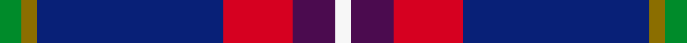

This is one **variant** — a specific cloth: this exact thread count and colourway, with its own
provenance below. It is one weaving of the [sett](/tartans/k/ki/kilsyth/) (the scale-free proportion — the
same cloth at any scale or shade), whose colour order is pattern [GGBRBW](/stripes/ggbrbw/).

Part of the [Kilsyth](/tartans/k/ki/kilsyth/) tartan — the named design grouping this sett with its other cloths.

Sourced from register-of-tartans.  It is a [6 stripe tartan](/stripes/stripes6/).

Original link [https://www.tartanregister.gov.uk/tartanDetails.aspx?ref=1977](https://www.tartanregister.gov.uk/tartanDetails.aspx?ref=1977)

## Provenance

Earliest known date: January 2002 Kilsyth in Scotland, Canada, Australia, New Zealand and America. Designed by William & Colin Chalmers of Howe Rd, Kilsyth, Scotland.

3 attestations — the source records this cloth was collapsed from (oldest owns this page)

<ul>
<li>01/01/2002 — Kilsyth (register-of-tartans, <a href="https://www.tartanregister.gov.uk/tartanDetails.aspx?ref=1977">record</a>)  <em>Clan/Family tartan for people from Kilsyth (Scotland) and surrounding area and all who have ancestral links with Kilsyth - in particular, inhabitants of Kilsyth Canada, Australia, New Zealand and America. Designed by William & Colin Chalmers of Howe Rd, Kilsyth, Scotland.</em></li>
<li>January 2002 — Kilsyth (District) (tartans-authority, <a href="https://web.archive.org/web/*/http://www.tartansauthority.com/tartan-ferret/display/4073/*">record</a>)  <em>District tartan for people from Kilsyth (Scotland) and surrounding area and all who have ancestral links with Kilsyth - in particular, inhabitants of Kilsyth Canada, Australia, New Zealand and America. Designed by William & Colin Chalmers of Howe Rd, Kilsyth, Scotland.</em></li>
<li>January 2002 — Kilsyth District Tartan (house-of-tartan, <a href="http://www.house-of-tartan.scotland.net/house/TartanViewjs.asp?colr=Def&tnam=4073">record</a>) </li>
</ul>

Dataset <small>— provenance for this record, inherited from the source manifest</small>

<dl class="dataset-prov">
<dt>source</dt><dd><a href="/sources/register-of-tartans/">Scottish Register of Tartans</a></dd>
<dt>data captured from</dt><dd><a href="https://github.com/thetartan/tartan-database/blob/master/data/register-of-tartans/data.csv">https://github.com/thetartan/tartan-database/blob/master/data/register-of-tartans/data.csv</a></dd>
<dt>data date</dt><dd>2002 <small>(this record)</small></dd>
<dt>licence</dt><dd><a href="https://www.tartanregister.gov.uk/copyright">Crown copyright</a></dd>
</dl>

Capture chain <small>— the hands this data passed through, oldest first; each capture carries its own licence</small>

<ol class="capture-chain">
<li><a href="https://www.tartanregister.gov.uk/">Scottish Register of Tartans</a> · <a href="https://www.tartanregister.gov.uk/copyright">Crown copyright</a> <small>the living register — still published by National Records of Scotland</small></li>
<li><a href="https://github.com/thetartan/tartan-database">thetartan/tartan-database</a> <small>2016-2017</small> · <a href="https://creativecommons.org/licenses/by-nc-nd/4.0/">CC BY-NC-ND 4.0</a> <small>Levko Kravets's frozen compilation — the capture we vendored, and where its CC licence text came from</small></li>
<li>this dictionary <small>captured 2026-06-10 · commit 5bf86c7566</small> <small>each re-capture is a git commit to data/sources</small></li>
</ol>

## Register references

External register numbers recorded for this tartan.

- Scottish Register of Tartans: [1977](https://www.tartanregister.gov.uk/tartanDetails.aspx?ref=1977)
- Scottish Tartans Authority (ITI): 4073

## Thread count
G/8 Y6 DB70 R26 DP16 W/6

One full sett is **250 threads**.

The source recorded this cloth as G/8 Y6 DB70 R26 DP16 W6 DP16 R26 DB70 Y/6 — 486 threads; it folds to the canonical 250-thread sett above.

## Palette
<table><thead><tr><th>Colour</th><th>Shade</th><th>OKLCh</th></tr></thead><tbody><tr><td>DB</td><td><code style="background-color:#082077;">#082077</code> <small style="color:#888">#082077</small></td><td><small style="color:#888">oklch(30.0% 0.149 265.1)</small></td></tr><tr><td>G</td><td><code style="background-color:#008B2A;">#008B2A</code> <small style="color:#888">#008B2A</small></td><td><small style="color:#888">oklch(55.4% 0.170 145.9)</small></td></tr><tr><td>W</td><td><code style="background-color:#F7F7F7;">#F7F7F7</code> <small style="color:#888">#F7F7F7</small></td><td><small style="color:#888">oklch(97.6% 0.000 89.9)</small></td></tr><tr><td>DP</td><td><code style="background-color:#4B0B4F;">#4B0B4F</code> <small style="color:#888">#4B0B4F</small></td><td><small style="color:#888">oklch(30.1% 0.125 325.4)</small></td></tr><tr><td>R</td><td><code style="background-color:#D60020;">#D60020</code> <small style="color:#888">#D60020</small></td><td><small style="color:#888">oklch(55.2% 0.224 25.5)</small></td></tr><tr><td>Y</td><td><code style="background-color:#8B6E00;">#8B6E00</code> <small style="color:#888">#8B6E00</small></td><td><small style="color:#888">oklch(55.1% 0.113 90.4)</small></td></tr></tbody></table>

# Sample pattern

## Nearest tartan variants

The nearest existing variants by ΔTartan distance, with this cloth at the top so the swatches line up against it.

ΔTartan

Threads

Variant

Sett

—

486

<a href="/variants/s6/g4y3db35r13dp8w3~x2/">Kilsyth</a>

<a href="/ttd/edit/#slug=w1db15r1n10g2lp1~x4&amp;base=g4y3db35r13dp8w3~x2" title="compare in the TTD">1.82</a>

232

<a href="/variants/s6/w1db15r1n10g2lp1~x4/">Peterson, Oren (Name)</a>

<a href="/ttd/edit/#slug=y3db38g7dp4lb5r5w3~x2&amp;base=g4y3db35r13dp8w3~x2" title="compare in the TTD">1.95</a>

248

<a href="/variants/s7/y3db38g7dp4lb5r5w3~x2/">Blairgowrie Golf Club, The</a>

<a href="/ttd/edit/#slug=m1g2n10r1db15w1~x4&amp;base=g4y3db35r13dp8w3~x2" title="compare in the TTD">2.14</a>

232

<a href="/variants/s6/m1g2n10r1db15w1~x4/">Oren Peterson</a>

<a href="/ttd/edit/#slug=dp20lb8g8db8dp33r3~x2&amp;base=g4y3db35r13dp8w3~x2" title="compare in the TTD">2.19</a>

274

<a href="/variants/s6/dp20lb8g8db8dp33r3~x2/">McIntosh, Stuart (Personal)</a>

<a href="/ttd/edit/#slug=dp3o15db15r2db15y3~x2~o2500000&amp;base=g4y3db35r13dp8w3~x2" title="compare in the TTD">2.32</a>

200

<a href="/variants/s6/dp3o15db15r2db15y3~x2~o2500000/">HMS Duncan Regimental Tartan</a>

<a href="/ttd/edit/#slug=dy1db11dy1dr2n1dr2r2w1r2dr2n1dr2dy1db11w1~x8&amp;base=g4y3db35r13dp8w3~x2" title="compare in the TTD">2.58</a>

640

<a href="/variants/s15/dy1db11dy1dr2n1dr2r2w1r2dr2n1dr2dy1db11w1~x8/">Wisconsin in Scotland (Corporate)</a>

<a href="/ttd/edit/#slug=dbi30w2r3w2db14lr3g14dbi18r2dbi3~x2~dbi1605267-db0906265&amp;base=g4y3db35r13dp8w3~x2" title="compare in the TTD">2.68</a>

298

<a href="/variants/s10/dbi30w2r3w2db14lr3g14dbi18r2dbi3~x2~dbi1605267-db0906265/">Kansai St Andrews Society</a>

<a href="/ttd/edit/#slug=db3r13db13r9db5w2dp9db21y2~x2&amp;base=g4y3db35r13dp8w3~x2" title="compare in the TTD">2.79</a>

298

<a href="/variants/s9/db3r13db13r9db5w2dp9db21y2~x2/">Telfer, Brian William (Personal)</a>

<a href="/ttd/edit/#slug=db2g4lb11dp19db1dp19o4lo2~x2&amp;base=g4y3db35r13dp8w3~x2" title="compare in the TTD">2.85</a>

240

<a href="/variants/s8/db2g4lb11dp19db1dp19o4lo2~x2/">Brigid Mhairi</a>

<a href="/ttd/edit/#slug=db3r13db13r9db5w2dp9db21ly2~x2&amp;base=g4y3db35r13dp8w3~x2" title="compare in the TTD">2.86</a>

298

<a href="/variants/s9/db3r13db13r9db5w2dp9db21ly2~x2/">Telfer, Brian William (Personal)</a>

## Neighbour map

Every grey dot is one of 13656 variants placed by the first two principal components of the ΔTartan feature space (42% of its variance). Red is this tartan; blue dots are its nearest — click one to open its page. The map is a flat projection of a many-dimensional space — [how to read it](/posts/neighbourhood-maps/).

<svg viewBox="0 0 640 380" role="img" style="max-width:100%;height:auto;border:1px solid #e0e0e0;border-radius:4px;display:block" xmlns="http://www.w3.org/2000/svg"><image href="/nn/cloud.v1.png" width="640" height="380"/><a href="/variants/s6/w1db15r1n10g2lp1~x4/"><circle cx="292.6" cy="162.8" r="4" fill="#3465a4"><title>Peterson, Oren (Name)</title></circle></a><a href="/variants/s7/y3db38g7dp4lb5r5w3~x2/"><circle cx="276.5" cy="129.8" r="4" fill="#3465a4"><title>Blairgowrie Golf Club, The</title></circle></a><a href="/variants/s6/m1g2n10r1db15w1~x4/"><circle cx="296.6" cy="162.5" r="4" fill="#3465a4"><title>Oren Peterson</title></circle></a><a href="/variants/s6/dp20lb8g8db8dp33r3~x2/"><circle cx="361.8" cy="200.5" r="4" fill="#3465a4"><title>McIntosh, Stuart (Personal)</title></circle></a><a href="/variants/s6/dp3o15db15r2db15y3~x2~o2500000/"><circle cx="301.9" cy="232.6" r="4" fill="#3465a4"><title>HMS Duncan Regimental Tartan</title></circle></a><a href="/variants/s15/dy1db11dy1dr2n1dr2r2w1r2dr2n1dr2dy1db11w1~x8/"><circle cx="267.7" cy="126.6" r="4" fill="#3465a4"><title>Wisconsin in Scotland (Corporate)</title></circle></a><a href="/variants/s10/dbi30w2r3w2db14lr3g14dbi18r2dbi3~x2~dbi1605267-db0906265/"><circle cx="280.6" cy="145.4" r="4" fill="#3465a4"><title>Kansai St Andrews Society</title></circle></a><a href="/variants/s9/db3r13db13r9db5w2dp9db21y2~x2/"><circle cx="274.8" cy="191.9" r="4" fill="#3465a4"><title>Telfer, Brian William (Personal)</title></circle></a><a href="/variants/s8/db2g4lb11dp19db1dp19o4lo2~x2/"><circle cx="311.5" cy="137.4" r="4" fill="#3465a4"><title>Brigid Mhairi</title></circle></a><a href="/variants/s9/db3r13db13r9db5w2dp9db21ly2~x2/"><circle cx="268.1" cy="189.8" r="4" fill="#3465a4"><title>Telfer, Brian William (Personal)</title></circle></a><circle cx="277.4" cy="152.6" r="5" fill="#c00000"/><text x="320" y="376" text-anchor="middle" font-size="11" fill="#999">ground</text><text x="11" y="190" text-anchor="middle" font-size="11" fill="#999" transform="rotate(-90 11 190)">complexity</text></svg>

ID: /variants/s6/g4y3db35r13dp8w3~x2/
