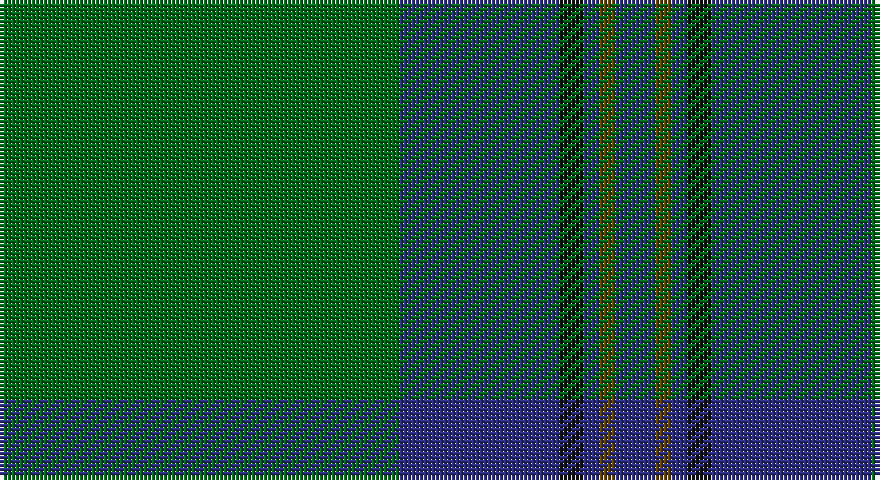

This page is one **sett** — a single exact thread-count. It belongs to the [tartan](/setts/g50db20k3db2dy2db5/)
(the same proportion at any scale), whose colour order is pattern [BGBKBG](/stripes/bgbkbg/).

Part of the [St. Andrews Old Course Hotel](/tartans/st-andrews-old-course-hotel/) tartan — the named design grouping this sett with its other cloths.

Sourced from house-of-tartan.  It is a [6 stripe tartan](/stripes/stripes6/).

Original link http://www.house-of-tartan.scotland.net/house/TartanViewjs.asp?colr=Def&tnam=2332

## Provenance

Earliest known date: 1994 St Andrews Old Course Hotel, Golf Resort, and SPA

## Also known as

This cloth is also recorded under:

- St Andrews Old Course Hotel

## Thread count
G/100 DB40 K6 DB4 T4 DB/10

One full sett is **218 threads**.

## Palette

Palette: <strong>Tartan Register</strong>
<table><thead><tr><th>Colour</th><th>Threads</th><th>Shade</th><th>Base</th><th>OKLCh</th></tr></thead><tbody><tr><td>G/</td><td style="text-align:right;font-variant-numeric:tabular-nums">100</td><td><code style="background-color:#006818;">#006818</code> <small style="color:#888">#006818</small></td><td>G <code style="background-color:#006100;">#006100</code></td><td><small style="color:#888">oklch(45.0% 0.142 145.0)</small></td></tr><tr><td>DB</td><td style="text-align:right;font-variant-numeric:tabular-nums">40</td><td><code style="background-color:#2C2C80;">#2C2C80</code> <small style="color:#888">#2C2C80</small></td><td>B <code style="background-color:#2A418A;">#2A418A</code></td><td><small style="color:#888">oklch(35.0% 0.138 276.6)</small></td></tr><tr><td>K</td><td style="text-align:right;font-variant-numeric:tabular-nums">6</td><td><code style="background-color:#101010;">#101010</code> <small style="color:#888">#101010</small></td><td>K <code style="background-color:#000000;">#000000</code></td><td><small style="color:#888">oklch(17.3% 0.000 89.9)</small></td></tr><tr><td>DB</td><td style="text-align:right;font-variant-numeric:tabular-nums">4</td><td><code style="background-color:#2C2C80;">#2C2C80</code> <small style="color:#888">#2C2C80</small></td><td>B <code style="background-color:#2A418A;">#2A418A</code></td><td><small style="color:#888">oklch(35.0% 0.138 276.6)</small></td></tr><tr><td>T</td><td style="text-align:right;font-variant-numeric:tabular-nums">4</td><td><code style="background-color:#604000;">#604000</code> <small style="color:#888">#604000</small></td><td>G <code style="background-color:#006100;">#006100</code></td><td><small style="color:#888">oklch(39.8% 0.083 76.8)</small></td></tr><tr><td>DB/</td><td style="text-align:right;font-variant-numeric:tabular-nums">10</td><td><code style="background-color:#2C2C80;">#2C2C80</code> <small style="color:#888">#2C2C80</small></td><td>B <code style="background-color:#2A418A;">#2A418A</code></td><td><small style="color:#888">oklch(35.0% 0.138 276.6)</small></td></tr></tbody></table>

# Sample pattern

## Compared to the master

This cloth is one sett of its design; the master sett (the exemplar the design is anchored on) is below for comparison.

<figure style="margin:0"><figcaption style="color:#888;font-size:smaller">this sett</figcaption></figure>
<figure style="margin:0"><figcaption style="color:#888;font-size:smaller"><a href="/setts/g26db10k3db2dy2db10/">master sett →</a></figcaption></figure>

## Nearest tartans

The nearest existing variants by ΔTartan distance, with this tartan at the top so the swatches line up against it.

ΔTartan

Tartan

Sett

—

<a href="/ttd/edit/#slug=g50db20k3db2dy2db5~x2">St Andrews Old Course Hotel Corporate Tartan</a> <a class="nn-out" href="/variants/s6/g50db20k3db2dy2db5~x2/" title="open its dictionary page">↗</a>

0.97

<a href="/ttd/edit/#slug=g49db16dy3db2dy2db6~x2&amp;base=g50db20k3db2dy2db5~x2">Royal and Ancient, The</a> <a class="nn-out" href="/variants/s6/g49db16dy3db2dy2db6~x2/" title="open its dictionary page">↗</a>

1.19

<a href="/ttd/edit/#slug=g44k2g2k2g3k12db10r3~x2&amp;base=g50db20k3db2dy2db5~x2">Celtic (New) Corporate Sport Tartan</a> <a class="nn-out" href="/variants/s8/g44k2g2k2g3k12db10r3~x2/" title="open its dictionary page">↗</a>

1.21

<a href="/ttd/edit/#slug=g50db20k3db2o2db5~x2&amp;base=g50db20k3db2dy2db5~x2">St Andrews Hotel, Golf Resort, and SPA</a> <a class="nn-out" href="/variants/s6/g50db20k3db2o2db5~x2/" title="open its dictionary page">↗</a>

1.32

<a href="/ttd/edit/#slug=gi16dg1y4dg41y1dg6g2dg2~x2&amp;base=g50db20k3db2dy2db5~x2">Semper</a> <a class="nn-out" href="/variants/s8/gi16dg1y4dg41y1dg6g2dg2~x2/" title="open its dictionary page">↗</a>

1.32

<a href="/ttd/edit/#slug=g49db16o3db2o2db6~x2&amp;base=g50db20k3db2dy2db5~x2">Royal and Ancient, The</a> <a class="nn-out" href="/variants/s6/g49db16o3db2o2db6~x2/" title="open its dictionary page">↗</a>

1.32

<a href="/ttd/edit/#slug=gi16dg1lg4dg41lg1dg6g2dg2~x2&amp;base=g50db20k3db2dy2db5~x2">Semper</a> <a class="nn-out" href="/variants/s8/gi16dg1lg4dg41lg1dg6g2dg2~x2/" title="open its dictionary page">↗</a>

1.35

<a href="/ttd/edit/#slug=k8r2k13lo2dg48b6~x2&amp;base=g50db20k3db2dy2db5~x2">Green Swamp Youth Campers</a> <a class="nn-out" href="/variants/s6/k8r2k13lo2dg48b6~x2/" title="open its dictionary page">↗</a>

1.36

<a href="/ttd/edit/#slug=b46r2b3r2b14g38k3g4~x2&amp;base=g50db20k3db2dy2db5~x2">Greenlaw, American (Name)</a> <a class="nn-out" href="/variants/s8/b46r2b3r2b14g38k3g4~x2/" title="open its dictionary page">↗</a>

1.38

<a href="/ttd/edit/#slug=dg38w2dg6db24o6db2o3db2~x2&amp;base=g50db20k3db2dy2db5~x2">MacAuliffe/McAucliffe</a> <a class="nn-out" href="/variants/s8/dg38w2dg6db24o6db2o3db2~x2/" title="open its dictionary page">↗</a>

1.42

<a href="/ttd/edit/#slug=g24k2db3k2db8r2~x2&amp;base=g50db20k3db2dy2db5~x2">Shaw (Clan 1)</a> <a class="nn-out" href="/variants/s6/g24k2db3k2db8r2~x2/" title="open its dictionary page">↗</a>

## Neighbour map

Every grey dot is one of 14360 variants placed by the first two principal components of the ΔTartan feature space (44% of its variance). Red is this tartan; blue dots are its nearest — click one to open its page.

<svg viewBox="0 0 640 380" role="img" style="max-width:100%;height:auto;border:1px solid #e0e0e0;border-radius:4px;display:block" xmlns="http://www.w3.org/2000/svg"><image href="/nn/cloud.v1.png" width="640" height="380"/><a href="/variants/s6/g49db16dy3db2dy2db6~x2/"><circle cx="484.8" cy="209.7" r="4" fill="#3465a4"><title>Royal and Ancient, The</title></circle></a><a href="/variants/s8/g44k2g2k2g3k12db10r3~x2/"><circle cx="419.3" cy="165.0" r="4" fill="#3465a4"><title>Celtic (New) Corporate Sport Tartan</title></circle></a><a href="/variants/s6/g50db20k3db2o2db5~x2/"><circle cx="416.1" cy="173.6" r="4" fill="#3465a4"><title>St Andrews Hotel, Golf Resort, and SPA</title></circle></a><a href="/variants/s8/gi16dg1y4dg41y1dg6g2dg2~x2/"><circle cx="512.2" cy="157.8" r="4" fill="#3465a4"><title>Semper</title></circle></a><a href="/variants/s6/g49db16o3db2o2db6~x2/"><circle cx="470.2" cy="201.7" r="4" fill="#3465a4"><title>Royal and Ancient, The</title></circle></a><a href="/variants/s8/gi16dg1lg4dg41lg1dg6g2dg2~x2/"><circle cx="503.0" cy="153.0" r="4" fill="#3465a4"><title>Semper</title></circle></a><a href="/variants/s6/k8r2k13lo2dg48b6~x2/"><circle cx="408.0" cy="175.6" r="4" fill="#3465a4"><title>Green Swamp Youth Campers</title></circle></a><a href="/variants/s8/b46r2b3r2b14g38k3g4~x2/"><circle cx="410.3" cy="183.3" r="4" fill="#3465a4"><title>Greenlaw, American (Name)</title></circle></a><a href="/variants/s8/dg38w2dg6db24o6db2o3db2~x2/"><circle cx="364.2" cy="179.5" r="4" fill="#3465a4"><title>MacAuliffe/McAucliffe</title></circle></a><a href="/variants/s6/g24k2db3k2db8r2~x2/"><circle cx="369.4" cy="209.1" r="4" fill="#3465a4"><title>Shaw (Clan 1)</title></circle></a><circle cx="446.9" cy="189.2" r="5" fill="#c00000"/></svg>

ID: /variants/s6/g50db20k3db2dy2db5~x2/
