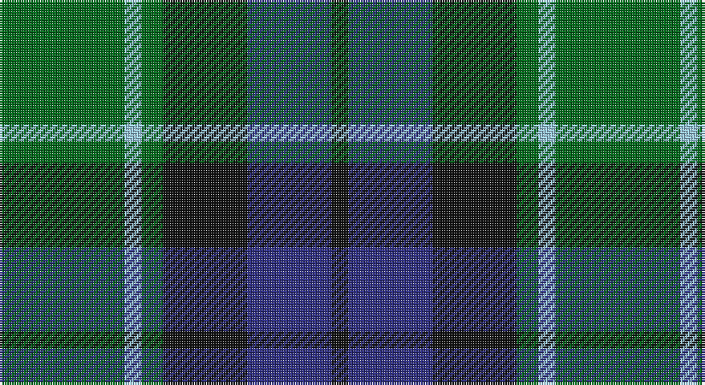

This page is one **sett** — a single exact thread-count. It belongs to the [tartan](/setts/g52lb7g9k35db35k7/)
(the same proportion at any scale), whose colour order is pattern [GWGKBK](/stripes/gwgkbk/).

Sourced from register-of-tartans.  It is a [6 stripe tartan](/stripes/stripes6/).

Original link https://www.tartanregister.gov.uk/tartanDetails.aspx?ref=3482

2 attestations — the source records this cloth was collapsed from (oldest owns this page)

<ul>
<li>01/01/2003 — Redland (register-of-tartans, <a href="https://www.tartanregister.gov.uk/tartanDetails.aspx?ref=3482">record</a>)</li>
<li>pre 2003 — Redland (Corporate) (tartans-authority, <a href="http://www.tartansauthority.com/tartan-ferret/display/6070/">record</a>)</li>
</ul>

## Register references

External register numbers recorded for this tartan.

- Scottish Register of Tartans: [3482](https://www.tartanregister.gov.uk/tartanDetails.aspx?ref=3482)
- Scottish Tartans Authority (ITI): 6070

## Thread count
G/52 LB7 G9 K35 DB35 K/7

One full sett is **231 threads**.

## Palette

Palette: <strong>Tartan Register</strong>
<table><thead><tr><th>Colour</th><th>Threads</th><th>Shade</th><th>Base</th><th>OKLCh</th></tr></thead><tbody><tr><td>G/</td><td style="text-align:right;font-variant-numeric:tabular-nums">52</td><td><code style="background-color:#006818;">#006818</code> <small style="color:#888">#006818</small></td><td>G <code style="background-color:#006100;">#006100</code></td><td><small style="color:#888">oklch(45.0% 0.142 145.0)</small></td></tr><tr><td>LB</td><td style="text-align:right;font-variant-numeric:tabular-nums">7</td><td><code style="background-color:#98C8E8;">#98C8E8</code> <small style="color:#888">#98C8E8</small></td><td>W <code style="background-color:#F7F7F7;">#F7F7F7</code></td><td><small style="color:#888">oklch(81.0% 0.068 237.9)</small></td></tr><tr><td>G</td><td style="text-align:right;font-variant-numeric:tabular-nums">9</td><td><code style="background-color:#006818;">#006818</code> <small style="color:#888">#006818</small></td><td>G <code style="background-color:#006100;">#006100</code></td><td><small style="color:#888">oklch(45.0% 0.142 145.0)</small></td></tr><tr><td>K</td><td style="text-align:right;font-variant-numeric:tabular-nums">35</td><td><code style="background-color:#101010;">#101010</code> <small style="color:#888">#101010</small></td><td>K <code style="background-color:#000000;">#000000</code></td><td><small style="color:#888">oklch(17.3% 0.000 89.9)</small></td></tr><tr><td>DB</td><td style="text-align:right;font-variant-numeric:tabular-nums">35</td><td><code style="background-color:#2C2C80;">#2C2C80</code> <small style="color:#888">#2C2C80</small></td><td>B <code style="background-color:#2A418A;">#2A418A</code></td><td><small style="color:#888">oklch(35.0% 0.138 276.6)</small></td></tr><tr><td>K/</td><td style="text-align:right;font-variant-numeric:tabular-nums">7</td><td><code style="background-color:#101010;">#101010</code> <small style="color:#888">#101010</small></td><td>K <code style="background-color:#000000;">#000000</code></td><td><small style="color:#888">oklch(17.3% 0.000 89.9)</small></td></tr></tbody></table>

# Sample pattern

## Nearest tartans

The nearest existing variants by ΔTartan distance, with this tartan at the top so the swatches line up against it.

ΔTartan

Tartan

Sett

—

<a href="/ttd/edit/#slug=g52lb7g9k35db35k7">Redland</a> <a class="nn-out" href="/variants/s6/g52lb7g9k35db35k7/" title="open its dictionary page">↗</a>

0.57

<a href="/ttd/edit/#slug=k2dg9t1k6b4dg2~x2&amp;base=g52lb7g9k35db35k7">Unidentified #28</a> <a class="nn-out" href="/variants/s6/k2dg9t1k6b4dg2~x2/" title="open its dictionary page">↗</a>

0.62

<a href="/ttd/edit/#slug=g8t1g1k6db6k1~x4&amp;base=g52lb7g9k35db35k7">Graham of Menteith (Clan)</a> <a class="nn-out" href="/variants/s6/g8t1g1k6db6k1~x4/" title="open its dictionary page">↗</a>

0.62

<a href="/ttd/edit/#slug=g24b6lb3k6b12k15g4~x2&amp;base=g52lb7g9k35db35k7">Blaylock Annandale</a> <a class="nn-out" href="/variants/s7/g24b6lb3k6b12k15g4~x2/" title="open its dictionary page">↗</a>

0.66

<a href="/ttd/edit/#slug=g24db6t3k6db12k15g4~x2&amp;base=g52lb7g9k35db35k7">Blaylock Annandale (Name)</a> <a class="nn-out" href="/variants/s7/g24db6t3k6db12k15g4~x2/" title="open its dictionary page">↗</a>

0.67

<a href="/ttd/edit/#slug=db2k2db12k11g16w2~x2&amp;base=g52lb7g9k35db35k7">Campbell of Argyll (Smiths)</a> <a class="nn-out" href="/variants/s6/db2k2db12k11g16w2~x2/" title="open its dictionary page">↗</a>

0.72

<a href="/ttd/edit/#slug=g3db1g8db7k3ly1~x2&amp;base=g52lb7g9k35db35k7">Trafalgar (Fashion)</a> <a class="nn-out" href="/variants/s6/g3db1g8db7k3ly1~x2/" title="open its dictionary page">↗</a>

0.73

<a href="/ttd/edit/#slug=dg1db5dg1k5dg6ly1~x2&amp;base=g52lb7g9k35db35k7">MacKay (Bonner)</a> <a class="nn-out" href="/variants/s6/dg1db5dg1k5dg6ly1~x2/" title="open its dictionary page">↗</a>

0.74

<a href="/ttd/edit/#slug=g1db6k6g6r1g1~x6&amp;base=g52lb7g9k35db35k7">Callum Beg (Fashion)</a> <a class="nn-out" href="/variants/s6/g1db6k6g6r1g1~x6/" title="open its dictionary page">↗</a>

0.74

<a href="/ttd/edit/#slug=k3g14k14g2b14r3~x2&amp;base=g52lb7g9k35db35k7">Morrison Society</a> <a class="nn-out" href="/variants/s6/k3g14k14g2b14r3~x2/" title="open its dictionary page">↗</a>

0.77

<a href="/ttd/edit/#slug=g21k6t3g11k17db17k3~x2&amp;base=g52lb7g9k35db35k7">MacCallum</a> <a class="nn-out" href="/variants/s7/g21k6t3g11k17db17k3~x2/" title="open its dictionary page">↗</a>

## Neighbour map

Every grey dot is one of 14360 variants placed by the first two principal components of the ΔTartan feature space (44% of its variance). Red is this tartan; blue dots are its nearest — click one to open its page.

<svg viewBox="0 0 640 380" role="img" style="max-width:100%;height:auto;border:1px solid #e0e0e0;border-radius:4px;display:block" xmlns="http://www.w3.org/2000/svg"><image href="/nn/cloud.v1.png" width="640" height="380"/><a href="/variants/s6/k2dg9t1k6b4dg2~x2/"><circle cx="229.2" cy="243.7" r="4" fill="#3465a4"><title>Unidentified #28</title></circle></a><a href="/variants/s6/g8t1g1k6db6k1~x4/"><circle cx="218.0" cy="249.8" r="4" fill="#3465a4"><title>Graham of Menteith (Clan)</title></circle></a><a href="/variants/s7/g24b6lb3k6b12k15g4~x2/"><circle cx="189.5" cy="236.9" r="4" fill="#3465a4"><title>Blaylock Annandale</title></circle></a><a href="/variants/s7/g24db6t3k6db12k15g4~x2/"><circle cx="212.9" cy="249.2" r="4" fill="#3465a4"><title>Blaylock Annandale (Name)</title></circle></a><a href="/variants/s6/db2k2db12k11g16w2~x2/"><circle cx="184.6" cy="238.2" r="4" fill="#3465a4"><title>Campbell of Argyll (Smiths)</title></circle></a><a href="/variants/s6/g3db1g8db7k3ly1~x2/"><circle cx="248.7" cy="248.4" r="4" fill="#3465a4"><title>Trafalgar (Fashion)</title></circle></a><a href="/variants/s6/dg1db5dg1k5dg6ly1~x2/"><circle cx="213.0" cy="266.7" r="4" fill="#3465a4"><title>MacKay (Bonner)</title></circle></a><a href="/variants/s6/g1db6k6g6r1g1~x6/"><circle cx="197.7" cy="261.3" r="4" fill="#3465a4"><title>Callum Beg (Fashion)</title></circle></a><a href="/variants/s6/k3g14k14g2b14r3~x2/"><circle cx="163.0" cy="248.5" r="4" fill="#3465a4"><title>Morrison Society</title></circle></a><a href="/variants/s7/g21k6t3g11k17db17k3~x2/"><circle cx="205.9" cy="263.3" r="4" fill="#3465a4"><title>MacCallum</title></circle></a><circle cx="207.5" cy="247.7" r="5" fill="#c00000"/></svg>

ID: /variants/s6/g52lb7g9k35db35k7/
