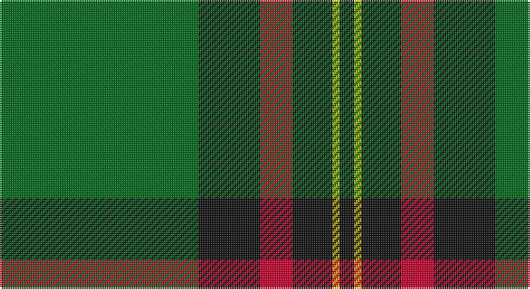

This page is one **sett** — a single exact thread-count. It belongs to the [tartan](/setts/g55k17r9k11ly2k4/)
(the same proportion at any scale), whose colour order is pattern [GKRKYK](/stripes/gkrkyk/).

Part of the [Moran](/tartans/moran/) tartan — the named design grouping this sett with its other cloths.

Sourced from tartans-authority.  It is a [6 stripe tartan](/stripes/stripes6/).

Original link http://www.tartansauthority.com/tartan-ferret/display/675/

## Also known as

This cloth is also recorded under:

- Moran Blue
- Moran Personal

3 attestations — the source records this cloth was collapsed from (oldest owns this page)

<ul>
<li>1986 — Moran (Name) (tartans-authority, <a href="http://www.tartansauthority.com/tartan-ferret/display/675/">record</a>)</li>
<li>01/01/1987 — Moran (Personal) (register-of-tartans, <a href="https://www.tartanregister.gov.uk/tartanDetails.aspx?ref=3005">record</a>)</li>
<li>undated — Moran (weddslist, <a href="http://www.weddslist.com/cgi-bin/tartans/pg.pl?source=sts">record</a>)</li>
</ul>

## Register references

External register numbers recorded for this tartan.

- Scottish Register of Tartans: [3005](https://www.tartanregister.gov.uk/tartanDetails.aspx?ref=3005)
- Scottish Tartans Authority (ITI): 675
- Scottish Tartans World Register: 675

## Thread count
G/110 K34 R18 K22 Y4 K/8

One full sett is **274 threads**.

## Palette

Palette: <strong>Tartan Register</strong>
<table><thead><tr><th>Colour</th><th>Threads</th><th>Shade</th><th>Base</th><th>OKLCh</th></tr></thead><tbody><tr><td>G/</td><td style="text-align:right;font-variant-numeric:tabular-nums">110</td><td><code style="background-color:#006818;">#006818</code> <small style="color:#888">#006818</small></td><td>G <code style="background-color:#006100;">#006100</code></td><td><small style="color:#888">oklch(45.0% 0.142 145.0)</small></td></tr><tr><td>K</td><td style="text-align:right;font-variant-numeric:tabular-nums">34</td><td><code style="background-color:#101010;">#101010</code> <small style="color:#888">#101010</small></td><td>K <code style="background-color:#000000;">#000000</code></td><td><small style="color:#888">oklch(17.3% 0.000 89.9)</small></td></tr><tr><td>R</td><td style="text-align:right;font-variant-numeric:tabular-nums">18</td><td><code style="background-color:#C8002C;">#C8002C</code> <small style="color:#888">#C8002C</small></td><td>R <code style="background-color:#CC0000;">#CC0000</code></td><td><small style="color:#888">oklch(52.6% 0.212 22.0)</small></td></tr><tr><td>K</td><td style="text-align:right;font-variant-numeric:tabular-nums">22</td><td><code style="background-color:#101010;">#101010</code> <small style="color:#888">#101010</small></td><td>K <code style="background-color:#000000;">#000000</code></td><td><small style="color:#888">oklch(17.3% 0.000 89.9)</small></td></tr><tr><td>Y</td><td style="text-align:right;font-variant-numeric:tabular-nums">4</td><td><code style="background-color:#E8C000;">#E8C000</code> <small style="color:#888">#E8C000</small></td><td>Y <code style="background-color:#F2BF00;">#F2BF00</code></td><td><small style="color:#888">oklch(81.9% 0.168 93.7)</small></td></tr><tr><td>K/</td><td style="text-align:right;font-variant-numeric:tabular-nums">8</td><td><code style="background-color:#101010;">#101010</code> <small style="color:#888">#101010</small></td><td>K <code style="background-color:#000000;">#000000</code></td><td><small style="color:#888">oklch(17.3% 0.000 89.9)</small></td></tr></tbody></table>

# Sample pattern

## Compared to the master

This cloth is one sett of its design; the master sett (the exemplar the design is anchored on) is below for comparison.

<figure style="margin:0"><figcaption style="color:#888;font-size:smaller">this sett</figcaption></figure>
<figure style="margin:0"><figcaption style="color:#888;font-size:smaller"><a href="/setts/db5m3gi2m3g12b34gi2w2/">master sett →</a></figcaption></figure>

## Nearest tartans

The nearest existing variants by ΔTartan distance, with this tartan at the top so the swatches line up against it.

ΔTartan

Tartan

Sett

—

<a href="/ttd/edit/#slug=g55k17r9k11ly2k4~x2">Moran (Name)</a> <a class="nn-out" href="/variants/s6/g55k17r9k11ly2k4~x2/" title="open its dictionary page">↗</a>

0.84

<a href="/ttd/edit/#slug=g62k40ly3k3w3~x2&amp;base=g55k17r9k11ly2k4~x2">O'Donoghue</a> <a class="nn-out" href="/variants/s5/g62k40ly3k3w3~x2/" title="open its dictionary page">↗</a>

0.86

<a href="/ttd/edit/#slug=r3g30k12g1k16lo2~x2&amp;base=g55k17r9k11ly2k4~x2">MacArthur-Fox Htg (Personal)</a> <a class="nn-out" href="/variants/s6/r3g30k12g1k16lo2~x2/" title="open its dictionary page">↗</a>

0.88

<a href="/ttd/edit/#slug=g55k17r9k11ly2db4~x2&amp;base=g55k17r9k11ly2k4~x2">Moran Family Tartan</a> <a class="nn-out" href="/variants/s6/g55k17r9k11ly2db4~x2/" title="open its dictionary page">↗</a>

1.02

<a href="/ttd/edit/#slug=o2db20r2g3r4g35r1~x2&amp;base=g55k17r9k11ly2k4~x2">Williams, Jodi (Personal)</a> <a class="nn-out" href="/variants/s7/o2db20r2g3r4g35r1~x2/" title="open its dictionary page">↗</a>

1.10

<a href="/ttd/edit/#slug=g2k1db6k11g26k1g1lo2~x2&amp;base=g55k17r9k11ly2k4~x2">Mackie (2016)</a> <a class="nn-out" href="/variants/s8/g2k1db6k11g26k1g1lo2~x2/" title="open its dictionary page">↗</a>

1.23

<a href="/ttd/edit/#slug=g25k8o10r1o3~x4&amp;base=g55k17r9k11ly2k4~x2">Herbage Family Tartan</a> <a class="nn-out" href="/variants/s5/g25k8o10r1o3~x4/" title="open its dictionary page">↗</a>

1.26

<a href="/ttd/edit/#slug=k6db1k6g4k10g20r2~x2&amp;base=g55k17r9k11ly2k4~x2">MacKinross</a> <a class="nn-out" href="/variants/s7/k6db1k6g4k10g20r2~x2/" title="open its dictionary page">↗</a>

1.26

<a href="/ttd/edit/#slug=g4r4k12w2k12g32r4k3~x2&amp;base=g55k17r9k11ly2k4~x2">MacHardy (Clans Originaux)</a> <a class="nn-out" href="/variants/s8/g4r4k12w2k12g32r4k3~x2/" title="open its dictionary page">↗</a>

1.27

<a href="/ttd/edit/#slug=r3g30k12g6k16ly2~x2&amp;base=g55k17r9k11ly2k4~x2">MacArthur (Variant)</a> <a class="nn-out" href="/variants/s6/r3g30k12g6k16ly2~x2/" title="open its dictionary page">↗</a>

1.29

<a href="/ttd/edit/#slug=k83r16dg56k2w5k2dg56r5~x2&amp;base=g55k17r9k11ly2k4~x2">MacDiarmid #2</a> <a class="nn-out" href="/variants/s8/k83r16dg56k2w5k2dg56r5~x2/" title="open its dictionary page">↗</a>

## Neighbour map

Every grey dot is one of 14360 variants placed by the first two principal components of the ΔTartan feature space (44% of its variance). Red is this tartan; blue dots are its nearest — click one to open its page.

<svg viewBox="0 0 640 380" role="img" style="max-width:100%;height:auto;border:1px solid #e0e0e0;border-radius:4px;display:block" xmlns="http://www.w3.org/2000/svg"><image href="/nn/cloud.v1.png" width="640" height="380"/><a href="/variants/s5/g62k40ly3k3w3~x2/"><circle cx="362.3" cy="188.0" r="4" fill="#3465a4"><title>O'Donoghue</title></circle></a><a href="/variants/s6/r3g30k12g1k16lo2~x2/"><circle cx="347.9" cy="185.3" r="4" fill="#3465a4"><title>MacArthur-Fox Htg (Personal)</title></circle></a><a href="/variants/s6/g55k17r9k11ly2db4~x2/"><circle cx="344.8" cy="156.2" r="4" fill="#3465a4"><title>Moran Family Tartan</title></circle></a><a href="/variants/s7/o2db20r2g3r4g35r1~x2/"><circle cx="376.0" cy="145.1" r="4" fill="#3465a4"><title>Williams, Jodi (Personal)</title></circle></a><a href="/variants/s8/g2k1db6k11g26k1g1lo2~x2/"><circle cx="380.2" cy="157.7" r="4" fill="#3465a4"><title>Mackie (2016)</title></circle></a><a href="/variants/s5/g25k8o10r1o3~x4/"><circle cx="339.1" cy="199.3" r="4" fill="#3465a4"><title>Herbage Family Tartan</title></circle></a><a href="/variants/s7/k6db1k6g4k10g20r2~x2/"><circle cx="332.8" cy="204.5" r="4" fill="#3465a4"><title>MacKinross</title></circle></a><a href="/variants/s8/g4r4k12w2k12g32r4k3~x2/"><circle cx="296.3" cy="177.0" r="4" fill="#3465a4"><title>MacHardy (Clans Originaux)</title></circle></a><a href="/variants/s6/r3g30k12g6k16ly2~x2/"><circle cx="319.1" cy="214.6" r="4" fill="#3465a4"><title>MacArthur (Variant)</title></circle></a><a href="/variants/s8/k83r16dg56k2w5k2dg56r5~x2/"><circle cx="358.1" cy="152.0" r="4" fill="#3465a4"><title>MacDiarmid #2</title></circle></a><circle cx="369.3" cy="171.5" r="5" fill="#c00000"/></svg>

ID: /variants/s6/g55k17r9k11ly2k4~x2/
