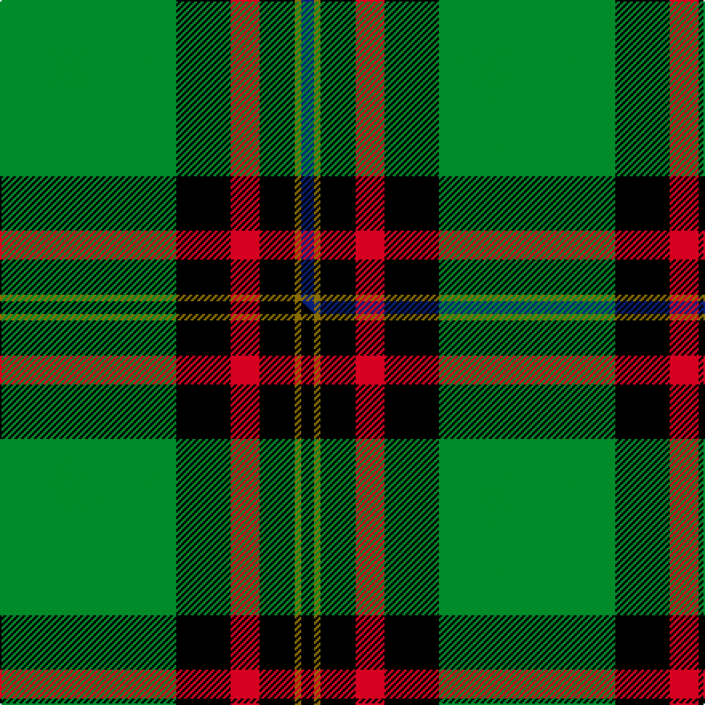

This is one **variant** — a specific cloth: this exact thread count and colourway, with its own
provenance below. It is one weaving of the [sett](/tartans/m/mo/moran-5/) (the scale-free proportion — the
same cloth at any scale or shade), whose colour order is pattern [BGKRKG](/stripes/bgkrkg/).

Part of the [Moran](/tartans/m/mo/moran-5/) tartan — the named design grouping this sett with its other cloths.

Sourced from house-of-tartan.  It is a [6 stripe tartan](/stripes/stripes6/).

Original link [http://www.house-of-tartan.scotland.net/house/TartanViewjs.asp?colr=Def&tnam=675](http://www.house-of-tartan.scotland.net/house/TartanViewjs.asp?colr=Def&tnam=675)

## Provenance

Earliest known date: 1986 The designers requested that the threadcount be Restricted.

Dataset <small>— provenance for this record, inherited from the source manifest</small>

<dl class="dataset-prov">
<dt>source</dt><dd><a href="/sources/house-of-tartan/">House of Tartan</a></dd>
<dt>data captured from</dt><dd><a href="https://github.com/thetartan/tartan-database/blob/master/data/house-of-tartan/data.csv">https://github.com/thetartan/tartan-database/blob/master/data/house-of-tartan/data.csv</a></dd>
<dt>data date</dt><dd>1986 <small>(this record)</small></dd>
<dt>licence</dt><dd><a href="https://creativecommons.org/licenses/by-nc-nd/4.0/">CC BY-NC-ND 4.0</a></dd>
</dl>

Capture chain <small>— the hands this data passed through, oldest first; each capture carries its own licence</small>

<ol class="capture-chain">
<li><a href="http://www.house-of-tartan.scotland.net/">House of Tartan</a> <small>the weaver/retailer's database — the site is now offline; the URL is kept as the ultimate source's identity</small></li>
<li><a href="https://github.com/thetartan/tartan-database">thetartan/tartan-database</a> <small>2016-2017</small> · <a href="https://creativecommons.org/licenses/by-nc-nd/4.0/">CC BY-NC-ND 4.0</a> <small>Levko Kravets's frozen compilation — the capture we vendored, and where its CC licence text came from</small></li>
<li>this dictionary <small>captured 2026-06-10 · commit 5bf86c7566</small> <small>each re-capture is a git commit to data/sources</small></li>
</ol>

## Thread count
G/110 K34 R18 K22 Y4 DB/8

One full sett is **274 threads**.

## Palette
<table><thead><tr><th>Colour</th><th>Shade</th><th>OKLCh</th></tr></thead><tbody><tr><td>DB</td><td><code style="background-color:#082077;">#082077</code> <small style="color:#888">#082077</small></td><td><small style="color:#888">oklch(30.0% 0.149 265.1)</small></td></tr><tr><td>G</td><td><code style="background-color:#008B2A;">#008B2A</code> <small style="color:#888">#008B2A</small></td><td><small style="color:#888">oklch(55.4% 0.170 145.9)</small></td></tr><tr><td>K</td><td><code style="background-color:#000000;">#000000</code> <small style="color:#888">#000000</small></td><td><small style="color:#888">oklch(0.0% 0.000 0.0)</small></td></tr><tr><td>R</td><td><code style="background-color:#D60020;">#D60020</code> <small style="color:#888">#D60020</small></td><td><small style="color:#888">oklch(55.2% 0.224 25.5)</small></td></tr><tr><td>Y</td><td><code style="background-color:#8B6E00;">#8B6E00</code> <small style="color:#888">#8B6E00</small></td><td><small style="color:#888">oklch(55.1% 0.113 90.4)</small></td></tr></tbody></table>

# Sample pattern

## Compared to the master

This cloth is one sett of its design; the master sett (the exemplar the design is anchored on) is below for comparison.

Its **ΔTartan distance** from the master is **1.07** — the same measure the nearest-tartans table ranks by (0 is identical; a re-scale of the same cloth is near 0, a recolour or a different proportion further).

<figure class="master-compare" style="margin:0">

this sett
master sett ★

<figcaption style="color:#888;font-size:smaller">One weave of this sett against the <a href="/setts/g55k17r9k11y2k4/">master sett ★</a>, split on the diagonal: a shared proportion runs seamlessly across it with only the shades shifting; a different proportion breaks on it.</figcaption>
</figure>

## Nearest tartan variants

The nearest existing variants by ΔTartan distance, with this cloth at the top so the swatches line up against it.

ΔTartan

Threads

Variant

Sett

—

274

<a href="/variants/s6/g55k17r9k11y2db4~x2/">Moran Family Tartan</a>

<a href="/ttd/edit/#slug=g55k17r9k11y2k4~x2&amp;base=g55k17r9k11y2db4~x2" title="compare in the TTD">1.07</a>

274

<a href="/variants/s6/g55k17r9k11y2k4~x2/">Moran (Name)</a>

<a href="/ttd/edit/#slug=g40k15t10k10y3~x2&amp;base=g55k17r9k11y2db4~x2" title="compare in the TTD">1.18</a>

226

<a href="/variants/s5/g40k15t10k10y3~x2/">U.S. Border Patrol (Corporate)</a>

<a href="/ttd/edit/#slug=k3lb1g21k2dr3lb2~x2&amp;base=g55k17r9k11y2db4~x2" title="compare in the TTD">1.40</a>

118

<a href="/variants/s6/k3lb1g21k2dr3lb2~x2/">Leach Hunting</a>

<a href="/ttd/edit/#slug=g62k40y3k3w3~x2&amp;base=g55k17r9k11y2db4~x2" title="compare in the TTD">1.46</a>

314

<a href="/variants/s5/g62k40y3k3w3~x2/">O'Donoghue</a>

<a href="/ttd/edit/#slug=r1g16k8g4k4y1~x2&amp;base=g55k17r9k11y2db4~x2" title="compare in the TTD">1.75</a>

132

<a href="/variants/s6/r1g16k8g4k4y1~x2/">Forbes #6</a>

<a href="/ttd/edit/#slug=r1g16k8g3k4y1&amp;base=g55k17r9k11y2db4~x2" title="compare in the TTD">1.78</a>

64

<a href="/variants/s6/r1g16k8g3k4y1/">Forbes VS</a>

<a href="/ttd/edit/#slug=r1g16k8g3k4y1~x2&amp;base=g55k17r9k11y2db4~x2" title="compare in the TTD">1.78</a>

128

<a href="/variants/s6/r1g16k8g3k4y1~x2/">Forbes VS</a>

<a href="/ttd/edit/#slug=ly10k2g5k2dg46y2k2~x2~g1903133&amp;base=g55k17r9k11y2db4~x2" title="compare in the TTD">1.82</a>

252

<a href="/variants/s7/ly10k2g5k2dg46y2k2~x2~g1903133/">Green Rover, The</a>

<a href="/ttd/edit/#slug=g12k1r1k1lb2k1y4~x2&amp;base=g55k17r9k11y2db4~x2" title="compare in the TTD">1.85</a>

56

<a href="/variants/s7/g12k1r1k1lb2k1y4~x2/">Alberta District Tartan</a>

<a href="/ttd/edit/#slug=g13k1r1k1t2k1ly4~x8&amp;base=g55k17r9k11y2db4~x2" title="compare in the TTD">1.86</a>

232

<a href="/variants/s7/g13k1r1k1t2k1ly4~x8/">Alberta (Province)</a>

## Neighbour map

Every grey dot is one of 13657 variants placed by the first two principal components of the ΔTartan feature space (42% of its variance). Red is this tartan; blue dots are its nearest — click one to open its page. The map is a flat projection of a many-dimensional space — [how to read it](/posts/neighbourhood-maps/).

<svg viewBox="0 0 640 380" role="img" style="max-width:100%;height:auto;border:1px solid #e0e0e0;border-radius:4px;display:block" xmlns="http://www.w3.org/2000/svg"><image href="/nn/cloud.v1.png" width="640" height="380"/><a href="/variants/s6/g55k17r9k11y2k4~x2/"><circle cx="294.9" cy="131.8" r="4" fill="#3465a4"><title>Moran (Name)</title></circle></a><a href="/variants/s5/g40k15t10k10y3~x2/"><circle cx="236.4" cy="194.5" r="4" fill="#3465a4"><title>U.S. Border Patrol (Corporate)</title></circle></a><a href="/variants/s6/k3lb1g21k2dr3lb2~x2/"><circle cx="356.4" cy="137.5" r="4" fill="#3465a4"><title>Leach Hunting</title></circle></a><a href="/variants/s5/g62k40y3k3w3~x2/"><circle cx="299.3" cy="151.7" r="4" fill="#3465a4"><title>O'Donoghue</title></circle></a><a href="/variants/s6/r1g16k8g4k4y1~x2/"><circle cx="292.8" cy="168.1" r="4" fill="#3465a4"><title>Forbes #6</title></circle></a><a href="/variants/s6/r1g16k8g3k4y1/"><circle cx="288.9" cy="165.0" r="4" fill="#3465a4"><title>Forbes VS</title></circle></a><a href="/variants/s6/r1g16k8g3k4y1~x2/"><circle cx="288.9" cy="165.0" r="4" fill="#3465a4"><title>Forbes VS</title></circle></a><a href="/variants/s7/ly10k2g5k2dg46y2k2~x2~g1903133/"><circle cx="371.1" cy="104.7" r="4" fill="#3465a4"><title>Green Rover, The</title></circle></a><a href="/variants/s7/g12k1r1k1lb2k1y4~x2/"><circle cx="248.7" cy="147.5" r="4" fill="#3465a4"><title>Alberta District Tartan</title></circle></a><a href="/variants/s7/g13k1r1k1t2k1ly4~x8/"><circle cx="256.2" cy="139.8" r="4" fill="#3465a4"><title>Alberta (Province)</title></circle></a><circle cx="272.8" cy="119.5" r="5" fill="#c00000"/><text x="320" y="376" text-anchor="middle" font-size="11" fill="#999">ground</text><text x="11" y="190" text-anchor="middle" font-size="11" fill="#999" transform="rotate(-90 11 190)">complexity</text></svg>

ID: /variants/s6/g55k17r9k11y2db4~x2/
