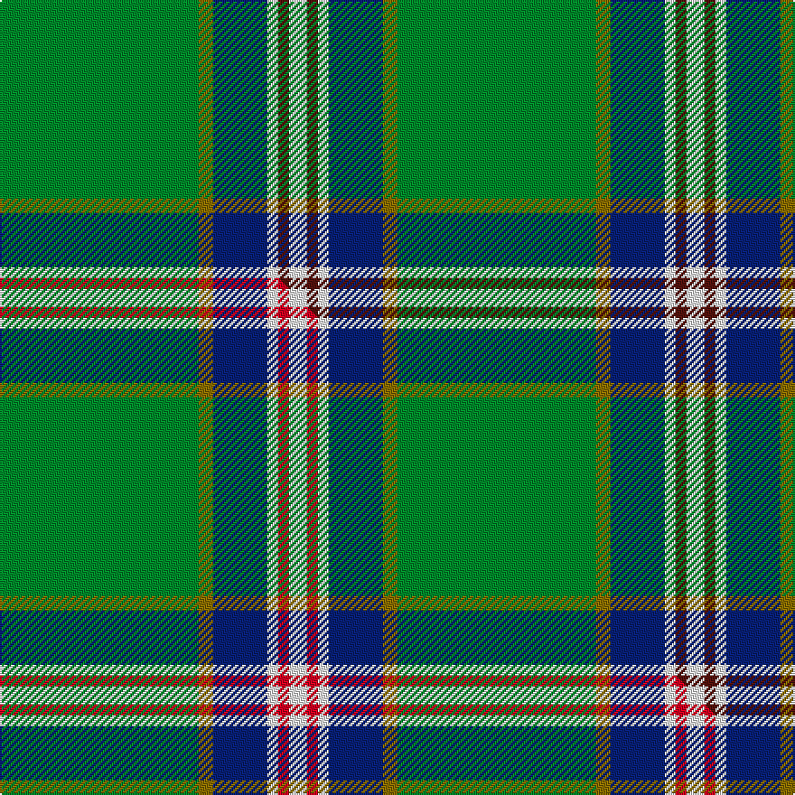

This is one **variant** — a specific cloth: this exact thread count and colourway, with its own
provenance below. It is one weaving of the [sett](/setts/g55y4db15w3dr3w5/) (the scale-free proportion — the
same cloth at any scale or shade), whose colour order is pattern [GGBWBW](/stripes/ggbwbw/).

Part of the [Spencer](/tartans/s/sp/spencer/) tartan — the named design grouping this sett with its other cloths.

Sourced from tartans-authority.  It is a [6 stripe tartan](/stripes/stripes6/).

Original link [https://www.tartanregister.gov.uk/tartanDetails.aspx?ref=10901](https://www.tartanregister.gov.uk/tartanDetails.aspx?ref=10901)

Dataset <small>— provenance for this record, inherited from the source manifest</small>

<dl class="dataset-prov">
<dt>source</dt><dd><a href="/sources/tartans-authority/">Scottish Tartans Authority</a></dd>
<dt>data captured from</dt><dd><a href="https://github.com/thetartan/tartan-database/blob/master/data/tartans-authority/data.csv">https://github.com/thetartan/tartan-database/blob/master/data/tartans-authority/data.csv</a></dd>
<dt>data date</dt><dd>2013 <small>(this record)</small></dd>
<dt>licence</dt><dd><a href="https://creativecommons.org/licenses/by-nc-nd/4.0/">CC BY-NC-ND 4.0</a></dd>
</dl>

Capture chain <small>— the hands this data passed through, oldest first; each capture carries its own licence</small>

<ol class="capture-chain">
<li><a href="https://www.tartansauthority.com/">Scottish Tartans Authority</a> <small>the heritage body's archive — its tartan-ferret record browser is retired (links repaired to the SRT, above)</small></li>
<li><a href="https://github.com/thetartan/tartan-database">thetartan/tartan-database</a> <small>2016-2017</small> · <a href="https://creativecommons.org/licenses/by-nc-nd/4.0/">CC BY-NC-ND 4.0</a> <small>Levko Kravets's frozen compilation — the capture we vendored, and where its CC licence text came from</small></li>
<li>this dictionary <small>captured 2026-06-10 · commit 5bf86c7566</small> <small>each re-capture is a git commit to data/sources</small></li>
</ol>

## Register references

External register numbers recorded for this tartan.

- Scottish Register of Tartans: [10901](https://www.tartanregister.gov.uk/tartanDetails?ref=10901)
- Scottish Tartans Authority (ITI): 10901

## Thread count
G/110 Y8 DB30 W6 DR6 W/10

One full sett is **220 threads**.

## Palette
<table><thead><tr><th>Colour</th><th>Shade</th><th>OKLCh</th></tr></thead><tbody><tr><td>DB</td><td><code style="background-color:#082077;">#082077</code> <small style="color:#888">#082077</small></td><td><small style="color:#888">oklch(30.0% 0.149 265.1)</small></td></tr><tr><td>DR</td><td><code style="background-color:#55120C;">#55120C</code> <small style="color:#888">#55120C</small></td><td><small style="color:#888">oklch(30.0% 0.099 29.3)</small></td></tr><tr><td>G</td><td><code style="background-color:#008B2A;">#008B2A</code> <small style="color:#888">#008B2A</small></td><td><small style="color:#888">oklch(55.4% 0.170 145.9)</small></td></tr><tr><td>W</td><td><code style="background-color:#F7F7F7;">#F7F7F7</code> <small style="color:#888">#F7F7F7</small></td><td><small style="color:#888">oklch(97.6% 0.000 89.9)</small></td></tr><tr><td>Y</td><td><code style="background-color:#8B6E00;">#8B6E00</code> <small style="color:#888">#8B6E00</small></td><td><small style="color:#888">oklch(55.1% 0.113 90.4)</small></td></tr></tbody></table>

# Sample pattern

## Compared to the master

This cloth is one sett of its design; the master sett (the exemplar the design is anchored on) is below for comparison.

Its **ΔTartan distance** from the master is **0.02** — the same measure the nearest-tartans table ranks by (0 is identical; a re-scale of the same cloth is near 0, a recolour or a different proportion further).

<figure class="master-compare" style="margin:0">

this sett
master sett ★

<figcaption style="color:#888;font-size:smaller">One weave of this sett against the <a href="/setts/g55y4db15w3r3w5/">master sett ★</a>, split on the diagonal: a shared proportion runs seamlessly across it with only the shades shifting; a different proportion breaks on it.</figcaption>
</figure>

## Nearest tartan variants

The nearest existing variants by ΔTartan distance, with this cloth at the top so the swatches line up against it.

ΔTartan

Threads

Variant

Sett

—

220

<a href="/variants/s6/g55y4db15w3dr3w5~x2/">Spencer (2013)</a>

<a href="/ttd/edit/#slug=g55y4db15w3r3w5~x2&amp;base=g55y4db15w3dr3w5~x2" title="compare in the TTD">0.02</a>

220

<a href="/variants/s6/g55y4db15w3r3w5~x2/">Spencer (2013)</a>

<a href="/ttd/edit/#slug=db8g20w4r1~x5&amp;base=g55y4db15w3dr3w5~x2" title="compare in the TTD">1.06</a>

285

<a href="/variants/s4/db8g20w4r1~x5/">Farooq (Personal)</a>

<a href="/ttd/edit/#slug=w8r6y2g34db3~x2&amp;base=g55y4db15w3dr3w5~x2" title="compare in the TTD">1.31</a>

190

<a href="/variants/s5/w8r6y2g34db3~x2/">Milling-Christensen</a>

<a href="/ttd/edit/#slug=w8r6ly2dg34db3~x2&amp;base=g55y4db15w3dr3w5~x2" title="compare in the TTD">1.31</a>

190

<a href="/variants/s5/w8r6ly2dg34db3~x2/">Milling-Kristensen (Personal)</a>

<a href="/ttd/edit/#slug=w1g10db4lb1~x2&amp;base=g55y4db15w3dr3w5~x2" title="compare in the TTD">1.52</a>

60

<a href="/variants/s4/w1g10db4lb1~x2/">Wilson's, No 205</a>

<a href="/ttd/edit/#slug=lb5dy6w2g7w2t44w2~x2&amp;base=g55y4db15w3dr3w5~x2" title="compare in the TTD">1.68</a>

258

<a href="/variants/s7/lb5dy6w2g7w2t44w2~x2/">Leblant-Macqueron (Personal)</a>

<a href="/ttd/edit/#slug=db5ly5dy13g41r3~x2&amp;base=g55y4db15w3dr3w5~x2" title="compare in the TTD">1.73</a>

252

<a href="/variants/s5/db5ly5dy13g41r3~x2/">Clare, Richard (Personal)</a>

<a href="/ttd/edit/#slug=db5lo5dy13g41r3~x2~lo3006076-g2505139&amp;base=g55y4db15w3dr3w5~x2" title="compare in the TTD">1.73</a>

252

<a href="/variants/s5/db5lo5dy13y41r3~x2~lo3006076-y2505139/">Clare (Prince George) (Personal)</a>

<a href="/ttd/edit/#slug=dy8g50db4lb2w5y2~x2&amp;base=g55y4db15w3dr3w5~x2" title="compare in the TTD">1.80</a>

264

<a href="/variants/s6/dy8g50db4lb2w5y2~x2/">Greenup (2015)</a>

<a href="/ttd/edit/#slug=y1g10db4lb1~x2&amp;base=g55y4db15w3dr3w5~x2" title="compare in the TTD">1.82</a>

60

<a href="/variants/s4/y1g10db4lb1~x2/">Wilson's No.174</a>

## Neighbour map

Every grey dot is one of 13621 variants placed by the first two principal components of the ΔTartan feature space (42% of its variance). Red is this tartan; blue dots are its nearest — click one to open its page.

<svg viewBox="0 0 640 380" role="img" style="max-width:100%;height:auto;border:1px solid #e0e0e0;border-radius:4px;display:block" xmlns="http://www.w3.org/2000/svg"><image href="/nn/cloud.v1.png" width="640" height="380"/><a href="/variants/s6/g55y4db15w3r3w5~x2/"><circle cx="379.9" cy="157.0" r="4" fill="#3465a4"><title>Spencer (2013)</title></circle></a><a href="/variants/s4/db8g20w4r1~x5/"><circle cx="345.3" cy="204.5" r="4" fill="#3465a4"><title>Farooq (Personal)</title></circle></a><a href="/variants/s5/w8r6y2g34db3~x2/"><circle cx="356.7" cy="170.2" r="4" fill="#3465a4"><title>Milling-Christensen</title></circle></a><a href="/variants/s5/w8r6ly2dg34db3~x2/"><circle cx="340.3" cy="160.1" r="4" fill="#3465a4"><title>Milling-Kristensen (Personal)</title></circle></a><a href="/variants/s4/w1g10db4lb1~x2/"><circle cx="371.1" cy="244.7" r="4" fill="#3465a4"><title>Wilson's, No 205</title></circle></a><a href="/variants/s7/lb5dy6w2g7w2t44w2~x2/"><circle cx="443.9" cy="163.5" r="4" fill="#3465a4"><title>Leblant-Macqueron (Personal)</title></circle></a><a href="/variants/s5/db5ly5dy13g41r3~x2/"><circle cx="356.8" cy="192.4" r="4" fill="#3465a4"><title>Clare, Richard (Personal)</title></circle></a><a href="/variants/s5/db5lo5dy13y41r3~x2~lo3006076-y2505139/"><circle cx="359.2" cy="189.5" r="4" fill="#3465a4"><title>Clare (Prince George) (Personal)</title></circle></a><a href="/variants/s6/dy8g50db4lb2w5y2~x2/"><circle cx="443.5" cy="138.3" r="4" fill="#3465a4"><title>Greenup (2015)</title></circle></a><a href="/variants/s4/y1g10db4lb1~x2/"><circle cx="392.5" cy="250.0" r="4" fill="#3465a4"><title>Wilson's No.174</title></circle></a><circle cx="390.6" cy="164.6" r="5" fill="#c00000"/><text x="320" y="376" text-anchor="middle" font-size="11" fill="#999">ground</text><text x="11" y="190" text-anchor="middle" font-size="11" fill="#999" transform="rotate(-90 11 190)">complexity</text></svg>

ID: /variants/s6/g55y4db15w3dr3w5~x2/
