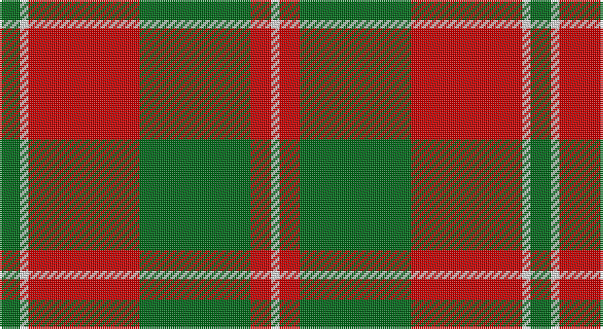

This page is one **sett** — a single exact thread-count. It belongs to the [tartan](/setts/g5w2r27g27r5w2/)
(the same proportion at any scale), whose colour order is pattern [GWRGRW](/stripes/gwrgrw/).

Part of the [MacDonald of Glenaladale](/tartans/macdonald-of-glenaladale/) tartan — the named design grouping this sett with its other cloths.

Sourced from register-of-tartans.  It is a [6 stripe tartan](/stripes/stripes6/).

Original link https://www.tartanregister.gov.uk/tartanDetails.aspx?ref=2360

## Also known as

This cloth is also recorded under:

- MacDonald of Glenaladale Artifact
- MacDougall #5

## Register references

External register numbers recorded for this tartan.

- Scottish Register of Tartans: [2360](https://www.tartanregister.gov.uk/tartanDetails.aspx?ref=2360)
- Scottish Tartans Authority (ITI): 7012

## Thread count
G/10 LN4 R54 G54 R10 LN/4

One full sett is **258 threads**.

## Palette

Palette: <strong>Tartan Register</strong>
<table><thead><tr><th>Colour</th><th>Threads</th><th>Shade</th><th>Base</th><th>OKLCh</th></tr></thead><tbody><tr><td>G/</td><td style="text-align:right;font-variant-numeric:tabular-nums">10</td><td><code style="background-color:#006818;">#006818</code> <small style="color:#888">#006818</small></td><td>G <code style="background-color:#006100;">#006100</code></td><td><small style="color:#888">oklch(45.0% 0.142 145.0)</small></td></tr><tr><td>LN</td><td style="text-align:right;font-variant-numeric:tabular-nums">4</td><td><code style="background-color:#E0E0E0;">#E0E0E0</code> <small style="color:#888">#E0E0E0</small></td><td>W <code style="background-color:#F7F7F7;">#F7F7F7</code></td><td><small style="color:#888">oklch(90.7% 0.000 89.9)</small></td></tr><tr><td>R</td><td style="text-align:right;font-variant-numeric:tabular-nums">54</td><td><code style="background-color:#C80000;">#C80000</code> <small style="color:#888">#C80000</small></td><td>R <code style="background-color:#CC0000;">#CC0000</code></td><td><small style="color:#888">oklch(52.3% 0.215 29.2)</small></td></tr><tr><td>G</td><td style="text-align:right;font-variant-numeric:tabular-nums">54</td><td><code style="background-color:#006818;">#006818</code> <small style="color:#888">#006818</small></td><td>G <code style="background-color:#006100;">#006100</code></td><td><small style="color:#888">oklch(45.0% 0.142 145.0)</small></td></tr><tr><td>R</td><td style="text-align:right;font-variant-numeric:tabular-nums">10</td><td><code style="background-color:#C80000;">#C80000</code> <small style="color:#888">#C80000</small></td><td>R <code style="background-color:#CC0000;">#CC0000</code></td><td><small style="color:#888">oklch(52.3% 0.215 29.2)</small></td></tr><tr><td>LN/</td><td style="text-align:right;font-variant-numeric:tabular-nums">4</td><td><code style="background-color:#E0E0E0;">#E0E0E0</code> <small style="color:#888">#E0E0E0</small></td><td>W <code style="background-color:#F7F7F7;">#F7F7F7</code></td><td><small style="color:#888">oklch(90.7% 0.000 89.9)</small></td></tr></tbody></table>

# Sample pattern

## Compared to the master

This cloth is one sett of its design; the master sett (the exemplar the design is anchored on) is below for comparison.

<figure style="margin:0"><figcaption style="color:#888;font-size:smaller">this sett</figcaption></figure>
<figure style="margin:0"><figcaption style="color:#888;font-size:smaller"><a href="/setts/db3t1r30db32r3w1r3g23r31db3w1/">master sett →</a></figcaption></figure>

## Nearest tartans

The nearest existing variants by ΔTartan distance, with this tartan at the top so the swatches line up against it.

ΔTartan

Tartan

Sett

—

<a href="/ttd/edit/#slug=g5w2r27g27r5w2~x2">MacDonald of Glenaladale (symmetrical)</a> <a class="nn-out" href="/variants/s6/g5w2r27g27r5w2~x2/" title="open its dictionary page">↗</a>

1.00

<a href="/ttd/edit/#slug=g20k2r3k2r6g20r29g3r10~x2&amp;base=g5w2r27g27r5w2~x2">Livingston</a> <a class="nn-out" href="/variants/s9/g20k2r3k2r6g20r29g3r10~x2/" title="open its dictionary page">↗</a>

1.07

<a href="/ttd/edit/#slug=db1r12g6ly1g6db1~x4&amp;base=g5w2r27g27r5w2~x2">Cetoloni (Personal)</a> <a class="nn-out" href="/variants/s6/db1r12g6ly1g6db1~x4/" title="open its dictionary page">↗</a>

1.08

<a href="/ttd/edit/#slug=k1r5g10r5g1~x4&amp;base=g5w2r27g27r5w2~x2">Murray, Lord George (Hose)</a> <a class="nn-out" href="/variants/s5/k1r5g10r5g1~x4/" title="open its dictionary page">↗</a>

1.11

<a href="/ttd/edit/#slug=k1g6k1g6r16db1~x2&amp;base=g5w2r27g27r5w2~x2">Denny, hunting</a> <a class="nn-out" href="/variants/s6/k1g6k1g6r16db1~x2/" title="open its dictionary page">↗</a>

1.12

<a href="/ttd/edit/#slug=g9r2g9r14k1w2~x2&amp;base=g5w2r27g27r5w2~x2">MacGregor of Balquidder (Logan)</a> <a class="nn-out" href="/variants/s6/g9r2g9r14k1w2~x2/" title="open its dictionary page">↗</a>

1.13

<a href="/ttd/edit/#slug=dg8r2dg9r16w1~x2&amp;base=g5w2r27g27r5w2~x2">MacGregor of Balquhidder</a> <a class="nn-out" href="/variants/s5/dg8r2dg9r16w1~x2/" title="open its dictionary page">↗</a>

1.16

<a href="/ttd/edit/#slug=r4g4lo4g12r22lo1g4~x4&amp;base=g5w2r27g27r5w2~x2">Spice Apple</a> <a class="nn-out" href="/variants/s7/r4g4lo4g12r22lo1g4~x4/" title="open its dictionary page">↗</a>

1.18

<a href="/variants/s8/r44db2g26r3db2/">Unidentified Cant #09</a>

1.18

<a href="/ttd/edit/#slug=r1dg6r1dg6r15ly1~x2&amp;base=g5w2r27g27r5w2~x2">Cameron Clan D</a> <a class="nn-out" href="/variants/s6/r1dg6r1dg6r15ly1~x2/" title="open its dictionary page">↗</a>

1.18

<a href="/ttd/edit/#slug=dg20k2r3k2r6dg20r29dg3r10~x2&amp;base=g5w2r27g27r5w2~x2">Livingston</a> <a class="nn-out" href="/variants/s9/dg20k2r3k2r6dg20r29dg3r10~x2/" title="open its dictionary page">↗</a>

## Neighbour map

Every grey dot is one of 14360 variants placed by the first two principal components of the ΔTartan feature space (44% of its variance). Red is this tartan; blue dots are its nearest — click one to open its page.

<svg viewBox="0 0 640 380" role="img" style="max-width:100%;height:auto;border:1px solid #e0e0e0;border-radius:4px;display:block" xmlns="http://www.w3.org/2000/svg"><image href="/nn/cloud.v1.png" width="640" height="380"/><a href="/variants/s9/g20k2r3k2r6g20r29g3r10~x2/"><circle cx="334.8" cy="186.7" r="4" fill="#3465a4"><title>Livingston</title></circle></a><a href="/variants/s6/db1r12g6ly1g6db1~x4/"><circle cx="287.5" cy="198.5" r="4" fill="#3465a4"><title>Cetoloni (Personal)</title></circle></a><a href="/variants/s5/k1r5g10r5g1~x4/"><circle cx="323.1" cy="240.3" r="4" fill="#3465a4"><title>Murray, Lord George (Hose)</title></circle></a><a href="/variants/s6/k1g6k1g6r16db1~x2/"><circle cx="322.6" cy="169.9" r="4" fill="#3465a4"><title>Denny, hunting</title></circle></a><a href="/variants/s6/g9r2g9r14k1w2~x2/"><circle cx="297.2" cy="199.6" r="4" fill="#3465a4"><title>MacGregor of Balquidder (Logan)</title></circle></a><a href="/variants/s5/dg8r2dg9r16w1~x2/"><circle cx="345.6" cy="217.9" r="4" fill="#3465a4"><title>MacGregor of Balquhidder</title></circle></a><a href="/variants/s7/r4g4lo4g12r22lo1g4~x4/"><circle cx="367.6" cy="184.7" r="4" fill="#3465a4"><title>Spice Apple</title></circle></a><a href="/variants/s8/r44db2g26r3db2/"><circle cx="375.7" cy="170.7" r="4" fill="#3465a4"><title>Unidentified Cant #09</title></circle></a><a href="/variants/s6/r1dg6r1dg6r15ly1~x2/"><circle cx="393.3" cy="195.9" r="4" fill="#3465a4"><title>Cameron Clan D</title></circle></a><a href="/variants/s9/dg20k2r3k2r6dg20r29dg3r10~x2/"><circle cx="343.8" cy="187.3" r="4" fill="#3465a4"><title>Livingston</title></circle></a><circle cx="334.3" cy="199.7" r="5" fill="#c00000"/></svg>

ID: /variants/s6/g5w2r27g27r5w2~x2/
