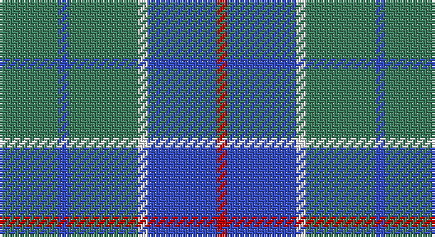

This page is one **sett** — a single exact thread-count. It belongs to the [tartan](/setts/g6b1g7w1b7r1/)
(the same proportion at any scale), whose colour order is pattern [GBGWBR](/stripes/gbgwbr/).

Part of the [Norris](/tartans/norris/) tartan — the named design grouping this sett with its other cloths.

Sourced from register-of-tartans.  It is a [6 stripe tartan](/stripes/stripes6/).

Original link https://www.tartanregister.gov.uk/tartanDetails.aspx?ref=3149

2 attestations — the source records this cloth was collapsed from (oldest owns this page)

<ul>
<li>01/01/1957 — Norris (1957) (register-of-tartans, <a href="https://www.tartanregister.gov.uk/tartanDetails.aspx?ref=3149">record</a>)</li>
<li>1957 — Norris (1957) (Name) (tartans-authority, <a href="http://www.tartansauthority.com/tartan-ferret/display/5943/">record</a>)</li>
</ul>

## Register references

External register numbers recorded for this tartan.

- Scottish Register of Tartans: [3149](https://www.tartanregister.gov.uk/tartanDetails.aspx?ref=3149)
- Scottish Tartans Authority (ITI): 5943

## Thread count
G/24 Ba4 G28 W4 Ba28 R/4

One full sett is **156 threads**.

## Palette

Palette: <strong>Tartan Register</strong>
<table><thead><tr><th>Colour</th><th>Threads</th><th>Shade</th><th>Base</th><th>OKLCh</th></tr></thead><tbody><tr><td>G/</td><td style="text-align:right;font-variant-numeric:tabular-nums">24</td><td><code style="background-color:#408060;">#408060</code> <small style="color:#888">#408060</small></td><td>G <code style="background-color:#006100;">#006100</code></td><td><small style="color:#888">oklch(54.8% 0.084 160.1)</small></td></tr><tr><td>Ba</td><td style="text-align:right;font-variant-numeric:tabular-nums">4</td><td><code style="background-color:#3850C8;">#3850C8</code> <small style="color:#888">#3850C8</small></td><td>B <code style="background-color:#2A418A;">#2A418A</code></td><td><small style="color:#888">oklch(48.8% 0.188 269.4)</small></td></tr><tr><td>G</td><td style="text-align:right;font-variant-numeric:tabular-nums">28</td><td><code style="background-color:#408060;">#408060</code> <small style="color:#888">#408060</small></td><td>G <code style="background-color:#006100;">#006100</code></td><td><small style="color:#888">oklch(54.8% 0.084 160.1)</small></td></tr><tr><td>W</td><td style="text-align:right;font-variant-numeric:tabular-nums">4</td><td><code style="background-color:#FCFCFC;">#FCFCFC</code> <small style="color:#888">#FCFCFC</small></td><td>W <code style="background-color:#F7F7F7;">#F7F7F7</code></td><td><small style="color:#888">oklch(99.1% 0.000 89.9)</small></td></tr><tr><td>Ba</td><td style="text-align:right;font-variant-numeric:tabular-nums">28</td><td><code style="background-color:#3850C8;">#3850C8</code> <small style="color:#888">#3850C8</small></td><td>B <code style="background-color:#2A418A;">#2A418A</code></td><td><small style="color:#888">oklch(48.8% 0.188 269.4)</small></td></tr><tr><td>R/</td><td style="text-align:right;font-variant-numeric:tabular-nums">4</td><td><code style="background-color:#C80000;">#C80000</code> <small style="color:#888">#C80000</small></td><td>R <code style="background-color:#CC0000;">#CC0000</code></td><td><small style="color:#888">oklch(52.3% 0.215 29.2)</small></td></tr></tbody></table>

# Sample pattern

## Compared to the master

This cloth is one sett of its design; the master sett (the exemplar the design is anchored on) is below for comparison.

<figure style="margin:0"><figcaption style="color:#888;font-size:smaller">this sett</figcaption></figure>
<figure style="margin:0"><figcaption style="color:#888;font-size:smaller"><a href="/setts/k2w1g5r1t18r2/">master sett →</a></figcaption></figure>

## Nearest tartans

The nearest existing variants by ΔTartan distance, with this tartan at the top so the swatches line up against it.

ΔTartan

Tartan

Sett

—

<a href="/ttd/edit/#slug=g6b1g7w1b7r1~x4">Norris (1957)</a> <a class="nn-out" href="/variants/s6/g6b1g7w1b7r1~x4/" title="open its dictionary page">↗</a>

1.31

<a href="/ttd/edit/#slug=b3k1g4k1b4g9k2~x4&amp;base=g6b1g7w1b7r1~x4">Outdoorsmen (Fashion)</a> <a class="nn-out" href="/variants/s7/b3k1g4k1b4g9k2~x4/" title="open its dictionary page">↗</a>

1.35

<a href="/ttd/edit/#slug=db1r1g6db6ly1db6r1g1~x2&amp;base=g6b1g7w1b7r1~x4">MacHardy</a> <a class="nn-out" href="/variants/s8/db1r1g6db6ly1db6r1g1~x2/" title="open its dictionary page">↗</a>

1.41

<a href="/ttd/edit/#slug=dt3t14dt3o16dt34r3~x2&amp;base=g6b1g7w1b7r1~x4">Thorburn (Lochcarron)</a> <a class="nn-out" href="/variants/s6/dt3t14dt3o16dt34r3~x2/" title="open its dictionary page">↗</a>

1.42

<a href="/ttd/edit/#slug=dp3o15dt15r2dt15ly3~x2&amp;base=g6b1g7w1b7r1~x4">HMS Duncan (Military)</a> <a class="nn-out" href="/variants/s6/dp3o15dt15r2dt15ly3~x2/" title="open its dictionary page">↗</a>

1.42

<a href="/ttd/edit/#slug=dg1r1db6ly1db6dg6r1db1~x2&amp;base=g6b1g7w1b7r1~x4">MacHardy</a> <a class="nn-out" href="/variants/s8/dg1r1db6ly1db6dg6r1db1~x2/" title="open its dictionary page">↗</a>

1.43

<a href="/ttd/edit/#slug=n8k5n16o9n3o3n3o3n10lb3~x2&amp;base=g6b1g7w1b7r1~x4">Digital Equipment Corp.</a> <a class="nn-out" href="/variants/s10/n8k5n16o9n3o3n3o3n10lb3~x2/" title="open its dictionary page">↗</a>

1.48

<a href="/ttd/edit/#slug=t33r8db12g12t8db2t8~x2&amp;base=g6b1g7w1b7r1~x4">Bermuda Plaid (1947) (District)</a> <a class="nn-out" href="/variants/s7/t33r8db12g12t8db2t8~x2/" title="open its dictionary page">↗</a>

1.53

<a href="/ttd/edit/#slug=db11g2db15g18w2~x2&amp;base=g6b1g7w1b7r1~x4">Hamilton, hunting</a> <a class="nn-out" href="/variants/s5/db11g2db15g18w2~x2/" title="open its dictionary page">↗</a>

1.55

<a href="/ttd/edit/#slug=t6k3t10lo5t2lo2t2lo2t7w2~x2&amp;base=g6b1g7w1b7r1~x4">Digital Corporate Tartan</a> <a class="nn-out" href="/variants/s10/t6k3t10lo5t2lo2t2lo2t7w2~x2/" title="open its dictionary page">↗</a>

1.56

<a href="/ttd/edit/#slug=t9dt3t1dt12ly1~x4&amp;base=g6b1g7w1b7r1~x4">North Sea Commission</a> <a class="nn-out" href="/variants/s5/t9dt3t1dt12ly1~x4/" title="open its dictionary page">↗</a>

## Neighbour map

Every grey dot is one of 14360 variants placed by the first two principal components of the ΔTartan feature space (44% of its variance). Red is this tartan; blue dots are its nearest — click one to open its page.

<svg viewBox="0 0 640 380" role="img" style="max-width:100%;height:auto;border:1px solid #e0e0e0;border-radius:4px;display:block" xmlns="http://www.w3.org/2000/svg"><image href="/nn/cloud.v1.png" width="640" height="380"/><a href="/variants/s7/b3k1g4k1b4g9k2~x4/"><circle cx="298.0" cy="246.4" r="4" fill="#3465a4"><title>Outdoorsmen (Fashion)</title></circle></a><a href="/variants/s8/db1r1g6db6ly1db6r1g1~x2/"><circle cx="291.2" cy="229.6" r="4" fill="#3465a4"><title>MacHardy</title></circle></a><a href="/variants/s6/dt3t14dt3o16dt34r3~x2/"><circle cx="332.7" cy="226.1" r="4" fill="#3465a4"><title>Thorburn (Lochcarron)</title></circle></a><a href="/variants/s6/dp3o15dt15r2dt15ly3~x2/"><circle cx="278.9" cy="232.6" r="4" fill="#3465a4"><title>HMS Duncan (Military)</title></circle></a><a href="/variants/s8/dg1r1db6ly1db6dg6r1db1~x2/"><circle cx="309.7" cy="239.8" r="4" fill="#3465a4"><title>MacHardy</title></circle></a><a href="/variants/s10/n8k5n16o9n3o3n3o3n10lb3~x2/"><circle cx="307.6" cy="245.2" r="4" fill="#3465a4"><title>Digital Equipment Corp.</title></circle></a><a href="/variants/s7/t33r8db12g12t8db2t8~x2/"><circle cx="346.4" cy="211.1" r="4" fill="#3465a4"><title>Bermuda Plaid (1947) (District)</title></circle></a><a href="/variants/s5/db11g2db15g18w2~x2/"><circle cx="328.2" cy="271.2" r="4" fill="#3465a4"><title>Hamilton, hunting</title></circle></a><a href="/variants/s10/t6k3t10lo5t2lo2t2lo2t7w2~x2/"><circle cx="322.9" cy="248.6" r="4" fill="#3465a4"><title>Digital Corporate Tartan</title></circle></a><a href="/variants/s5/t9dt3t1dt12ly1~x4/"><circle cx="397.6" cy="252.6" r="4" fill="#3465a4"><title>North Sea Commission</title></circle></a><circle cx="311.8" cy="250.5" r="5" fill="#c00000"/></svg>

ID: /variants/s6/g6b1g7w1b7r1~x4/
