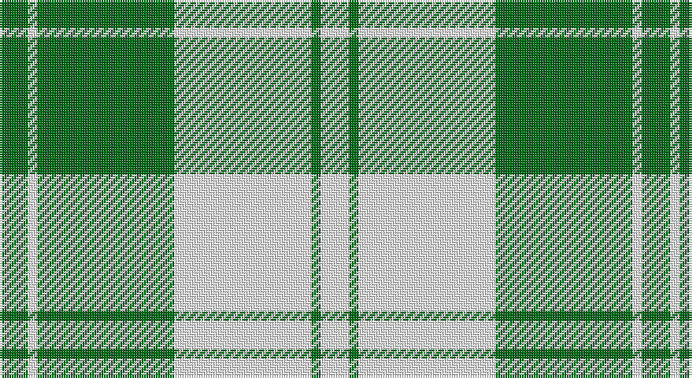

This page is one **sett** — a single exact thread-count. It belongs to the [tartan](/setts/g6w2g29w29g2w6/)
(the same proportion at any scale), whose colour order is pattern [GWGWGW](/stripes/gwgwgw/).

Part of the [Erskine](/tartans/erskine/) tartan — the named design grouping this sett with its other cloths.

Sourced from tartans-authority.  It is a [6 stripe tartan](/stripes/stripes6/).

Original link http://www.tartansauthority.com/tartan-ferret/display/941/

## Provenance

Earliest known date: pre 2003 A sample of this tartan was recorded by the Scottish Tartans Society during the period 1970 to 1990.

## Also known as

This cloth is also recorded under:

- Erskine Blue
- Erskine Green
- Erskine Hunting
- Erskine Purple
- Erskine Red Dress
- Erskine Royal Blue Dress
- Erskine,
- Erskine, Black & Red
- Erskine, Blue
- Erskine, Burgundy
- Erskine, Green
- Erskine, Grey
- Erskine, Purple
- Erskine, dress
- Erskine, hunting
- Royal Scots Fusiliers

3 attestations — the source records this cloth was collapsed from (oldest owns this page)

<ul>
<li>1980 — Erskine, Green (Dance) (tartans-authority, <a href="http://www.tartansauthority.com/tartan-ferret/display/941/">record</a>)</li>
<li>undated — Erskine, Green (weddslist, <a href="http://www.weddslist.com/cgi-bin/tartans/pg.pl?source=sts">record</a>)</li>
<li>undated — Erskine Green Clan Tartan (house-of-tartan, <a href="http://www.house-of-tartan.scotland.net/house/TartanViewjs.asp?colr=Def&tnam=941">record</a>)</li>
</ul>

## Register references

External register numbers recorded for this tartan.

- Scottish Tartans Authority (ITI): 941

## Thread count
G/12 W4 G58 W58 G4 W/12

One full sett is **272 threads**.

## Palette

Palette: <strong>Tartan Register</strong>
<table><thead><tr><th>Colour</th><th>Threads</th><th>Shade</th><th>Base</th><th>OKLCh</th></tr></thead><tbody><tr><td>G/</td><td style="text-align:right;font-variant-numeric:tabular-nums">12</td><td><code style="background-color:#006818;">#006818</code> <small style="color:#888">#006818</small></td><td>G <code style="background-color:#006100;">#006100</code></td><td><small style="color:#888">oklch(45.0% 0.142 145.0)</small></td></tr><tr><td>W</td><td style="text-align:right;font-variant-numeric:tabular-nums">4</td><td><code style="background-color:#FCFCFC;">#FCFCFC</code> <small style="color:#888">#FCFCFC</small></td><td>W <code style="background-color:#F7F7F7;">#F7F7F7</code></td><td><small style="color:#888">oklch(99.1% 0.000 89.9)</small></td></tr><tr><td>G</td><td style="text-align:right;font-variant-numeric:tabular-nums">58</td><td><code style="background-color:#006818;">#006818</code> <small style="color:#888">#006818</small></td><td>G <code style="background-color:#006100;">#006100</code></td><td><small style="color:#888">oklch(45.0% 0.142 145.0)</small></td></tr><tr><td>W</td><td style="text-align:right;font-variant-numeric:tabular-nums">58</td><td><code style="background-color:#FCFCFC;">#FCFCFC</code> <small style="color:#888">#FCFCFC</small></td><td>W <code style="background-color:#F7F7F7;">#F7F7F7</code></td><td><small style="color:#888">oklch(99.1% 0.000 89.9)</small></td></tr><tr><td>G</td><td style="text-align:right;font-variant-numeric:tabular-nums">4</td><td><code style="background-color:#006818;">#006818</code> <small style="color:#888">#006818</small></td><td>G <code style="background-color:#006100;">#006100</code></td><td><small style="color:#888">oklch(45.0% 0.142 145.0)</small></td></tr><tr><td>W/</td><td style="text-align:right;font-variant-numeric:tabular-nums">12</td><td><code style="background-color:#FCFCFC;">#FCFCFC</code> <small style="color:#888">#FCFCFC</small></td><td>W <code style="background-color:#F7F7F7;">#F7F7F7</code></td><td><small style="color:#888">oklch(99.1% 0.000 89.9)</small></td></tr></tbody></table>

# Sample pattern

## Compared to the master

This cloth is one sett of its design; the master sett (the exemplar the design is anchored on) is below for comparison.

<figure style="margin:0"><figcaption style="color:#888;font-size:smaller">this sett</figcaption></figure>
<figure style="margin:0"><figcaption style="color:#888;font-size:smaller"><a href="/setts/g6r1g24r28g1r4/">master sett →</a></figcaption></figure>

## Nearest tartans

The nearest existing variants by ΔTartan distance, with this tartan at the top so the swatches line up against it.

ΔTartan

Tartan

Sett

—

<a href="/ttd/edit/#slug=g6w2g29w29g2w6~x2">Erskine, Green (Dance)</a> <a class="nn-out" href="/variants/s6/g6w2g29w29g2w6~x2/" title="open its dictionary page">↗</a>

0.78

<a href="/ttd/edit/#slug=dg6w2dg29w29dg2w6~x2&amp;base=g6w2g29w29g2w6~x2">Erskine Green</a> <a class="nn-out" href="/variants/s6/dg6w2dg29w29dg2w6~x2/" title="open its dictionary page">↗</a>

1.51

<a href="/ttd/edit/#slug=g1g1w1g15w15g1w1g1~x4&amp;base=g6w2g29w29g2w6~x2">Bundy, Dress Black Personal)</a> <a class="nn-out" href="/variants/s8/g1g1w1g15w15g1w1g1~x4/" title="open its dictionary page">↗</a>

1.62

<a href="/ttd/edit/#slug=w12g12w1g12w12lo1~x4&amp;base=g6w2g29w29g2w6~x2">Wallace Green Dress Fashion Tartan</a> <a class="nn-out" href="/variants/s6/w12g12w1g12w12lo1~x4/" title="open its dictionary page">↗</a>

1.67

<a href="/ttd/edit/#slug=dg4w35g31w4~x2&amp;base=g6w2g29w29g2w6~x2">Lewis, Green (Dance)</a> <a class="nn-out" href="/variants/s4/dg4w35g31w4~x2/" title="open its dictionary page">↗</a>

1.69

<a href="/ttd/edit/#slug=w15do6w1do3o3w1~x4&amp;base=g6w2g29w29g2w6~x2">Burns (Fashion)</a> <a class="nn-out" href="/variants/s6/w15do6w1do3o3w1~x4/" title="open its dictionary page">↗</a>

1.70

<a href="/ttd/edit/#slug=db4ly9w4db9ly18w1~x2&amp;base=g6w2g29w29g2w6~x2">WVU Mountaineer Tartan</a> <a class="nn-out" href="/variants/s6/db4ly9w4db9ly18w1~x2/" title="open its dictionary page">↗</a>

1.79

<a href="/ttd/edit/#slug=dt3w16dt4w3dt12w2~x3&amp;base=g6w2g29w29g2w6~x2">MacMugen</a> <a class="nn-out" href="/variants/s6/dt3w16dt4w3dt12w2~x3/" title="open its dictionary page">↗</a>

1.97

<a href="/ttd/edit/#slug=dt4ly9w4dt9ly18w1~x2&amp;base=g6w2g29w29g2w6~x2">WVU Mountaineer (Corporate)</a> <a class="nn-out" href="/variants/s6/dt4ly9w4dt9ly18w1~x2/" title="open its dictionary page">↗</a>

2.07

<a href="/ttd/edit/#slug=w2o1w2g6w10o6w2g1w2~x2&amp;base=g6w2g29w29g2w6~x2">O'Neill</a> <a class="nn-out" href="/variants/s9/w2o1w2g6w10o6w2g1w2~x2/" title="open its dictionary page">↗</a>

2.11

<a href="/ttd/edit/#slug=w6b3w20k2w3k25w3~x2&amp;base=g6w2g29w29g2w6~x2">Forbes Dress (Clans Originaux)</a> <a class="nn-out" href="/variants/s7/w6b3w20k2w3k25w3~x2/" title="open its dictionary page">↗</a>

## Neighbour map

Every grey dot is one of 14360 variants placed by the first two principal components of the ΔTartan feature space (44% of its variance). Red is this tartan; blue dots are its nearest — click one to open its page.

<svg viewBox="0 0 640 380" role="img" style="max-width:100%;height:auto;border:1px solid #e0e0e0;border-radius:4px;display:block" xmlns="http://www.w3.org/2000/svg"><image href="/nn/cloud.v1.png" width="640" height="380"/><a href="/variants/s6/dg6w2dg29w29dg2w6~x2/"><circle cx="326.0" cy="200.4" r="4" fill="#3465a4"><title>Erskine Green</title></circle></a><a href="/variants/s8/g1g1w1g15w15g1w1g1~x4/"><circle cx="294.8" cy="144.2" r="4" fill="#3465a4"><title>Bundy, Dress Black Personal)</title></circle></a><a href="/variants/s6/w12g12w1g12w12lo1~x4/"><circle cx="272.4" cy="224.4" r="4" fill="#3465a4"><title>Wallace Green Dress Fashion Tartan</title></circle></a><a href="/variants/s4/dg4w35g31w4~x2/"><circle cx="280.9" cy="231.6" r="4" fill="#3465a4"><title>Lewis, Green (Dance)</title></circle></a><a href="/variants/s6/w15do6w1do3o3w1~x4/"><circle cx="321.6" cy="166.6" r="4" fill="#3465a4"><title>Burns (Fashion)</title></circle></a><a href="/variants/s6/db4ly9w4db9ly18w1~x2/"><circle cx="299.4" cy="179.9" r="4" fill="#3465a4"><title>WVU Mountaineer Tartan</title></circle></a><a href="/variants/s6/dt3w16dt4w3dt12w2~x3/"><circle cx="293.2" cy="227.3" r="4" fill="#3465a4"><title>MacMugen</title></circle></a><a href="/variants/s6/dt4ly9w4dt9ly18w1~x2/"><circle cx="314.6" cy="183.4" r="4" fill="#3465a4"><title>WVU Mountaineer (Corporate)</title></circle></a><a href="/variants/s9/w2o1w2g6w10o6w2g1w2~x2/"><circle cx="285.4" cy="192.4" r="4" fill="#3465a4"><title>O'Neill</title></circle></a><a href="/variants/s7/w6b3w20k2w3k25w3~x2/"><circle cx="281.1" cy="170.5" r="4" fill="#3465a4"><title>Forbes Dress (Clans Originaux)</title></circle></a><circle cx="318.9" cy="195.3" r="5" fill="#c00000"/></svg>

ID: /variants/s6/g6w2g29w29g2w6~x2/
