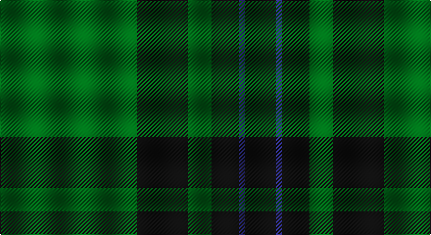

This page is one **sett** — a single exact thread-count. It belongs to the [tartan](/setts/g70k26g12k14db3k16/)
(the same proportion at any scale), whose colour order is pattern [GKGKBK](/stripes/gkgkbk/).

Part of the [Duchess of Fife](/tartans/duchess-of-fife/) tartan — the named design grouping this sett with its other cloths.

Sourced from register-of-tartans.  It is a [6 stripe tartan](/stripes/stripes6/).

Original link https://www.tartanregister.gov.uk/tartanDetails.aspx?ref=1003

## Also known as

This cloth is also recorded under:

- Duchess of Fife #2

2 attestations — the source records this cloth was collapsed from (oldest owns this page)

<ul>
<li>01/01/2002 — Duchess of Fife #2 (register-of-tartans, <a href="https://www.tartanregister.gov.uk/tartanDetails.aspx?ref=1003">record</a>)</li>
<li>pre 2002 — Duchess of Fife (Fashion) (tartans-authority, <a href="http://www.tartansauthority.com/tartan-ferret/display/4730/">record</a>)</li>
</ul>

## Register references

External register numbers recorded for this tartan.

- Scottish Register of Tartans: [1003](https://www.tartanregister.gov.uk/tartanDetails.aspx?ref=1003)
- Scottish Tartans Authority (ITI): 4730

## Thread count
G/140 K52 G24 K28 DB6 K/32

One full sett is **392 threads**.

## Palette

Palette: <strong>Tartan Register</strong>
<table><thead><tr><th>Colour</th><th>Threads</th><th>Shade</th><th>Base</th><th>OKLCh</th></tr></thead><tbody><tr><td>G/</td><td style="text-align:right;font-variant-numeric:tabular-nums">140</td><td><code style="background-color:#006818;">#006818</code> <small style="color:#888">#006818</small></td><td>G <code style="background-color:#006100;">#006100</code></td><td><small style="color:#888">oklch(45.0% 0.142 145.0)</small></td></tr><tr><td>K</td><td style="text-align:right;font-variant-numeric:tabular-nums">52</td><td><code style="background-color:#101010;">#101010</code> <small style="color:#888">#101010</small></td><td>K <code style="background-color:#000000;">#000000</code></td><td><small style="color:#888">oklch(17.3% 0.000 89.9)</small></td></tr><tr><td>G</td><td style="text-align:right;font-variant-numeric:tabular-nums">24</td><td><code style="background-color:#006818;">#006818</code> <small style="color:#888">#006818</small></td><td>G <code style="background-color:#006100;">#006100</code></td><td><small style="color:#888">oklch(45.0% 0.142 145.0)</small></td></tr><tr><td>K</td><td style="text-align:right;font-variant-numeric:tabular-nums">28</td><td><code style="background-color:#101010;">#101010</code> <small style="color:#888">#101010</small></td><td>K <code style="background-color:#000000;">#000000</code></td><td><small style="color:#888">oklch(17.3% 0.000 89.9)</small></td></tr><tr><td>DB</td><td style="text-align:right;font-variant-numeric:tabular-nums">6</td><td><code style="background-color:#2C2C80;">#2C2C80</code> <small style="color:#888">#2C2C80</small></td><td>B <code style="background-color:#2A418A;">#2A418A</code></td><td><small style="color:#888">oklch(35.0% 0.138 276.6)</small></td></tr><tr><td>K/</td><td style="text-align:right;font-variant-numeric:tabular-nums">32</td><td><code style="background-color:#101010;">#101010</code> <small style="color:#888">#101010</small></td><td>K <code style="background-color:#000000;">#000000</code></td><td><small style="color:#888">oklch(17.3% 0.000 89.9)</small></td></tr></tbody></table>

# Sample pattern

## Compared to the master

This cloth is one sett of its design; the master sett (the exemplar the design is anchored on) is below for comparison.

<figure style="margin:0"><figcaption style="color:#888;font-size:smaller">this sett</figcaption></figure>
<figure style="margin:0"><figcaption style="color:#888;font-size:smaller"><a href="/setts/g70k26g12k14b3k16/">master sett →</a></figcaption></figure>

## Nearest tartans

The nearest existing variants by ΔTartan distance, with this tartan at the top so the swatches line up against it.

ΔTartan

Tartan

Sett

—

<a href="/ttd/edit/#slug=g70k26g12k14db3k16~x2">Duchess of Fife #2</a> <a class="nn-out" href="/variants/s6/g70k26g12k14db3k16~x2/" title="open its dictionary page">↗</a>

0.96

<a href="/ttd/edit/#slug=g3k6r2k6g3k2g16k1~x4&amp;base=g70k26g12k14db3k16~x2">Glenbarr</a> <a class="nn-out" href="/variants/s8/g3k6r2k6g3k2g16k1~x4/" title="open its dictionary page">↗</a>

1.15

<a href="/ttd/edit/#slug=k22g5k2g5k11g33k2r4~x2&amp;base=g70k26g12k14db3k16~x2">MacArthur-Fox 1993 (Personal)</a> <a class="nn-out" href="/variants/s8/k22g5k2g5k11g33k2r4~x2/" title="open its dictionary page">↗</a>

1.18

<a href="/ttd/edit/#slug=r1dg16k8dg4k4ly1~x2&amp;base=g70k26g12k14db3k16~x2">Forbes #6</a> <a class="nn-out" href="/variants/s6/r1dg16k8dg4k4ly1~x2/" title="open its dictionary page">↗</a>

1.39

<a href="/ttd/edit/#slug=k6db1k6g4k10g20r2~x2&amp;base=g70k26g12k14db3k16~x2">MacKinross</a> <a class="nn-out" href="/variants/s7/k6db1k6g4k10g20r2~x2/" title="open its dictionary page">↗</a>

1.43

<a href="/ttd/edit/#slug=k13g3k4g3k3g19lo1g19k3g2lo4~x2&amp;base=g70k26g12k14db3k16~x2">American Monahan (Personal)</a> <a class="nn-out" href="/variants/s11/k13g3k4g3k3g19lo1g19k3g2lo4~x2/" title="open its dictionary page">↗</a>

1.47

<a href="/ttd/edit/#slug=g3r1k14g14lo1~x4&amp;base=g70k26g12k14db3k16~x2">Wcwm 1255</a> <a class="nn-out" href="/variants/s5/g3r1k14g14lo1~x4/" title="open its dictionary page">↗</a>

1.48

<a href="/ttd/edit/#slug=r3g30k12g1k16lo2~x2&amp;base=g70k26g12k14db3k16~x2">MacArthur-Fox Htg (Personal)</a> <a class="nn-out" href="/variants/s6/r3g30k12g1k16lo2~x2/" title="open its dictionary page">↗</a>

1.48

<a href="/ttd/edit/#slug=lo1dg11k6dg3lo1dg1lo1~x4&amp;base=g70k26g12k14db3k16~x2">Angle, Green (Fashion)</a> <a class="nn-out" href="/variants/s7/lo1dg11k6dg3lo1dg1lo1~x4/" title="open its dictionary page">↗</a>

1.49

<a href="/ttd/edit/#slug=g55k17r9k11ly2k4~x2&amp;base=g70k26g12k14db3k16~x2">Moran (Name)</a> <a class="nn-out" href="/variants/s6/g55k17r9k11ly2k4~x2/" title="open its dictionary page">↗</a>

1.51

<a href="/ttd/edit/#slug=g24r4g3k14g5r2g10~x2&amp;base=g70k26g12k14db3k16~x2">Northcroft (Personal)</a> <a class="nn-out" href="/variants/s7/g24r4g3k14g5r2g10~x2/" title="open its dictionary page">↗</a>

## Neighbour map

Every grey dot is one of 14360 variants placed by the first two principal components of the ΔTartan feature space (44% of its variance). Red is this tartan; blue dots are its nearest — click one to open its page.

<svg viewBox="0 0 640 380" role="img" style="max-width:100%;height:auto;border:1px solid #e0e0e0;border-radius:4px;display:block" xmlns="http://www.w3.org/2000/svg"><image href="/nn/cloud.v1.png" width="640" height="380"/><a href="/variants/s8/g3k6r2k6g3k2g16k1~x4/"><circle cx="376.4" cy="215.7" r="4" fill="#3465a4"><title>Glenbarr</title></circle></a><a href="/variants/s8/k22g5k2g5k11g33k2r4~x2/"><circle cx="362.4" cy="209.2" r="4" fill="#3465a4"><title>MacArthur-Fox 1993 (Personal)</title></circle></a><a href="/variants/s6/r1dg16k8dg4k4ly1~x2/"><circle cx="388.3" cy="222.4" r="4" fill="#3465a4"><title>Forbes #6</title></circle></a><a href="/variants/s7/k6db1k6g4k10g20r2~x2/"><circle cx="332.8" cy="204.5" r="4" fill="#3465a4"><title>MacKinross</title></circle></a><a href="/variants/s11/k13g3k4g3k3g19lo1g19k3g2lo4~x2/"><circle cx="401.0" cy="193.8" r="4" fill="#3465a4"><title>American Monahan (Personal)</title></circle></a><a href="/variants/s5/g3r1k14g14lo1~x4/"><circle cx="337.3" cy="224.0" r="4" fill="#3465a4"><title>Wcwm 1255</title></circle></a><a href="/variants/s6/r3g30k12g1k16lo2~x2/"><circle cx="347.9" cy="185.3" r="4" fill="#3465a4"><title>MacArthur-Fox Htg (Personal)</title></circle></a><a href="/variants/s7/lo1dg11k6dg3lo1dg1lo1~x4/"><circle cx="396.3" cy="226.6" r="4" fill="#3465a4"><title>Angle, Green (Fashion)</title></circle></a><a href="/variants/s6/g55k17r9k11ly2k4~x2/"><circle cx="369.3" cy="171.5" r="4" fill="#3465a4"><title>Moran (Name)</title></circle></a><a href="/variants/s7/g24r4g3k14g5r2g10~x2/"><circle cx="417.4" cy="240.0" r="4" fill="#3465a4"><title>Northcroft (Personal)</title></circle></a><circle cx="419.6" cy="222.1" r="5" fill="#c00000"/></svg>

ID: /variants/s6/g70k26g12k14db3k16~x2/
