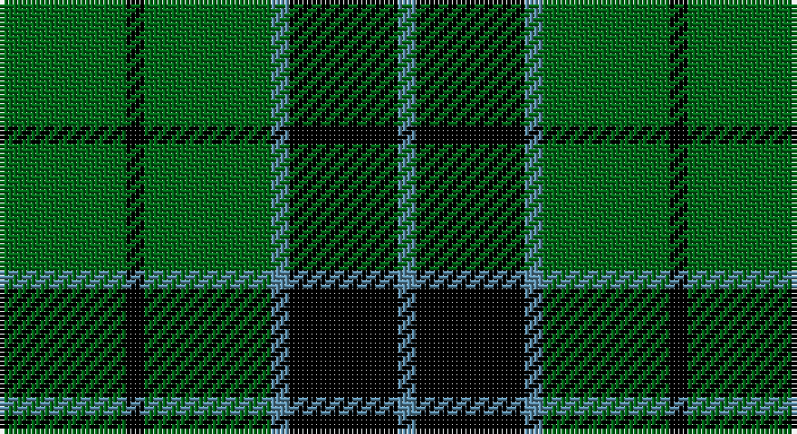

This page is one **sett** — a single exact thread-count. It belongs to the [tartan](/setts/g7k1g7t1k6t1/)
(the same proportion at any scale), whose colour order is pattern [BKBGKG](/stripes/bkbgkg/).

Part of the [Innes](/tartans/innes/) tartan — the named design grouping this sett with its other cloths.

Sourced from tartans-authority.  It is a [6 stripe tartan](/stripes/stripes6/).

Original link http://www.tartansauthority.com/tartan-ferret/display/235/

## Also known as

This cloth is also recorded under:

- Innes 6 Colours
- Innes,
- Innes, Georgina

## Register references

External register numbers recorded for this tartan.

- Scottish Tartans Authority (ITI): 235

## Thread count
G/28 K4 G28 B4 K24 B/4

One full sett is **152 threads**.

## Palette

Palette: <strong>Tartan Register</strong>
<table><thead><tr><th>Colour</th><th>Threads</th><th>Shade</th><th>Base</th><th>OKLCh</th></tr></thead><tbody><tr><td>G/</td><td style="text-align:right;font-variant-numeric:tabular-nums">28</td><td><code style="background-color:#006818;">#006818</code> <small style="color:#888">#006818</small></td><td>G <code style="background-color:#006100;">#006100</code></td><td><small style="color:#888">oklch(45.0% 0.142 145.0)</small></td></tr><tr><td>K</td><td style="text-align:right;font-variant-numeric:tabular-nums">4</td><td><code style="background-color:#000000;">#000000</code> <small style="color:#888">#000000</small></td><td>K <code style="background-color:#000000;">#000000</code></td><td><small style="color:#888">oklch(0.0% 0.000 0.0)</small></td></tr><tr><td>G</td><td style="text-align:right;font-variant-numeric:tabular-nums">28</td><td><code style="background-color:#006818;">#006818</code> <small style="color:#888">#006818</small></td><td>G <code style="background-color:#006100;">#006100</code></td><td><small style="color:#888">oklch(45.0% 0.142 145.0)</small></td></tr><tr><td>B</td><td style="text-align:right;font-variant-numeric:tabular-nums">4</td><td><code style="background-color:#5C8CA8;">#5C8CA8</code> <small style="color:#888">#5C8CA8</small></td><td>B <code style="background-color:#2A418A;">#2A418A</code></td><td><small style="color:#888">oklch(61.7% 0.067 235.0)</small></td></tr><tr><td>K</td><td style="text-align:right;font-variant-numeric:tabular-nums">24</td><td><code style="background-color:#000000;">#000000</code> <small style="color:#888">#000000</small></td><td>K <code style="background-color:#000000;">#000000</code></td><td><small style="color:#888">oklch(0.0% 0.000 0.0)</small></td></tr><tr><td>B/</td><td style="text-align:right;font-variant-numeric:tabular-nums">4</td><td><code style="background-color:#5C8CA8;">#5C8CA8</code> <small style="color:#888">#5C8CA8</small></td><td>B <code style="background-color:#2A418A;">#2A418A</code></td><td><small style="color:#888">oklch(61.7% 0.067 235.0)</small></td></tr></tbody></table>

# Sample pattern

## Compared to the master

This cloth is one sett of its design; the master sett (the exemplar the design is anchored on) is below for comparison.

<figure style="margin:0"><figcaption style="color:#888;font-size:smaller">this sett</figcaption></figure>
<figure style="margin:0"><figcaption style="color:#888;font-size:smaller"><a href="/setts/k2g12r2k2r2k2r16ly2r3db6r3k1g8k1r3w2/">master sett →</a></figcaption></figure>

## Nearest tartans

The nearest existing variants by ΔTartan distance, with this tartan at the top so the swatches line up against it.

ΔTartan

Tartan

Sett

—

<a href="/ttd/edit/#slug=g7k1g7t1k6t1~x4">Innes, Georgina (Portrait)</a> <a class="nn-out" href="/variants/s6/g7k1g7t1k6t1~x4/" title="open its dictionary page">↗</a>

0.62

<a href="/ttd/edit/#slug=g7k1g7t1k6t1~x2&amp;base=g7k1g7t1k6t1~x4">Innes</a> <a class="nn-out" href="/variants/s6/g7k1g7t1k6t1~x2/" title="open its dictionary page">↗</a>

1.05

<a href="/ttd/edit/#slug=k19g8k10g31r3&amp;base=g7k1g7t1k6t1~x4">MacArthur-Fox</a> <a class="nn-out" href="/variants/s5/k19g8k10g31r3/" title="open its dictionary page">↗</a>

1.18

<a href="/ttd/edit/#slug=k9g3k3g12ly2~x4&amp;base=g7k1g7t1k6t1~x4">MacArthur</a> <a class="nn-out" href="/variants/s5/k9g3k3g12ly2~x4/" title="open its dictionary page">↗</a>

1.23

<a href="/ttd/edit/#slug=k3g15k20ly3~x2&amp;base=g7k1g7t1k6t1~x4">Scotch Tape 2 (Corporate)</a> <a class="nn-out" href="/variants/s4/k3g15k20ly3~x2/" title="open its dictionary page">↗</a>

1.28

<a href="/ttd/edit/#slug=dg40k4dg12k21dg17w4~x2&amp;base=g7k1g7t1k6t1~x4">Granger</a> <a class="nn-out" href="/variants/s6/dg40k4dg12k21dg17w4~x2/" title="open its dictionary page">↗</a>

1.31

<a href="/ttd/edit/#slug=k32g6k12g30ly3&amp;base=g7k1g7t1k6t1~x4">MacArthur</a> <a class="nn-out" href="/variants/s5/k32g6k12g30ly3/" title="open its dictionary page">↗</a>

1.35

<a href="/ttd/edit/#slug=g3k6w2k6g2k2g16k2~x2&amp;base=g7k1g7t1k6t1~x4">MacLean of Duart Hunting</a> <a class="nn-out" href="/variants/s8/g3k6w2k6g2k2g16k2~x2/" title="open its dictionary page">↗</a>

1.40

<a href="/ttd/edit/#slug=g10k2dp5g1~x8&amp;base=g7k1g7t1k6t1~x4">Bumbee #1 (Fashion)</a> <a class="nn-out" href="/variants/s4/g10k2dp5g1~x8/" title="open its dictionary page">↗</a>

1.42

<a href="/ttd/edit/#slug=g30k12g6k6db2k5~x2&amp;base=g7k1g7t1k6t1~x4">Fife, Duchess of..</a> <a class="nn-out" href="/variants/s6/g30k12g6k6db2k5~x2/" title="open its dictionary page">↗</a>

1.43

<a href="/ttd/edit/#slug=g8k8ly1k8g8k1~x4&amp;base=g7k1g7t1k6t1~x4">Wallace Hunting</a> <a class="nn-out" href="/variants/s6/g8k8ly1k8g8k1~x4/" title="open its dictionary page">↗</a>

## Neighbour map

Every grey dot is one of 14360 variants placed by the first two principal components of the ΔTartan feature space (44% of its variance). Red is this tartan; blue dots are its nearest — click one to open its page.

<svg viewBox="0 0 640 380" role="img" style="max-width:100%;height:auto;border:1px solid #e0e0e0;border-radius:4px;display:block" xmlns="http://www.w3.org/2000/svg"><image href="/nn/cloud.v1.png" width="640" height="380"/><a href="/variants/s6/g7k1g7t1k6t1~x2/"><circle cx="297.9" cy="251.0" r="4" fill="#3465a4"><title>Innes</title></circle></a><a href="/variants/s5/k19g8k10g31r3/"><circle cx="294.1" cy="249.5" r="4" fill="#3465a4"><title>MacArthur-Fox</title></circle></a><a href="/variants/s5/k9g3k3g12ly2~x4/"><circle cx="282.1" cy="279.6" r="4" fill="#3465a4"><title>MacArthur</title></circle></a><a href="/variants/s4/k3g15k20ly3~x2/"><circle cx="311.5" cy="279.8" r="4" fill="#3465a4"><title>Scotch Tape 2 (Corporate)</title></circle></a><a href="/variants/s6/dg40k4dg12k21dg17w4~x2/"><circle cx="390.8" cy="246.4" r="4" fill="#3465a4"><title>Granger</title></circle></a><a href="/variants/s5/k32g6k12g30ly3/"><circle cx="292.2" cy="246.1" r="4" fill="#3465a4"><title>MacArthur</title></circle></a><a href="/variants/s8/g3k6w2k6g2k2g16k2~x2/"><circle cx="320.6" cy="232.0" r="4" fill="#3465a4"><title>MacLean of Duart Hunting</title></circle></a><a href="/variants/s4/g10k2dp5g1~x8/"><circle cx="355.3" cy="264.8" r="4" fill="#3465a4"><title>Bumbee #1 (Fashion)</title></circle></a><a href="/variants/s6/g30k12g6k6db2k5~x2/"><circle cx="343.6" cy="211.8" r="4" fill="#3465a4"><title>Fife, Duchess of..</title></circle></a><a href="/variants/s6/g8k8ly1k8g8k1~x4/"><circle cx="265.1" cy="269.4" r="4" fill="#3465a4"><title>Wallace Hunting</title></circle></a><circle cx="310.5" cy="256.8" r="5" fill="#c00000"/></svg>

ID: /variants/s6/g7k1g7t1k6t1~x4/
