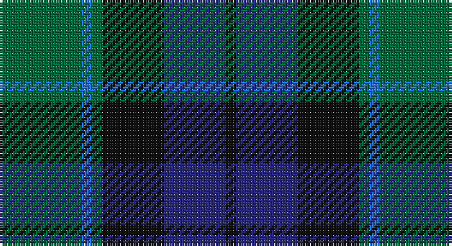

This page is one **sett** — a single exact thread-count. It belongs to the [tartan](/setts/g8b1g1k6db6k1/)
(the same proportion at any scale), whose colour order is pattern [GBGKBK](/stripes/gbgkbk/).

Part of the [Graham of Menteith](/tartans/graham-of-menteith/) tartan — the named design grouping this sett with its other cloths.

Sourced from register-of-tartans.  It is a [6 stripe tartan](/stripes/stripes6/).

Original link https://www.tartanregister.gov.uk/tartanDetails.aspx?ref=1482

## Also known as

This cloth is also recorded under:

- Graham of Menteith,

## Register references

External register numbers recorded for this tartan.

- Scottish Register of Tartans: [1482](https://www.tartanregister.gov.uk/tartanDetails.aspx?ref=1482)
- Scottish Tartans Authority (ITI): 698
- Scottish Tartans World Register: 698

## Thread count
G/32 B4 G4 K24 DB24 K/4

One full sett is **148 threads**.

## Palette

Palette: <strong>Tartan Register</strong> <small style="color:#888">(2 of 4 colours)</small>
<table><thead><tr><th>Colour</th><th>Threads</th><th>Shade</th><th>Base</th><th>OKLCh</th></tr></thead><tbody><tr><td>G/</td><td style="text-align:right;font-variant-numeric:tabular-nums">32</td><td><code style="background-color:#006C3C;">#006C3C</code> <small style="color:#888">#006C3C</small></td><td>G <code style="background-color:#006100;">#006100</code></td><td><small style="color:#888">oklch(46.7% 0.115 155.1)</small></td></tr><tr><td>B</td><td style="text-align:right;font-variant-numeric:tabular-nums">4</td><td><code style="background-color:#2474E8;">#2474E8</code> <small style="color:#888">#2474E8</small></td><td>B <code style="background-color:#2A418A;">#2A418A</code></td><td><small style="color:#888">oklch(57.8% 0.192 258.7)</small></td></tr><tr><td>G</td><td style="text-align:right;font-variant-numeric:tabular-nums">4</td><td><code style="background-color:#006C3C;">#006C3C</code> <small style="color:#888">#006C3C</small></td><td>G <code style="background-color:#006100;">#006100</code></td><td><small style="color:#888">oklch(46.7% 0.115 155.1)</small></td></tr><tr><td>K</td><td style="text-align:right;font-variant-numeric:tabular-nums">24</td><td><code style="background-color:#101010;">#101010</code> <small style="color:#888">#101010</small></td><td>K <code style="background-color:#000000;">#000000</code></td><td><small style="color:#888">oklch(17.3% 0.000 89.9)</small></td></tr><tr><td>DB</td><td style="text-align:right;font-variant-numeric:tabular-nums">24</td><td><code style="background-color:#28287C;">#28287C</code> <small style="color:#888">#28287C</small></td><td>B <code style="background-color:#2A418A;">#2A418A</code></td><td><small style="color:#888">oklch(33.6% 0.138 276.0)</small></td></tr><tr><td>K/</td><td style="text-align:right;font-variant-numeric:tabular-nums">4</td><td><code style="background-color:#101010;">#101010</code> <small style="color:#888">#101010</small></td><td>K <code style="background-color:#000000;">#000000</code></td><td><small style="color:#888">oklch(17.3% 0.000 89.9)</small></td></tr></tbody></table>

# Sample pattern

## Nearest tartans

The nearest existing variants by ΔTartan distance, with this tartan at the top so the swatches line up against it.

ΔTartan

Tartan

Sett

—

<a href="/ttd/edit/#slug=g8b1g1k6db6k1~x4">Graham of Menteith</a> <a class="nn-out" href="/variants/s6/g8b1g1k6db6k1~x4/" title="open its dictionary page">↗</a>

0.41

<a href="/ttd/edit/#slug=g8t1g1k6db6k1~x4&amp;base=g8b1g1k6db6k1~x4">Graham of Menteith (Clan)</a> <a class="nn-out" href="/variants/s6/g8t1g1k6db6k1~x4/" title="open its dictionary page">↗</a>

0.59

<a href="/ttd/edit/#slug=g24db6t3k6db12k15g4~x2&amp;base=g8b1g1k6db6k1~x4">Blaylock Annandale (Name)</a> <a class="nn-out" href="/variants/s7/g24db6t3k6db12k15g4~x2/" title="open its dictionary page">↗</a>

0.59

<a href="/ttd/edit/#slug=k4g25k24r3db24g4~x2&amp;base=g8b1g1k6db6k1~x4">Ferguson of Balquhidder #2</a> <a class="nn-out" href="/variants/s6/k4g25k24r3db24g4~x2/" title="open its dictionary page">↗</a>

0.61

<a href="/ttd/edit/#slug=k4dg19k16w2db15dg4~x2&amp;base=g8b1g1k6db6k1~x4">Graham of Montrose</a> <a class="nn-out" href="/variants/s6/k4dg19k16w2db15dg4~x2/" title="open its dictionary page">↗</a>

0.65

<a href="/ttd/edit/#slug=db6k2db18k18g18k3r2~x2&amp;base=g8b1g1k6db6k1~x4">Renfrew</a> <a class="nn-out" href="/variants/s7/db6k2db18k18g18k3r2~x2/" title="open its dictionary page">↗</a>

0.68

<a href="/ttd/edit/#slug=k3db14r2k14g14k3~x2&amp;base=g8b1g1k6db6k1~x4">Gallamore</a> <a class="nn-out" href="/variants/s6/k3db14r2k14g14k3~x2/" title="open its dictionary page">↗</a>

0.70

<a href="/ttd/edit/#slug=g1db6k6g6r1g1~x6&amp;base=g8b1g1k6db6k1~x4">Callum Beg (Fashion)</a> <a class="nn-out" href="/variants/s6/g1db6k6g6r1g1~x6/" title="open its dictionary page">↗</a>

0.71

<a href="/ttd/edit/#slug=k2g10k9db9r1k1db2~x2&amp;base=g8b1g1k6db6k1~x4">Reid and Taylor</a> <a class="nn-out" href="/variants/s7/k2g10k9db9r1k1db2~x2/" title="open its dictionary page">↗</a>

0.75

<a href="/ttd/edit/#slug=db1k1db6k6dg6k1w1~x2&amp;base=g8b1g1k6db6k1~x4">Forbes #4</a> <a class="nn-out" href="/variants/s7/db1k1db6k6dg6k1w1~x2/" title="open its dictionary page">↗</a>

0.79

<a href="/ttd/edit/#slug=dg1db5dg1k5dg6ly1~x2&amp;base=g8b1g1k6db6k1~x4">MacKay (Bonner)</a> <a class="nn-out" href="/variants/s6/dg1db5dg1k5dg6ly1~x2/" title="open its dictionary page">↗</a>

## Neighbour map

Every grey dot is one of 14360 variants placed by the first two principal components of the ΔTartan feature space (44% of its variance). Red is this tartan; blue dots are its nearest — click one to open its page.

<svg viewBox="0 0 640 380" role="img" style="max-width:100%;height:auto;border:1px solid #e0e0e0;border-radius:4px;display:block" xmlns="http://www.w3.org/2000/svg"><image href="/nn/cloud.v1.png" width="640" height="380"/><a href="/variants/s6/g8t1g1k6db6k1~x4/"><circle cx="218.0" cy="249.8" r="4" fill="#3465a4"><title>Graham of Menteith (Clan)</title></circle></a><a href="/variants/s7/g24db6t3k6db12k15g4~x2/"><circle cx="212.9" cy="249.2" r="4" fill="#3465a4"><title>Blaylock Annandale (Name)</title></circle></a><a href="/variants/s6/k4g25k24r3db24g4~x2/"><circle cx="204.5" cy="249.5" r="4" fill="#3465a4"><title>Ferguson of Balquhidder #2</title></circle></a><a href="/variants/s6/k4dg19k16w2db15dg4~x2/"><circle cx="223.0" cy="255.2" r="4" fill="#3465a4"><title>Graham of Montrose</title></circle></a><a href="/variants/s7/db6k2db18k18g18k3r2~x2/"><circle cx="219.4" cy="240.0" r="4" fill="#3465a4"><title>Renfrew</title></circle></a><a href="/variants/s6/k3db14r2k14g14k3~x2/"><circle cx="214.3" cy="261.9" r="4" fill="#3465a4"><title>Gallamore</title></circle></a><a href="/variants/s6/g1db6k6g6r1g1~x6/"><circle cx="197.7" cy="261.3" r="4" fill="#3465a4"><title>Callum Beg (Fashion)</title></circle></a><a href="/variants/s7/k2g10k9db9r1k1db2~x2/"><circle cx="221.4" cy="232.8" r="4" fill="#3465a4"><title>Reid and Taylor</title></circle></a><a href="/variants/s7/db1k1db6k6dg6k1w1~x2/"><circle cx="192.0" cy="248.0" r="4" fill="#3465a4"><title>Forbes #4</title></circle></a><a href="/variants/s6/dg1db5dg1k5dg6ly1~x2/"><circle cx="213.0" cy="266.7" r="4" fill="#3465a4"><title>MacKay (Bonner)</title></circle></a><circle cx="220.5" cy="251.3" r="5" fill="#c00000"/></svg>

ID: /variants/s6/g8b1g1k6db6k1~x4/
