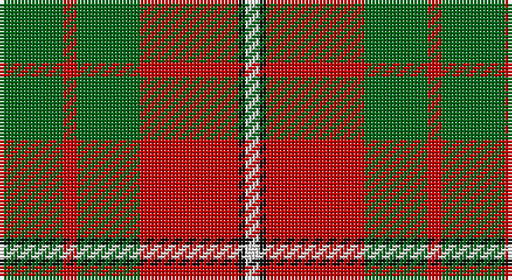

This page is one **sett** — a single exact thread-count. It belongs to the [tartan](/setts/g9r2g9r14k1w2/)
(the same proportion at any scale), whose colour order is pattern [GRGRKW](/stripes/grgrkw/).

Part of the [MacGregor of Balquhidder](/tartans/macgregor-of-balquhidder/) tartan — the named design grouping this sett with its other cloths.

Sourced from register-of-tartans.  It is a [6 stripe tartan](/stripes/stripes6/).

Original link https://www.tartanregister.gov.uk/tartanDetails.aspx?ref=2456

## Provenance

Earliest known date: 1831 This sett is shown in the earliest publication of clan tartans. James Logan collected material for, 'The Scottish Gael', around 1826 and published in 1831. A number of minor anomilies in Logans method of recording tartans has led to errors appearing in some versions of the sett.

## Also known as

This cloth is also recorded under:

- MacGregor of Balquidder

2 attestations — the source records this cloth was collapsed from (oldest owns this page)

<ul>
<li>01/01/1842 — MacGregor of Balquidder (Logan) (register-of-tartans, <a href="https://www.tartanregister.gov.uk/tartanDetails.aspx?ref=2456">record</a>)</li>
<li>undated — MacGregor of Balquhidder Clan Tartan (house-of-tartan, <a href="http://www.house-of-tartan.scotland.net/house/TartanViewjs.asp?colr=Def&tnam=988">record</a>)</li>
</ul>

## Register references

External register numbers recorded for this tartan.

- Scottish Register of Tartans: [2456](https://www.tartanregister.gov.uk/tartanDetails.aspx?ref=2456)
- Scottish Tartans Authority (ITI): 988
- Scottish Tartans World Register: 988

## Thread count
G/18 R4 G18 R28 K2 LN/4

One full sett is **126 threads**.

## Palette

Palette: <strong>Tartan Register</strong>
<table><thead><tr><th>Colour</th><th>Threads</th><th>Shade</th><th>Base</th><th>OKLCh</th></tr></thead><tbody><tr><td>G/</td><td style="text-align:right;font-variant-numeric:tabular-nums">18</td><td><code style="background-color:#006818;">#006818</code> <small style="color:#888">#006818</small></td><td>G <code style="background-color:#006100;">#006100</code></td><td><small style="color:#888">oklch(45.0% 0.142 145.0)</small></td></tr><tr><td>R</td><td style="text-align:right;font-variant-numeric:tabular-nums">4</td><td><code style="background-color:#C80000;">#C80000</code> <small style="color:#888">#C80000</small></td><td>R <code style="background-color:#CC0000;">#CC0000</code></td><td><small style="color:#888">oklch(52.3% 0.215 29.2)</small></td></tr><tr><td>G</td><td style="text-align:right;font-variant-numeric:tabular-nums">18</td><td><code style="background-color:#006818;">#006818</code> <small style="color:#888">#006818</small></td><td>G <code style="background-color:#006100;">#006100</code></td><td><small style="color:#888">oklch(45.0% 0.142 145.0)</small></td></tr><tr><td>R</td><td style="text-align:right;font-variant-numeric:tabular-nums">28</td><td><code style="background-color:#C80000;">#C80000</code> <small style="color:#888">#C80000</small></td><td>R <code style="background-color:#CC0000;">#CC0000</code></td><td><small style="color:#888">oklch(52.3% 0.215 29.2)</small></td></tr><tr><td>K</td><td style="text-align:right;font-variant-numeric:tabular-nums">2</td><td><code style="background-color:#101010;">#101010</code> <small style="color:#888">#101010</small></td><td>K <code style="background-color:#000000;">#000000</code></td><td><small style="color:#888">oklch(17.3% 0.000 89.9)</small></td></tr><tr><td>LN/</td><td style="text-align:right;font-variant-numeric:tabular-nums">4</td><td><code style="background-color:#E0E0E0;">#E0E0E0</code> <small style="color:#888">#E0E0E0</small></td><td>W <code style="background-color:#F7F7F7;">#F7F7F7</code></td><td><small style="color:#888">oklch(90.7% 0.000 89.9)</small></td></tr></tbody></table>

# Sample pattern

## Nearest tartans

The nearest existing variants by ΔTartan distance, with this tartan at the top so the swatches line up against it.

ΔTartan

Tartan

Sett

—

<a href="/ttd/edit/#slug=g9r2g9r14k1w2~x2">MacGregor of Balquidder (Logan)</a> <a class="nn-out" href="/variants/s6/g9r2g9r14k1w2~x2/" title="open its dictionary page">↗</a>

0.66

<a href="/ttd/edit/#slug=g9r2g9r14k1w2~x4&amp;base=g9r2g9r14k1w2~x2">MacGregor of Balquidder - 1831 (Clan</a> <a class="nn-out" href="/variants/s6/g9r2g9r14k1w2~x4/" title="open its dictionary page">↗</a>

0.71

<a href="/ttd/edit/#slug=db1r12g6ly1g6db1~x4&amp;base=g9r2g9r14k1w2~x2">Cetoloni (Personal)</a> <a class="nn-out" href="/variants/s6/db1r12g6ly1g6db1~x4/" title="open its dictionary page">↗</a>

0.73

<a href="/ttd/edit/#slug=k2r16g6r3g8w1~x2&amp;base=g9r2g9r14k1w2~x2">MacAulay</a> <a class="nn-out" href="/variants/s6/k2r16g6r3g8w1~x2/" title="open its dictionary page">↗</a>

0.79

<a href="/ttd/edit/#slug=k2r16g6r3g8w1~x4&amp;base=g9r2g9r14k1w2~x2">MacAulay (Clan)</a> <a class="nn-out" href="/variants/s6/k2r16g6r3g8w1~x4/" title="open its dictionary page">↗</a>

0.79

<a href="/ttd/edit/#slug=r3g9w1g9r3g6r18k2~x2&amp;base=g9r2g9r14k1w2~x2">Cumming #2</a> <a class="nn-out" href="/variants/s8/r3g9w1g9r3g6r18k2~x2/" title="open its dictionary page">↗</a>

0.82

<a href="/ttd/edit/#slug=k2r16g6r3g8lb1~x2&amp;base=g9r2g9r14k1w2~x2">MacAulay</a> <a class="nn-out" href="/variants/s6/k2r16g6r3g8lb1~x2/" title="open its dictionary page">↗</a>

0.95

<a href="/ttd/edit/#slug=k2r4w1r10g12r2w2~x4&amp;base=g9r2g9r14k1w2~x2">Starr (1978) (Name)</a> <a class="nn-out" href="/variants/s7/k2r4w1r10g12r2w2~x4/" title="open its dictionary page">↗</a>

0.99

<a href="/ttd/edit/#slug=k1g6k1g6r16db1~x2&amp;base=g9r2g9r14k1w2~x2">Denny, hunting</a> <a class="nn-out" href="/variants/s6/k1g6k1g6r16db1~x2/" title="open its dictionary page">↗</a>

1.00

<a href="/ttd/edit/#slug=db6lo25dy16k2db3~x2&amp;base=g9r2g9r14k1w2~x2">Prince of Orange #2</a> <a class="nn-out" href="/variants/s5/db6lo25dy16k2db3~x2/" title="open its dictionary page">↗</a>

1.01

<a href="/ttd/edit/#slug=r3dg9lb1dg9r3dg6r18k2~x2&amp;base=g9r2g9r14k1w2~x2">Cumming SM</a> <a class="nn-out" href="/variants/s8/r3dg9lb1dg9r3dg6r18k2~x2/" title="open its dictionary page">↗</a>

## Neighbour map

Every grey dot is one of 14360 variants placed by the first two principal components of the ΔTartan feature space (44% of its variance). Red is this tartan; blue dots are its nearest — click one to open its page.

<svg viewBox="0 0 640 380" role="img" style="max-width:100%;height:auto;border:1px solid #e0e0e0;border-radius:4px;display:block" xmlns="http://www.w3.org/2000/svg"><image href="/nn/cloud.v1.png" width="640" height="380"/><a href="/variants/s6/g9r2g9r14k1w2~x4/"><circle cx="288.3" cy="194.9" r="4" fill="#3465a4"><title>MacGregor of Balquidder - 1831 (Clan</title></circle></a><a href="/variants/s6/db1r12g6ly1g6db1~x4/"><circle cx="287.5" cy="198.5" r="4" fill="#3465a4"><title>Cetoloni (Personal)</title></circle></a><a href="/variants/s6/k2r16g6r3g8w1~x2/"><circle cx="314.2" cy="181.6" r="4" fill="#3465a4"><title>MacAulay</title></circle></a><a href="/variants/s6/k2r16g6r3g8w1~x4/"><circle cx="330.6" cy="188.3" r="4" fill="#3465a4"><title>MacAulay (Clan)</title></circle></a><a href="/variants/s8/r3g9w1g9r3g6r18k2~x2/"><circle cx="312.5" cy="177.9" r="4" fill="#3465a4"><title>Cumming #2</title></circle></a><a href="/variants/s6/k2r16g6r3g8lb1~x2/"><circle cx="334.7" cy="190.4" r="4" fill="#3465a4"><title>MacAulay</title></circle></a><a href="/variants/s7/k2r4w1r10g12r2w2~x4/"><circle cx="263.8" cy="177.8" r="4" fill="#3465a4"><title>Starr (1978) (Name)</title></circle></a><a href="/variants/s6/k1g6k1g6r16db1~x2/"><circle cx="322.6" cy="169.9" r="4" fill="#3465a4"><title>Denny, hunting</title></circle></a><a href="/variants/s5/db6lo25dy16k2db3~x2/"><circle cx="276.5" cy="201.1" r="4" fill="#3465a4"><title>Prince of Orange #2</title></circle></a><a href="/variants/s8/r3dg9lb1dg9r3dg6r18k2~x2/"><circle cx="307.6" cy="176.1" r="4" fill="#3465a4"><title>Cumming SM</title></circle></a><circle cx="297.2" cy="199.6" r="5" fill="#c00000"/></svg>

ID: /variants/s6/g9r2g9r14k1w2~x2/
