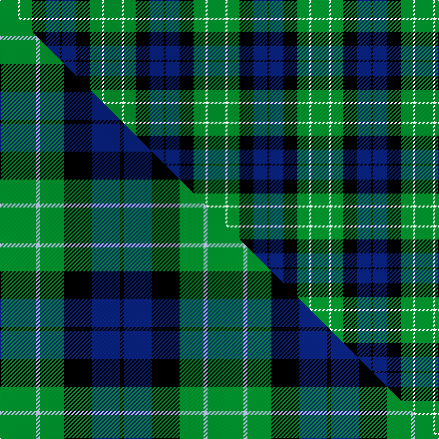

This page is one **sett** — a single exact thread-count. It belongs to the [tartan](/setts/g9w1g6k7db7k1/)
(the same proportion at any scale), whose colour order is pattern [GWGKBK](/stripes/gwgkbk/).

Part of the [Menteith](/tartans/menteith/) tartan — the named design grouping this sett with its other cloths.

Sourced from weddslist.  It is a [6 stripe tartan](/stripes/stripes6/).

Original link http://www.weddslist.com/cgi-bin/tartans/pg.pl?source=sts

## Provenance

Earliest known date: Mid 19th century Menteith lies in the upper reaches of the River Forth. The tartan is similar to the Graham of Mentieth sett recorded by Logan in 1831. The proportions of colours are quite distinct, however, and the azure stipe in the family tartan is replaced by white in the district. The Menteith district tartan was rescued from oblivion in 1941 by Graeme Menteith who wrote to MacGregor-Hastie about it. (STS archives)

2 attestations — the source records this cloth was collapsed from (oldest owns this page)

<ul>
<li>undated — Menteith (weddslist, <a href="http://www.weddslist.com/cgi-bin/tartans/pg.pl?source=sts">record</a>) </li>
<li>undated — Menteith District Tartan (house-of-tartan, <a href="http://www.house-of-tartan.scotland.net/house/TartanViewjs.asp?colr=Def&tnam=929">record</a>) </li>
</ul>

## Thread count
G/18 W2 G12 K14 DB14 K/2

One full sett is **104 threads**.

## Palette
<table><thead><tr><th>Colour</th><th>Shade</th><th>OKLCh</th></tr></thead><tbody><tr><td>DB</td><td><code style="background-color:#082077;">#082077</code> <small style="color:#888">#082077</small></td><td><small style="color:#888">oklch(30.0% 0.149 265.1)</small></td></tr><tr><td>G</td><td><code style="background-color:#008B2A;">#008B2A</code> <small style="color:#888">#008B2A</small></td><td><small style="color:#888">oklch(55.4% 0.170 145.9)</small></td></tr><tr><td>K</td><td><code style="background-color:#000000;">#000000</code> <small style="color:#888">#000000</small></td><td><small style="color:#888">oklch(0.0% 0.000 0.0)</small></td></tr><tr><td>W</td><td><code style="background-color:#F7F7F7;">#F7F7F7</code> <small style="color:#888">#F7F7F7</small></td><td><small style="color:#888">oklch(97.6% 0.000 89.9)</small></td></tr></tbody></table>

# Sample pattern

## Compared to the master

This cloth is one sett of its design; the master sett (the exemplar the design is anchored on) is below for comparison.

Its **ΔTartan distance** from the master is **0.11** — the same measure the nearest-tartans table ranks by (0 is identical; a re-scale of the same cloth is near 0, a recolour or a different proportion further).

<figure class="master-compare" style="margin:0">

this sett
master sett ★

<figcaption style="color:#888;font-size:smaller">One weave of this sett against the <a href="/setts/g9lb1g6k7db7k1/">master sett ★</a>, split on the diagonal: a shared proportion runs seamlessly across it with only the shades shifting; a different proportion breaks on it.</figcaption>
</figure>

## Nearest tartan variants

The nearest existing variants by ΔTartan distance, with this cloth at the top so the swatches line up against it.

ΔTartan

Threads

Variant

Sett

—

104

<a href="/variants/s6/g9w1g6k7db7k1~x2/">Menteith</a>

<a href="/ttd/edit/#slug=g9lb1g6k7db7k1~x4&amp;base=g9w1g6k7db7k1~x2" title="compare in the TTD">0.30</a>

208

<a href="/variants/s6/g9lb1g6k7db7k1~x4/">Menteith</a>

<a href="/ttd/edit/#slug=g21w2g4k17db14k3&amp;base=g9w1g6k7db7k1~x2" title="compare in the TTD">0.53</a>

98

<a href="/variants/s6/g21w2g4k17db14k3/">Graham W</a>

<a href="/ttd/edit/#slug=g18lb2g4k14db12k3~x2&amp;base=g9w1g6k7db7k1~x2" title="compare in the TTD">0.78</a>

170

<a href="/variants/s6/g18lb2g4k14db12k3~x2/">Graham of Menteith</a>

<a href="/ttd/edit/#slug=t12k4g6ly1~x8&amp;base=g9w1g6k7db7k1~x2" title="compare in the TTD">0.80</a>

264

<a href="/variants/s4/t12k4g6ly1~x8/">Sinclair of Ulbster</a>

<a href="/ttd/edit/#slug=g52lb7g9k35db35k7&amp;base=g9w1g6k7db7k1~x2" title="compare in the TTD">0.87</a>

231

<a href="/variants/s6/g52lb7g9k35db35k7/">Redland</a>

<a href="/ttd/edit/#slug=g8lb1g1k6db6k1~x4&amp;base=g9w1g6k7db7k1~x2" title="compare in the TTD">0.90</a>

148

<a href="/variants/s6/g8lb1g1k6db6k1~x4/">Graham of Menteith</a>

<a href="/ttd/edit/#slug=db16g14w2g14k13db12k4~x2&amp;base=g9w1g6k7db7k1~x2" title="compare in the TTD">1.28</a>

260

<a href="/variants/s7/db16g14w2g14k13db12k4~x2/">MacNeil of Colonsay (Clan)</a>

<a href="/ttd/edit/#slug=g8k2w1g4k6db6k1~x2&amp;base=g9w1g6k7db7k1~x2" title="compare in the TTD">1.39</a>

94

<a href="/variants/s7/g8k2w1g4k6db6k1~x2/">MacCallum</a>

<a href="/ttd/edit/#slug=k4w2g13k13b12k2~x2&amp;base=g9w1g6k7db7k1~x2" title="compare in the TTD">1.53</a>

172

<a href="/variants/s6/k4w2g13k13b12k2~x2/">Melville</a>

<a href="/ttd/edit/#slug=k7g6w1g6k7db7k1~x4&amp;base=g9w1g6k7db7k1~x2" title="compare in the TTD">1.55</a>

248

<a href="/variants/s7/k7g6w1g6k7db7k1~x4/">MacLaggan</a>

## Neighbour map

Every grey dot is one of 13620 variants placed by the first two principal components of the ΔTartan feature space (42% of its variance). Red is this tartan; blue dots are its nearest — click one to open its page.

<svg viewBox="0 0 640 380" role="img" style="max-width:100%;height:auto;border:1px solid #e0e0e0;border-radius:4px;display:block" xmlns="http://www.w3.org/2000/svg"><image href="/nn/cloud.v1.png" width="640" height="380"/><a href="/variants/s6/g9lb1g6k7db7k1~x4/"><circle cx="187.6" cy="225.7" r="4" fill="#3465a4"><title>Menteith</title></circle></a><a href="/variants/s6/g21w2g4k17db14k3/"><circle cx="169.2" cy="204.3" r="4" fill="#3465a4"><title>Graham W</title></circle></a><a href="/variants/s6/g18lb2g4k14db12k3~x2/"><circle cx="165.3" cy="214.9" r="4" fill="#3465a4"><title>Graham of Menteith</title></circle></a><a href="/variants/s4/t12k4g6ly1~x8/"><circle cx="155.4" cy="219.9" r="4" fill="#3465a4"><title>Sinclair of Ulbster</title></circle></a><a href="/variants/s6/g52lb7g9k35db35k7/"><circle cx="161.4" cy="219.3" r="4" fill="#3465a4"><title>Redland</title></circle></a><a href="/variants/s6/g8lb1g1k6db6k1~x4/"><circle cx="156.8" cy="213.5" r="4" fill="#3465a4"><title>Graham of Menteith</title></circle></a><a href="/variants/s7/db16g14w2g14k13db12k4~x2/"><circle cx="131.9" cy="242.2" r="4" fill="#3465a4"><title>MacNeil of Colonsay (Clan)</title></circle></a><a href="/variants/s7/g8k2w1g4k6db6k1~x2/"><circle cx="153.1" cy="215.6" r="4" fill="#3465a4"><title>MacCallum</title></circle></a><a href="/variants/s6/k4w2g13k13b12k2~x2/"><circle cx="132.4" cy="220.3" r="4" fill="#3465a4"><title>Melville</title></circle></a><a href="/variants/s7/k7g6w1g6k7db7k1~x4/"><circle cx="135.6" cy="230.2" r="4" fill="#3465a4"><title>MacLaggan</title></circle></a><circle cx="184.1" cy="224.7" r="5" fill="#c00000"/><text x="320" y="376" text-anchor="middle" font-size="11" fill="#999">ground</text><text x="11" y="190" text-anchor="middle" font-size="11" fill="#999" transform="rotate(-90 11 190)">complexity</text></svg>

ID: /variants/s6/g9w1g6k7db7k1~x2/
