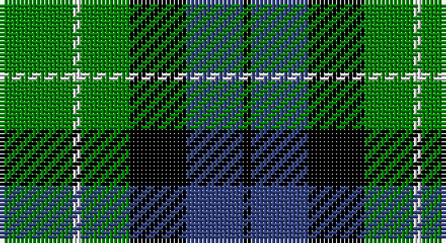

This page is one **sett** — a single exact thread-count. It belongs to the [tartan](/setts/g9w1g6k7db7k1/)
(the same proportion at any scale), whose colour order is pattern [GWGKBK](/stripes/gwgkbk/).

Part of the [Menteith](/tartans/menteith/) tartan — the named design grouping this sett with its other cloths.

Sourced from weddslist.  It is a [6 stripe tartan](/stripes/stripes6/).

Original link http://www.weddslist.com/cgi-bin/tartans/pg.pl?source=sts

## Provenance

Earliest known date: Mid 19th century Menteith lies in the upper reaches of the River Forth. The tartan is similar to the Graham of Mentieth sett recorded by Logan in 1831. The proportions of colours are quite distinct, however, and the azure stipe in the family tartan is replaced by white in the district. The Menteith district tartan was rescued from oblivion in 1941 by Graeme Menteith who wrote to MacGregor-Hastie about it. (STS archives)

2 attestations — the source records this cloth was collapsed from (oldest owns this page)

<ul>
<li>undated — Menteith (weddslist, <a href="http://www.weddslist.com/cgi-bin/tartans/pg.pl?source=sts">record</a>)</li>
<li>undated — Menteith District Tartan (house-of-tartan, <a href="http://www.house-of-tartan.scotland.net/house/TartanViewjs.asp?colr=Def&tnam=929">record</a>)</li>
</ul>

## Thread count
G/18 LN2 G12 K14 B14 K/2

One full sett is **104 threads**.

## Palette

Palette: <strong>Tartan Register</strong> <small style="color:#888">(2 of 4 colours)</small>
<table><thead><tr><th>Colour</th><th>Threads</th><th>Shade</th><th>Base</th><th>OKLCh</th></tr></thead><tbody><tr><td>G/</td><td style="text-align:right;font-variant-numeric:tabular-nums">18</td><td><code style="background-color:#008000;">#008000</code> <small style="color:#888">#008000</small></td><td>G <code style="background-color:#006100;">#006100</code></td><td><small style="color:#888">oklch(52.0% 0.177 142.5)</small></td></tr><tr><td>LN</td><td style="text-align:right;font-variant-numeric:tabular-nums">2</td><td><code style="background-color:#E0E0E0;">#E0E0E0</code> <small style="color:#888">#E0E0E0</small></td><td>W <code style="background-color:#F7F7F7;">#F7F7F7</code></td><td><small style="color:#888">oklch(90.7% 0.000 89.9)</small></td></tr><tr><td>G</td><td style="text-align:right;font-variant-numeric:tabular-nums">12</td><td><code style="background-color:#008000;">#008000</code> <small style="color:#888">#008000</small></td><td>G <code style="background-color:#006100;">#006100</code></td><td><small style="color:#888">oklch(52.0% 0.177 142.5)</small></td></tr><tr><td>K</td><td style="text-align:right;font-variant-numeric:tabular-nums">14</td><td><code style="background-color:#000000;">#000000</code> <small style="color:#888">#000000</small></td><td>K <code style="background-color:#000000;">#000000</code></td><td><small style="color:#888">oklch(0.0% 0.000 0.0)</small></td></tr><tr><td>B</td><td style="text-align:right;font-variant-numeric:tabular-nums">14</td><td><code style="background-color:#304080;">#304080</code> <small style="color:#888">#304080</small></td><td>B <code style="background-color:#2A418A;">#2A418A</code></td><td><small style="color:#888">oklch(39.4% 0.109 270.2)</small></td></tr><tr><td>K/</td><td style="text-align:right;font-variant-numeric:tabular-nums">2</td><td><code style="background-color:#000000;">#000000</code> <small style="color:#888">#000000</small></td><td>K <code style="background-color:#000000;">#000000</code></td><td><small style="color:#888">oklch(0.0% 0.000 0.0)</small></td></tr></tbody></table>

# Sample pattern

## Compared to the master

This cloth is one sett of its design; the master sett (the exemplar the design is anchored on) is below for comparison.

<figure style="margin:0"><figcaption style="color:#888;font-size:smaller">this sett</figcaption></figure>
<figure style="margin:0"><figcaption style="color:#888;font-size:smaller"><a href="/setts/g9lb1g6k7db7k1/">master sett →</a></figcaption></figure>

## Nearest tartans

The nearest existing variants by ΔTartan distance, with this tartan at the top so the swatches line up against it.

ΔTartan

Tartan

Sett

—

<a href="/ttd/edit/#slug=g9w1g6k7db7k1~x2">Menteith</a> <a class="nn-out" href="/variants/s6/g9w1g6k7db7k1~x2/" title="open its dictionary page">↗</a>

0.53

<a href="/ttd/edit/#slug=k2g9t1k6b4g2~x2&amp;base=g9w1g6k7db7k1~x2">Unnamed 3</a> <a class="nn-out" href="/variants/s6/k2g9t1k6b4g2~x2/" title="open its dictionary page">↗</a>

0.75

<a href="/ttd/edit/#slug=g8k2t1g4k6db6k1~x2&amp;base=g9w1g6k7db7k1~x2">MacCallum</a> <a class="nn-out" href="/variants/s7/g8k2t1g4k6db6k1~x2/" title="open its dictionary page">↗</a>

0.85

<a href="/ttd/edit/#slug=g18t2g4k14db12k3~x2&amp;base=g9w1g6k7db7k1~x2">Graham of Menteith</a> <a class="nn-out" href="/variants/s6/g18t2g4k14db12k3~x2/" title="open its dictionary page">↗</a>

0.96

<a href="/ttd/edit/#slug=g1db5g1k5g6ly1~x2&amp;base=g9w1g6k7db7k1~x2">MacKay</a> <a class="nn-out" href="/variants/s6/g1db5g1k5g6ly1~x2/" title="open its dictionary page">↗</a>

1.02

<a href="/ttd/edit/#slug=k19w8k19g16ly4g16w2~x2&amp;base=g9w1g6k7db7k1~x2">St Johnstone F.C.</a> <a class="nn-out" href="/variants/s7/k19w8k19g16ly4g16w2~x2/" title="open its dictionary page">↗</a>

1.07

<a href="/ttd/edit/#slug=k4g19k16w2db15g4~x2&amp;base=g9w1g6k7db7k1~x2">Graham of Montrose</a> <a class="nn-out" href="/variants/s6/k4g19k16w2db15g4~x2/" title="open its dictionary page">↗</a>

1.13

<a href="/ttd/edit/#slug=db12k17g19w2k5~x2&amp;base=g9w1g6k7db7k1~x2">Wilson's, Folio 131</a> <a class="nn-out" href="/variants/s5/db12k17g19w2k5~x2/" title="open its dictionary page">↗</a>

1.17

<a href="/ttd/edit/#slug=db8g8db1g8k8db8ly2~x2&amp;base=g9w1g6k7db7k1~x2">MacKay</a> <a class="nn-out" href="/variants/s7/db8g8db1g8k8db8ly2~x2/" title="open its dictionary page">↗</a>

1.17

<a href="/ttd/edit/#slug=k8g8k1g8k8b8w2~x2&amp;base=g9w1g6k7db7k1~x2">Unnamed, No 31</a> <a class="nn-out" href="/variants/s7/k8g8k1g8k8b8w2~x2/" title="open its dictionary page">↗</a>

1.18

<a href="/ttd/edit/#slug=k7g6w1g6k7db7k1~x4&amp;base=g9w1g6k7db7k1~x2">MacLaggan</a> <a class="nn-out" href="/variants/s7/k7g6w1g6k7db7k1~x4/" title="open its dictionary page">↗</a>

## Neighbour map

Every grey dot is one of 14360 variants placed by the first two principal components of the ΔTartan feature space (44% of its variance). Red is this tartan; blue dots are its nearest — click one to open its page.

<svg viewBox="0 0 640 380" role="img" style="max-width:100%;height:auto;border:1px solid #e0e0e0;border-radius:4px;display:block" xmlns="http://www.w3.org/2000/svg"><image href="/nn/cloud.v1.png" width="640" height="380"/><a href="/variants/s6/k2g9t1k6b4g2~x2/"><circle cx="189.6" cy="223.1" r="4" fill="#3465a4"><title>Unnamed 3</title></circle></a><a href="/variants/s7/g8k2t1g4k6db6k1~x2/"><circle cx="171.2" cy="232.3" r="4" fill="#3465a4"><title>MacCallum</title></circle></a><a href="/variants/s6/g18t2g4k14db12k3~x2/"><circle cx="177.6" cy="229.2" r="4" fill="#3465a4"><title>Graham of Menteith</title></circle></a><a href="/variants/s6/g1db5g1k5g6ly1~x2/"><circle cx="156.9" cy="239.0" r="4" fill="#3465a4"><title>MacKay</title></circle></a><a href="/variants/s7/k19w8k19g16ly4g16w2~x2/"><circle cx="166.3" cy="221.9" r="4" fill="#3465a4"><title>St Johnstone F.C.</title></circle></a><a href="/variants/s6/k4g19k16w2db15g4~x2/"><circle cx="162.0" cy="225.5" r="4" fill="#3465a4"><title>Graham of Montrose</title></circle></a><a href="/variants/s5/db12k17g19w2k5~x2/"><circle cx="165.0" cy="242.0" r="4" fill="#3465a4"><title>Wilson's, Folio 131</title></circle></a><a href="/variants/s7/db8g8db1g8k8db8ly2~x2/"><circle cx="145.0" cy="249.4" r="4" fill="#3465a4"><title>MacKay</title></circle></a><a href="/variants/s7/k8g8k1g8k8b8w2~x2/"><circle cx="128.3" cy="241.2" r="4" fill="#3465a4"><title>Unnamed, No 31</title></circle></a><a href="/variants/s7/k7g6w1g6k7db7k1~x4/"><circle cx="152.4" cy="250.4" r="4" fill="#3465a4"><title>MacLaggan</title></circle></a><circle cx="194.3" cy="237.2" r="5" fill="#c00000"/></svg>

ID: /variants/s6/g9w1g6k7db7k1~x2/
