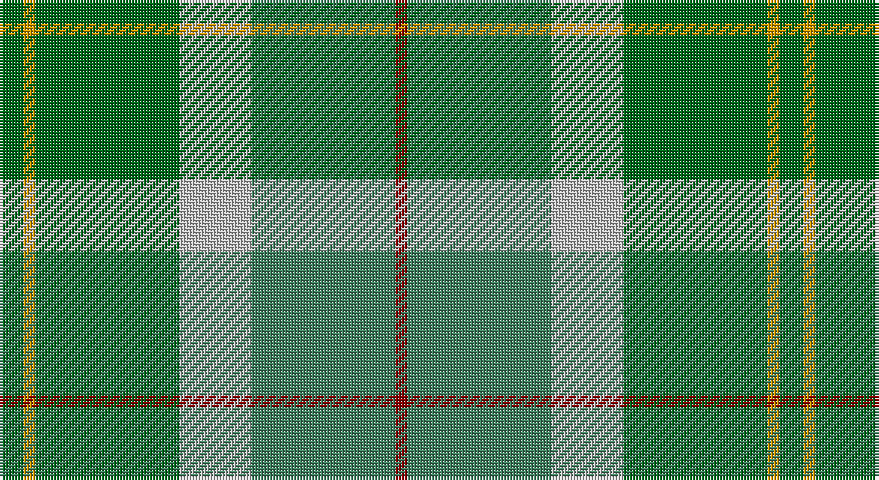

This page is one **sett** — a single exact thread-count. It belongs to the [tartan](/setts/gi2lo1gi12lb6g12r1/)
(the same proportion at any scale), whose colour order is pattern [GYGWGR](/stripes/gygwgr/).

Sourced from tartans-authority.  It is a [6 stripe tartan](/stripes/stripes6/).

Original link http://www.tartansauthority.com/tartan-ferret/display/2083/

## Register references

External register numbers recorded for this tartan.

- Scottish Tartans Authority (ITI): 2083

## Thread count
Ga/8 DY4 Ga48 N24 G48 DR/4

One full sett is **260 threads**.

## Palette

Palette: <strong>Tartan Register</strong> <small style="color:#888">(4 of 5 colours)</small>
<table><thead><tr><th>Colour</th><th>Threads</th><th>Shade</th><th>Base</th><th>OKLCh</th></tr></thead><tbody><tr><td>Ga/</td><td style="text-align:right;font-variant-numeric:tabular-nums">8</td><td><code style="background-color:#006818;">#006818</code> <small style="color:#888">#006818</small></td><td>G <code style="background-color:#006100;">#006100</code></td><td><small style="color:#888">oklch(45.0% 0.142 145.0)</small></td></tr><tr><td>DY</td><td style="text-align:right;font-variant-numeric:tabular-nums">4</td><td><code style="background-color:#D09800;">#D09800</code> <small style="color:#888">#D09800</small></td><td>Y <code style="background-color:#F2BF00;">#F2BF00</code></td><td><small style="color:#888">oklch(71.4% 0.147 82.1)</small></td></tr><tr><td>Ga</td><td style="text-align:right;font-variant-numeric:tabular-nums">48</td><td><code style="background-color:#006818;">#006818</code> <small style="color:#888">#006818</small></td><td>G <code style="background-color:#006100;">#006100</code></td><td><small style="color:#888">oklch(45.0% 0.142 145.0)</small></td></tr><tr><td>N</td><td style="text-align:right;font-variant-numeric:tabular-nums">24</td><td><code style="background-color:#C0C0C0;">#C0C0C0</code> <small style="color:#888">#C0C0C0</small></td><td>W <code style="background-color:#F7F7F7;">#F7F7F7</code></td><td><small style="color:#888">oklch(80.8% 0.000 89.9)</small></td></tr><tr><td>G</td><td style="text-align:right;font-variant-numeric:tabular-nums">48</td><td><code style="background-color:#408060;">#408060</code> <small style="color:#888">#408060</small></td><td>G <code style="background-color:#006100;">#006100</code></td><td><small style="color:#888">oklch(54.8% 0.084 160.1)</small></td></tr><tr><td>DR/</td><td style="text-align:right;font-variant-numeric:tabular-nums">4</td><td><code style="background-color:#880000;">#880000</code> <small style="color:#888">#880000</small></td><td>R <code style="background-color:#CC0000;">#CC0000</code></td><td><small style="color:#888">oklch(39.4% 0.162 29.2)</small></td></tr></tbody></table>

# Sample pattern

## Nearest tartans

The nearest existing variants by ΔTartan distance, with this tartan at the top so the swatches line up against it.

ΔTartan

Tartan

Sett

—

<a href="/ttd/edit/#slug=gi2lo1gi12lb6g12r1~x4">City of Vancouver (Commemorative)</a> <a class="nn-out" href="/variants/s6/gi2lo1gi12lb6g12r1~x4/" title="open its dictionary page">↗</a>

1.04

<a href="/ttd/edit/#slug=b30ly3dy11ly3g33r6~x2&amp;base=gi2lo1gi12lb6g12r1~x4">Balfour Hunting</a> <a class="nn-out" href="/variants/s6/b30ly3dy11ly3g33r6~x2/" title="open its dictionary page">↗</a>

1.22

<a href="/ttd/edit/#slug=t12gi2t2gi2t2dy8g8dy1~x2&amp;base=gi2lo1gi12lb6g12r1~x4">Universal Ancient International Tartan</a> <a class="nn-out" href="/variants/s8/t12gi2t2gi2t2dy8g8dy1~x2/" title="open its dictionary page">↗</a>

1.30

<a href="/ttd/edit/#slug=gi2g8dp4lb2gi13b2~x4&amp;base=gi2lo1gi12lb6g12r1~x4">Ellan Vannin</a> <a class="nn-out" href="/variants/s6/gi2g8dp4lb2gi13b2~x4/" title="open its dictionary page">↗</a>

1.30

<a href="/ttd/edit/#slug=lo9g18t9r1w1db1~x4&amp;base=gi2lo1gi12lb6g12r1~x4">T.H.E. C.O.G. USA (Corporate)</a> <a class="nn-out" href="/variants/s6/lo9g18t9r1w1db1~x4/" title="open its dictionary page">↗</a>

1.37

<a href="/ttd/edit/#slug=dg70ly6lr28g56lr5g11lr5g11r12&amp;base=gi2lo1gi12lb6g12r1~x4">Dalwhinnie</a> <a class="nn-out" href="/variants/s9/dg70ly6lr28g56lr5g11lr5g11r12/" title="open its dictionary page">↗</a>

1.39

<a href="/ttd/edit/#slug=k9lr6n22g28ly2~x2&amp;base=gi2lo1gi12lb6g12r1~x4">Wellington (Lochcarron)</a> <a class="nn-out" href="/variants/s5/k9lr6n22g28ly2~x2/" title="open its dictionary page">↗</a>

1.43

<a href="/ttd/edit/#slug=gi14db1gi1db1gi3db6g12r2~x2&amp;base=gi2lo1gi12lb6g12r1~x4">Cranstoun</a> <a class="nn-out" href="/variants/s8/gi14db1gi1db1gi3db6g12r2~x2/" title="open its dictionary page">↗</a>

1.43

<a href="/ttd/edit/#slug=t12dg2t2dg2t2dy8g8dy1~x2&amp;base=gi2lo1gi12lb6g12r1~x4">Universal Ancient</a> <a class="nn-out" href="/variants/s8/t12dg2t2dg2t2dy8g8dy1~x2/" title="open its dictionary page">↗</a>

1.44

<a href="/ttd/edit/#slug=g32o7g7o16db32ly3o8~x2&amp;base=gi2lo1gi12lb6g12r1~x4">Strange Of Balcaskie</a> <a class="nn-out" href="/variants/s7/g32o7g7o16db32ly3o8~x2/" title="open its dictionary page">↗</a>

1.49

<a href="/ttd/edit/#slug=gi18w1gi4w1lo4g1lo2g12r2g4~x2&amp;base=gi2lo1gi12lb6g12r1~x4">Michigan, State of (District)</a> <a class="nn-out" href="/variants/s10/gi18w1gi4w1lo4g1lo2g12r2g4~x2/" title="open its dictionary page">↗</a>

## Neighbour map

Every grey dot is one of 14360 variants placed by the first two principal components of the ΔTartan feature space (44% of its variance). Red is this tartan; blue dots are its nearest — click one to open its page.

<svg viewBox="0 0 640 380" role="img" style="max-width:100%;height:auto;border:1px solid #e0e0e0;border-radius:4px;display:block" xmlns="http://www.w3.org/2000/svg"><image href="/nn/cloud.v1.png" width="640" height="380"/><a href="/variants/s6/b30ly3dy11ly3g33r6~x2/"><circle cx="216.7" cy="209.7" r="4" fill="#3465a4"><title>Balfour Hunting</title></circle></a><a href="/variants/s8/t12gi2t2gi2t2dy8g8dy1~x2/"><circle cx="264.9" cy="222.1" r="4" fill="#3465a4"><title>Universal Ancient International Tartan</title></circle></a><a href="/variants/s6/gi2g8dp4lb2gi13b2~x4/"><circle cx="234.0" cy="240.0" r="4" fill="#3465a4"><title>Ellan Vannin</title></circle></a><a href="/variants/s6/lo9g18t9r1w1db1~x4/"><circle cx="268.5" cy="172.2" r="4" fill="#3465a4"><title>T.H.E. C.O.G. USA (Corporate)</title></circle></a><a href="/variants/s9/dg70ly6lr28g56lr5g11lr5g11r12/"><circle cx="221.8" cy="170.8" r="4" fill="#3465a4"><title>Dalwhinnie</title></circle></a><a href="/variants/s5/k9lr6n22g28ly2~x2/"><circle cx="230.4" cy="221.8" r="4" fill="#3465a4"><title>Wellington (Lochcarron)</title></circle></a><a href="/variants/s8/gi14db1gi1db1gi3db6g12r2~x2/"><circle cx="280.9" cy="203.8" r="4" fill="#3465a4"><title>Cranstoun</title></circle></a><a href="/variants/s8/t12dg2t2dg2t2dy8g8dy1~x2/"><circle cx="254.5" cy="219.5" r="4" fill="#3465a4"><title>Universal Ancient</title></circle></a><a href="/variants/s7/g32o7g7o16db32ly3o8~x2/"><circle cx="237.9" cy="236.3" r="4" fill="#3465a4"><title>Strange Of Balcaskie</title></circle></a><a href="/variants/s10/gi18w1gi4w1lo4g1lo2g12r2g4~x2/"><circle cx="280.4" cy="156.2" r="4" fill="#3465a4"><title>Michigan, State of (District)</title></circle></a><circle cx="246.1" cy="215.0" r="5" fill="#c00000"/></svg>

ID: /variants/s6/gi2lo1gi12lb6g12r1~x4/
