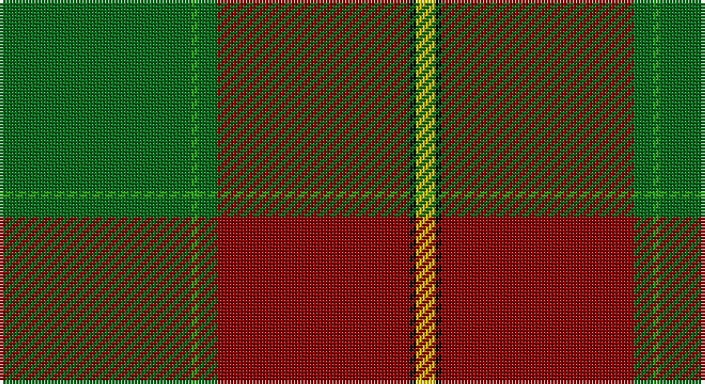

This page is one **sett** — a single exact thread-count. It belongs to the [tartan](/setts/gi30g1gi3r30k1ly3/)
(the same proportion at any scale), whose colour order is pattern [GGGRKY](/stripes/gggrky/).

Sourced from tartans-authority.  It is a [6 stripe tartan](/stripes/stripes6/).

Original link http://www.tartansauthority.com/tartan-ferret/display/7850/

2 attestations — the source records this cloth was collapsed from (oldest owns this page)

<ul>
<li>Dec. 2008 — Abadia Da Cova (Corporate) (tartans-authority, <a href="http://www.tartansauthority.com/tartan-ferret/display/7850/">record</a>)</li>
<li>undated — Abadia Da Cova (register-of-tartans, <a href="https://www.tartanregister.gov.uk/tartanDetails.aspx?ref=5802">record</a>)</li>
</ul>

## Register references

External register numbers recorded for this tartan.

- Scottish Register of Tartans: [5802](https://www.tartanregister.gov.uk/tartanDetails.aspx?ref=5802)
- Scottish Tartans Authority (ITI): 7850

## Thread count
Ga/60 G2 Ga6 DR60 K2 Y/6

One full sett is **206 threads**.

## Palette

Palette: <strong>Tartan Register</strong>
<table><thead><tr><th>Colour</th><th>Threads</th><th>Shade</th><th>Base</th><th>OKLCh</th></tr></thead><tbody><tr><td>Ga/</td><td style="text-align:right;font-variant-numeric:tabular-nums">60</td><td><code style="background-color:#006818;">#006818</code> <small style="color:#888">#006818</small></td><td>G <code style="background-color:#006100;">#006100</code></td><td><small style="color:#888">oklch(45.0% 0.142 145.0)</small></td></tr><tr><td>G</td><td style="text-align:right;font-variant-numeric:tabular-nums">2</td><td><code style="background-color:#289C18;">#289C18</code> <small style="color:#888">#289C18</small></td><td>G <code style="background-color:#006100;">#006100</code></td><td><small style="color:#888">oklch(60.6% 0.191 141.6)</small></td></tr><tr><td>Ga</td><td style="text-align:right;font-variant-numeric:tabular-nums">6</td><td><code style="background-color:#006818;">#006818</code> <small style="color:#888">#006818</small></td><td>G <code style="background-color:#006100;">#006100</code></td><td><small style="color:#888">oklch(45.0% 0.142 145.0)</small></td></tr><tr><td>DR</td><td style="text-align:right;font-variant-numeric:tabular-nums">60</td><td><code style="background-color:#880000;">#880000</code> <small style="color:#888">#880000</small></td><td>R <code style="background-color:#CC0000;">#CC0000</code></td><td><small style="color:#888">oklch(39.4% 0.162 29.2)</small></td></tr><tr><td>K</td><td style="text-align:right;font-variant-numeric:tabular-nums">2</td><td><code style="background-color:#101010;">#101010</code> <small style="color:#888">#101010</small></td><td>K <code style="background-color:#000000;">#000000</code></td><td><small style="color:#888">oklch(17.3% 0.000 89.9)</small></td></tr><tr><td>Y/</td><td style="text-align:right;font-variant-numeric:tabular-nums">6</td><td><code style="background-color:#E8C000;">#E8C000</code> <small style="color:#888">#E8C000</small></td><td>Y <code style="background-color:#F2BF00;">#F2BF00</code></td><td><small style="color:#888">oklch(81.9% 0.168 93.7)</small></td></tr></tbody></table>

# Sample pattern

## Nearest tartans

The nearest existing variants by ΔTartan distance, with this tartan at the top so the swatches line up against it.

ΔTartan

Tartan

Sett

—

<a href="/ttd/edit/#slug=gi30g1gi3r30k1ly3~x2">Abadia Da Cova (Corporate)</a> <a class="nn-out" href="/variants/s6/gi30g1gi3r30k1ly3~x2/" title="open its dictionary page">↗</a>

1.16

<a href="/ttd/edit/#slug=g15ly3g27r2g2r33b2w1b4~x2&amp;base=gi30g1gi3r30k1ly3~x2">Longmore (Name)</a> <a class="nn-out" href="/variants/s9/g15ly3g27r2g2r33b2w1b4~x2/" title="open its dictionary page">↗</a>

1.29

<a href="/ttd/edit/#slug=k2o2k1o18g24k1g2lo2~x2&amp;base=gi30g1gi3r30k1ly3~x2">Gleneil (Spoof)</a> <a class="nn-out" href="/variants/s8/k2o2k1o18g24k1g2lo2~x2/" title="open its dictionary page">↗</a>

1.38

<a href="/ttd/edit/#slug=k9w2r50g42r16g17k4&amp;base=gi30g1gi3r30k1ly3~x2">McNee (Name)</a> <a class="nn-out" href="/variants/s7/k9w2r50g42r16g17k4/" title="open its dictionary page">↗</a>

1.42

<a href="/ttd/edit/#slug=lr2r12dg2r1dg32r1dg2r12ly2&amp;base=gi30g1gi3r30k1ly3~x2">MacFie</a> <a class="nn-out" href="/variants/s9/lr2r12dg2r1dg32r1dg2r12ly2/" title="open its dictionary page">↗</a>

1.49

<a href="/ttd/edit/#slug=g24dr2w2dr2dt8o1dr24g4~x2&amp;base=gi30g1gi3r30k1ly3~x2">Wellmont Golf Tournament</a> <a class="nn-out" href="/variants/s8/g24dr2w2dr2dt8o1dr24g4~x2/" title="open its dictionary page">↗</a>

1.51

<a href="/ttd/edit/#slug=g36r18g4r6k1w2~x2&amp;base=gi30g1gi3r30k1ly3~x2">Princess Margaret Rose Tartan</a> <a class="nn-out" href="/variants/s6/g36r18g4r6k1w2~x2/" title="open its dictionary page">↗</a>

1.52

<a href="/ttd/edit/#slug=g55dp7r24g12db4ly3db4~x2&amp;base=gi30g1gi3r30k1ly3~x2">Crieff and Strathearn District Tartan</a> <a class="nn-out" href="/variants/s7/g55dp7r24g12db4ly3db4~x2/" title="open its dictionary page">↗</a>

1.55

<a href="/ttd/edit/#slug=do8g19dg42lo3o1~x2&amp;base=gi30g1gi3r30k1ly3~x2">Nolan Family, John J (Personal)</a> <a class="nn-out" href="/variants/s5/do8g19dg42lo3o1~x2/" title="open its dictionary page">↗</a>

1.60

<a href="/ttd/edit/#slug=k3r12dy8lo2g36dy10t2~x2&amp;base=gi30g1gi3r30k1ly3~x2">Snelgrove Htg (Name)</a> <a class="nn-out" href="/variants/s7/k3r12dy8lo2g36dy10t2~x2/" title="open its dictionary page">↗</a>

1.60

<a href="/ttd/edit/#slug=r5k2dg1k2r5k2dg18lo3~x2&amp;base=gi30g1gi3r30k1ly3~x2">Midpac Tissue (non woven)</a> <a class="nn-out" href="/variants/s8/r5k2dg1k2r5k2dg18lo3~x2/" title="open its dictionary page">↗</a>

## Neighbour map

Every grey dot is one of 14360 variants placed by the first two principal components of the ΔTartan feature space (44% of its variance). Red is this tartan; blue dots are its nearest — click one to open its page.

<svg viewBox="0 0 640 380" role="img" style="max-width:100%;height:auto;border:1px solid #e0e0e0;border-radius:4px;display:block" xmlns="http://www.w3.org/2000/svg"><image href="/nn/cloud.v1.png" width="640" height="380"/><a href="/variants/s9/g15ly3g27r2g2r33b2w1b4~x2/"><circle cx="333.0" cy="114.5" r="4" fill="#3465a4"><title>Longmore (Name)</title></circle></a><a href="/variants/s8/k2o2k1o18g24k1g2lo2~x2/"><circle cx="376.2" cy="158.2" r="4" fill="#3465a4"><title>Gleneil (Spoof)</title></circle></a><a href="/variants/s7/k9w2r50g42r16g17k4/"><circle cx="339.0" cy="185.4" r="4" fill="#3465a4"><title>McNee (Name)</title></circle></a><a href="/variants/s9/lr2r12dg2r1dg32r1dg2r12ly2/"><circle cx="412.3" cy="136.5" r="4" fill="#3465a4"><title>MacFie</title></circle></a><a href="/variants/s8/g24dr2w2dr2dt8o1dr24g4~x2/"><circle cx="284.9" cy="147.8" r="4" fill="#3465a4"><title>Wellmont Golf Tournament</title></circle></a><a href="/variants/s6/g36r18g4r6k1w2~x2/"><circle cx="421.0" cy="152.3" r="4" fill="#3465a4"><title>Princess Margaret Rose Tartan</title></circle></a><a href="/variants/s7/g55dp7r24g12db4ly3db4~x2/"><circle cx="365.1" cy="158.3" r="4" fill="#3465a4"><title>Crieff and Strathearn District Tartan</title></circle></a><a href="/variants/s5/do8g19dg42lo3o1~x2/"><circle cx="377.6" cy="157.2" r="4" fill="#3465a4"><title>Nolan Family, John J (Personal)</title></circle></a><a href="/variants/s7/k3r12dy8lo2g36dy10t2~x2/"><circle cx="286.9" cy="154.1" r="4" fill="#3465a4"><title>Snelgrove Htg (Name)</title></circle></a><a href="/variants/s8/r5k2dg1k2r5k2dg18lo3~x2/"><circle cx="308.5" cy="164.4" r="4" fill="#3465a4"><title>Midpac Tissue (non woven)</title></circle></a><circle cx="361.7" cy="148.6" r="5" fill="#c00000"/></svg>

ID: /variants/s6/gi30g1gi3r30k1ly3~x2/
