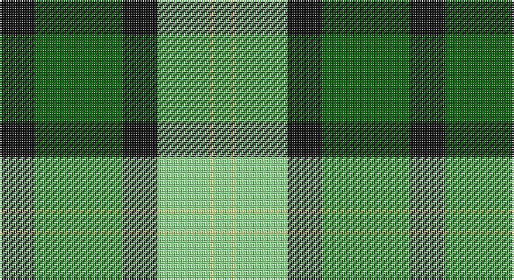

This page is one **sett** — a single exact thread-count. It belongs to the [tartan](/setts/k10g25k10lg15w1lg5/)
(the same proportion at any scale), whose colour order is pattern [KGKYWY](/stripes/kgkywy/).

Part of the [Delaware Fine Spirits Guild](/tartans/delaware-fine-spirits-guild/) tartan — the named design grouping this sett with its other cloths.

Sourced from register-of-tartans.  It is a [6 stripe tartan](/stripes/stripes6/).

Original link https://www.tartanregister.gov.uk/tartanDetails.aspx?ref=10204

## Register references

External register numbers recorded for this tartan.

- Scottish Register of Tartans: [10204](https://www.tartanregister.gov.uk/tartanDetails.aspx?ref=10204)

## Thread count
K/20 G50 K20 LG30 LY2 LG/10

One full sett is **234 threads**.

## Palette

Palette: <strong>Logan (The Scottish Gael, 1831)</strong> <small style="color:#888">(2 of 4 colours)</small>
<table><thead><tr><th>Colour</th><th>Threads</th><th>Shade</th><th>Base</th><th>OKLCh</th></tr></thead><tbody><tr><td>K/</td><td style="text-align:right;font-variant-numeric:tabular-nums">20</td><td><code style="background-color:#101010;">#101010</code> <small style="color:#888">#101010</small></td><td>K <code style="background-color:#000000;">#000000</code></td><td><small style="color:#888">oklch(17.3% 0.000 89.9)</small></td></tr><tr><td>G</td><td style="text-align:right;font-variant-numeric:tabular-nums">50</td><td><code style="background-color:#006400;">#006400</code> <small style="color:#888">#006400</small></td><td>G <code style="background-color:#006100;">#006100</code></td><td><small style="color:#888">oklch(43.6% 0.148 142.5)</small></td></tr><tr><td>K</td><td style="text-align:right;font-variant-numeric:tabular-nums">20</td><td><code style="background-color:#101010;">#101010</code> <small style="color:#888">#101010</small></td><td>K <code style="background-color:#000000;">#000000</code></td><td><small style="color:#888">oklch(17.3% 0.000 89.9)</small></td></tr><tr><td>LG</td><td style="text-align:right;font-variant-numeric:tabular-nums">30</td><td><code style="background-color:#90EE90;">#90EE90</code> <small style="color:#888">#90EE90</small></td><td>Y <code style="background-color:#F2BF00;">#F2BF00</code></td><td><small style="color:#888">oklch(86.8% 0.156 144.1)</small></td></tr><tr><td>LY</td><td style="text-align:right;font-variant-numeric:tabular-nums">2</td><td><code style="background-color:#FFF68F;">#FFF68F</code> <small style="color:#888">#FFF68F</small></td><td>W <code style="background-color:#F7F7F7;">#F7F7F7</code></td><td><small style="color:#888">oklch(95.9% 0.125 104.1)</small></td></tr><tr><td>LG/</td><td style="text-align:right;font-variant-numeric:tabular-nums">10</td><td><code style="background-color:#90EE90;">#90EE90</code> <small style="color:#888">#90EE90</small></td><td>Y <code style="background-color:#F2BF00;">#F2BF00</code></td><td><small style="color:#888">oklch(86.8% 0.156 144.1)</small></td></tr></tbody></table>

# Sample pattern

## Nearest tartans

The nearest existing variants by ΔTartan distance, with this tartan at the top so the swatches line up against it.

ΔTartan

Tartan

Sett

—

<a href="/ttd/edit/#slug=k10g25k10lg15w1lg5~x2">Delaware Fine Spirits Guild</a> <a class="nn-out" href="/variants/s6/k10g25k10lg15w1lg5~x2/" title="open its dictionary page">↗</a>

1.10

<a href="/ttd/edit/#slug=k5g25k10lg15ly1lg5~x2&amp;base=k10g25k10lg15w1lg5~x2">Delaware Fine Spirits Guild (Corp)</a> <a class="nn-out" href="/variants/s6/k5g25k10lg15ly1lg5~x2/" title="open its dictionary page">↗</a>

1.57

<a href="/ttd/edit/#slug=ly30g30r1db16~x2&amp;base=k10g25k10lg15w1lg5~x2">Barber Family (Personal)</a> <a class="nn-out" href="/variants/s4/ly30g30r1db16~x2/" title="open its dictionary page">↗</a>

1.69

<a href="/ttd/edit/#slug=g21w2g21k17dg12dp6k2w1~x2&amp;base=k10g25k10lg15w1lg5~x2">Hibernian F. C. (2004) (C orporate)</a> <a class="nn-out" href="/variants/s8/g21w2g21k17dg12dp6k2w1~x2/" title="open its dictionary page">↗</a>

1.75

<a href="/ttd/edit/#slug=g25k8y10r1y3~x4&amp;base=k10g25k10lg15w1lg5~x2">Herbage</a> <a class="nn-out" href="/variants/s5/g25k8y10r1y3~x4/" title="open its dictionary page">↗</a>

1.81

<a href="/ttd/edit/#slug=k4g23k23g2w23b4~x2&amp;base=k10g25k10lg15w1lg5~x2">MacKay Dress</a> <a class="nn-out" href="/variants/s6/k4g23k23g2w23b4~x2/" title="open its dictionary page">↗</a>

1.87

<a href="/ttd/edit/#slug=gi16ly2gi4ly2gi5k14g28ly2g7~x2&amp;base=k10g25k10lg15w1lg5~x2">Marie Curie Fields of Hope</a> <a class="nn-out" href="/variants/s9/gi16ly2gi4ly2gi5k14g28ly2g7~x2/" title="open its dictionary page">↗</a>

1.91

<a href="/ttd/edit/#slug=g5k2g28k10o26db4g4~x2&amp;base=k10g25k10lg15w1lg5~x2">John Telfar, Dunbar hunting</a> <a class="nn-out" href="/variants/s7/g5k2g28k10o26db4g4~x2/" title="open its dictionary page">↗</a>

1.92

<a href="/ttd/edit/#slug=db8ly1dg5ly12r1dg2~x6&amp;base=k10g25k10lg15w1lg5~x2">McCabe (2016)</a> <a class="nn-out" href="/variants/s6/db8ly1dg5ly12r1dg2~x6/" title="open its dictionary page">↗</a>

1.94

<a href="/ttd/edit/#slug=m5dg27o2g25ly7dg3m3~x2&amp;base=k10g25k10lg15w1lg5~x2">Kilkenny</a> <a class="nn-out" href="/variants/s7/m5dg27o2g25ly7dg3m3~x2/" title="open its dictionary page">↗</a>

1.96

<a href="/ttd/edit/#slug=y83k35w3g35k3ly10&amp;base=k10g25k10lg15w1lg5~x2">Brandon, Manitoba</a> <a class="nn-out" href="/variants/s6/y83k35w3g35k3ly10/" title="open its dictionary page">↗</a>

## Neighbour map

Every grey dot is one of 14360 variants placed by the first two principal components of the ΔTartan feature space (44% of its variance). Red is this tartan; blue dots are its nearest — click one to open its page.

<svg viewBox="0 0 640 380" role="img" style="max-width:100%;height:auto;border:1px solid #e0e0e0;border-radius:4px;display:block" xmlns="http://www.w3.org/2000/svg"><image href="/nn/cloud.v1.png" width="640" height="380"/><a href="/variants/s6/k5g25k10lg15ly1lg5~x2/"><circle cx="224.5" cy="173.3" r="4" fill="#3465a4"><title>Delaware Fine Spirits Guild (Corp)</title></circle></a><a href="/variants/s4/ly30g30r1db16~x2/"><circle cx="213.6" cy="190.0" r="4" fill="#3465a4"><title>Barber Family (Personal)</title></circle></a><a href="/variants/s8/g21w2g21k17dg12dp6k2w1~x2/"><circle cx="235.4" cy="160.8" r="4" fill="#3465a4"><title>Hibernian F. C. (2004) (C orporate)</title></circle></a><a href="/variants/s5/g25k8y10r1y3~x4/"><circle cx="301.3" cy="182.1" r="4" fill="#3465a4"><title>Herbage</title></circle></a><a href="/variants/s6/k4g23k23g2w23b4~x2/"><circle cx="144.1" cy="195.9" r="4" fill="#3465a4"><title>MacKay Dress</title></circle></a><a href="/variants/s9/gi16ly2gi4ly2gi5k14g28ly2g7~x2/"><circle cx="206.9" cy="172.1" r="4" fill="#3465a4"><title>Marie Curie Fields of Hope</title></circle></a><a href="/variants/s7/g5k2g28k10o26db4g4~x2/"><circle cx="253.1" cy="191.6" r="4" fill="#3465a4"><title>John Telfar, Dunbar hunting</title></circle></a><a href="/variants/s6/db8ly1dg5ly12r1dg2~x6/"><circle cx="187.4" cy="175.9" r="4" fill="#3465a4"><title>McCabe (2016)</title></circle></a><a href="/variants/s7/m5dg27o2g25ly7dg3m3~x2/"><circle cx="202.2" cy="165.6" r="4" fill="#3465a4"><title>Kilkenny</title></circle></a><a href="/variants/s6/y83k35w3g35k3ly10/"><circle cx="249.1" cy="134.0" r="4" fill="#3465a4"><title>Brandon, Manitoba</title></circle></a><circle cx="185.8" cy="179.4" r="5" fill="#c00000"/></svg>

ID: /variants/s6/k10g25k10lg15w1lg5~x2/
