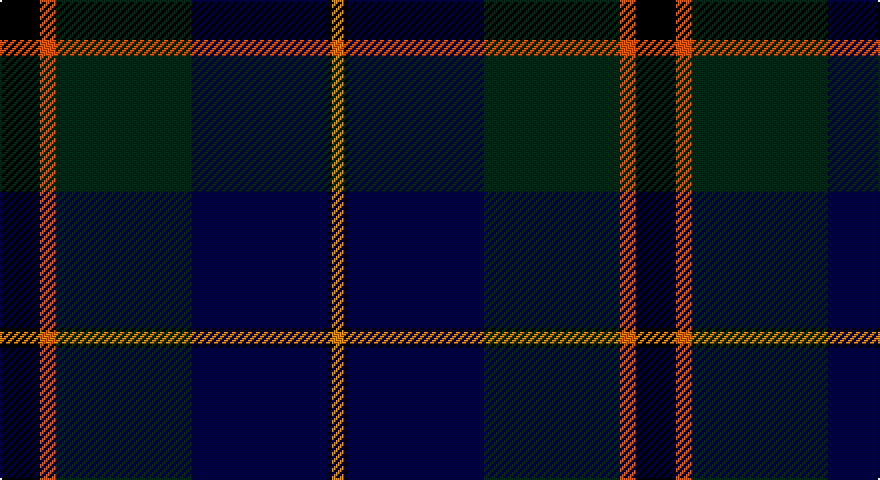

This page is one **sett** — a single exact thread-count. It belongs to the [tartan](/setts/k10r4dg34db34k1lo3/)
(the same proportion at any scale), whose colour order is pattern [KRGBKY](/stripes/krgbky/).

Sourced from register-of-tartans.  It is a [6 stripe tartan](/stripes/stripes6/).

Original link https://www.tartanregister.gov.uk/tartanDetails.aspx?ref=11357

## Register references

External register numbers recorded for this tartan.

- Scottish Register of Tartans: [11357](https://www.tartanregister.gov.uk/tartanDetails.aspx?ref=11357)

## Thread count
K/20 R8 DG68 DB68 K2 O/6

One full sett is **318 threads**.

## Palette

Palette: <strong>Tartan Register</strong>
<table><thead><tr><th>Colour</th><th>Threads</th><th>Shade</th><th>Base</th><th>OKLCh</th></tr></thead><tbody><tr><td>K/</td><td style="text-align:right;font-variant-numeric:tabular-nums">20</td><td><code style="background-color:#000000;">#000000</code> <small style="color:#888">#000000</small></td><td>K <code style="background-color:#000000;">#000000</code></td><td><small style="color:#888">oklch(0.0% 0.000 0.0)</small></td></tr><tr><td>R</td><td style="text-align:right;font-variant-numeric:tabular-nums">8</td><td><code style="background-color:#FA4B00;">#FA4B00</code> <small style="color:#888">#FA4B00</small></td><td>R <code style="background-color:#CC0000;">#CC0000</code></td><td><small style="color:#888">oklch(65.7% 0.220 36.9)</small></td></tr><tr><td>DG</td><td style="text-align:right;font-variant-numeric:tabular-nums">68</td><td><code style="background-color:#002814;">#002814</code> <small style="color:#888">#002814</small></td><td>G <code style="background-color:#006100;">#006100</code></td><td><small style="color:#888">oklch(24.4% 0.059 156.5)</small></td></tr><tr><td>DB</td><td style="text-align:right;font-variant-numeric:tabular-nums">68</td><td><code style="background-color:#000048;">#000048</code> <small style="color:#888">#000048</small></td><td>B <code style="background-color:#2A418A;">#2A418A</code></td><td><small style="color:#888">oklch(18.2% 0.126 264.1)</small></td></tr><tr><td>K</td><td style="text-align:right;font-variant-numeric:tabular-nums">2</td><td><code style="background-color:#000000;">#000000</code> <small style="color:#888">#000000</small></td><td>K <code style="background-color:#000000;">#000000</code></td><td><small style="color:#888">oklch(0.0% 0.000 0.0)</small></td></tr><tr><td>O/</td><td style="text-align:right;font-variant-numeric:tabular-nums">6</td><td><code style="background-color:#D87C00;">#D87C00</code> <small style="color:#888">#D87C00</small></td><td>Y <code style="background-color:#F2BF00;">#F2BF00</code></td><td><small style="color:#888">oklch(67.3% 0.155 61.8)</small></td></tr></tbody></table>

# Sample pattern

## Nearest tartans

The nearest existing variants by ΔTartan distance, with this tartan at the top so the swatches line up against it.

ΔTartan

Tartan

Sett

—

<a href="/ttd/edit/#slug=k10r4dg34db34k1lo3~x2">Singh, Gopal (Personal)</a> <a class="nn-out" href="/variants/s6/k10r4dg34db34k1lo3~x2/" title="open its dictionary page">↗</a>

0.90

<a href="/ttd/edit/#slug=db4k2db16lr1k8dg24r4~x2&amp;base=k10r4dg34db34k1lo3~x2">Colqhoun VS</a> <a class="nn-out" href="/variants/s7/db4k2db16lr1k8dg24r4~x2/" title="open its dictionary page">↗</a>

0.96

<a href="/ttd/edit/#slug=db24k8dg8r2dg8k1ly2~x2&amp;base=k10r4dg34db34k1lo3~x2">MacLaren</a> <a class="nn-out" href="/variants/s7/db24k8dg8r2dg8k1ly2~x2/" title="open its dictionary page">↗</a>

0.96

<a href="/ttd/edit/#slug=db24k8dg8r2dg8k1lr2~x2&amp;base=k10r4dg34db34k1lo3~x2">Fergusson</a> <a class="nn-out" href="/variants/s7/db24k8dg8r2dg8k1lr2~x2/" title="open its dictionary page">↗</a>

0.96

<a href="/ttd/edit/#slug=db24k8dg8r2dg8k1lr2&amp;base=k10r4dg34db34k1lo3~x2">Fergusson</a> <a class="nn-out" href="/variants/s7/db24k8dg8r2dg8k1lr2/" title="open its dictionary page">↗</a>

1.07

<a href="/ttd/edit/#slug=db28ly1db2k16dg24k1dg2r3~x2&amp;base=k10r4dg34db34k1lo3~x2">Ogilvy VS</a> <a class="nn-out" href="/variants/s8/db28ly1db2k16dg24k1dg2r3~x2/" title="open its dictionary page">↗</a>

1.14

<a href="/ttd/edit/#slug=k6db3dg28w1dbi28db2w3~x2&amp;base=k10r4dg34db34k1lo3~x2">Weisfeld</a> <a class="nn-out" href="/variants/s7/k6db3dg28w1dbi28db2w3~x2/" title="open its dictionary page">↗</a>

1.16

<a href="/ttd/edit/#slug=dg2r1dg30k16lr1db16r2~x2&amp;base=k10r4dg34db34k1lo3~x2">Sinclair Hunting</a> <a class="nn-out" href="/variants/s7/dg2r1dg30k16lr1db16r2~x2/" title="open its dictionary page">↗</a>

1.23

<a href="/ttd/edit/#slug=r3k2db25k28dg25k2r1db2~x2&amp;base=k10r4dg34db34k1lo3~x2">Common Kilt</a> <a class="nn-out" href="/variants/s8/r3k2db25k28dg25k2r1db2~x2/" title="open its dictionary page">↗</a>

1.24

<a href="/ttd/edit/#slug=db24k8dg8r2dg8k1lb2&amp;base=k10r4dg34db34k1lo3~x2">Fergusson</a> <a class="nn-out" href="/variants/s7/db24k8dg8r2dg8k1lb2/" title="open its dictionary page">↗</a>

1.26

<a href="/ttd/edit/#slug=ly2k4ly1dg16k14db23k4r1~x2&amp;base=k10r4dg34db34k1lo3~x2">Thomas of Craigie (Personal)</a> <a class="nn-out" href="/variants/s8/ly2k4ly1dg16k14db23k4r1~x2/" title="open its dictionary page">↗</a>

## Neighbour map

Every grey dot is one of 14360 variants placed by the first two principal components of the ΔTartan feature space (44% of its variance). Red is this tartan; blue dots are its nearest — click one to open its page.

<svg viewBox="0 0 640 380" role="img" style="max-width:100%;height:auto;border:1px solid #e0e0e0;border-radius:4px;display:block" xmlns="http://www.w3.org/2000/svg"><image href="/nn/cloud.v1.png" width="640" height="380"/><a href="/variants/s7/db4k2db16lr1k8dg24r4~x2/"><circle cx="248.6" cy="171.9" r="4" fill="#3465a4"><title>Colqhoun VS</title></circle></a><a href="/variants/s7/db24k8dg8r2dg8k1ly2~x2/"><circle cx="267.4" cy="170.0" r="4" fill="#3465a4"><title>MacLaren</title></circle></a><a href="/variants/s7/db24k8dg8r2dg8k1lr2~x2/"><circle cx="268.0" cy="170.1" r="4" fill="#3465a4"><title>Fergusson</title></circle></a><a href="/variants/s7/db24k8dg8r2dg8k1lr2/"><circle cx="268.0" cy="170.1" r="4" fill="#3465a4"><title>Fergusson</title></circle></a><a href="/variants/s8/db28ly1db2k16dg24k1dg2r3~x2/"><circle cx="250.1" cy="147.9" r="4" fill="#3465a4"><title>Ogilvy VS</title></circle></a><a href="/variants/s7/k6db3dg28w1dbi28db2w3~x2/"><circle cx="253.8" cy="149.8" r="4" fill="#3465a4"><title>Weisfeld</title></circle></a><a href="/variants/s7/dg2r1dg30k16lr1db16r2~x2/"><circle cx="292.7" cy="155.2" r="4" fill="#3465a4"><title>Sinclair Hunting</title></circle></a><a href="/variants/s8/r3k2db25k28dg25k2r1db2~x2/"><circle cx="274.5" cy="175.9" r="4" fill="#3465a4"><title>Common Kilt</title></circle></a><a href="/variants/s7/db24k8dg8r2dg8k1lb2/"><circle cx="254.1" cy="163.1" r="4" fill="#3465a4"><title>Fergusson</title></circle></a><a href="/variants/s8/ly2k4ly1dg16k14db23k4r1~x2/"><circle cx="235.1" cy="166.6" r="4" fill="#3465a4"><title>Thomas of Craigie (Personal)</title></circle></a><circle cx="282.0" cy="169.4" r="5" fill="#c00000"/></svg>

ID: /variants/s6/k10r4dg34db34k1lo3~x2/
