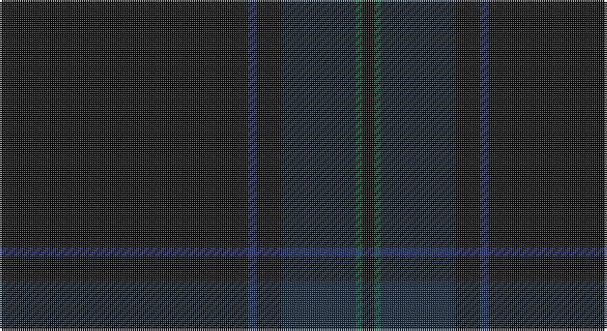

This page is one **sett** — a single exact thread-count. It belongs to the [tartan](/setts/k120db4k12dt36dg3k6/)
(the same proportion at any scale), whose colour order is pattern [KBKBGK](/stripes/kbkbgk/).

Sourced from tartans-authority.  It is a [6 stripe tartan](/stripes/stripes6/).

Original link http://www.tartansauthority.com/tartan-ferret/display/6582/

2 attestations — the source records this cloth was collapsed from (oldest owns this page)

<ul>
<li>Dec. 1993 — Scottish Football Association (Corp) (tartans-authority, <a href="http://www.tartansauthority.com/tartan-ferret/display/6582/">record</a>)</li>
<li>01/01/2003 — Scottish Football Association (register-of-tartans, <a href="https://www.tartanregister.gov.uk/tartanDetails.aspx?ref=3716">record</a>)</li>
</ul>

## Register references

External register numbers recorded for this tartan.

- Scottish Register of Tartans: [3716](https://www.tartanregister.gov.uk/tartanDetails.aspx?ref=3716)
- Scottish Tartans Authority (ITI): 6582

## Thread count
K/120 DB4 K12 DN36 G3 K/6

One full sett is **236 threads**.

## Palette

Palette: <strong>Tartan Register</strong> <small style="color:#888">(2 of 4 colours)</small>
<table><thead><tr><th>Colour</th><th>Threads</th><th>Shade</th><th>Base</th><th>OKLCh</th></tr></thead><tbody><tr><td>K/</td><td style="text-align:right;font-variant-numeric:tabular-nums">120</td><td><code style="background-color:#101010;">#101010</code> <small style="color:#888">#101010</small></td><td>K <code style="background-color:#000000;">#000000</code></td><td><small style="color:#888">oklch(17.3% 0.000 89.9)</small></td></tr><tr><td>DB</td><td style="text-align:right;font-variant-numeric:tabular-nums">4</td><td><code style="background-color:#203078;">#203078</code> <small style="color:#888">#203078</small></td><td>B <code style="background-color:#2A418A;">#2A418A</code></td><td><small style="color:#888">oklch(34.3% 0.124 269.3)</small></td></tr><tr><td>K</td><td style="text-align:right;font-variant-numeric:tabular-nums">12</td><td><code style="background-color:#101010;">#101010</code> <small style="color:#888">#101010</small></td><td>K <code style="background-color:#000000;">#000000</code></td><td><small style="color:#888">oklch(17.3% 0.000 89.9)</small></td></tr><tr><td>DN</td><td style="text-align:right;font-variant-numeric:tabular-nums">36</td><td><code style="background-color:#14283C;">#14283C</code> <small style="color:#888">#14283C</small></td><td>B <code style="background-color:#2A418A;">#2A418A</code></td><td><small style="color:#888">oklch(27.1% 0.046 249.9)</small></td></tr><tr><td>G</td><td style="text-align:right;font-variant-numeric:tabular-nums">3</td><td><code style="background-color:#006038;">#006038</code> <small style="color:#888">#006038</small></td><td>G <code style="background-color:#006100;">#006100</code></td><td><small style="color:#888">oklch(43.0% 0.103 156.9)</small></td></tr><tr><td>K/</td><td style="text-align:right;font-variant-numeric:tabular-nums">6</td><td><code style="background-color:#101010;">#101010</code> <small style="color:#888">#101010</small></td><td>K <code style="background-color:#000000;">#000000</code></td><td><small style="color:#888">oklch(17.3% 0.000 89.9)</small></td></tr></tbody></table>

# Sample pattern

## Nearest tartans

The nearest existing variants by ΔTartan distance, with this tartan at the top so the swatches line up against it.

ΔTartan

Tartan

Sett

—

<a href="/ttd/edit/#slug=k120db4k12dt36dg3k6">Scottish Football Association (Corp)</a> <a class="nn-out" href="/variants/s6/k120db4k12dt36dg3k6/" title="open its dictionary page">↗</a>

1.85

<a href="/ttd/edit/#slug=dt4k2dt4k45n2k3n2~x2&amp;base=k120db4k12dt36dg3k6">STLTH (Corporate)</a> <a class="nn-out" href="/variants/s7/dt4k2dt4k45n2k3n2~x2/" title="open its dictionary page">↗</a>

1.87

<a href="/ttd/edit/#slug=k44dg12dt1o6~x2&amp;base=k120db4k12dt36dg3k6">Heslop, William D Name Tartan</a> <a class="nn-out" href="/variants/s4/k44dg12dt1o6~x2/" title="open its dictionary page">↗</a>

2.48

<a href="/variants/s9/ki10k3ki3k32dg1k1dg1k2n2~x2/">Orman (Personal)</a>

2.89

<a href="/variants/s14/db1ki4k3dp2ki15k2ki3k50ki2k2ki6k2ki1r1~x2/">Bowcutt, David (Personal)</a>

2.92

<a href="/ttd/edit/#slug=dg45db14k3db2dy2db5~x2&amp;base=k120db4k12dt36dg3k6">St Andrews Old Course Hotel, Golf Course and Spa</a> <a class="nn-out" href="/variants/s6/dg45db14k3db2dy2db5~x2/" title="open its dictionary page">↗</a>

3.02

<a href="/ttd/edit/#slug=dg23db3k8db4dg4db56dy8&amp;base=k120db4k12dt36dg3k6">Tern House</a> <a class="nn-out" href="/variants/s7/dg23db3k8db4dg4db56dy8/" title="open its dictionary page">↗</a>

3.08

<a href="/ttd/edit/#slug=n2y3n3y3n10y2n18y1~x4&amp;base=k120db4k12dt36dg3k6">Hebridean Cairn Fashion Tartan</a> <a class="nn-out" href="/variants/s8/n2y3n3y3n10y2n18y1~x4/" title="open its dictionary page">↗</a>

3.12

<a href="/variants/s7/k17ki4k13ki4k3ki45k3~x2/">Black Spirit Fashion Tartan</a>

3.19

<a href="/ttd/edit/#slug=k26r2k13k2k3r2k6k1k6r2k3k2k30r2k2~x2&amp;base=k120db4k12dt36dg3k6">Williams (Welsh Name)</a> <a class="nn-out" href="/variants/s15/k26r2k13k2k3r2k6k1k6r2k3k2k30r2k2~x2/" title="open its dictionary page">↗</a>

3.20

<a href="/ttd/edit/#slug=do5k2do28k10do26k4do4~x2&amp;base=k120db4k12dt36dg3k6">Dunbar, John Telfer (Personal)</a> <a class="nn-out" href="/variants/s7/do5k2do28k10do26k4do4~x2/" title="open its dictionary page">↗</a>

## Neighbour map

Every grey dot is one of 14360 variants placed by the first two principal components of the ΔTartan feature space (44% of its variance). Red is this tartan; blue dots are its nearest — click one to open its page.

<svg viewBox="0 0 640 380" role="img" style="max-width:100%;height:auto;border:1px solid #e0e0e0;border-radius:4px;display:block" xmlns="http://www.w3.org/2000/svg"><image href="/nn/cloud.v1.png" width="640" height="380"/><a href="/variants/s7/dt4k2dt4k45n2k3n2~x2/"><circle cx="626.0" cy="265.1" r="4" fill="#3465a4"><title>STLTH (Corporate)</title></circle></a><a href="/variants/s4/k44dg12dt1o6~x2/"><circle cx="626.0" cy="296.9" r="4" fill="#3465a4"><title>Heslop, William D Name Tartan</title></circle></a><a href="/variants/s9/ki10k3ki3k32dg1k1dg1k2n2~x2/"><circle cx="626.0" cy="222.8" r="4" fill="#3465a4"><title>Orman (Personal)</title></circle></a><a href="/variants/s14/db1ki4k3dp2ki15k2ki3k50ki2k2ki6k2ki1r1~x2/"><circle cx="626.0" cy="188.5" r="4" fill="#3465a4"><title>Bowcutt, David (Personal)</title></circle></a><a href="/variants/s6/dg45db14k3db2dy2db5~x2/"><circle cx="562.2" cy="254.1" r="4" fill="#3465a4"><title>St Andrews Old Course Hotel, Golf Course and Spa</title></circle></a><a href="/variants/s7/dg23db3k8db4dg4db56dy8/"><circle cx="527.6" cy="265.1" r="4" fill="#3465a4"><title>Tern House</title></circle></a><a href="/variants/s8/n2y3n3y3n10y2n18y1~x4/"><circle cx="626.0" cy="322.2" r="4" fill="#3465a4"><title>Hebridean Cairn Fashion Tartan</title></circle></a><a href="/variants/s7/k17ki4k13ki4k3ki45k3~x2/"><circle cx="626.0" cy="352.5" r="4" fill="#3465a4"><title>Black Spirit Fashion Tartan</title></circle></a><a href="/variants/s15/k26r2k13k2k3r2k6k1k6r2k3k2k30r2k2~x2/"><circle cx="626.0" cy="211.8" r="4" fill="#3465a4"><title>Williams (Welsh Name)</title></circle></a><a href="/variants/s7/do5k2do28k10do26k4do4~x2/"><circle cx="626.0" cy="356.0" r="4" fill="#3465a4"><title>Dunbar, John Telfer (Personal)</title></circle></a><circle cx="626.0" cy="264.3" r="5" fill="#c00000"/></svg>

ID: /variants/s6/k120db4k12dt36dg3k6/
