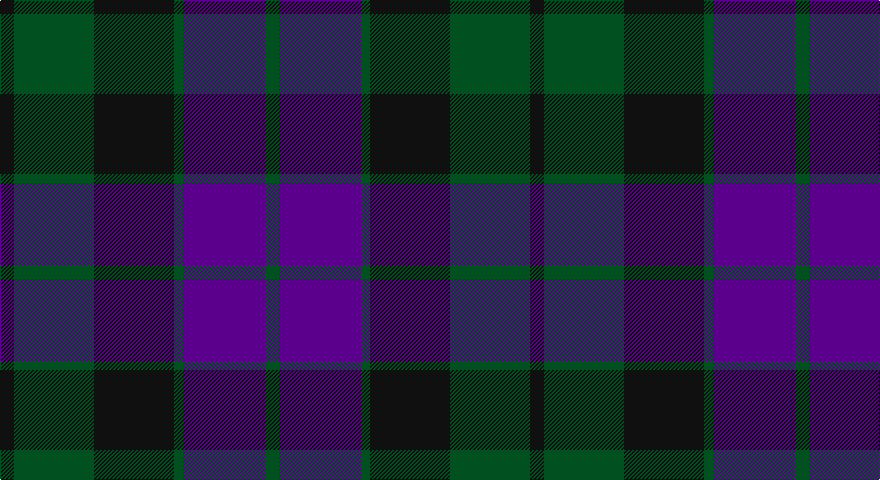

This page is one **sett** — a single exact thread-count. It belongs to the [tartan](/setts/k14dg80k80dg9dp82dg14/)
(the same proportion at any scale), whose colour order is pattern [GBGKGK](/stripes/gbgkgk/).

Part of the [MacKay](/tartans/mackay/) tartan — the named design grouping this sett with its other cloths.

Sourced from register-of-tartans.  It is a [6 stripe tartan](/stripes/stripes6/).

Original link https://www.tartanregister.gov.uk/tartanDetails.aspx?ref=2504

## Also known as

This cloth is also recorded under:

- MacKay #2
- MacKay Plaid
- MacKay V
- MacKay VS
- MacKay, Blue
- MacKay, Plaid

## Register references

External register numbers recorded for this tartan.

- Scottish Register of Tartans: [2504](https://www.tartanregister.gov.uk/tartanDetails.aspx?ref=2504)
- Scottish Tartans World Register: 702

## Thread count
K/14 G80 K80 G9 P82 G/14

One full sett is **530 threads**.

## Palette

Palette: <strong>Tartan Register</strong>
<table><thead><tr><th>Colour</th><th>Threads</th><th>Shade</th><th>Base</th><th>OKLCh</th></tr></thead><tbody><tr><td>K/</td><td style="text-align:right;font-variant-numeric:tabular-nums">14</td><td><code style="background-color:#101010;">#101010</code> <small style="color:#888">#101010</small></td><td>K <code style="background-color:#000000;">#000000</code></td><td><small style="color:#888">oklch(17.3% 0.000 89.9)</small></td></tr><tr><td>G</td><td style="text-align:right;font-variant-numeric:tabular-nums">80</td><td><code style="background-color:#005020;">#005020</code> <small style="color:#888">#005020</small></td><td>G <code style="background-color:#006100;">#006100</code></td><td><small style="color:#888">oklch(37.7% 0.105 149.6)</small></td></tr><tr><td>K</td><td style="text-align:right;font-variant-numeric:tabular-nums">80</td><td><code style="background-color:#101010;">#101010</code> <small style="color:#888">#101010</small></td><td>K <code style="background-color:#000000;">#000000</code></td><td><small style="color:#888">oklch(17.3% 0.000 89.9)</small></td></tr><tr><td>G</td><td style="text-align:right;font-variant-numeric:tabular-nums">9</td><td><code style="background-color:#005020;">#005020</code> <small style="color:#888">#005020</small></td><td>G <code style="background-color:#006100;">#006100</code></td><td><small style="color:#888">oklch(37.7% 0.105 149.6)</small></td></tr><tr><td>P</td><td style="text-align:right;font-variant-numeric:tabular-nums">82</td><td><code style="background-color:#5A008C;">#5A008C</code> <small style="color:#888">#5A008C</small></td><td>B <code style="background-color:#2A418A;">#2A418A</code></td><td><small style="color:#888">oklch(37.0% 0.191 306.3)</small></td></tr><tr><td>G/</td><td style="text-align:right;font-variant-numeric:tabular-nums">14</td><td><code style="background-color:#005020;">#005020</code> <small style="color:#888">#005020</small></td><td>G <code style="background-color:#006100;">#006100</code></td><td><small style="color:#888">oklch(37.7% 0.105 149.6)</small></td></tr></tbody></table>

# Sample pattern

## Compared to the master

This cloth is one sett of its design; the master sett (the exemplar the design is anchored on) is below for comparison.

<figure style="margin:0"><figcaption style="color:#888;font-size:smaller">this sett</figcaption></figure>
<figure style="margin:0"><figcaption style="color:#888;font-size:smaller"><a href="/setts/db8dg8db1dg8k8db8ly2/">master sett →</a></figcaption></figure>

## Nearest tartans

The nearest existing variants by ΔTartan distance, with this tartan at the top so the swatches line up against it.

ΔTartan

Tartan

Sett

—

<a href="/ttd/edit/#slug=k14dg80k80dg9dp82dg14">MacKay Plaid</a> <a class="nn-out" href="/variants/s6/k14dg80k80dg9dp82dg14/" title="open its dictionary page">↗</a>

1.07

<a href="/ttd/edit/#slug=db6k2db18k18g18k3r2~x2&amp;base=k14dg80k80dg9dp82dg14">Renfrew</a> <a class="nn-out" href="/variants/s7/db6k2db18k18g18k3r2~x2/" title="open its dictionary page">↗</a>

1.17

<a href="/ttd/edit/#slug=k2g10k9db9r1k1db2~x2&amp;base=k14dg80k80dg9dp82dg14">Reid and Taylor</a> <a class="nn-out" href="/variants/s7/k2g10k9db9r1k1db2~x2/" title="open its dictionary page">↗</a>

1.17

<a href="/ttd/edit/#slug=k3dg17ly2k18dp17dg3~x2&amp;base=k14dg80k80dg9dp82dg14">Wilson's No.100</a> <a class="nn-out" href="/variants/s6/k3dg17ly2k18dp17dg3~x2/" title="open its dictionary page">↗</a>

1.21

<a href="/ttd/edit/#slug=k3db14r2k14g14k3~x2&amp;base=k14dg80k80dg9dp82dg14">Gallamore</a> <a class="nn-out" href="/variants/s6/k3db14r2k14g14k3~x2/" title="open its dictionary page">↗</a>

1.22

<a href="/ttd/edit/#slug=n6k6n21k16db36ly4&amp;base=k14dg80k80dg9dp82dg14">Bareback (Corporate)</a> <a class="nn-out" href="/variants/s6/n6k6n21k16db36ly4/" title="open its dictionary page">↗</a>

1.23

<a href="/ttd/edit/#slug=g8t1g1k6dp6k1dp3~x4&amp;base=k14dg80k80dg9dp82dg14">Unnamed 19th Century Plaid</a> <a class="nn-out" href="/variants/s7/g8t1g1k6dp6k1dp3~x4/" title="open its dictionary page">↗</a>

1.23

<a href="/ttd/edit/#slug=db2k2db12k8dg11r2~x2&amp;base=k14dg80k80dg9dp82dg14">Murray #3</a> <a class="nn-out" href="/variants/s6/db2k2db12k8dg11r2~x2/" title="open its dictionary page">↗</a>

1.24

<a href="/ttd/edit/#slug=k4g23k23g2db23g4~x2&amp;base=k14dg80k80dg9dp82dg14">MacKay (Logan)</a> <a class="nn-out" href="/variants/s6/k4g23k23g2db23g4~x2/" title="open its dictionary page">↗</a>

1.26

<a href="/ttd/edit/#slug=k4g25k24r3db24g4~x2&amp;base=k14dg80k80dg9dp82dg14">Ferguson of Balquhidder #2</a> <a class="nn-out" href="/variants/s6/k4g25k24r3db24g4~x2/" title="open its dictionary page">↗</a>

1.27

<a href="/ttd/edit/#slug=k7g22k22db6r2db15r2~x2&amp;base=k14dg80k80dg9dp82dg14">National Galleries of Scotland</a> <a class="nn-out" href="/variants/s7/k7g22k22db6r2db15r2~x2/" title="open its dictionary page">↗</a>

## Neighbour map

Every grey dot is one of 14360 variants placed by the first two principal components of the ΔTartan feature space (44% of its variance). Red is this tartan; blue dots are its nearest — click one to open its page.

<svg viewBox="0 0 640 380" role="img" style="max-width:100%;height:auto;border:1px solid #e0e0e0;border-radius:4px;display:block" xmlns="http://www.w3.org/2000/svg"><image href="/nn/cloud.v1.png" width="640" height="380"/><a href="/variants/s7/db6k2db18k18g18k3r2~x2/"><circle cx="219.4" cy="240.0" r="4" fill="#3465a4"><title>Renfrew</title></circle></a><a href="/variants/s7/k2g10k9db9r1k1db2~x2/"><circle cx="221.4" cy="232.8" r="4" fill="#3465a4"><title>Reid and Taylor</title></circle></a><a href="/variants/s6/k3dg17ly2k18dp17dg3~x2/"><circle cx="204.3" cy="240.5" r="4" fill="#3465a4"><title>Wilson's No.100</title></circle></a><a href="/variants/s6/k3db14r2k14g14k3~x2/"><circle cx="214.3" cy="261.9" r="4" fill="#3465a4"><title>Gallamore</title></circle></a><a href="/variants/s6/n6k6n21k16db36ly4/"><circle cx="233.0" cy="241.5" r="4" fill="#3465a4"><title>Bareback (Corporate)</title></circle></a><a href="/variants/s7/g8t1g1k6dp6k1dp3~x4/"><circle cx="203.2" cy="242.9" r="4" fill="#3465a4"><title>Unnamed 19th Century Plaid</title></circle></a><a href="/variants/s6/db2k2db12k8dg11r2~x2/"><circle cx="217.5" cy="273.5" r="4" fill="#3465a4"><title>Murray #3</title></circle></a><a href="/variants/s6/k4g23k23g2db23g4~x2/"><circle cx="244.9" cy="256.4" r="4" fill="#3465a4"><title>MacKay (Logan)</title></circle></a><a href="/variants/s6/k4g25k24r3db24g4~x2/"><circle cx="204.5" cy="249.5" r="4" fill="#3465a4"><title>Ferguson of Balquhidder #2</title></circle></a><a href="/variants/s7/k7g22k22db6r2db15r2~x2/"><circle cx="218.5" cy="230.5" r="4" fill="#3465a4"><title>National Galleries of Scotland</title></circle></a><circle cx="258.2" cy="268.3" r="5" fill="#c00000"/></svg>

ID: /variants/s6/k14dg80k80dg9dp82dg14/
