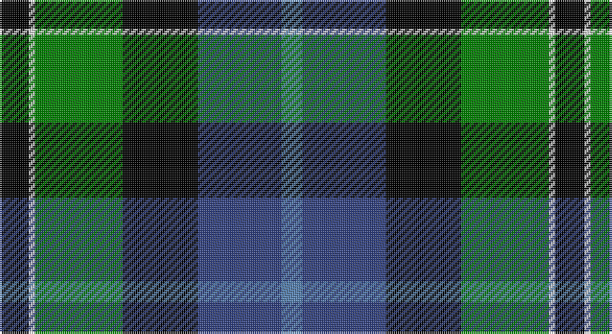

This page is one **sett** — a single exact thread-count. It belongs to the [tartan](/setts/k14w3g42k36db40t10/)
(the same proportion at any scale), whose colour order is pattern [BBKGWK](/stripes/bbkgwk/).

Sourced from weddslist.  It is a [6 stripe tartan](/stripes/stripes6/).

Original link http://www.weddslist.com/cgi-bin/tartans/pg.pl?source=sts

## Provenance

Earliest known date: 1964 Nothing

## Also known as

This cloth is also recorded under:

- New York, Firemen's Pipe Band

2 attestations — the source records this cloth was collapsed from (oldest owns this page)

<ul>
<li>undated — New York, Firemen's Pipe Band (weddslist, <a href="http://www.weddslist.com/cgi-bin/tartans/pg.pl?source=sts">record</a>)</li>
<li>undated — New York Firemen's Pipe Band Corporate Tartan (house-of-tartan, <a href="http://www.house-of-tartan.scotland.net/house/TartanViewjs.asp?colr=Def&tnam=60">record</a>)</li>
</ul>

## Thread count
K/14 LN3 G42 K36 B40 Ba/10

One full sett is **266 threads**.

## Palette

Palette: <strong>Tartan Register</strong> <small style="color:#888">(2 of 5 colours)</small>
<table><thead><tr><th>Colour</th><th>Threads</th><th>Shade</th><th>Base</th><th>OKLCh</th></tr></thead><tbody><tr><td>K/</td><td style="text-align:right;font-variant-numeric:tabular-nums">14</td><td><code style="background-color:#000000;">#000000</code> <small style="color:#888">#000000</small></td><td>K <code style="background-color:#000000;">#000000</code></td><td><small style="color:#888">oklch(0.0% 0.000 0.0)</small></td></tr><tr><td>LN</td><td style="text-align:right;font-variant-numeric:tabular-nums">3</td><td><code style="background-color:#E0E0E0;">#E0E0E0</code> <small style="color:#888">#E0E0E0</small></td><td>W <code style="background-color:#F7F7F7;">#F7F7F7</code></td><td><small style="color:#888">oklch(90.7% 0.000 89.9)</small></td></tr><tr><td>G</td><td style="text-align:right;font-variant-numeric:tabular-nums">42</td><td><code style="background-color:#008000;">#008000</code> <small style="color:#888">#008000</small></td><td>G <code style="background-color:#006100;">#006100</code></td><td><small style="color:#888">oklch(52.0% 0.177 142.5)</small></td></tr><tr><td>K</td><td style="text-align:right;font-variant-numeric:tabular-nums">36</td><td><code style="background-color:#000000;">#000000</code> <small style="color:#888">#000000</small></td><td>K <code style="background-color:#000000;">#000000</code></td><td><small style="color:#888">oklch(0.0% 0.000 0.0)</small></td></tr><tr><td>B</td><td style="text-align:right;font-variant-numeric:tabular-nums">40</td><td><code style="background-color:#304080;">#304080</code> <small style="color:#888">#304080</small></td><td>B <code style="background-color:#2A418A;">#2A418A</code></td><td><small style="color:#888">oklch(39.4% 0.109 270.2)</small></td></tr><tr><td>Ba/</td><td style="text-align:right;font-variant-numeric:tabular-nums">10</td><td><code style="background-color:#5480B0;">#5480B0</code> <small style="color:#888">#5480B0</small></td><td>B <code style="background-color:#2A418A;">#2A418A</code></td><td><small style="color:#888">oklch(58.8% 0.089 251.5)</small></td></tr></tbody></table>

# Sample pattern

## Nearest tartans

The nearest existing variants by ΔTartan distance, with this tartan at the top so the swatches line up against it.

ΔTartan

Tartan

Sett

—

<a href="/ttd/edit/#slug=k14w3g42k36db40t10">New York, Firemen's Pipe Band</a> <a class="nn-out" href="/variants/s6/k14w3g42k36db40t10/" title="open its dictionary page">↗</a>

0.55

<a href="/ttd/edit/#slug=k2g12k12r1db12w2~x2&amp;base=k14w3g42k36db40t10">Russell, or Mitchell or Hunter or Galbraith</a> <a class="nn-out" href="/variants/s6/k2g12k12r1db12w2~x2/" title="open its dictionary page">↗</a>

0.65

<a href="/ttd/edit/#slug=w1db12k12g12k5ly1~x4&amp;base=k14w3g42k36db40t10">MacNeil 5</a> <a class="nn-out" href="/variants/s6/w1db12k12g12k5ly1~x4/" title="open its dictionary page">↗</a>

0.69

<a href="/ttd/edit/#slug=k2g11ly1k8db9r2~x4&amp;base=k14w3g42k36db40t10">Forsyth</a> <a class="nn-out" href="/variants/s6/k2g11ly1k8db9r2~x4/" title="open its dictionary page">↗</a>

0.76

<a href="/ttd/edit/#slug=k2g11ly1k8b9r2~x4&amp;base=k14w3g42k36db40t10">Forsyth (1795)</a> <a class="nn-out" href="/variants/s6/k2g11ly1k8b9r2~x4/" title="open its dictionary page">↗</a>

0.83

<a href="/ttd/edit/#slug=r1g14k14r2db14t1~x2&amp;base=k14w3g42k36db40t10">Wilson's, No 221</a> <a class="nn-out" href="/variants/s6/r1g14k14r2db14t1~x2/" title="open its dictionary page">↗</a>

0.91

<a href="/ttd/edit/#slug=r2db16r1k10g12o2~x2&amp;base=k14w3g42k36db40t10">MacWilliam</a> <a class="nn-out" href="/variants/s6/r2db16r1k10g12o2~x2/" title="open its dictionary page">↗</a>

0.95

<a href="/ttd/edit/#slug=r2db23k14g16k2w2~x2&amp;base=k14w3g42k36db40t10">MacPhail, hunting</a> <a class="nn-out" href="/variants/s6/r2db23k14g16k2w2~x2/" title="open its dictionary page">↗</a>

0.95

<a href="/ttd/edit/#slug=w1db8k9g9k1ly1~x4&amp;base=k14w3g42k36db40t10">MacNeil 4</a> <a class="nn-out" href="/variants/s6/w1db8k9g9k1ly1~x4/" title="open its dictionary page">↗</a>

0.96

<a href="/ttd/edit/#slug=k4w1g13k11db11lb3~x4&amp;base=k14w3g42k36db40t10">New York Fire Department Pipe Band</a> <a class="nn-out" href="/variants/s6/k4w1g13k11db11lb3~x4/" title="open its dictionary page">↗</a>

0.99

<a href="/ttd/edit/#slug=r3k2g15k10db20ly2~x2&amp;base=k14w3g42k36db40t10">MacLeod of Assynt</a> <a class="nn-out" href="/variants/s6/r3k2g15k10db20ly2~x2/" title="open its dictionary page">↗</a>

## Neighbour map

Every grey dot is one of 14360 variants placed by the first two principal components of the ΔTartan feature space (44% of its variance). Red is this tartan; blue dots are its nearest — click one to open its page.

<svg viewBox="0 0 640 380" role="img" style="max-width:100%;height:auto;border:1px solid #e0e0e0;border-radius:4px;display:block" xmlns="http://www.w3.org/2000/svg"><image href="/nn/cloud.v1.png" width="640" height="380"/><a href="/variants/s6/k2g12k12r1db12w2~x2/"><circle cx="136.5" cy="191.5" r="4" fill="#3465a4"><title>Russell, or Mitchell or Hunter or Galbraith</title></circle></a><a href="/variants/s6/w1db12k12g12k5ly1~x4/"><circle cx="157.6" cy="199.8" r="4" fill="#3465a4"><title>MacNeil 5</title></circle></a><a href="/variants/s6/k2g11ly1k8db9r2~x4/"><circle cx="127.2" cy="198.2" r="4" fill="#3465a4"><title>Forsyth</title></circle></a><a href="/variants/s6/k2g11ly1k8b9r2~x4/"><circle cx="121.0" cy="196.3" r="4" fill="#3465a4"><title>Forsyth (1795)</title></circle></a><a href="/variants/s6/r1g14k14r2db14t1~x2/"><circle cx="141.8" cy="182.8" r="4" fill="#3465a4"><title>Wilson's, No 221</title></circle></a><a href="/variants/s6/r2db16r1k10g12o2~x2/"><circle cx="170.2" cy="180.4" r="4" fill="#3465a4"><title>MacWilliam</title></circle></a><a href="/variants/s6/r2db23k14g16k2w2~x2/"><circle cx="167.0" cy="187.3" r="4" fill="#3465a4"><title>MacPhail, hunting</title></circle></a><a href="/variants/s6/w1db8k9g9k1ly1~x4/"><circle cx="128.9" cy="197.7" r="4" fill="#3465a4"><title>MacNeil 4</title></circle></a><a href="/variants/s6/k4w1g13k11db11lb3~x4/"><circle cx="153.6" cy="210.2" r="4" fill="#3465a4"><title>New York Fire Department Pipe Band</title></circle></a><a href="/variants/s6/r3k2g15k10db20ly2~x2/"><circle cx="153.9" cy="194.2" r="4" fill="#3465a4"><title>MacLeod of Assynt</title></circle></a><circle cx="132.7" cy="199.9" r="5" fill="#c00000"/></svg>

ID: /variants/s6/k14w3g42k36db40t10/
