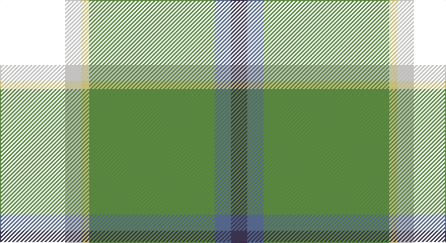

This page is one **sett** — a single exact thread-count. It belongs to the [tartan](/setts/k16w4ly2g31t4dp4/)
(the same proportion at any scale), whose colour order is pattern [BBGYWK](/stripes/bbgywk/).

Part of the [Lethcoe](/tartans/lethcoe/) tartan — the named design grouping this sett with its other cloths.

Sourced from register-of-tartans.  It is a [6 stripe tartan](/stripes/stripes6/).

Original link https://www.tartanregister.gov.uk/tartanDetails.aspx?ref=10813

## Also known as

This cloth is also recorded under:

- Morris, Tom

## Register references

External register numbers recorded for this tartan.

- Scottish Register of Tartans: [10813](https://www.tartanregister.gov.uk/tartanDetails.aspx?ref=10813)

## Thread count
T/64 W16 LY8 LG124 B16 N/16

One full sett is **408 threads**.

## Palette

Palette: <strong>Tartan Register</strong> <small style="color:#888">(3 of 5 colours)</small>
<table><thead><tr><th>Colour</th><th>Threads</th><th>Shade</th><th>Base</th><th>OKLCh</th></tr></thead><tbody><tr><td>/</td><td style="text-align:right;font-variant-numeric:tabular-nums">64</td><td><code style="background-color:;"></code> <small style="color:#888"></small></td><td> <code style="background-color:;"></code></td><td><small style="color:#888"></small></td></tr><tr><td>W</td><td style="text-align:right;font-variant-numeric:tabular-nums">16</td><td><code style="background-color:#F9F5EF;">#F9F5EF</code> <small style="color:#888">#F9F5EF</small></td><td>W <code style="background-color:#F7F7F7;">#F7F7F7</code></td><td><small style="color:#888">oklch(97.2% 0.009 78.3)</small></td></tr><tr><td>LY</td><td style="text-align:right;font-variant-numeric:tabular-nums">8</td><td><code style="background-color:#F8E38C;">#F8E38C</code> <small style="color:#888">#F8E38C</small></td><td>Y <code style="background-color:#F2BF00;">#F2BF00</code></td><td><small style="color:#888">oklch(91.4% 0.110 96.2)</small></td></tr><tr><td>LG</td><td style="text-align:right;font-variant-numeric:tabular-nums">124</td><td><code style="background-color:#649848;">#649848</code> <small style="color:#888">#649848</small></td><td>G <code style="background-color:#006100;">#006100</code></td><td><small style="color:#888">oklch(62.4% 0.125 135.7)</small></td></tr><tr><td>B</td><td style="text-align:right;font-variant-numeric:tabular-nums">16</td><td><code style="background-color:#5F749C;">#5F749C</code> <small style="color:#888">#5F749C</small></td><td>B <code style="background-color:#2A418A;">#2A418A</code></td><td><small style="color:#888">oklch(55.8% 0.067 262.9)</small></td></tr><tr><td>N/</td><td style="text-align:right;font-variant-numeric:tabular-nums">16</td><td><code style="background-color:#433A5A;">#433A5A</code> <small style="color:#888">#433A5A</small></td><td>B <code style="background-color:#2A418A;">#2A418A</code></td><td><small style="color:#888">oklch(37.2% 0.055 296.6)</small></td></tr></tbody></table>

# Sample pattern

## Nearest tartans

The nearest existing variants by ΔTartan distance, with this tartan at the top so the swatches line up against it.

ΔTartan

Tartan

Sett

—

<a href="/ttd/edit/#slug=k16w4ly2g31t4dp4~x4">Lethcoe (Thousand Oaks) (Personal)</a> <a class="nn-out" href="/variants/s6/k16w4ly2g31t4dp4~x4/" title="open its dictionary page">↗</a>

0.77

<a href="/ttd/edit/#slug=g11w11k3ly3dg36lo7~x2&amp;base=k16w4ly2g31t4dp4~x4">Driver (Name)</a> <a class="nn-out" href="/variants/s6/g11w11k3ly3dg36lo7~x2/" title="open its dictionary page">↗</a>

1.11

<a href="/ttd/edit/#slug=k3g44db27ly6r10w3~x2&amp;base=k16w4ly2g31t4dp4~x4">Official Glasgow 2014, The</a> <a class="nn-out" href="/variants/s6/k3g44db27ly6r10w3~x2/" title="open its dictionary page">↗</a>

1.11

<a href="/ttd/edit/#slug=g11w11k3ly3dg36r7~x2&amp;base=k16w4ly2g31t4dp4~x4">Driver, RC</a> <a class="nn-out" href="/variants/s6/g11w11k3ly3dg36r7~x2/" title="open its dictionary page">↗</a>

1.26

<a href="/ttd/edit/#slug=ly16lo5k8lo8k68g46w8k8r8&amp;base=k16w4ly2g31t4dp4~x4">Louth County Crest (Fashion)</a> <a class="nn-out" href="/variants/s9/ly16lo5k8lo8k68g46w8k8r8/" title="open its dictionary page">↗</a>

1.30

<a href="/ttd/edit/#slug=w8k16g32dt3lo5w5~x2&amp;base=k16w4ly2g31t4dp4~x4">Mellor (Name)</a> <a class="nn-out" href="/variants/s6/w8k16g32dt3lo5w5~x2/" title="open its dictionary page">↗</a>

1.36

<a href="/ttd/edit/#slug=g5ly1r2g25k14db19w4g2~x2&amp;base=k16w4ly2g31t4dp4~x4">Tooth</a> <a class="nn-out" href="/variants/s8/g5ly1r2g25k14db19w4g2~x2/" title="open its dictionary page">↗</a>

1.36

<a href="/ttd/edit/#slug=t6db17p4db2k11g33ly4~x2&amp;base=k16w4ly2g31t4dp4~x4">East Lothian</a> <a class="nn-out" href="/variants/s7/t6db17p4db2k11g33ly4~x2/" title="open its dictionary page">↗</a>

1.42

<a href="/ttd/edit/#slug=o5dt30w3dg15ly8r4~x2&amp;base=k16w4ly2g31t4dp4~x4">Carleton College Rugby</a> <a class="nn-out" href="/variants/s6/o5dt30w3dg15ly8r4~x2/" title="open its dictionary page">↗</a>

1.43

<a href="/ttd/edit/#slug=b2lb1b2k16g20k14r2w2ly2~x2&amp;base=k16w4ly2g31t4dp4~x4">Brooke</a> <a class="nn-out" href="/variants/s9/b2lb1b2k16g20k14r2w2ly2~x2/" title="open its dictionary page">↗</a>

1.47

<a href="/ttd/edit/#slug=lr2dg17w6b5r1~x4&amp;base=k16w4ly2g31t4dp4~x4">Scotstown</a> <a class="nn-out" href="/variants/s5/lr2dg17w6b5r1~x4/" title="open its dictionary page">↗</a>

## Neighbour map

Every grey dot is one of 14360 variants placed by the first two principal components of the ΔTartan feature space (44% of its variance). Red is this tartan; blue dots are its nearest — click one to open its page.

<svg viewBox="0 0 640 380" role="img" style="max-width:100%;height:auto;border:1px solid #e0e0e0;border-radius:4px;display:block" xmlns="http://www.w3.org/2000/svg"><image href="/nn/cloud.v1.png" width="640" height="380"/><a href="/variants/s6/g11w11k3ly3dg36lo7~x2/"><circle cx="201.4" cy="155.5" r="4" fill="#3465a4"><title>Driver (Name)</title></circle></a><a href="/variants/s6/k3g44db27ly6r10w3~x2/"><circle cx="191.1" cy="141.3" r="4" fill="#3465a4"><title>Official Glasgow 2014, The</title></circle></a><a href="/variants/s6/g11w11k3ly3dg36r7~x2/"><circle cx="193.7" cy="150.8" r="4" fill="#3465a4"><title>Driver, RC</title></circle></a><a href="/variants/s9/ly16lo5k8lo8k68g46w8k8r8/"><circle cx="197.5" cy="124.9" r="4" fill="#3465a4"><title>Louth County Crest (Fashion)</title></circle></a><a href="/variants/s6/w8k16g32dt3lo5w5~x2/"><circle cx="186.7" cy="179.4" r="4" fill="#3465a4"><title>Mellor (Name)</title></circle></a><a href="/variants/s8/g5ly1r2g25k14db19w4g2~x2/"><circle cx="193.9" cy="121.3" r="4" fill="#3465a4"><title>Tooth</title></circle></a><a href="/variants/s7/t6db17p4db2k11g33ly4~x2/"><circle cx="170.3" cy="145.3" r="4" fill="#3465a4"><title>East Lothian</title></circle></a><a href="/variants/s6/o5dt30w3dg15ly8r4~x2/"><circle cx="171.4" cy="168.8" r="4" fill="#3465a4"><title>Carleton College Rugby</title></circle></a><a href="/variants/s9/b2lb1b2k16g20k14r2w2ly2~x2/"><circle cx="206.7" cy="100.5" r="4" fill="#3465a4"><title>Brooke</title></circle></a><a href="/variants/s5/lr2dg17w6b5r1~x4/"><circle cx="256.0" cy="165.5" r="4" fill="#3465a4"><title>Scotstown</title></circle></a><circle cx="207.2" cy="134.0" r="5" fill="#c00000"/></svg>

ID: /variants/s6/k16w4ly2g31t4dp4~x4/
