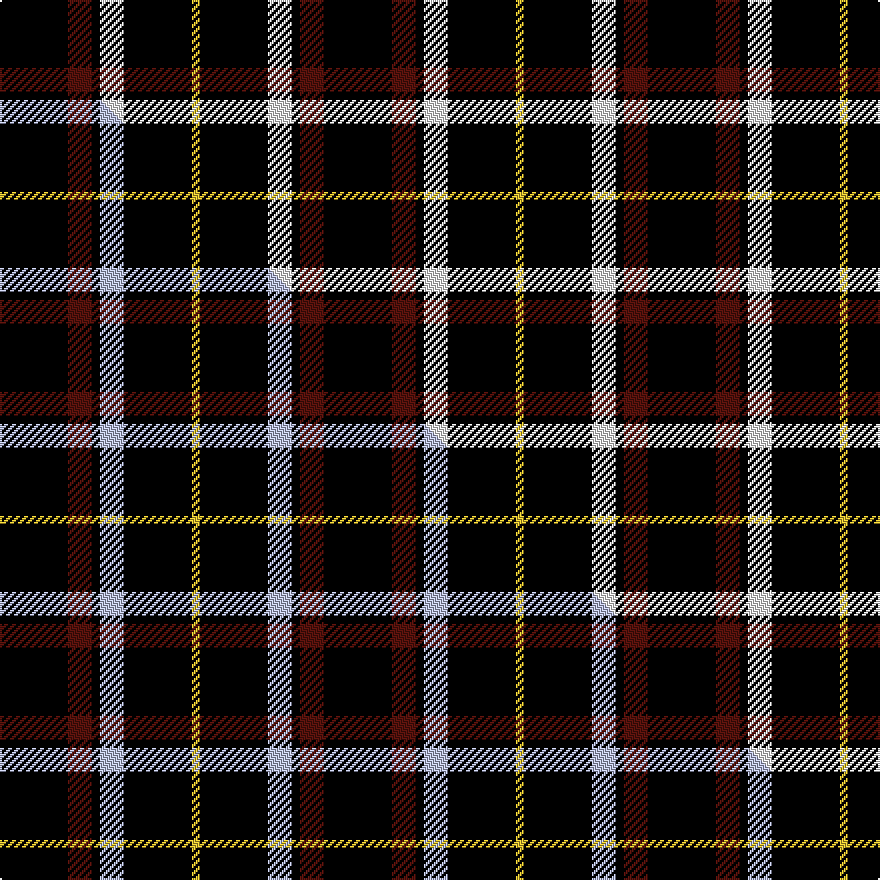

This page is one **sett** — a single exact thread-count. It belongs to the [tartan](/setts/k17dr6k2w6k17ly2/)
(the same proportion at any scale), whose colour order is pattern [KBKWKY](/stripes/kbkwky/).

Part of the [Black](/tartans/black/) tartan — the named design grouping this sett with its other cloths.

Sourced from tartans-authority.  It is a [6 stripe tartan](/stripes/stripes6/).

Original link [https://www.tartanregister.gov.uk/tartanDetails.aspx?ref=7630](https://www.tartanregister.gov.uk/tartanDetails.aspx?ref=7630)

2 attestations — the source records this cloth was collapsed from (oldest owns this page)

<ul>
<li>pre 1945 — Black 1990 (Name) (tartans-authority, <a href="https://www.tartanregister.gov.uk/tartanDetails.aspx?ref=7630">record</a>)  <em>Asymmetric. In 1990, taken to a TECA stand at one of the US Highland Games by a Timothy Wood, who explained that his father had 'found' it in a shop in northern England during World War II. 'Tartans' by Johnston & Smith which shows the correct asymmetric threadcount as seen here. 3693 is an incorrect symmetrical version woven in 2003 by D C Dalgliesh of Selkirk.</em></li>
<li>01/01/1990 — Black (asymmetric) (register-of-tartans, <a href="https://www.tartanregister.gov.uk/tartanDetails.aspx?ref=5648">record</a>)  <em>In 1990, taken to a Tartan Education and Cultural Association stand at one of the US Highland Games by a Timothy Wood, who explained that his father had 'found' it in a shop in northern England during World War II. Appears in 'Tartans' by Johnston & Smith, which shows the correct asymmetric threadcount as seen here. Scottish Tartan Register #269 is an incorrect symmetrical version woven in 2003 by DC Dalgliesh Ltd of Selkirk.</em></li>
</ul>

Dataset <small>— provenance for this record, inherited from the source manifest</small>

<dl class="dataset-prov">
<dt>source</dt><dd><a href="/sources/tartans-authority/">Scottish Tartans Authority</a></dd>
<dt>data captured from</dt><dd><a href="https://github.com/thetartan/tartan-database/blob/master/data/tartans-authority/data.csv">https://github.com/thetartan/tartan-database/blob/master/data/tartans-authority/data.csv</a></dd>
<dt>data date</dt><dd>pre 1945 <small>(this record)</small></dd>
<dt>licence</dt><dd><a href="https://creativecommons.org/licenses/by-nc-nd/4.0/">CC BY-NC-ND 4.0</a></dd>
</dl>

Capture chain <small>— the hands this data passed through, oldest first; each capture carries its own licence</small>

<ol class="capture-chain">
<li><a href="https://www.tartansauthority.com/">Scottish Tartans Authority</a> <small>the heritage body's archive — its tartan-ferret record browser is retired (links repaired to the SRT, above)</small></li>
<li><a href="https://github.com/thetartan/tartan-database">thetartan/tartan-database</a> <small>2016-2017</small> · <a href="https://creativecommons.org/licenses/by-nc-nd/4.0/">CC BY-NC-ND 4.0</a> <small>Levko Kravets's frozen compilation — the capture we vendored, and where its CC licence text came from</small></li>
<li>this dictionary <small>captured 2026-06-10 · commit 5bf86c7566</small> <small>each re-capture is a git commit to data/sources</small></li>
</ol>

## Register references

External register numbers recorded for this tartan.

- Scottish Register of Tartans: [5648](https://www.tartanregister.gov.uk/tartanDetails.aspx?ref=5648)
- Scottish Tartans Authority (ITI): 7630

## Thread count
K/34 DR12 K4 W12 K34 LY/4

One full sett is **162 threads**.

## Palette
<table><thead><tr><th>Colour</th><th>Shade</th><th>OKLCh</th></tr></thead><tbody><tr><td>DR</td><td><code style="background-color:#55120C;">#55120C</code> <small style="color:#888">#55120C</small></td><td><small style="color:#888">oklch(30.0% 0.099 29.3)</small></td></tr><tr><td>LY</td><td><code style="background-color:#DCBC32;">#DCBC32</code> <small style="color:#888">#DCBC32</small></td><td><small style="color:#888">oklch(80.0% 0.150 95.2)</small></td></tr><tr><td>K</td><td><code style="background-color:#000000;">#000000</code> <small style="color:#888">#000000</small></td><td><small style="color:#888">oklch(0.0% 0.000 0.0)</small></td></tr><tr><td>W</td><td><code style="background-color:#F7F7F7;">#F7F7F7</code> <small style="color:#888">#F7F7F7</small></td><td><small style="color:#888">oklch(97.6% 0.000 89.9)</small></td></tr></tbody></table>

# Sample pattern

## Compared to the master

This cloth is one sett of its design; the master sett (the exemplar the design is anchored on) is below for comparison.

Its **ΔTartan distance** from the master is **0.30** — the same measure the nearest-tartans table ranks by (0 is identical; a re-scale of the same cloth is near 0, a recolour or a different proportion further).

<figure class="master-compare" style="margin:0">

this sett
master sett ★

<figcaption style="color:#888;font-size:smaller">One weave of this sett against the <a href="/setts/k17dr6k2lb6k17ly2/">master sett ★</a>, split on the diagonal: a shared proportion runs seamlessly across it with only the shades shifting; a different proportion breaks on it.</figcaption>
</figure>

## Nearest tartan variants

The nearest existing variants by ΔTartan distance, with this cloth at the top so the swatches line up against it.

ΔTartan

Threads

Variant

Sett

—

162

<a href="/variants/s6/k17dr6k2w6k17ly2~x2/">Black 1990 (Name)</a>

<a href="/ttd/edit/#slug=k17dr6k2lb6k17ly2~x2&amp;base=k17dr6k2w6k17ly2~x2" title="compare in the TTD">0.30</a>

162

<a href="/variants/s6/k17dr6k2lb6k17ly2~x2/">Black (symmetrical)</a>

<a href="/ttd/edit/#slug=k17dr6k2lb6k17lo2~x2&amp;base=k17dr6k2w6k17ly2~x2" title="compare in the TTD">0.60</a>

162

<a href="/variants/s6/k17dr6k2lb6k17lo2~x2/">Black Clan/Family Tartan</a>

<a href="/ttd/edit/#slug=w5k3y6k5w3k30y2~x2&amp;base=k17dr6k2w6k17ly2~x2" title="compare in the TTD">1.12</a>

202

<a href="/variants/s7/w5k3y6k5w3k30y2~x2/">Northern Kentucky University</a>

<a href="/ttd/edit/#slug=n3k31w6k7n3k12w2~x2&amp;base=k17dr6k2w6k17ly2~x2" title="compare in the TTD">1.36</a>

246

<a href="/variants/s7/n3k31w6k7n3k12w2~x2/">Believe - Colette</a>

<a href="/ttd/edit/#slug=n3k31w6k8n3k12w2~x2&amp;base=k17dr6k2w6k17ly2~x2" title="compare in the TTD">1.37</a>

250

<a href="/variants/s7/n3k31w6k8n3k12w2~x2/">Believe - Colette</a>

<a href="/ttd/edit/#slug=k2r4k7ri1k1~x2~r1506028-ri2008029&amp;base=k17dr6k2w6k17ly2~x2" title="compare in the TTD">1.39</a>

54

<a href="/variants/s5/k2r4k7ri1k1~x2~r1506028-ri2008029/">Romsdal, Tresfjord</a>

<a href="/ttd/edit/#slug=k5r1y1k1y1r1k8db1w1~x6&amp;base=k17dr6k2w6k17ly2~x2" title="compare in the TTD">1.48</a>

204

<a href="/variants/s9/k5r1y1k1y1r1k8db1w1~x6/">Muylle, Jelle (Personal)</a>

<a href="/ttd/edit/#slug=k30r10y1k8w3~x4&amp;base=k17dr6k2w6k17ly2~x2" title="compare in the TTD">1.62</a>

284

<a href="/variants/s5/k30r10y1k8w3~x4/">Union Fire Club Pipes and Drums</a>

<a href="/ttd/edit/#slug=k11w1k1w1k4n8r1~x8&amp;base=k17dr6k2w6k17ly2~x2" title="compare in the TTD">1.64</a>

336

<a href="/variants/s7/k11w1k1w1k4n8r1~x8/">Dunfermline Athletic (2008) (Corp)</a>

<a href="/ttd/edit/#slug=k16t2k8r3lr3r3k8~x2&amp;base=k17dr6k2w6k17ly2~x2" title="compare in the TTD">1.64</a>

124

<a href="/variants/s7/k16t2k8r3lr3r3k8~x2/">Benson (New England)</a>

## Neighbour map

Every grey dot is one of 13621 variants placed by the first two principal components of the ΔTartan feature space (42% of its variance). Red is this tartan; blue dots are its nearest — click one to open its page.

<svg viewBox="0 0 640 380" role="img" style="max-width:100%;height:auto;border:1px solid #e0e0e0;border-radius:4px;display:block" xmlns="http://www.w3.org/2000/svg"><image href="/nn/cloud.v1.png" width="640" height="380"/><a href="/variants/s6/k17dr6k2lb6k17ly2~x2/"><circle cx="336.9" cy="194.1" r="4" fill="#3465a4"><title>Black (symmetrical)</title></circle></a><a href="/variants/s6/k17dr6k2lb6k17lo2~x2/"><circle cx="337.7" cy="193.9" r="4" fill="#3465a4"><title>Black Clan/Family Tartan</title></circle></a><a href="/variants/s7/w5k3y6k5w3k30y2~x2/"><circle cx="368.0" cy="144.4" r="4" fill="#3465a4"><title>Northern Kentucky University</title></circle></a><a href="/variants/s7/n3k31w6k7n3k12w2~x2/"><circle cx="425.2" cy="154.9" r="4" fill="#3465a4"><title>Believe - Colette</title></circle></a><a href="/variants/s7/n3k31w6k8n3k12w2~x2/"><circle cx="427.0" cy="156.2" r="4" fill="#3465a4"><title>Believe - Colette</title></circle></a><a href="/variants/s5/k2r4k7ri1k1~x2~r1506028-ri2008029/"><circle cx="355.9" cy="223.9" r="4" fill="#3465a4"><title>Romsdal, Tresfjord</title></circle></a><a href="/variants/s9/k5r1y1k1y1r1k8db1w1~x6/"><circle cx="305.4" cy="137.5" r="4" fill="#3465a4"><title>Muylle, Jelle (Personal)</title></circle></a><a href="/variants/s5/k30r10y1k8w3~x4/"><circle cx="400.3" cy="127.9" r="4" fill="#3465a4"><title>Union Fire Club Pipes and Drums</title></circle></a><a href="/variants/s7/k11w1k1w1k4n8r1~x8/"><circle cx="272.6" cy="159.3" r="4" fill="#3465a4"><title>Dunfermline Athletic (2008) (Corp)</title></circle></a><a href="/variants/s7/k16t2k8r3lr3r3k8~x2/"><circle cx="342.9" cy="182.3" r="4" fill="#3465a4"><title>Benson (New England)</title></circle></a><circle cx="328.2" cy="191.8" r="5" fill="#c00000"/><text x="320" y="376" text-anchor="middle" font-size="11" fill="#999">ground</text><text x="11" y="190" text-anchor="middle" font-size="11" fill="#999" transform="rotate(-90 11 190)">complexity</text></svg>

ID: /variants/s6/k17dr6k2w6k17ly2~x2/
