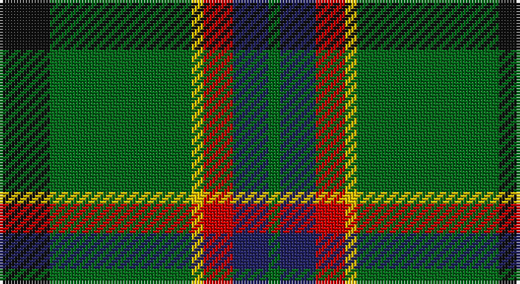

This page is one **sett** — a single exact thread-count. It belongs to the [tartan](/setts/k17g48ly4r10db12g4/)
(the same proportion at any scale), whose colour order is pattern [GBRYGK](/stripes/gbrygk/).

Sourced from tartans-authority.  It is a [6 stripe tartan](/stripes/stripes6/).

Original link http://www.tartansauthority.com/tartan-ferret/display/10866/

## Register references

External register numbers recorded for this tartan.

- Scottish Register of Tartans: [10866](https://www.tartanregister.gov.uk/tartanDetails?ref=10866)
- Scottish Tartans Authority (ITI): 10866

## Thread count
K/17 G48 Y4 R10 DB12 G/4

One full sett is **169 threads**.

## Palette

Palette: <strong>Tartan Register</strong>
<table><thead><tr><th>Colour</th><th>Threads</th><th>Shade</th><th>Base</th><th>OKLCh</th></tr></thead><tbody><tr><td>K/</td><td style="text-align:right;font-variant-numeric:tabular-nums">17</td><td><code style="background-color:#101010;">#101010</code> <small style="color:#888">#101010</small></td><td>K <code style="background-color:#000000;">#000000</code></td><td><small style="color:#888">oklch(17.3% 0.000 89.9)</small></td></tr><tr><td>G</td><td style="text-align:right;font-variant-numeric:tabular-nums">48</td><td><code style="background-color:#006818;">#006818</code> <small style="color:#888">#006818</small></td><td>G <code style="background-color:#006100;">#006100</code></td><td><small style="color:#888">oklch(45.0% 0.142 145.0)</small></td></tr><tr><td>Y</td><td style="text-align:right;font-variant-numeric:tabular-nums">4</td><td><code style="background-color:#E8C000;">#E8C000</code> <small style="color:#888">#E8C000</small></td><td>Y <code style="background-color:#F2BF00;">#F2BF00</code></td><td><small style="color:#888">oklch(81.9% 0.168 93.7)</small></td></tr><tr><td>R</td><td style="text-align:right;font-variant-numeric:tabular-nums">10</td><td><code style="background-color:#C80000;">#C80000</code> <small style="color:#888">#C80000</small></td><td>R <code style="background-color:#CC0000;">#CC0000</code></td><td><small style="color:#888">oklch(52.3% 0.215 29.2)</small></td></tr><tr><td>DB</td><td style="text-align:right;font-variant-numeric:tabular-nums">12</td><td><code style="background-color:#202060;">#202060</code> <small style="color:#888">#202060</small></td><td>B <code style="background-color:#2A418A;">#2A418A</code></td><td><small style="color:#888">oklch(28.9% 0.111 276.9)</small></td></tr><tr><td>G/</td><td style="text-align:right;font-variant-numeric:tabular-nums">4</td><td><code style="background-color:#006818;">#006818</code> <small style="color:#888">#006818</small></td><td>G <code style="background-color:#006100;">#006100</code></td><td><small style="color:#888">oklch(45.0% 0.142 145.0)</small></td></tr></tbody></table>

# Sample pattern

## Nearest tartans

The nearest existing variants by ΔTartan distance, with this tartan at the top so the swatches line up against it.

ΔTartan

Tartan

Sett

—

<a href="/ttd/edit/#slug=k17g48ly4r10db12g4">Asheville Firefighters, The</a> <a class="nn-out" href="/variants/s6/k17g48ly4r10db12g4/" title="open its dictionary page">↗</a>

0.82

<a href="/ttd/edit/#slug=g13dp1g1dp1g3db5k4ly2~x2&amp;base=k17g48ly4r10db12g4">Carrick Hunting District Tartan</a> <a class="nn-out" href="/variants/s8/g13dp1g1dp1g3db5k4ly2~x2/" title="open its dictionary page">↗</a>

1.01

<a href="/ttd/edit/#slug=gi9g1p2g1db4r1~x12&amp;base=k17g48ly4r10db12g4">Gorman, George (Personal)</a> <a class="nn-out" href="/variants/s6/gi9g1p2g1db4r1~x12/" title="open its dictionary page">↗</a>

1.02

<a href="/ttd/edit/#slug=k17dg48ly4r10lb12dg4&amp;base=k17g48ly4r10db12g4">Asheville Firefighters, The</a> <a class="nn-out" href="/variants/s6/k17dg48ly4r10lb12dg4/" title="open its dictionary page">↗</a>

1.05

<a href="/ttd/edit/#slug=g15ly2k30g32r3w2~x2&amp;base=k17g48ly4r10db12g4">Merwe</a> <a class="nn-out" href="/variants/s6/g15ly2k30g32r3w2~x2/" title="open its dictionary page">↗</a>

1.06

<a href="/ttd/edit/#slug=r3g32k4g4k11db3k7r4lb3&amp;base=k17g48ly4r10db12g4">Wardrope (Personal)</a> <a class="nn-out" href="/variants/s9/r3g32k4g4k11db3k7r4lb3/" title="open its dictionary page">↗</a>

1.07

<a href="/ttd/edit/#slug=r17db7lo8g58k6~x2&amp;base=k17g48ly4r10db12g4">St Johns County Sheriff Office (Cor)</a> <a class="nn-out" href="/variants/s5/r17db7lo8g58k6~x2/" title="open its dictionary page">↗</a>

1.12

<a href="/ttd/edit/#slug=g26db3g12k10dp15w2~x2&amp;base=k17g48ly4r10db12g4">Lossiemouth/Hersbruck</a> <a class="nn-out" href="/variants/s6/g26db3g12k10dp15w2~x2/" title="open its dictionary page">↗</a>

1.15

<a href="/ttd/edit/#slug=dg62g17ly12t8o8~x2&amp;base=k17g48ly4r10db12g4">Dundhuin Hunting (Personal)</a> <a class="nn-out" href="/variants/s5/dg62g17ly12t8o8~x2/" title="open its dictionary page">↗</a>

1.15

<a href="/ttd/edit/#slug=dg3w1dg12r6dg3k3g2~x4&amp;base=k17g48ly4r10db12g4">Arkansas</a> <a class="nn-out" href="/variants/s7/dg3w1dg12r6dg3k3g2~x4/" title="open its dictionary page">↗</a>

1.15

<a href="/ttd/edit/#slug=dgi20dg11lb6r2dp3lb1~x2&amp;base=k17g48ly4r10db12g4">Chiti, Cristiano (Personal)</a> <a class="nn-out" href="/variants/s6/dgi20dg11lb6r2dp3lb1~x2/" title="open its dictionary page">↗</a>

## Neighbour map

Every grey dot is one of 14360 variants placed by the first two principal components of the ΔTartan feature space (44% of its variance). Red is this tartan; blue dots are its nearest — click one to open its page.

<svg viewBox="0 0 640 380" role="img" style="max-width:100%;height:auto;border:1px solid #e0e0e0;border-radius:4px;display:block" xmlns="http://www.w3.org/2000/svg"><image href="/nn/cloud.v1.png" width="640" height="380"/><a href="/variants/s8/g13dp1g1dp1g3db5k4ly2~x2/"><circle cx="288.9" cy="173.7" r="4" fill="#3465a4"><title>Carrick Hunting District Tartan</title></circle></a><a href="/variants/s6/gi9g1p2g1db4r1~x12/"><circle cx="246.8" cy="203.5" r="4" fill="#3465a4"><title>Gorman, George (Personal)</title></circle></a><a href="/variants/s6/k17dg48ly4r10lb12dg4/"><circle cx="261.5" cy="178.8" r="4" fill="#3465a4"><title>Asheville Firefighters, The</title></circle></a><a href="/variants/s6/g15ly2k30g32r3w2~x2/"><circle cx="312.6" cy="185.1" r="4" fill="#3465a4"><title>Merwe</title></circle></a><a href="/variants/s9/r3g32k4g4k11db3k7r4lb3/"><circle cx="268.3" cy="168.5" r="4" fill="#3465a4"><title>Wardrope (Personal)</title></circle></a><a href="/variants/s5/r17db7lo8g58k6~x2/"><circle cx="325.0" cy="200.8" r="4" fill="#3465a4"><title>St Johns County Sheriff Office (Cor)</title></circle></a><a href="/variants/s6/g26db3g12k10dp15w2~x2/"><circle cx="275.1" cy="208.3" r="4" fill="#3465a4"><title>Lossiemouth/Hersbruck</title></circle></a><a href="/variants/s5/dg62g17ly12t8o8~x2/"><circle cx="268.7" cy="200.5" r="4" fill="#3465a4"><title>Dundhuin Hunting (Personal)</title></circle></a><a href="/variants/s7/dg3w1dg12r6dg3k3g2~x4/"><circle cx="294.3" cy="191.2" r="4" fill="#3465a4"><title>Arkansas</title></circle></a><a href="/variants/s6/dgi20dg11lb6r2dp3lb1~x2/"><circle cx="244.7" cy="170.4" r="4" fill="#3465a4"><title>Chiti, Cristiano (Personal)</title></circle></a><circle cx="278.3" cy="190.3" r="5" fill="#c00000"/></svg>

ID: /variants/s6/k17g48ly4r10db12g4/
