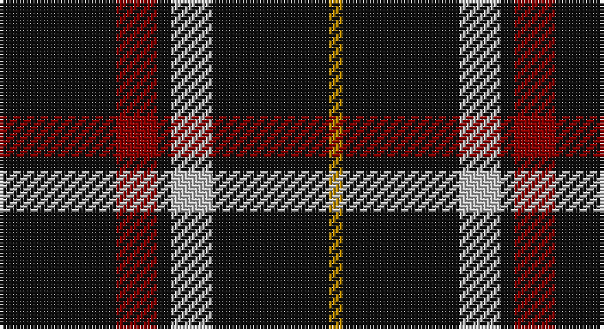

This page is one **sett** — a single exact thread-count. It belongs to the [tartan](/setts/k17r6k2lb6k17lo2/)
(the same proportion at any scale), whose colour order is pattern [KRKWKY](/stripes/krkwky/).

Part of the [Black](/tartans/black/) tartan — the named design grouping this sett with its other cloths.

Sourced from register-of-tartans.  It is a [6 stripe tartan](/stripes/stripes6/).

Original link https://www.tartanregister.gov.uk/tartanDetails.aspx?ref=269

## Provenance

Earliest known date: pre 1945 In 1990, taken to a TECA stand at one of the US Highland Games by a Timothy Wood, who explained that his faher had 'found' it in a shop in northern England during World War II.

## Also known as

This cloth is also recorded under:

- Black 1990
- Black Clan/Family

2 attestations — the source records this cloth was collapsed from (oldest owns this page)

<ul>
<li>01/01/2003 — Black (symmetrical) (register-of-tartans, <a href="https://www.tartanregister.gov.uk/tartanDetails.aspx?ref=269">record</a>)</li>
<li>undated — Black Clan/Family Tartan (house-of-tartan, <a href="http://www.house-of-tartan.scotland.net/house/TartanViewjs.asp?colr=Def&tnam=2761">record</a>)</li>
</ul>

## Register references

External register numbers recorded for this tartan.

- Scottish Register of Tartans: [269](https://www.tartanregister.gov.uk/tartanDetails.aspx?ref=269)
- Scottish Tartans Authority (ITI): 3693
- Scottish Tartans World Register: 2671

## Thread count
K/34 DR12 K4 N12 K34 DY/4

One full sett is **162 threads**.

## Palette

Palette: <strong>Tartan Register</strong>
<table><thead><tr><th>Colour</th><th>Threads</th><th>Shade</th><th>Base</th><th>OKLCh</th></tr></thead><tbody><tr><td>K/</td><td style="text-align:right;font-variant-numeric:tabular-nums">34</td><td><code style="background-color:#101010;">#101010</code> <small style="color:#888">#101010</small></td><td>K <code style="background-color:#000000;">#000000</code></td><td><small style="color:#888">oklch(17.3% 0.000 89.9)</small></td></tr><tr><td>DR</td><td style="text-align:right;font-variant-numeric:tabular-nums">12</td><td><code style="background-color:#880000;">#880000</code> <small style="color:#888">#880000</small></td><td>R <code style="background-color:#CC0000;">#CC0000</code></td><td><small style="color:#888">oklch(39.4% 0.162 29.2)</small></td></tr><tr><td>K</td><td style="text-align:right;font-variant-numeric:tabular-nums">4</td><td><code style="background-color:#101010;">#101010</code> <small style="color:#888">#101010</small></td><td>K <code style="background-color:#000000;">#000000</code></td><td><small style="color:#888">oklch(17.3% 0.000 89.9)</small></td></tr><tr><td>N</td><td style="text-align:right;font-variant-numeric:tabular-nums">12</td><td><code style="background-color:#C0C0C0;">#C0C0C0</code> <small style="color:#888">#C0C0C0</small></td><td>W <code style="background-color:#F7F7F7;">#F7F7F7</code></td><td><small style="color:#888">oklch(80.8% 0.000 89.9)</small></td></tr><tr><td>K</td><td style="text-align:right;font-variant-numeric:tabular-nums">34</td><td><code style="background-color:#101010;">#101010</code> <small style="color:#888">#101010</small></td><td>K <code style="background-color:#000000;">#000000</code></td><td><small style="color:#888">oklch(17.3% 0.000 89.9)</small></td></tr><tr><td>DY/</td><td style="text-align:right;font-variant-numeric:tabular-nums">4</td><td><code style="background-color:#BC8C00;">#BC8C00</code> <small style="color:#888">#BC8C00</small></td><td>Y <code style="background-color:#F2BF00;">#F2BF00</code></td><td><small style="color:#888">oklch(66.8% 0.137 84.1)</small></td></tr></tbody></table>

# Sample pattern

## Nearest tartans

The nearest existing variants by ΔTartan distance, with this tartan at the top so the swatches line up against it.

ΔTartan

Tartan

Sett

—

<a href="/ttd/edit/#slug=k17r6k2lb6k17lo2~x2">Black (symmetrical)</a> <a class="nn-out" href="/variants/s6/k17r6k2lb6k17lo2~x2/" title="open its dictionary page">↗</a>

0.33

<a href="/ttd/edit/#slug=k17r6k2w6k17lo2~x2&amp;base=k17r6k2lb6k17lo2~x2">Black 1990 (Name)</a> <a class="nn-out" href="/variants/s6/k17r6k2w6k17lo2~x2/" title="open its dictionary page">↗</a>

0.58

<a href="/ttd/edit/#slug=k16b2k8r3lr3r3k8~x2&amp;base=k17r6k2lb6k17lo2~x2">Benson (New England)</a> <a class="nn-out" href="/variants/s7/k16b2k8r3lr3r3k8~x2/" title="open its dictionary page">↗</a>

1.18

<a href="/variants/s6/r3lo2k10w1~x6/">St. Eloi</a>

1.19

<a href="/ttd/edit/#slug=k21lb2k4lb4do2lb4k13g2~x4&amp;base=k17r6k2lb6k17lo2~x2">Anzac (Fashion)</a> <a class="nn-out" href="/variants/s8/k21lb2k4lb4do2lb4k13g2~x4/" title="open its dictionary page">↗</a>

1.20

<a href="/ttd/edit/#slug=k8t3k32b14w3k25t3~x2&amp;base=k17r6k2lb6k17lo2~x2">Cowe (Personal)</a> <a class="nn-out" href="/variants/s7/k8t3k32b14w3k25t3~x2/" title="open its dictionary page">↗</a>

1.31

<a href="/ttd/edit/#slug=k14r2k4lb3k12r8k1~x2&amp;base=k17r6k2lb6k17lo2~x2">Punky Princess (Fashion)</a> <a class="nn-out" href="/variants/s7/k14r2k4lb3k12r8k1~x2/" title="open its dictionary page">↗</a>

1.34

<a href="/ttd/edit/#slug=db1k4r1k1ly1k4db1~x6&amp;base=k17r6k2lb6k17lo2~x2">Justus Family Tartan</a> <a class="nn-out" href="/variants/s7/db1k4r1k1ly1k4db1~x6/" title="open its dictionary page">↗</a>

1.36

<a href="/ttd/edit/#slug=r1k10n2lb5k5r1~x4&amp;base=k17r6k2lb6k17lo2~x2">Callaway (Corporate)</a> <a class="nn-out" href="/variants/s6/r1k10n2lb5k5r1~x4/" title="open its dictionary page">↗</a>

1.37

<a href="/ttd/edit/#slug=k18t9k18lb2k2lb2k18lr9k18lb2&amp;base=k17r6k2lb6k17lo2~x2">London Fog Black 2 (fashion)</a> <a class="nn-out" href="/variants/s10/k18t9k18lb2k2lb2k18lr9k18lb2/" title="open its dictionary page">↗</a>

1.43

<a href="/ttd/edit/#slug=k21w2k5w9k13g2~x4&amp;base=k17r6k2lb6k17lo2~x2">New Zealand District Tartan</a> <a class="nn-out" href="/variants/s6/k21w2k5w9k13g2~x4/" title="open its dictionary page">↗</a>

## Neighbour map

Every grey dot is one of 14360 variants placed by the first two principal components of the ΔTartan feature space (44% of its variance). Red is this tartan; blue dots are its nearest — click one to open its page.

<svg viewBox="0 0 640 380" role="img" style="max-width:100%;height:auto;border:1px solid #e0e0e0;border-radius:4px;display:block" xmlns="http://www.w3.org/2000/svg"><image href="/nn/cloud.v1.png" width="640" height="380"/><a href="/variants/s6/k17r6k2w6k17lo2~x2/"><circle cx="371.2" cy="223.5" r="4" fill="#3465a4"><title>Black 1990 (Name)</title></circle></a><a href="/variants/s7/k16b2k8r3lr3r3k8~x2/"><circle cx="402.8" cy="229.1" r="4" fill="#3465a4"><title>Benson (New England)</title></circle></a><a href="/variants/s6/r3lo2k10w1~x6/"><circle cx="376.0" cy="216.7" r="4" fill="#3465a4"><title>St. Eloi</title></circle></a><a href="/variants/s8/k21lb2k4lb4do2lb4k13g2~x4/"><circle cx="402.0" cy="189.4" r="4" fill="#3465a4"><title>Anzac (Fashion)</title></circle></a><a href="/variants/s7/k8t3k32b14w3k25t3~x2/"><circle cx="411.9" cy="213.6" r="4" fill="#3465a4"><title>Cowe (Personal)</title></circle></a><a href="/variants/s7/k14r2k4lb3k12r8k1~x2/"><circle cx="398.0" cy="211.4" r="4" fill="#3465a4"><title>Punky Princess (Fashion)</title></circle></a><a href="/variants/s7/db1k4r1k1ly1k4db1~x6/"><circle cx="335.4" cy="257.0" r="4" fill="#3465a4"><title>Justus Family Tartan</title></circle></a><a href="/variants/s6/r1k10n2lb5k5r1~x4/"><circle cx="308.7" cy="209.9" r="4" fill="#3465a4"><title>Callaway (Corporate)</title></circle></a><a href="/variants/s10/k18t9k18lb2k2lb2k18lr9k18lb2/"><circle cx="383.0" cy="207.3" r="4" fill="#3465a4"><title>London Fog Black 2 (fashion)</title></circle></a><a href="/variants/s6/k21w2k5w9k13g2~x4/"><circle cx="414.8" cy="228.2" r="4" fill="#3465a4"><title>New Zealand District Tartan</title></circle></a><circle cx="380.7" cy="228.4" r="5" fill="#c00000"/></svg>

ID: /variants/s6/k17r6k2lb6k17lo2~x2/
