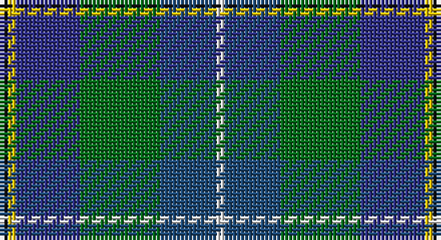

This page is one **sett** — a single exact thread-count. It belongs to the [tartan](/setts/k1ly1db8g10dbi7w1/)
(the same proportion at any scale), whose colour order is pattern [KYBGBW](/stripes/kybgbw/).

Part of the [Porteous](/tartans/porteous/) tartan — the named design grouping this sett with its other cloths.

Sourced from house-of-tartan.  It is a [6 stripe tartan](/stripes/stripes6/).

Original link http://www.house-of-tartan.scotland.net/house/TartanViewjs.asp?colr=Def&tnam=1264

## Provenance

Earliest known date: 1978 Designed for the Porteous Family Association, and submitted to the Monitoring Committee of the Scottish Tartan Society by Captain Barry Porteous who was president of the association at that time.

## Thread count
K/2 Y2 DB16 G20 B14 LN/2

One full sett is **108 threads**.

## Palette

Palette: <strong>Tartan Register</strong> <small style="color:#888">(5 of 6 colours)</small>
<table><thead><tr><th>Colour</th><th>Threads</th><th>Shade</th><th>Base</th><th>OKLCh</th></tr></thead><tbody><tr><td>K/</td><td style="text-align:right;font-variant-numeric:tabular-nums">2</td><td><code style="background-color:#101010;">#101010</code> <small style="color:#888">#101010</small></td><td>K <code style="background-color:#000000;">#000000</code></td><td><small style="color:#888">oklch(17.3% 0.000 89.9)</small></td></tr><tr><td>Y</td><td style="text-align:right;font-variant-numeric:tabular-nums">2</td><td><code style="background-color:#E8C000;">#E8C000</code> <small style="color:#888">#E8C000</small></td><td>Y <code style="background-color:#F2BF00;">#F2BF00</code></td><td><small style="color:#888">oklch(81.9% 0.168 93.7)</small></td></tr><tr><td>DB</td><td style="text-align:right;font-variant-numeric:tabular-nums">16</td><td><code style="background-color:#2C2C80;">#2C2C80</code> <small style="color:#888">#2C2C80</small></td><td>B <code style="background-color:#2A418A;">#2A418A</code></td><td><small style="color:#888">oklch(35.0% 0.138 276.6)</small></td></tr><tr><td>G</td><td style="text-align:right;font-variant-numeric:tabular-nums">20</td><td><code style="background-color:#006818;">#006818</code> <small style="color:#888">#006818</small></td><td>G <code style="background-color:#006100;">#006100</code></td><td><small style="color:#888">oklch(45.0% 0.142 145.0)</small></td></tr><tr><td>B</td><td style="text-align:right;font-variant-numeric:tabular-nums">14</td><td><code style="background-color:#1C4874;">#1C4874</code> <small style="color:#888">#1C4874</small></td><td>B <code style="background-color:#2A418A;">#2A418A</code></td><td><small style="color:#888">oklch(39.4% 0.089 251.1)</small></td></tr><tr><td>LN/</td><td style="text-align:right;font-variant-numeric:tabular-nums">2</td><td><code style="background-color:#E0E0E0;">#E0E0E0</code> <small style="color:#888">#E0E0E0</small></td><td>W <code style="background-color:#F7F7F7;">#F7F7F7</code></td><td><small style="color:#888">oklch(90.7% 0.000 89.9)</small></td></tr></tbody></table>

# Sample pattern

## Compared to the master

This cloth is one sett of its design; the master sett (the exemplar the design is anchored on) is below for comparison.

<figure style="margin:0"><figcaption style="color:#888;font-size:smaller">this sett</figcaption></figure>
<figure style="margin:0"><figcaption style="color:#888;font-size:smaller"><a href="/setts/k3ly3db20g25lb18w3/">master sett →</a></figcaption></figure>

## Nearest tartans

The nearest existing variants by ΔTartan distance, with this tartan at the top so the swatches line up against it.

ΔTartan

Tartan

Sett

—

<a href="/ttd/edit/#slug=k1ly1db8g10dbi7w1~x2">Porteous Family Tartan</a> <a class="nn-out" href="/variants/s6/k1ly1db8g10dbi7w1~x2/" title="open its dictionary page">↗</a>

0.81

<a href="/ttd/edit/#slug=db7b12k3b12dy12g25dt3~x2&amp;base=k1ly1db8g10dbi7w1~x2">Scottish Odyssey (Fashion)</a> <a class="nn-out" href="/variants/s7/db7b12k3b12dy12g25dt3~x2/" title="open its dictionary page">↗</a>

0.95

<a href="/ttd/edit/#slug=db3r2db18k6gi18ly2g3~x2&amp;base=k1ly1db8g10dbi7w1~x2">McComb (Personal)</a> <a class="nn-out" href="/variants/s7/db3r2db18k6gi18ly2g3~x2/" title="open its dictionary page">↗</a>

0.99

<a href="/ttd/edit/#slug=r3dt24k7db11g11ly2~x2&amp;base=k1ly1db8g10dbi7w1~x2">Cowie</a> <a class="nn-out" href="/variants/s6/r3dt24k7db11g11ly2~x2/" title="open its dictionary page">↗</a>

1.07

<a href="/ttd/edit/#slug=w3dbi17dy16db2dg17ly2~x2&amp;base=k1ly1db8g10dbi7w1~x2">Atlantic Ancient Trade Tartan</a> <a class="nn-out" href="/variants/s6/w3dbi17dy16db2dg17ly2~x2/" title="open its dictionary page">↗</a>

1.08

<a href="/ttd/edit/#slug=r4do27lo6n19b38lb4~x2&amp;base=k1ly1db8g10dbi7w1~x2">State Seal of Michigan (Fashion)</a> <a class="nn-out" href="/variants/s6/r4do27lo6n19b38lb4~x2/" title="open its dictionary page">↗</a>

1.08

<a href="/ttd/edit/#slug=db17w2db2r2db2do12dg16lo3~x4&amp;base=k1ly1db8g10dbi7w1~x2">Blairmore House</a> <a class="nn-out" href="/variants/s8/db17w2db2r2db2do12dg16lo3~x4/" title="open its dictionary page">↗</a>

1.09

<a href="/ttd/edit/#slug=k1ly1db8g10t7w1~x2&amp;base=k1ly1db8g10dbi7w1~x2">Porteous</a> <a class="nn-out" href="/variants/s6/k1ly1db8g10t7w1~x2/" title="open its dictionary page">↗</a>

1.12

<a href="/ttd/edit/#slug=b7dbi11k3dbi11dy11g22db3~x2&amp;base=k1ly1db8g10dbi7w1~x2">Scottish Odyssey</a> <a class="nn-out" href="/variants/s7/b7dbi11k3dbi11dy11g22db3~x2/" title="open its dictionary page">↗</a>

1.15

<a href="/ttd/edit/#slug=r3g3db4g17k13dt26w3~x2&amp;base=k1ly1db8g10dbi7w1~x2">Royal Burgh of Peebles (District)</a> <a class="nn-out" href="/variants/s7/r3g3db4g17k13dt26w3~x2/" title="open its dictionary page">↗</a>

1.16

<a href="/ttd/edit/#slug=db2r1db10w1dy4g8ly1g2~x4&amp;base=k1ly1db8g10dbi7w1~x2">Ayrshire District Tartan</a> <a class="nn-out" href="/variants/s8/db2r1db10w1dy4g8ly1g2~x4/" title="open its dictionary page">↗</a>

## Neighbour map

Every grey dot is one of 14360 variants placed by the first two principal components of the ΔTartan feature space (44% of its variance). Red is this tartan; blue dots are its nearest — click one to open its page.

<svg viewBox="0 0 640 380" role="img" style="max-width:100%;height:auto;border:1px solid #e0e0e0;border-radius:4px;display:block" xmlns="http://www.w3.org/2000/svg"><image href="/nn/cloud.v1.png" width="640" height="380"/><a href="/variants/s7/db7b12k3b12dy12g25dt3~x2/"><circle cx="132.5" cy="216.5" r="4" fill="#3465a4"><title>Scottish Odyssey (Fashion)</title></circle></a><a href="/variants/s7/db3r2db18k6gi18ly2g3~x2/"><circle cx="184.9" cy="185.1" r="4" fill="#3465a4"><title>McComb (Personal)</title></circle></a><a href="/variants/s6/r3dt24k7db11g11ly2~x2/"><circle cx="197.2" cy="208.6" r="4" fill="#3465a4"><title>Cowie</title></circle></a><a href="/variants/s6/w3dbi17dy16db2dg17ly2~x2/"><circle cx="132.5" cy="207.4" r="4" fill="#3465a4"><title>Atlantic Ancient Trade Tartan</title></circle></a><a href="/variants/s6/r4do27lo6n19b38lb4~x2/"><circle cx="173.6" cy="196.3" r="4" fill="#3465a4"><title>State Seal of Michigan (Fashion)</title></circle></a><a href="/variants/s8/db17w2db2r2db2do12dg16lo3~x4/"><circle cx="176.9" cy="190.5" r="4" fill="#3465a4"><title>Blairmore House</title></circle></a><a href="/variants/s6/k1ly1db8g10t7w1~x2/"><circle cx="142.3" cy="187.7" r="4" fill="#3465a4"><title>Porteous</title></circle></a><a href="/variants/s7/b7dbi11k3dbi11dy11g22db3~x2/"><circle cx="102.2" cy="216.9" r="4" fill="#3465a4"><title>Scottish Odyssey</title></circle></a><a href="/variants/s7/r3g3db4g17k13dt26w3~x2/"><circle cx="155.6" cy="191.2" r="4" fill="#3465a4"><title>Royal Burgh of Peebles (District)</title></circle></a><a href="/variants/s8/db2r1db10w1dy4g8ly1g2~x4/"><circle cx="190.9" cy="173.6" r="4" fill="#3465a4"><title>Ayrshire District Tartan</title></circle></a><circle cx="165.0" cy="202.4" r="5" fill="#c00000"/></svg>

ID: /variants/s6/k1ly1db8g10dbi7w1~x2/
