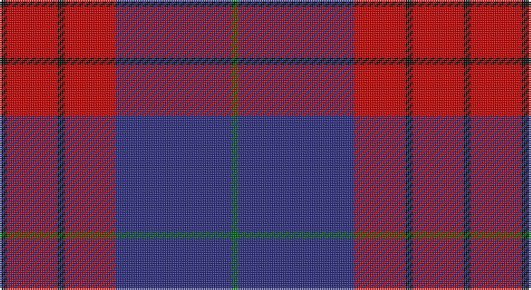

This page is one **sett** — a single exact thread-count. It belongs to the [tartan](/setts/k1r7k1r7db16g1/)
(the same proportion at any scale), whose colour order is pattern [GBRKRK](/stripes/gbrkrk/).

Sourced from register-of-tartans.  It is a [6 stripe tartan](/stripes/stripes6/).

Original link https://www.tartanregister.gov.uk/tartanDetails.aspx?ref=3538

## Also known as

This cloth is also recorded under:

- Robinson Dress
- Robinson Dress #1
- Robinson, dress

2 attestations — the source records this cloth was collapsed from (oldest owns this page)

<ul>
<li>01/01/2002 — Robinson Dress (Pendleton) #1 (register-of-tartans, <a href="https://www.tartanregister.gov.uk/tartanDetails.aspx?ref=3538">record</a>)</li>
<li>pre 2002 — Robinson Dress (Name) (tartans-authority, <a href="http://www.tartansauthority.com/tartan-ferret/display/739/">record</a>)</li>
</ul>

## Register references

External register numbers recorded for this tartan.

- Scottish Register of Tartans: [3538](https://www.tartanregister.gov.uk/tartanDetails.aspx?ref=3538)
- Scottish Tartans Authority (ITI): 739
- Scottish Tartans World Register: 739

## Thread count
K/4 R28 K4 R28 DB64 G/4

One full sett is **256 threads**.

## Palette

Palette: <strong>Tartan Register</strong>
<table><thead><tr><th>Colour</th><th>Threads</th><th>Shade</th><th>Base</th><th>OKLCh</th></tr></thead><tbody><tr><td>K/</td><td style="text-align:right;font-variant-numeric:tabular-nums">4</td><td><code style="background-color:#101010;">#101010</code> <small style="color:#888">#101010</small></td><td>K <code style="background-color:#000000;">#000000</code></td><td><small style="color:#888">oklch(17.3% 0.000 89.9)</small></td></tr><tr><td>R</td><td style="text-align:right;font-variant-numeric:tabular-nums">28</td><td><code style="background-color:#C80000;">#C80000</code> <small style="color:#888">#C80000</small></td><td>R <code style="background-color:#CC0000;">#CC0000</code></td><td><small style="color:#888">oklch(52.3% 0.215 29.2)</small></td></tr><tr><td>K</td><td style="text-align:right;font-variant-numeric:tabular-nums">4</td><td><code style="background-color:#101010;">#101010</code> <small style="color:#888">#101010</small></td><td>K <code style="background-color:#000000;">#000000</code></td><td><small style="color:#888">oklch(17.3% 0.000 89.9)</small></td></tr><tr><td>R</td><td style="text-align:right;font-variant-numeric:tabular-nums">28</td><td><code style="background-color:#C80000;">#C80000</code> <small style="color:#888">#C80000</small></td><td>R <code style="background-color:#CC0000;">#CC0000</code></td><td><small style="color:#888">oklch(52.3% 0.215 29.2)</small></td></tr><tr><td>DB</td><td style="text-align:right;font-variant-numeric:tabular-nums">64</td><td><code style="background-color:#2C2C80;">#2C2C80</code> <small style="color:#888">#2C2C80</small></td><td>B <code style="background-color:#2A418A;">#2A418A</code></td><td><small style="color:#888">oklch(35.0% 0.138 276.6)</small></td></tr><tr><td>G/</td><td style="text-align:right;font-variant-numeric:tabular-nums">4</td><td><code style="background-color:#006818;">#006818</code> <small style="color:#888">#006818</small></td><td>G <code style="background-color:#006100;">#006100</code></td><td><small style="color:#888">oklch(45.0% 0.142 145.0)</small></td></tr></tbody></table>

# Sample pattern

## Nearest tartans

The nearest existing variants by ΔTartan distance, with this tartan at the top so the swatches line up against it.

ΔTartan

Tartan

Sett

—

<a href="/ttd/edit/#slug=k1r7k1r7db16g1~x4">Robinson Dress (Pendleton) #1</a> <a class="nn-out" href="/variants/s6/k1r7k1r7db16g1~x4/" title="open its dictionary page">↗</a>

0.37

<a href="/ttd/edit/#slug=k1r7k1r7db16g1~x2&amp;base=k1r7k1r7db16g1~x4">Robinson, dress</a> <a class="nn-out" href="/variants/s6/k1r7k1r7db16g1~x2/" title="open its dictionary page">↗</a>

0.73

<a href="/ttd/edit/#slug=dg2r1db16r16db1ly2~x2&amp;base=k1r7k1r7db16g1~x4">Galloway Dress (Yellow Line)</a> <a class="nn-out" href="/variants/s6/dg2r1db16r16db1ly2~x2/" title="open its dictionary page">↗</a>

0.85

<a href="/ttd/edit/#slug=g1r1db16r16db1w1~x2&amp;base=k1r7k1r7db16g1~x4">Galloway, dress</a> <a class="nn-out" href="/variants/s6/g1r1db16r16db1w1~x2/" title="open its dictionary page">↗</a>

0.93

<a href="/ttd/edit/#slug=g2r1db16r16db1ly2~x2&amp;base=k1r7k1r7db16g1~x4">Galloway dress</a> <a class="nn-out" href="/variants/s6/g2r1db16r16db1ly2~x2/" title="open its dictionary page">↗</a>

1.05

<a href="/ttd/edit/#slug=g3r2db22r22db2w3~x2&amp;base=k1r7k1r7db16g1~x4">Galloway Red</a> <a class="nn-out" href="/variants/s6/g3r2db22r22db2w3~x2/" title="open its dictionary page">↗</a>

1.13

<a href="/ttd/edit/#slug=k4b32r30b2w5k2~x2&amp;base=k1r7k1r7db16g1~x4">Masai Shuka 17 (Artefact)</a> <a class="nn-out" href="/variants/s6/k4b32r30b2w5k2~x2/" title="open its dictionary page">↗</a>

1.13

<a href="/ttd/edit/#slug=db18r9db2r3k1o1~x4&amp;base=k1r7k1r7db16g1~x4">MacGregor, Modern</a> <a class="nn-out" href="/variants/s6/db18r9db2r3k1o1~x4/" title="open its dictionary page">↗</a>

1.18

<a href="/ttd/edit/#slug=db2r2db28k11r27w2r2~x2&amp;base=k1r7k1r7db16g1~x4">Americana - 1978 #2 (Fashion)</a> <a class="nn-out" href="/variants/s7/db2r2db28k11r27w2r2~x2/" title="open its dictionary page">↗</a>

1.18

<a href="/ttd/edit/#slug=ly3dg8o20dp30ly2~x2&amp;base=k1r7k1r7db16g1~x4">Wicks (Personal)</a> <a class="nn-out" href="/variants/s5/ly3dg8o20dp30ly2~x2/" title="open its dictionary page">↗</a>

1.20

<a href="/ttd/edit/#slug=dp6ly1dp20db6g19dp2~x4&amp;base=k1r7k1r7db16g1~x4">Discover Islay (District)</a> <a class="nn-out" href="/variants/s6/dp6ly1dp20db6g19dp2~x4/" title="open its dictionary page">↗</a>

## Neighbour map

Every grey dot is one of 14360 variants placed by the first two principal components of the ΔTartan feature space (44% of its variance). Red is this tartan; blue dots are its nearest — click one to open its page.

<svg viewBox="0 0 640 380" role="img" style="max-width:100%;height:auto;border:1px solid #e0e0e0;border-radius:4px;display:block" xmlns="http://www.w3.org/2000/svg"><image href="/nn/cloud.v1.png" width="640" height="380"/><a href="/variants/s6/k1r7k1r7db16g1~x2/"><circle cx="324.1" cy="182.0" r="4" fill="#3465a4"><title>Robinson, dress</title></circle></a><a href="/variants/s6/dg2r1db16r16db1ly2~x2/"><circle cx="307.5" cy="167.7" r="4" fill="#3465a4"><title>Galloway Dress (Yellow Line)</title></circle></a><a href="/variants/s6/g1r1db16r16db1w1~x2/"><circle cx="352.7" cy="171.0" r="4" fill="#3465a4"><title>Galloway, dress</title></circle></a><a href="/variants/s6/g2r1db16r16db1ly2~x2/"><circle cx="315.8" cy="172.7" r="4" fill="#3465a4"><title>Galloway dress</title></circle></a><a href="/variants/s6/g3r2db22r22db2w3~x2/"><circle cx="276.5" cy="179.6" r="4" fill="#3465a4"><title>Galloway Red</title></circle></a><a href="/variants/s6/k4b32r30b2w5k2~x2/"><circle cx="284.0" cy="163.1" r="4" fill="#3465a4"><title>Masai Shuka 17 (Artefact)</title></circle></a><a href="/variants/s6/db18r9db2r3k1o1~x4/"><circle cx="389.7" cy="176.1" r="4" fill="#3465a4"><title>MacGregor, Modern</title></circle></a><a href="/variants/s7/db2r2db28k11r27w2r2~x2/"><circle cx="269.8" cy="168.9" r="4" fill="#3465a4"><title>Americana - 1978 #2 (Fashion)</title></circle></a><a href="/variants/s5/ly3dg8o20dp30ly2~x2/"><circle cx="279.8" cy="195.4" r="4" fill="#3465a4"><title>Wicks (Personal)</title></circle></a><a href="/variants/s6/dp6ly1dp20db6g19dp2~x4/"><circle cx="336.7" cy="196.1" r="4" fill="#3465a4"><title>Discover Islay (District)</title></circle></a><circle cx="328.3" cy="182.9" r="5" fill="#c00000"/></svg>

ID: /variants/s6/k1r7k1r7db16g1~x4/
