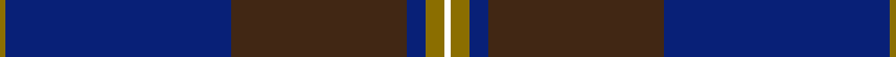

This page is one **sett** — a single exact thread-count. It belongs to the [tartan](/setts/k1y3db3do28db36y1/)
(the same proportion at any scale), whose colour order is pattern [GBBBGK](/stripes/gbbbgk/).

Part of the [Potts](/tartans/potts/) tartan — the named design grouping this sett with its other cloths.

Sourced from register-of-tartans.  It is a [6 stripe tartan](/stripes/stripes6/).

Original link https://www.tartanregister.gov.uk/tartanDetails.aspx?ref=3364

## Register references

External register numbers recorded for this tartan.

- Scottish Register of Tartans: [3364](https://www.tartanregister.gov.uk/tartanDetails.aspx?ref=3364)
- Scottish Tartans Authority (ITI): 4538

## Thread count
Y/2 DB72 DO56 DB6 Y6 K/2

One full sett is **284 threads**.

## Palette
<table><thead><tr><th>Colour</th><th>Shade</th><th>OKLCh</th></tr></thead><tbody><tr><td>DB</td><td><code style="background-color:#082077;">#082077</code> <small style="color:#888">#082077</small></td><td><small style="color:#888">oklch(30.0% 0.149 265.1)</small></td></tr><tr><td>DO</td><td><code style="background-color:#412714;">#412714</code> <small style="color:#888">#412714</small></td><td><small style="color:#888">oklch(30.1% 0.050 55.7)</small></td></tr><tr><td>Y</td><td><code style="background-color:#8B6E00;">#8B6E00</code> <small style="color:#888">#8B6E00</small></td><td><small style="color:#888">oklch(55.1% 0.113 90.4)</small></td></tr></tbody></table>

# Sample pattern

## Nearest variants

The nearest existing variants by ΔTartan distance, with this cloth at the top so the swatches line up against it.

ΔTartan

Threads

Variant

Sett

—

284

<a href="/variants/s6/k1y3db3do28db36y1~x2/">Potts (Personal)</a>

<a href="/ttd/edit/#slug=db4r1db18n18lb1~x4&amp;base=k1y3db3do28db36y1~x2" title="compare in the TTD">2.60</a>

316

<a href="/variants/s5/db4r1db18n18lb1~x4/">Ardee (Corporate)</a>

<a href="/ttd/edit/#slug=dr28r1db18y2g6db18~x2&amp;base=k1y3db3do28db36y1~x2" title="compare in the TTD">2.81</a>

200

<a href="/variants/s6/dr28r1db18y2g6db18~x2/">British Judo Association</a>

## Neighbour map

Every grey dot is one of 13620 variants placed by the first two principal components of the ΔTartan feature space (42% of its variance). Red is this tartan; blue dots are its nearest — click one to open its page.

<svg viewBox="0 0 640 380" role="img" style="max-width:100%;height:auto;border:1px solid #e0e0e0;border-radius:4px;display:block" xmlns="http://www.w3.org/2000/svg"><image href="/nn/cloud.v1.png" width="640" height="380"/><a href="/variants/s5/db4r1db18n18lb1~x4/"><circle cx="415.9" cy="217.1" r="4" fill="#3465a4"><title>Ardee (Corporate)</title></circle></a><a href="/variants/s6/dr28r1db18y2g6db18~x2/"><circle cx="364.4" cy="186.8" r="4" fill="#3465a4"><title>British Judo Association</title></circle></a><circle cx="467.7" cy="165.2" r="5" fill="#c00000"/><text x="320" y="376" text-anchor="middle" font-size="11" fill="#999">ground</text><text x="11" y="190" text-anchor="middle" font-size="11" fill="#999" transform="rotate(-90 11 190)">complexity</text></svg>

ID: /variants/s6/k1y3db3do28db36y1~x2/
