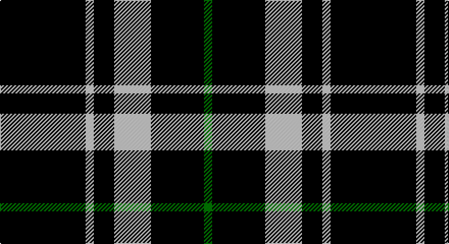

This page is one **sett** — a single exact thread-count. It belongs to the [tartan](/setts/k21lb2k5lb9k13g2/)
(the same proportion at any scale), whose colour order is pattern [GKWKWK](/stripes/gkwkwk/).

Part of the [New Zealand](/tartans/new-zealand/) tartan — the named design grouping this sett with its other cloths.

Sourced from register-of-tartans.  It is a [6 stripe tartan](/stripes/stripes6/).

Original link https://www.tartanregister.gov.uk/tartanDetails.aspx?ref=3124

## Also known as

This cloth is also recorded under:

- New Zealand 2003)

2 attestations — the source records this cloth was collapsed from (oldest owns this page)

<ul>
<li>01/03/2000 — New Zealand (2000) (register-of-tartans, <a href="https://www.tartanregister.gov.uk/tartanDetails.aspx?ref=3124">record</a>)</li>
<li>Mar. 2000 March — New Zealand (2000) (Fashion) (tartans-authority, <a href="http://www.tartansauthority.com/tartan-ferret/display/4215/">record</a>)</li>
</ul>

## Register references

External register numbers recorded for this tartan.

- Scottish Register of Tartans: [3124](https://www.tartanregister.gov.uk/tartanDetails.aspx?ref=3124)
- Scottish Tartans Authority (ITI): 4215

## Thread count
K/84 N8 K20 N36 K52 G/8

One full sett is **324 threads**.

## Palette

Palette: <strong>Tartan Register</strong>
<table><thead><tr><th>Colour</th><th>Threads</th><th>Shade</th><th>Base</th><th>OKLCh</th></tr></thead><tbody><tr><td>K/</td><td style="text-align:right;font-variant-numeric:tabular-nums">84</td><td><code style="background-color:#000000;">#000000</code> <small style="color:#888">#000000</small></td><td>K <code style="background-color:#000000;">#000000</code></td><td><small style="color:#888">oklch(0.0% 0.000 0.0)</small></td></tr><tr><td>N</td><td style="text-align:right;font-variant-numeric:tabular-nums">8</td><td><code style="background-color:#C8C8C8;">#C8C8C8</code> <small style="color:#888">#C8C8C8</small></td><td>W <code style="background-color:#F7F7F7;">#F7F7F7</code></td><td><small style="color:#888">oklch(83.3% 0.000 89.9)</small></td></tr><tr><td>K</td><td style="text-align:right;font-variant-numeric:tabular-nums">20</td><td><code style="background-color:#000000;">#000000</code> <small style="color:#888">#000000</small></td><td>K <code style="background-color:#000000;">#000000</code></td><td><small style="color:#888">oklch(0.0% 0.000 0.0)</small></td></tr><tr><td>N</td><td style="text-align:right;font-variant-numeric:tabular-nums">36</td><td><code style="background-color:#C8C8C8;">#C8C8C8</code> <small style="color:#888">#C8C8C8</small></td><td>W <code style="background-color:#F7F7F7;">#F7F7F7</code></td><td><small style="color:#888">oklch(83.3% 0.000 89.9)</small></td></tr><tr><td>K</td><td style="text-align:right;font-variant-numeric:tabular-nums">52</td><td><code style="background-color:#000000;">#000000</code> <small style="color:#888">#000000</small></td><td>K <code style="background-color:#000000;">#000000</code></td><td><small style="color:#888">oklch(0.0% 0.000 0.0)</small></td></tr><tr><td>G/</td><td style="text-align:right;font-variant-numeric:tabular-nums">8</td><td><code style="background-color:#007800;">#007800</code> <small style="color:#888">#007800</small></td><td>G <code style="background-color:#006100;">#006100</code></td><td><small style="color:#888">oklch(49.6% 0.169 142.5)</small></td></tr></tbody></table>

# Sample pattern

## Nearest tartans

The nearest existing variants by ΔTartan distance, with this tartan at the top so the swatches line up against it.

ΔTartan

Tartan

Sett

—

<a href="/ttd/edit/#slug=k21lb2k5lb9k13g2~x4">New Zealand (2000)</a> <a class="nn-out" href="/variants/s6/k21lb2k5lb9k13g2~x4/" title="open its dictionary page">↗</a>

1.23

<a href="/ttd/edit/#slug=k21w2k5w9k13g2~x4&amp;base=k21lb2k5lb9k13g2~x4">New Zealand District Tartan</a> <a class="nn-out" href="/variants/s6/k21w2k5w9k13g2~x4/" title="open its dictionary page">↗</a>

1.47

<a href="/ttd/edit/#slug=n3k31w6k8n3k12w2~x2&amp;base=k21lb2k5lb9k13g2~x4">Believe - Colette</a> <a class="nn-out" href="/variants/s7/n3k31w6k8n3k12w2~x2/" title="open its dictionary page">↗</a>

1.51

<a href="/ttd/edit/#slug=n3k31w6k7n3k12w2~x2&amp;base=k21lb2k5lb9k13g2~x4">Believe - Colette</a> <a class="nn-out" href="/variants/s7/n3k31w6k7n3k12w2~x2/" title="open its dictionary page">↗</a>

1.63

<a href="/variants/s6/r3lo2k10w1~x6/">St. Eloi</a>

1.64

<a href="/ttd/edit/#slug=k17r6k2w6k17lo2~x2&amp;base=k21lb2k5lb9k13g2~x4">Black 1990 (Name)</a> <a class="nn-out" href="/variants/s6/k17r6k2w6k17lo2~x2/" title="open its dictionary page">↗</a>

1.66

<a href="/ttd/edit/#slug=g12k8w6k22w3k8w3k40g6&amp;base=k21lb2k5lb9k13g2~x4">Jensen, Sven (Personal)</a> <a class="nn-out" href="/variants/s9/g12k8w6k22w3k8w3k40g6/" title="open its dictionary page">↗</a>

1.68

<a href="/ttd/edit/#slug=k46o7k8w20~x2&amp;base=k21lb2k5lb9k13g2~x4">Lords, of Skye</a> <a class="nn-out" href="/variants/s4/k46o7k8w20~x2/" title="open its dictionary page">↗</a>

1.72

<a href="/ttd/edit/#slug=k17r6k2lb6k17lo2~x2&amp;base=k21lb2k5lb9k13g2~x4">Black (symmetrical)</a> <a class="nn-out" href="/variants/s6/k17r6k2lb6k17lo2~x2/" title="open its dictionary page">↗</a>

1.73

<a href="/ttd/edit/#slug=k14r2k4lb3k12r8k1~x2&amp;base=k21lb2k5lb9k13g2~x4">Punky Princess (Fashion)</a> <a class="nn-out" href="/variants/s7/k14r2k4lb3k12r8k1~x2/" title="open its dictionary page">↗</a>

1.73

<a href="/ttd/edit/#slug=k8ly1k1r1k4db1~x12&amp;base=k21lb2k5lb9k13g2~x4">Justus</a> <a class="nn-out" href="/variants/s6/k8ly1k1r1k4db1~x12/" title="open its dictionary page">↗</a>

## Neighbour map

Every grey dot is one of 14360 variants placed by the first two principal components of the ΔTartan feature space (44% of its variance). Red is this tartan; blue dots are its nearest — click one to open its page.

<svg viewBox="0 0 640 380" role="img" style="max-width:100%;height:auto;border:1px solid #e0e0e0;border-radius:4px;display:block" xmlns="http://www.w3.org/2000/svg"><image href="/nn/cloud.v1.png" width="640" height="380"/><a href="/variants/s6/k21w2k5w9k13g2~x4/"><circle cx="414.8" cy="228.2" r="4" fill="#3465a4"><title>New Zealand District Tartan</title></circle></a><a href="/variants/s7/n3k31w6k8n3k12w2~x2/"><circle cx="474.5" cy="195.0" r="4" fill="#3465a4"><title>Believe - Colette</title></circle></a><a href="/variants/s7/n3k31w6k7n3k12w2~x2/"><circle cx="471.4" cy="192.5" r="4" fill="#3465a4"><title>Believe - Colette</title></circle></a><a href="/variants/s6/r3lo2k10w1~x6/"><circle cx="376.0" cy="216.7" r="4" fill="#3465a4"><title>St. Eloi</title></circle></a><a href="/variants/s6/k17r6k2w6k17lo2~x2/"><circle cx="371.2" cy="223.5" r="4" fill="#3465a4"><title>Black 1990 (Name)</title></circle></a><a href="/variants/s9/g12k8w6k22w3k8w3k40g6/"><circle cx="416.0" cy="198.2" r="4" fill="#3465a4"><title>Jensen, Sven (Personal)</title></circle></a><a href="/variants/s4/k46o7k8w20~x2/"><circle cx="336.8" cy="257.5" r="4" fill="#3465a4"><title>Lords, of Skye</title></circle></a><a href="/variants/s6/k17r6k2lb6k17lo2~x2/"><circle cx="380.7" cy="228.4" r="4" fill="#3465a4"><title>Black (symmetrical)</title></circle></a><a href="/variants/s7/k14r2k4lb3k12r8k1~x2/"><circle cx="398.0" cy="211.4" r="4" fill="#3465a4"><title>Punky Princess (Fashion)</title></circle></a><a href="/variants/s6/k8ly1k1r1k4db1~x12/"><circle cx="471.7" cy="226.2" r="4" fill="#3465a4"><title>Justus</title></circle></a><circle cx="415.2" cy="235.1" r="5" fill="#c00000"/></svg>

ID: /variants/s6/k21lb2k5lb9k13g2~x4/
