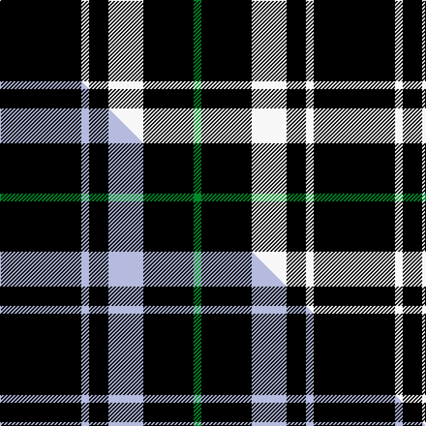

This is one **variant** — a specific cloth: this exact thread count and colourway, with its own
provenance below. It is one weaving of the [sett](/tartans/n/ne/new-zealand/) (the scale-free proportion — the
same cloth at any scale or shade), whose colour order is pattern [GKWKWK](/stripes/gkwkwk/).

Part of the [New Zealand](/tartans/n/ne/new-zealand/) tartan — the named design grouping this sett with its other cloths.

Sourced from house-of-tartan.  It is a [6 stripe tartan](/stripes/stripes6/).

Original link [http://www.house-of-tartan.scotland.net/house/TartanViewjs.asp?colr=Def&tnam=3250](http://www.house-of-tartan.scotland.net/house/TartanViewjs.asp?colr=Def&tnam=3250)

## Provenance

Earliest known date: 2000 Designed as a District sett by Timely Marketing Promotions, Christchurch, New Zealand

Dataset <small>— provenance for this record, inherited from the source manifest</small>

<dl class="dataset-prov">
<dt>source</dt><dd><a href="/sources/house-of-tartan/">House of Tartan</a></dd>
<dt>data captured from</dt><dd><a href="https://github.com/thetartan/tartan-database/blob/master/data/house-of-tartan/data.csv">https://github.com/thetartan/tartan-database/blob/master/data/house-of-tartan/data.csv</a></dd>
<dt>data date</dt><dd>2000 <small>(this record)</small></dd>
<dt>licence</dt><dd><a href="https://creativecommons.org/licenses/by-nc-nd/4.0/">CC BY-NC-ND 4.0</a></dd>
</dl>

Capture chain <small>— the hands this data passed through, oldest first; each capture carries its own licence</small>

<ol class="capture-chain">
<li><a href="http://www.house-of-tartan.scotland.net/">House of Tartan</a> <small>the weaver/retailer's database — the site is now offline; the URL is kept as the ultimate source's identity</small></li>
<li><a href="https://github.com/thetartan/tartan-database">thetartan/tartan-database</a> <small>2016-2017</small> · <a href="https://creativecommons.org/licenses/by-nc-nd/4.0/">CC BY-NC-ND 4.0</a> <small>Levko Kravets's frozen compilation — the capture we vendored, and where its CC licence text came from</small></li>
<li>this dictionary <small>captured 2026-06-10 · commit 5bf86c7566</small> <small>each re-capture is a git commit to data/sources</small></li>
</ol>

## Thread count
K/84 W8 K20 W36 K52 G/8

One full sett is **324 threads**.

## Palette
<table><thead><tr><th>Colour</th><th>Shade</th><th>OKLCh</th></tr></thead><tbody><tr><td>G</td><td><code style="background-color:#008B2A;">#008B2A</code> <small style="color:#888">#008B2A</small></td><td><small style="color:#888">oklch(55.4% 0.170 145.9)</small></td></tr><tr><td>K</td><td><code style="background-color:#000000;">#000000</code> <small style="color:#888">#000000</small></td><td><small style="color:#888">oklch(0.0% 0.000 0.0)</small></td></tr><tr><td>W</td><td><code style="background-color:#F7F7F7;">#F7F7F7</code> <small style="color:#888">#F7F7F7</small></td><td><small style="color:#888">oklch(97.6% 0.000 89.9)</small></td></tr></tbody></table>

# Sample pattern

[Sample sheet (PDF)](swatch.pdf) — the woven sample, thread count and palette on one printable A4, rendered on demand (the same sheet the TTD print page downloads).

## Compared to the master

This cloth is one sett of its design; the master sett (the exemplar the design is anchored on) is below for comparison.

Its **ΔTartan distance** from the master is **2.25** — the same measure the nearest-tartans table ranks by (0 is identical; a re-scale of the same cloth is near 0, a recolour or a different proportion further).

<figure class="master-compare" style="margin:0">

this sett
master sett ★

<figcaption style="color:#888;font-size:smaller">One weave of this sett against the <a href="/setts/k21lb2k5lb9k13g2/">master sett ★</a>, split on the diagonal: a shared proportion runs seamlessly across it with only the shades shifting; a different proportion breaks on it.</figcaption>
</figure>

## Nearest tartan variants

The nearest existing variants by ΔTartan distance, with this cloth at the top so the swatches line up against it.

ΔTartan

Threads

Variant

Sett

—

324

<a href="/variants/s6/k21w2k5w9k13g2~x4/">New Zealand District Tartan</a>

<a href="/ttd/edit/#slug=k22w3k3w11k1~x2&amp;base=k21w2k5w9k13g2~x4" title="compare in the TTD">1.16</a>

114

<a href="/variants/s5/k22w3k3w11k1~x2/">MacPhee MacFee or MacIver</a>

<a href="/ttd/edit/#slug=k2n6k2n6k12r1~x4&amp;base=k21w2k5w9k13g2~x4" title="compare in the TTD">1.24</a>

220

<a href="/variants/s6/k2n6k2n6k12r1~x4/">MacSween, Black (Personal)</a>

<a href="/ttd/edit/#slug=w5k3y6k5w3k30y2~x2&amp;base=k21w2k5w9k13g2~x4" title="compare in the TTD">1.25</a>

202

<a href="/variants/s7/w5k3y6k5w3k30y2~x2/">Northern Kentucky University</a>

<a href="/ttd/edit/#slug=n50k4n12k23lo4k4~x2&amp;base=k21w2k5w9k13g2~x4" title="compare in the TTD">1.28</a>

280

<a href="/variants/s6/n50k4n12k23lo4k4~x2/">Sligo Irish County Tartan</a>

<a href="/ttd/edit/#slug=n3k31w6k8n3k12w2~x2&amp;base=k21w2k5w9k13g2~x4" title="compare in the TTD">1.34</a>

250

<a href="/variants/s7/n3k31w6k8n3k12w2~x2/">Believe - Colette</a>

<a href="/ttd/edit/#slug=n3k31w6k7n3k12w2~x2&amp;base=k21w2k5w9k13g2~x4" title="compare in the TTD">1.34</a>

246

<a href="/variants/s7/n3k31w6k7n3k12w2~x2/">Believe - Colette</a>

<a href="/ttd/edit/#slug=k15n7k6n11k50n4~x2&amp;base=k21w2k5w9k13g2~x4" title="compare in the TTD">1.55</a>

334

<a href="/variants/s6/k15n7k6n11k50n4~x2/">Freedom of Scotland</a>

<a href="/ttd/edit/#slug=k37w9k3dg9w3~x2&amp;base=k21w2k5w9k13g2~x4" title="compare in the TTD">1.60</a>

164

<a href="/variants/s5/k37w9k3dg9w3~x2/">Glen Coe Trade Tartan</a>

<a href="/ttd/edit/#slug=k17dr6k2w6k17ly2~x2&amp;base=k21w2k5w9k13g2~x4" title="compare in the TTD">1.76</a>

162

<a href="/variants/s6/k17dr6k2w6k17ly2~x2/">Black 1990 (Name)</a>

<a href="/ttd/edit/#slug=n1k21n5k3n5k9r1~x4&amp;base=k21w2k5w9k13g2~x4" title="compare in the TTD">1.83</a>

352

<a href="/variants/s7/n1k21n5k3n5k9r1~x4/">Sunderland of Scotland (Fashion)</a>

## Neighbour map

Every grey dot is one of 13662 variants placed by the first two principal components of the ΔTartan feature space (42% of its variance). Red is this tartan; blue dots are its nearest — click one to open its page. The map is a flat projection of a many-dimensional space — [how to read it](/posts/neighbourhood-maps/).

<svg viewBox="0 0 640 380" role="img" style="max-width:100%;height:auto;border:1px solid #e0e0e0;border-radius:4px;display:block" xmlns="http://www.w3.org/2000/svg"><image href="/nn/cloud.v1.png" width="640" height="380"/><a href="/variants/s5/k22w3k3w11k1~x2/"><circle cx="367.8" cy="168.1" r="4" fill="#3465a4"><title>MacPhee MacFee or MacIver</title></circle></a><a href="/variants/s6/k2n6k2n6k12r1~x4/"><circle cx="296.0" cy="196.7" r="4" fill="#3465a4"><title>MacSween, Black (Personal)</title></circle></a><a href="/variants/s7/w5k3y6k5w3k30y2~x2/"><circle cx="367.8" cy="143.3" r="4" fill="#3465a4"><title>Northern Kentucky University</title></circle></a><a href="/variants/s6/n50k4n12k23lo4k4~x2/"><circle cx="359.0" cy="179.5" r="4" fill="#3465a4"><title>Sligo Irish County Tartan</title></circle></a><a href="/variants/s7/n3k31w6k8n3k12w2~x2/"><circle cx="426.9" cy="155.1" r="4" fill="#3465a4"><title>Believe - Colette</title></circle></a><a href="/variants/s7/n3k31w6k7n3k12w2~x2/"><circle cx="425.0" cy="153.8" r="4" fill="#3465a4"><title>Believe - Colette</title></circle></a><a href="/variants/s6/k15n7k6n11k50n4~x2/"><circle cx="471.7" cy="192.9" r="4" fill="#3465a4"><title>Freedom of Scotland</title></circle></a><a href="/variants/s5/k37w9k3dg9w3~x2/"><circle cx="331.2" cy="176.7" r="4" fill="#3465a4"><title>Glen Coe Trade Tartan</title></circle></a><a href="/variants/s6/k17dr6k2w6k17ly2~x2/"><circle cx="327.9" cy="190.5" r="4" fill="#3465a4"><title>Black 1990 (Name)</title></circle></a><a href="/variants/s7/n1k21n5k3n5k9r1~x4/"><circle cx="432.5" cy="150.8" r="4" fill="#3465a4"><title>Sunderland of Scotland (Fashion)</title></circle></a><circle cx="371.1" cy="191.9" r="5" fill="#c00000"/><text x="320" y="376" text-anchor="middle" font-size="11" fill="#999">ground</text><text x="11" y="190" text-anchor="middle" font-size="11" fill="#999" transform="rotate(-90 11 190)">complexity</text></svg>

ID: /variants/s6/k21w2k5w9k13g2~x4/
