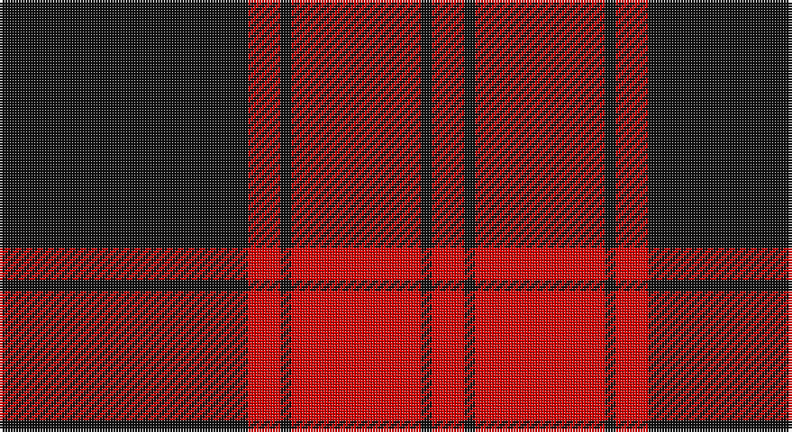

This page is one **sett** — a single exact thread-count. It belongs to the [tartan](/setts/k23r3k1r12/)
(the same proportion at any scale), whose colour order is pattern [KRKRKR](/stripes/krkrkr/).

Sourced from register-of-tartans.  It is a [6 stripe tartan](/stripes/stripes6/).

Original link https://www.tartanregister.gov.uk/tartanDetails.aspx?ref=11082

## Provenance

Earliest known date: 2014 Following official recognition, this tartan was chosen by the new Commander of Clan Ewing, John Thor Ewing, as the Clan Ewing tartan. The tartan takes its inspiration from the plaid of John Ewing in Heiddykis of Kirkmichael (d.1609), described in his testament as 'sax ellis of reid & blak cullerit claith' The design relates to historical and traditional tartans from the areas and clans among which Clan Ewing has its roots. This tartan is woven to order by Lochcarron on behalf of Clan Ewing. All weavers must seek permission from John Thor Ewing as registrant and copyright holder.

3 attestations — the source records this cloth was collapsed from (oldest owns this page)

<ul>
<li>29/05/2014 — Ewing (register-of-tartans, <a href="https://www.tartanregister.gov.uk/tartanDetails.aspx?ref=11082">record</a>)</li>
<li>2014 — Ewing (Clan) (tartans-authority, <a href="http://www.tartansauthority.com/tartan-ferret/display/11082/">record</a>)</li>
<li>undated — Ewing Clan Tartan (house-of-tartan, <a href="http://www.house-of-tartan.scotland.net/house/TartanViewjs.asp?colr=Def&tnam=11082">record</a>)</li>
</ul>

## Register references

External register numbers recorded for this tartan.

- Scottish Register of Tartans: [11082](https://www.tartanregister.gov.uk/tartanDetails?ref=11082)
- Scottish Tartans Authority (ITI): 11082

## Thread count
K/92 R12 K4 R48 K4 R/12

One full sett is **240 threads**.

## Palette

Palette: <strong>Logan (The Scottish Gael, 1831)</strong>
<table><thead><tr><th>Colour</th><th>Threads</th><th>Shade</th><th>Base</th><th>OKLCh</th></tr></thead><tbody><tr><td>K/</td><td style="text-align:right;font-variant-numeric:tabular-nums">92</td><td><code style="background-color:#101010;">#101010</code> <small style="color:#888">#101010</small></td><td>K <code style="background-color:#000000;">#000000</code></td><td><small style="color:#888">oklch(17.3% 0.000 89.9)</small></td></tr><tr><td>R</td><td style="text-align:right;font-variant-numeric:tabular-nums">12</td><td><code style="background-color:#DC0000;">#DC0000</code> <small style="color:#888">#DC0000</small></td><td>R <code style="background-color:#CC0000;">#CC0000</code></td><td><small style="color:#888">oklch(56.2% 0.230 29.2)</small></td></tr><tr><td>K</td><td style="text-align:right;font-variant-numeric:tabular-nums">4</td><td><code style="background-color:#101010;">#101010</code> <small style="color:#888">#101010</small></td><td>K <code style="background-color:#000000;">#000000</code></td><td><small style="color:#888">oklch(17.3% 0.000 89.9)</small></td></tr><tr><td>R</td><td style="text-align:right;font-variant-numeric:tabular-nums">48</td><td><code style="background-color:#DC0000;">#DC0000</code> <small style="color:#888">#DC0000</small></td><td>R <code style="background-color:#CC0000;">#CC0000</code></td><td><small style="color:#888">oklch(56.2% 0.230 29.2)</small></td></tr><tr><td>K</td><td style="text-align:right;font-variant-numeric:tabular-nums">4</td><td><code style="background-color:#101010;">#101010</code> <small style="color:#888">#101010</small></td><td>K <code style="background-color:#000000;">#000000</code></td><td><small style="color:#888">oklch(17.3% 0.000 89.9)</small></td></tr><tr><td>R/</td><td style="text-align:right;font-variant-numeric:tabular-nums">12</td><td><code style="background-color:#DC0000;">#DC0000</code> <small style="color:#888">#DC0000</small></td><td>R <code style="background-color:#CC0000;">#CC0000</code></td><td><small style="color:#888">oklch(56.2% 0.230 29.2)</small></td></tr></tbody></table>

# Sample pattern

## Nearest tartans

The nearest existing variants by ΔTartan distance, with this tartan at the top so the swatches line up against it.

ΔTartan

Tartan

Sett

—

<a href="/ttd/edit/#slug=k23r3k1r12~x4">Ewing</a> <a class="nn-out" href="/variants/s6/k23r3k1r12~x4/" title="open its dictionary page">↗</a>

0.78

<a href="/ttd/edit/#slug=k6r1k24r28k1r4~x2&amp;base=k23r3k1r12~x4">Aragon (Erskine)</a> <a class="nn-out" href="/variants/s6/k6r1k24r28k1r4~x2/" title="open its dictionary page">↗</a>

1.05

<a href="/ttd/edit/#slug=r4k1r24k22r2~x2&amp;base=k23r3k1r12~x4">Campbell Red (artefact)</a> <a class="nn-out" href="/variants/s5/r4k1r24k22r2~x2/" title="open its dictionary page">↗</a>

1.20

<a href="/ttd/edit/#slug=k30r3k2r3k2r27k30r4~x2&amp;base=k23r3k1r12~x4">Murray of Ochtertyre #2</a> <a class="nn-out" href="/variants/s8/k30r3k2r3k2r27k30r4~x2/" title="open its dictionary page">↗</a>

1.24

<a href="/ttd/edit/#slug=r20k2r2k15w1~x2&amp;base=k23r3k1r12~x4">Masai Shuka 15 (Artefact)</a> <a class="nn-out" href="/variants/s5/r20k2r2k15w1~x2/" title="open its dictionary page">↗</a>

1.29

<a href="/ttd/edit/#slug=k3r1k16r16k1r3~x4&amp;base=k23r3k1r12~x4">The Mary Erskine</a> <a class="nn-out" href="/variants/s6/k3r1k16r16k1r3~x4/" title="open its dictionary page">↗</a>

1.30

<a href="/ttd/edit/#slug=k16r2k2r12w1~x2&amp;base=k23r3k1r12~x4">MacIver</a> <a class="nn-out" href="/variants/s5/k16r2k2r12w1~x2/" title="open its dictionary page">↗</a>

1.38

<a href="/ttd/edit/#slug=k4w2k28r30k1r3~x2&amp;base=k23r3k1r12~x4">Ramsay of Dalhousie</a> <a class="nn-out" href="/variants/s6/k4w2k28r30k1r3~x2/" title="open its dictionary page">↗</a>

1.40

<a href="/ttd/edit/#slug=k3r1k30r28k1r1w3~x2&amp;base=k23r3k1r12~x4">Cunningham</a> <a class="nn-out" href="/variants/s7/k3r1k30r28k1r1w3~x2/" title="open its dictionary page">↗</a>

1.41

<a href="/ttd/edit/#slug=k3r2k30r28k2r2w3~x2&amp;base=k23r3k1r12~x4">Cunningham #2</a> <a class="nn-out" href="/variants/s7/k3r2k30r28k2r2w3~x2/" title="open its dictionary page">↗</a>

1.41

<a href="/ttd/edit/#slug=r42k2w2k18w2k5~x2&amp;base=k23r3k1r12~x4">Forget Family (Red)</a> <a class="nn-out" href="/variants/s6/r42k2w2k18w2k5~x2/" title="open its dictionary page">↗</a>

## Neighbour map

Every grey dot is one of 14360 variants placed by the first two principal components of the ΔTartan feature space (44% of its variance). Red is this tartan; blue dots are its nearest — click one to open its page.

<svg viewBox="0 0 640 380" role="img" style="max-width:100%;height:auto;border:1px solid #e0e0e0;border-radius:4px;display:block" xmlns="http://www.w3.org/2000/svg"><image href="/nn/cloud.v1.png" width="640" height="380"/><a href="/variants/s6/k6r1k24r28k1r4~x2/"><circle cx="415.7" cy="183.7" r="4" fill="#3465a4"><title>Aragon (Erskine)</title></circle></a><a href="/variants/s5/r4k1r24k22r2~x2/"><circle cx="419.6" cy="192.9" r="4" fill="#3465a4"><title>Campbell Red (artefact)</title></circle></a><a href="/variants/s8/k30r3k2r3k2r27k30r4~x2/"><circle cx="437.2" cy="205.4" r="4" fill="#3465a4"><title>Murray of Ochtertyre #2</title></circle></a><a href="/variants/s5/r20k2r2k15w1~x2/"><circle cx="385.2" cy="184.7" r="4" fill="#3465a4"><title>Masai Shuka 15 (Artefact)</title></circle></a><a href="/variants/s6/k3r1k16r16k1r3~x4/"><circle cx="375.2" cy="206.0" r="4" fill="#3465a4"><title>The Mary Erskine</title></circle></a><a href="/variants/s5/k16r2k2r12w1~x2/"><circle cx="359.3" cy="196.1" r="4" fill="#3465a4"><title>MacIver</title></circle></a><a href="/variants/s6/k4w2k28r30k1r3~x2/"><circle cx="369.6" cy="151.3" r="4" fill="#3465a4"><title>Ramsay of Dalhousie</title></circle></a><a href="/variants/s7/k3r1k30r28k1r1w3~x2/"><circle cx="375.9" cy="133.9" r="4" fill="#3465a4"><title>Cunningham</title></circle></a><a href="/variants/s7/k3r2k30r28k2r2w3~x2/"><circle cx="349.9" cy="167.6" r="4" fill="#3465a4"><title>Cunningham #2</title></circle></a><a href="/variants/s6/r42k2w2k18w2k5~x2/"><circle cx="400.0" cy="151.5" r="4" fill="#3465a4"><title>Forget Family (Red)</title></circle></a><circle cx="429.9" cy="184.4" r="5" fill="#c00000"/></svg>

ID: /variants/s6/k23r3k1r12~x4/
