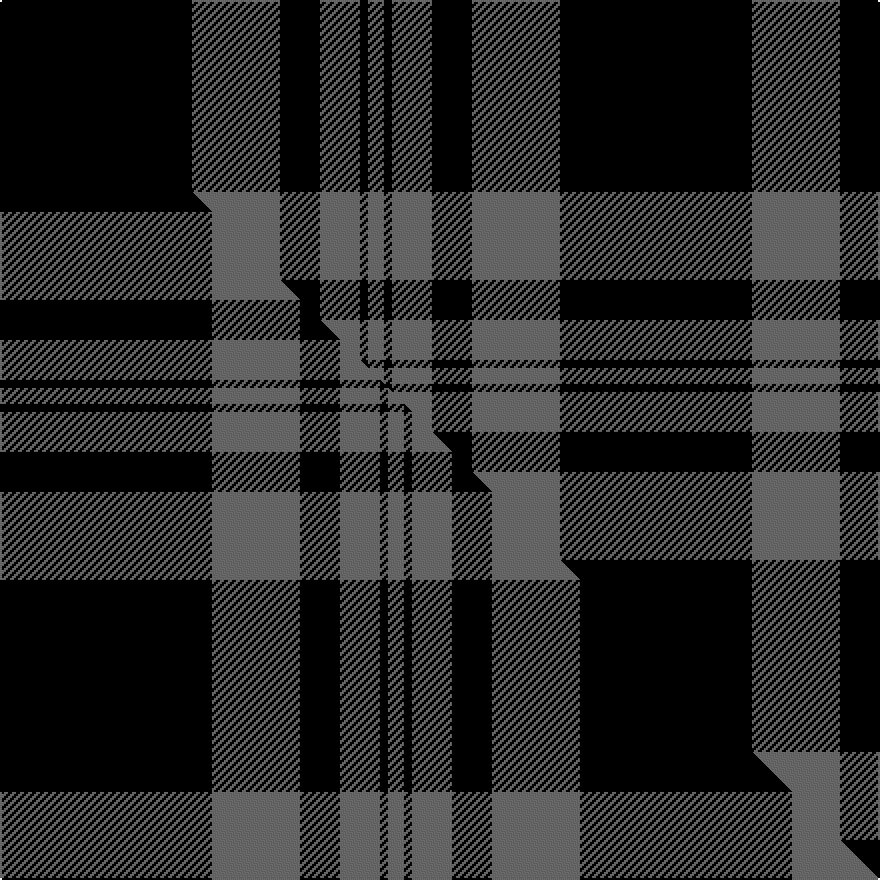

This page is one **sett** — a single exact thread-count. It belongs to the [tartan](/setts/k24n11k5n5k1n2/)
(the same proportion at any scale), whose colour order is pattern [BKBKBK](/stripes/bkbkbk/).

Part of the [Black Isle](/tartans/black-isle/) tartan — the named design grouping this sett with its other cloths.

Sourced from house-of-tartan.  It is a [6 stripe tartan](/stripes/stripes6/).

Original link http://www.house-of-tartan.scotland.net/house/TartanViewjs.asp?colr=Def&tnam=6183

## Provenance

Earliest known date: 15/07/2003 Designed for Black Isle Pewter Limited by Robert Howarth Guibal of Black Isle Pewter. Threadcount taken from a Marton Mills swatch book.

Dataset <small>— provenance for this record, inherited from the source manifest</small>

<dl class="dataset-prov">
<dt>source</dt><dd><a href="/sources/house-of-tartan/">House of Tartan</a></dd>
<dt>data captured from</dt><dd><a href="https://github.com/thetartan/tartan-database/blob/master/data/house-of-tartan/data.csv">https://github.com/thetartan/tartan-database/blob/master/data/house-of-tartan/data.csv</a></dd>
<dt>data date</dt><dd>2017-01-10 <small>(dataset default)</small></dd>
<dt>licence</dt><dd><a href="https://creativecommons.org/licenses/by-nc-nd/4.0/">CC BY-NC-ND 4.0</a></dd>
</dl>

Capture chain <small>— the hands this data passed through, oldest first; each capture carries its own licence</small>

<ol class="capture-chain">
<li><a href="http://www.house-of-tartan.scotland.net/">House of Tartan</a> <small>the weaver/retailer's database — the site is now offline; the URL is kept as the ultimate source's identity</small></li>
<li><a href="https://github.com/thetartan/tartan-database">thetartan/tartan-database</a> <small>2016-2017</small> · <a href="https://creativecommons.org/licenses/by-nc-nd/4.0/">CC BY-NC-ND 4.0</a> <small>Levko Kravets's frozen compilation — the capture we vendored, and where its CC licence text came from</small></li>
<li>this dictionary <small>captured 2026-06-10 · commit 5bf86c7566</small> <small>each re-capture is a git commit to data/sources</small></li>
</ol>

## Thread count
K/96 N44 K20 N20 K4 N/8

One full sett is **280 threads**.

## Palette
<table><thead><tr><th>Colour</th><th>Shade</th><th>OKLCh</th></tr></thead><tbody><tr><td>K</td><td><code style="background-color:#000000;">#000000</code> <small style="color:#888">#000000</small></td><td><small style="color:#888">oklch(0.0% 0.000 0.0)</small></td></tr><tr><td>N</td><td><code style="background-color:#636363;">#636363</code> <small style="color:#888">#636363</small></td><td><small style="color:#888">oklch(50.0% 0.000 89.9)</small></td></tr></tbody></table>

# Sample pattern

## Compared to the master

This cloth is one sett of its design; the master sett (the exemplar the design is anchored on) is below for comparison.

Its **ΔTartan distance** from the master is **0.11** — the same measure the nearest-tartans table ranks by (0 is identical; a re-scale of the same cloth is near 0, a recolour or a different proportion further).

<figure class="master-compare" style="margin:0">

this sett
master sett ★

<figcaption style="color:#888;font-size:smaller">One weave of this sett against the <a href="/setts/k53n22k10n10k2n4/">master sett ★</a>, split on the diagonal: a shared proportion runs seamlessly across it with only the shades shifting; a different proportion breaks on it.</figcaption>
</figure>

## Nearest tartan variants

The nearest existing variants by ΔTartan distance, with this cloth at the top so the swatches line up against it.

ΔTartan

Threads

Variant

Sett

—

280

<a href="/variants/s6/k24n11k5n5k1n2~x4/">Black Isle Corporate Tartan</a>

<a href="/ttd/edit/#slug=k53n22k10n10k2n4~x2&amp;base=k24n11k5n5k1n2~x4" title="compare in the TTD">0.11</a>

290

<a href="/variants/s6/k53n22k10n10k2n4~x2/">Black Isle</a>

<a href="/ttd/edit/#slug=k39n3k3n3k14n28r3~x2&amp;base=k24n11k5n5k1n2~x4" title="compare in the TTD">0.88</a>

288

<a href="/variants/s7/k39n3k3n3k14n28r3~x2/">Moffat (1984)</a>

<a href="/ttd/edit/#slug=k3n25k3n3k21n3~x2&amp;base=k24n11k5n5k1n2~x4" title="compare in the TTD">0.91</a>

220

<a href="/variants/s6/k3n25k3n3k21n3~x2/">Slanj, Grey (Corporate)</a>

<a href="/ttd/edit/#slug=k15n7k6n11k50n4~x2&amp;base=k24n11k5n5k1n2~x4" title="compare in the TTD">0.92</a>

334

<a href="/variants/s6/k15n7k6n11k50n4~x2/">Freedom of Scotland</a>

<a href="/ttd/edit/#slug=k13n2k13n31k1n1~x4&amp;base=k24n11k5n5k1n2~x4" title="compare in the TTD">0.94</a>

432

<a href="/variants/s6/k13n2k13n31k1n1~x4/">Silver Mist (Corporate)</a>

<a href="/ttd/edit/#slug=n6k17n6k17n45k4~x2&amp;base=k24n11k5n5k1n2~x4" title="compare in the TTD">0.98</a>

360

<a href="/variants/s6/n6k17n6k17n45k4~x2/">Grey Spirit (Fashion)</a>

<a href="/ttd/edit/#slug=n6k16n6k16n45k4~x2&amp;base=k24n11k5n5k1n2~x4" title="compare in the TTD">0.98</a>

352

<a href="/variants/s6/n6k16n6k16n45k4~x2/">Grey Spirit Fashion Tartan</a>

<a href="/ttd/edit/#slug=n13k3n3k3n3k35r3~x2&amp;base=k24n11k5n5k1n2~x4" title="compare in the TTD">0.99</a>

220

<a href="/variants/s7/n13k3n3k3n3k35r3~x2/">Holden Black (Corporate)</a>

<a href="/ttd/edit/#slug=n1k21n5k3n5k9r1~x4&amp;base=k24n11k5n5k1n2~x4" title="compare in the TTD">1.06</a>

352

<a href="/variants/s7/n1k21n5k3n5k9r1~x4/">Sunderland of Scotland (Fashion)</a>

<a href="/ttd/edit/#slug=n34k7n12k40n3k4lb3~x2&amp;base=k24n11k5n5k1n2~x4" title="compare in the TTD">1.12</a>

338

<a href="/variants/s7/n34k7n12k40n3k4lb3~x2/">TACC</a>

## Neighbour map

Every grey dot is one of 13620 variants placed by the first two principal components of the ΔTartan feature space (42% of its variance). Red is this tartan; blue dots are its nearest — click one to open its page.

<svg viewBox="0 0 640 380" role="img" style="max-width:100%;height:auto;border:1px solid #e0e0e0;border-radius:4px;display:block" xmlns="http://www.w3.org/2000/svg"><image href="/nn/cloud.v1.png" width="640" height="380"/><a href="/variants/s6/k53n22k10n10k2n4~x2/"><circle cx="414.1" cy="165.2" r="4" fill="#3465a4"><title>Black Isle</title></circle></a><a href="/variants/s7/k39n3k3n3k14n28r3~x2/"><circle cx="335.7" cy="168.3" r="4" fill="#3465a4"><title>Moffat (1984)</title></circle></a><a href="/variants/s6/k3n25k3n3k21n3~x2/"><circle cx="326.2" cy="213.6" r="4" fill="#3465a4"><title>Slanj, Grey (Corporate)</title></circle></a><a href="/variants/s6/k15n7k6n11k50n4~x2/"><circle cx="472.0" cy="193.6" r="4" fill="#3465a4"><title>Freedom of Scotland</title></circle></a><a href="/variants/s6/k13n2k13n31k1n1~x4/"><circle cx="378.9" cy="160.4" r="4" fill="#3465a4"><title>Silver Mist (Corporate)</title></circle></a><a href="/variants/s6/n6k17n6k17n45k4~x2/"><circle cx="356.5" cy="209.1" r="4" fill="#3465a4"><title>Grey Spirit (Fashion)</title></circle></a><a href="/variants/s6/n6k16n6k16n45k4~x2/"><circle cx="363.8" cy="207.6" r="4" fill="#3465a4"><title>Grey Spirit Fashion Tartan</title></circle></a><a href="/variants/s7/n13k3n3k3n3k35r3~x2/"><circle cx="365.8" cy="157.2" r="4" fill="#3465a4"><title>Holden Black (Corporate)</title></circle></a><a href="/variants/s7/n1k21n5k3n5k9r1~x4/"><circle cx="432.8" cy="151.3" r="4" fill="#3465a4"><title>Sunderland of Scotland (Fashion)</title></circle></a><a href="/variants/s7/n34k7n12k40n3k4lb3~x2/"><circle cx="293.9" cy="176.4" r="4" fill="#3465a4"><title>TACC</title></circle></a><circle cx="398.0" cy="173.0" r="5" fill="#c00000"/><text x="320" y="376" text-anchor="middle" font-size="11" fill="#999">ground</text><text x="11" y="190" text-anchor="middle" font-size="11" fill="#999" transform="rotate(-90 11 190)">complexity</text></svg>

ID: /variants/s6/k24n11k5n5k1n2~x4/
