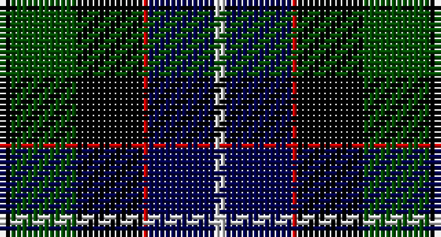

This page is one **sett** — a single exact thread-count. It belongs to the [tartan](/setts/k2dg12k12r1db12lb2/)
(the same proportion at any scale), whose colour order is pattern [KGKRBW](/stripes/kgkrbw/).

Sourced from weddslist.  It is a [6 stripe tartan](/stripes/stripes6/).

Original link http://www.weddslist.com/cgi-bin/tartans/pg.pl?source=rb

## Thread count
K/2 G12 K12 R1 DB12 N/2

One full sett is **78 threads**.

## Palette

Palette: <strong>Tartan Register</strong> <small style="color:#888">(3 of 5 colours)</small>
<table><thead><tr><th>Colour</th><th>Threads</th><th>Shade</th><th>Base</th><th>OKLCh</th></tr></thead><tbody><tr><td>K/</td><td style="text-align:right;font-variant-numeric:tabular-nums">2</td><td><code style="background-color:#000000;">#000000</code> <small style="color:#888">#000000</small></td><td>K <code style="background-color:#000000;">#000000</code></td><td><small style="color:#888">oklch(0.0% 0.000 0.0)</small></td></tr><tr><td>G</td><td style="text-align:right;font-variant-numeric:tabular-nums">12</td><td><code style="background-color:#004C00;">#004C00</code> <small style="color:#888">#004C00</small></td><td>G <code style="background-color:#006100;">#006100</code></td><td><small style="color:#888">oklch(36.1% 0.123 142.5)</small></td></tr><tr><td>K</td><td style="text-align:right;font-variant-numeric:tabular-nums">12</td><td><code style="background-color:#000000;">#000000</code> <small style="color:#888">#000000</small></td><td>K <code style="background-color:#000000;">#000000</code></td><td><small style="color:#888">oklch(0.0% 0.000 0.0)</small></td></tr><tr><td>R</td><td style="text-align:right;font-variant-numeric:tabular-nums">1</td><td><code style="background-color:#C80000;">#C80000</code> <small style="color:#888">#C80000</small></td><td>R <code style="background-color:#CC0000;">#CC0000</code></td><td><small style="color:#888">oklch(52.3% 0.215 29.2)</small></td></tr><tr><td>DB</td><td style="text-align:right;font-variant-numeric:tabular-nums">12</td><td><code style="background-color:#00004C;">#00004C</code> <small style="color:#888">#00004C</small></td><td>B <code style="background-color:#2A418A;">#2A418A</code></td><td><small style="color:#888">oklch(18.8% 0.130 264.1)</small></td></tr><tr><td>N/</td><td style="text-align:right;font-variant-numeric:tabular-nums">2</td><td><code style="background-color:#D0D0D0;">#D0D0D0</code> <small style="color:#888">#D0D0D0</small></td><td>W <code style="background-color:#F7F7F7;">#F7F7F7</code></td><td><small style="color:#888">oklch(85.8% 0.000 89.9)</small></td></tr></tbody></table>

# Sample pattern

## Nearest tartans

The nearest existing variants by ΔTartan distance, with this tartan at the top so the swatches line up against it.

ΔTartan

Tartan

Sett

—

<a href="/ttd/edit/#slug=k2dg12k12r1db12lb2">Mitchell</a> <a class="nn-out" href="/variants/s6/k2dg12k12r1db12lb2/" title="open its dictionary page">↗</a>

0.41

<a href="/ttd/edit/#slug=k2dg12k12r1db12lr2~x2&amp;base=k2dg12k12r1db12lb2">Mitchell</a> <a class="nn-out" href="/variants/s6/k2dg12k12r1db12lr2~x2/" title="open its dictionary page">↗</a>

0.41

<a href="/ttd/edit/#slug=k2dg12k12r1db12lr2&amp;base=k2dg12k12r1db12lb2">Mitchell</a> <a class="nn-out" href="/variants/s6/k2dg12k12r1db12lr2/" title="open its dictionary page">↗</a>

0.72

<a href="/ttd/edit/#slug=r2db8k8lb1dg8k1&amp;base=k2dg12k12r1db12lb2">Leslie Hunting</a> <a class="nn-out" href="/variants/s6/r2db8k8lb1dg8k1/" title="open its dictionary page">↗</a>

0.73

<a href="/ttd/edit/#slug=dg4lb1dg10k10db10r2&amp;base=k2dg12k12r1db12lb2">Rose Hunting</a> <a class="nn-out" href="/variants/s6/dg4lb1dg10k10db10r2/" title="open its dictionary page">↗</a>

0.78

<a href="/ttd/edit/#slug=dp4dg25k24w3db24w4~x2&amp;base=k2dg12k12r1db12lb2">Herd</a> <a class="nn-out" href="/variants/s6/dp4dg25k24w3db24w4~x2/" title="open its dictionary page">↗</a>

0.81

<a href="/ttd/edit/#slug=r2db8k8lr1dg8k1~x2&amp;base=k2dg12k12r1db12lb2">Leslie Hunting</a> <a class="nn-out" href="/variants/s6/r2db8k8lr1dg8k1~x2/" title="open its dictionary page">↗</a>

0.81

<a href="/ttd/edit/#slug=r2db8k8lr1dg8k1&amp;base=k2dg12k12r1db12lb2">Leslie Hunting</a> <a class="nn-out" href="/variants/s6/r2db8k8lr1dg8k1/" title="open its dictionary page">↗</a>

0.84

<a href="/ttd/edit/#slug=k4lr1dg10k10db10r2~x2&amp;base=k2dg12k12r1db12lb2">Rose Hunting</a> <a class="nn-out" href="/variants/s6/k4lr1dg10k10db10r2~x2/" title="open its dictionary page">↗</a>

0.84

<a href="/ttd/edit/#slug=k4lr1dg10k10db10r2&amp;base=k2dg12k12r1db12lb2">Rose Hunting</a> <a class="nn-out" href="/variants/s6/k4lr1dg10k10db10r2/" title="open its dictionary page">↗</a>

0.86

<a href="/ttd/edit/#slug=r2k1db8k8dg8k1lb2&amp;base=k2dg12k12r1db12lb2">Campbell Cawdor</a> <a class="nn-out" href="/variants/s7/r2k1db8k8dg8k1lb2/" title="open its dictionary page">↗</a>

## Neighbour map

Every grey dot is one of 14360 variants placed by the first two principal components of the ΔTartan feature space (44% of its variance). Red is this tartan; blue dots are its nearest — click one to open its page.

<svg viewBox="0 0 640 380" role="img" style="max-width:100%;height:auto;border:1px solid #e0e0e0;border-radius:4px;display:block" xmlns="http://www.w3.org/2000/svg"><image href="/nn/cloud.v1.png" width="640" height="380"/><a href="/variants/s6/k2dg12k12r1db12lr2~x2/"><circle cx="170.5" cy="212.5" r="4" fill="#3465a4"><title>Mitchell</title></circle></a><a href="/variants/s6/k2dg12k12r1db12lr2/"><circle cx="170.5" cy="212.5" r="4" fill="#3465a4"><title>Mitchell</title></circle></a><a href="/variants/s6/r2db8k8lb1dg8k1/"><circle cx="125.0" cy="220.4" r="4" fill="#3465a4"><title>Leslie Hunting</title></circle></a><a href="/variants/s6/dg4lb1dg10k10db10r2/"><circle cx="157.2" cy="225.7" r="4" fill="#3465a4"><title>Rose Hunting</title></circle></a><a href="/variants/s6/dp4dg25k24w3db24w4~x2/"><circle cx="116.0" cy="218.7" r="4" fill="#3465a4"><title>Herd</title></circle></a><a href="/variants/s6/r2db8k8lr1dg8k1~x2/"><circle cx="139.3" cy="227.9" r="4" fill="#3465a4"><title>Leslie Hunting</title></circle></a><a href="/variants/s6/r2db8k8lr1dg8k1/"><circle cx="139.3" cy="227.9" r="4" fill="#3465a4"><title>Leslie Hunting</title></circle></a><a href="/variants/s6/k4lr1dg10k10db10r2~x2/"><circle cx="169.4" cy="232.1" r="4" fill="#3465a4"><title>Rose Hunting</title></circle></a><a href="/variants/s6/k4lr1dg10k10db10r2/"><circle cx="169.4" cy="232.1" r="4" fill="#3465a4"><title>Rose Hunting</title></circle></a><a href="/variants/s7/r2k1db8k8dg8k1lb2/"><circle cx="118.9" cy="206.1" r="4" fill="#3465a4"><title>Campbell Cawdor</title></circle></a><circle cx="158.7" cy="206.7" r="5" fill="#c00000"/></svg>

ID: /variants/s6/k2dg12k12r1db12lb2/
