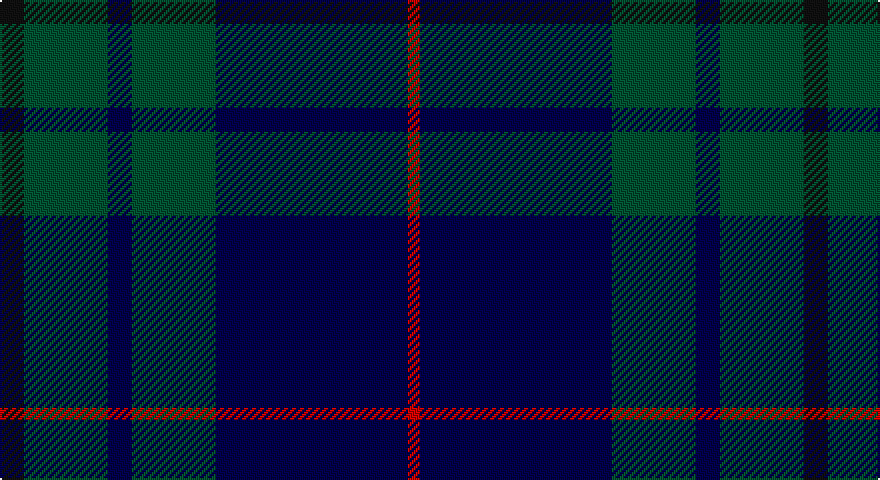

This page is one **sett** — a single exact thread-count. It belongs to the [tartan](/setts/k2dg7db2dg7db16r1/)
(the same proportion at any scale), whose colour order is pattern [KGBGBR](/stripes/kgbgbr/).

Sourced from register-of-tartans.  It is a [6 stripe tartan](/stripes/stripes6/).

Original link https://www.tartanregister.gov.uk/tartanDetails.aspx?ref=1801

2 attestations — the source records this cloth was collapsed from (oldest owns this page)

<ul>
<li>01/01/2004 — Hutton (register-of-tartans, <a href="https://www.tartanregister.gov.uk/tartanDetails.aspx?ref=1801">record</a>)</li>
<li>2004 — Hutton (Name) (tartans-authority, <a href="http://www.tartansauthority.com/tartan-ferret/display/7027/">record</a>)</li>
</ul>

## Register references

External register numbers recorded for this tartan.

- Scottish Register of Tartans: [1801](https://www.tartanregister.gov.uk/tartanDetails.aspx?ref=1801)
- Scottish Tartans Authority (ITI): 7027

## Thread count
K/12 Gb42 DBa12 Gb42 DBa96 R/6

One full sett is **402 threads**.

## Palette

Palette: <strong>Tartan Register</strong> <small style="color:#888">(5 of 7 colours)</small>
<table><thead><tr><th>Colour</th><th>Threads</th><th>Shade</th><th>Base</th><th>OKLCh</th></tr></thead><tbody><tr><td>K/</td><td style="text-align:right;font-variant-numeric:tabular-nums">12</td><td><code style="background-color:#101010;">#101010</code> <small style="color:#888">#101010</small></td><td>K <code style="background-color:#000000;">#000000</code></td><td><small style="color:#888">oklch(17.3% 0.000 89.9)</small></td></tr><tr><td>Gb</td><td style="text-align:right;font-variant-numeric:tabular-nums">42</td><td><code style="background-color:#005030;">#005030</code> <small style="color:#888">#005030</small></td><td>G <code style="background-color:#006100;">#006100</code></td><td><small style="color:#888">oklch(38.0% 0.088 158.4)</small></td></tr><tr><td>DBa</td><td style="text-align:right;font-variant-numeric:tabular-nums">12</td><td><code style="background-color:#00004C;">#00004C</code> <small style="color:#888">#00004C</small></td><td>B <code style="background-color:#2A418A;">#2A418A</code></td><td><small style="color:#888">oklch(18.8% 0.130 264.1)</small></td></tr><tr><td>Gb</td><td style="text-align:right;font-variant-numeric:tabular-nums">42</td><td><code style="background-color:#005030;">#005030</code> <small style="color:#888">#005030</small></td><td>G <code style="background-color:#006100;">#006100</code></td><td><small style="color:#888">oklch(38.0% 0.088 158.4)</small></td></tr><tr><td>DBa</td><td style="text-align:right;font-variant-numeric:tabular-nums">96</td><td><code style="background-color:#00004C;">#00004C</code> <small style="color:#888">#00004C</small></td><td>B <code style="background-color:#2A418A;">#2A418A</code></td><td><small style="color:#888">oklch(18.8% 0.130 264.1)</small></td></tr><tr><td>R/</td><td style="text-align:right;font-variant-numeric:tabular-nums">6</td><td><code style="background-color:#C80000;">#C80000</code> <small style="color:#888">#C80000</small></td><td>R <code style="background-color:#CC0000;">#CC0000</code></td><td><small style="color:#888">oklch(52.3% 0.215 29.2)</small></td></tr></tbody></table>

# Sample pattern

## Nearest tartans

The nearest existing variants by ΔTartan distance, with this tartan at the top so the swatches line up against it.

ΔTartan

Tartan

Sett

—

<a href="/ttd/edit/#slug=k2dg7db2dg7db16r1~x6">Hutton</a> <a class="nn-out" href="/variants/s6/k2dg7db2dg7db16r1~x6/" title="open its dictionary page">↗</a>

0.72

<a href="/ttd/edit/#slug=db4dbi1dg14db14r1~x4&amp;base=k2dg7db2dg7db16r1~x6">Wcwm 1255-1</a> <a class="nn-out" href="/variants/s5/db4dbi1dg14db14r1~x4/" title="open its dictionary page">↗</a>

1.19

<a href="/ttd/edit/#slug=k4r1k4r1dg14n1dg1~x4&amp;base=k2dg7db2dg7db16r1~x6">Pinehurst Resort</a> <a class="nn-out" href="/variants/s7/k4r1k4r1dg14n1dg1~x4/" title="open its dictionary page">↗</a>

1.22

<a href="/ttd/edit/#slug=db37r10dg22db11dg3r3~x2&amp;base=k2dg7db2dg7db16r1~x6">Perthshire, New /Tourist Board</a> <a class="nn-out" href="/variants/s6/db37r10dg22db11dg3r3~x2/" title="open its dictionary page">↗</a>

1.25

<a href="/ttd/edit/#slug=db26dg6db2dg17dy4w1dy4~x4&amp;base=k2dg7db2dg7db16r1~x6">Doral</a> <a class="nn-out" href="/variants/s7/db26dg6db2dg17dy4w1dy4~x4/" title="open its dictionary page">↗</a>

1.26

<a href="/ttd/edit/#slug=k4ly1k18db18lb1db4~x4&amp;base=k2dg7db2dg7db16r1~x6">Lyndon Prep (School)</a> <a class="nn-out" href="/variants/s6/k4ly1k18db18lb1db4~x4/" title="open its dictionary page">↗</a>

1.29

<a href="/ttd/edit/#slug=k10db4k34dt2k2dt30w3~x2&amp;base=k2dg7db2dg7db16r1~x6">Patriot, The (Fashion)</a> <a class="nn-out" href="/variants/s7/k10db4k34dt2k2dt30w3~x2/" title="open its dictionary page">↗</a>

1.32

<a href="/ttd/edit/#slug=n4db43k20n7o2~x2&amp;base=k2dg7db2dg7db16r1~x6">Deighan (Burham Kent) (Name)</a> <a class="nn-out" href="/variants/s5/n4db43k20n7o2~x2/" title="open its dictionary page">↗</a>

1.34

<a href="/ttd/edit/#slug=dg1db16dg16r1~x2&amp;base=k2dg7db2dg7db16r1~x6">Barclay Hunting</a> <a class="nn-out" href="/variants/s4/dg1db16dg16r1~x2/" title="open its dictionary page">↗</a>

1.35

<a href="/ttd/edit/#slug=k4r2k12db12k1lo2~x2&amp;base=k2dg7db2dg7db16r1~x6">Robert Gordon University</a> <a class="nn-out" href="/variants/s6/k4r2k12db12k1lo2~x2/" title="open its dictionary page">↗</a>

1.39

<a href="/ttd/edit/#slug=g26db10k3db2dy2db10~x4&amp;base=k2dg7db2dg7db16r1~x6">St. Andrews Old Course Hotel (Corp)</a> <a class="nn-out" href="/variants/s6/g26db10k3db2dy2db10~x4/" title="open its dictionary page">↗</a>

## Neighbour map

Every grey dot is one of 14360 variants placed by the first two principal components of the ΔTartan feature space (44% of its variance). Red is this tartan; blue dots are its nearest — click one to open its page.

<svg viewBox="0 0 640 380" role="img" style="max-width:100%;height:auto;border:1px solid #e0e0e0;border-radius:4px;display:block" xmlns="http://www.w3.org/2000/svg"><image href="/nn/cloud.v1.png" width="640" height="380"/><a href="/variants/s5/db4dbi1dg14db14r1~x4/"><circle cx="360.1" cy="243.3" r="4" fill="#3465a4"><title>Wcwm 1255-1</title></circle></a><a href="/variants/s7/k4r1k4r1dg14n1dg1~x4/"><circle cx="393.1" cy="207.8" r="4" fill="#3465a4"><title>Pinehurst Resort</title></circle></a><a href="/variants/s6/db37r10dg22db11dg3r3~x2/"><circle cx="387.9" cy="266.5" r="4" fill="#3465a4"><title>Perthshire, New /Tourist Board</title></circle></a><a href="/variants/s7/db26dg6db2dg17dy4w1dy4~x4/"><circle cx="348.9" cy="199.8" r="4" fill="#3465a4"><title>Doral</title></circle></a><a href="/variants/s6/k4ly1k18db18lb1db4~x4/"><circle cx="368.2" cy="220.1" r="4" fill="#3465a4"><title>Lyndon Prep (School)</title></circle></a><a href="/variants/s7/k10db4k34dt2k2dt30w3~x2/"><circle cx="388.5" cy="211.4" r="4" fill="#3465a4"><title>Patriot, The (Fashion)</title></circle></a><a href="/variants/s5/n4db43k20n7o2~x2/"><circle cx="403.1" cy="226.2" r="4" fill="#3465a4"><title>Deighan (Burham Kent) (Name)</title></circle></a><a href="/variants/s4/dg1db16dg16r1~x2/"><circle cx="400.4" cy="270.1" r="4" fill="#3465a4"><title>Barclay Hunting</title></circle></a><a href="/variants/s6/k4r2k12db12k1lo2~x2/"><circle cx="338.6" cy="238.5" r="4" fill="#3465a4"><title>Robert Gordon University</title></circle></a><a href="/variants/s6/g26db10k3db2dy2db10~x4/"><circle cx="315.5" cy="218.3" r="4" fill="#3465a4"><title>St. Andrews Old Course Hotel (Corp)</title></circle></a><circle cx="360.6" cy="235.5" r="5" fill="#c00000"/></svg>

ID: /variants/s6/k2dg7db2dg7db16r1~x6/
