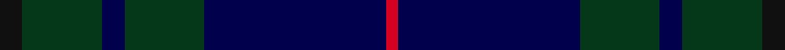

This is one **variant** — a specific cloth: this exact thread count and colourway, with its own
provenance below. It is one weaving of the [sett](/setts/k2dg7db2dg7db16r1/) (the scale-free proportion — the
same cloth at any scale or shade), whose colour order is pattern [KGBGBR](/stripes/kgbgbr/).

Part of the [Hutton](/tartans/h/hu/hutton/) tartan — the named design grouping this sett with its other cloths.

Sourced from tartans-authority.  It is a [6 stripe tartan](/stripes/stripes6/).

Original link [https://www.tartanregister.gov.uk/tartanDetails.aspx?ref=7027](https://www.tartanregister.gov.uk/tartanDetails.aspx?ref=7027)

Dataset <small>— provenance for this record, inherited from the source manifest</small>

<dl class="dataset-prov">
<dt>source</dt><dd><a href="/sources/tartans-authority/">Scottish Tartans Authority</a></dd>
<dt>data captured from</dt><dd><a href="https://github.com/thetartan/tartan-database/blob/master/data/tartans-authority/data.csv">https://github.com/thetartan/tartan-database/blob/master/data/tartans-authority/data.csv</a></dd>
<dt>data date</dt><dd>2004 <small>(this record)</small></dd>
<dt>licence</dt><dd><a href="https://creativecommons.org/licenses/by-nc-nd/4.0/">CC BY-NC-ND 4.0</a></dd>
</dl>

Capture chain <small>— the hands this data passed through, oldest first; each capture carries its own licence</small>

<ol class="capture-chain">
<li><a href="https://www.tartansauthority.com/">Scottish Tartans Authority</a> <small>the heritage body's archive — its tartan-ferret record browser is retired (links repaired to the SRT, above)</small></li>
<li><a href="https://github.com/thetartan/tartan-database">thetartan/tartan-database</a> <small>2016-2017</small> · <a href="https://creativecommons.org/licenses/by-nc-nd/4.0/">CC BY-NC-ND 4.0</a> <small>Levko Kravets's frozen compilation — the capture we vendored, and where its CC licence text came from</small></li>
<li>this dictionary <small>captured 2026-06-10 · commit 5bf86c7566</small> <small>each re-capture is a git commit to data/sources</small></li>
</ol>

## Register references

External register numbers recorded for this tartan.

- Scottish Tartans Authority (ITI): 7027

## Thread count
K/12 DG42 DB12 DG42 DB96 R/6

One full sett is **402 threads**.

## Palette
<table><thead><tr><th>Colour</th><th>Shade</th><th>OKLCh</th></tr></thead><tbody><tr><td>DB</td><td><code style="background-color:#00004C;">#00004C</code> <small style="color:#888">#00004C</small></td><td><small style="color:#888">oklch(18.8% 0.130 264.1)</small></td></tr><tr><td>DG</td><td><code style="background-color:#053819;">#053819</code> <small style="color:#888">#053819</small></td><td><small style="color:#888">oklch(30.0% 0.075 151.3)</small></td></tr><tr><td>K</td><td><code style="background-color:#101010;">#101010</code> <small style="color:#888">#101010</small></td><td><small style="color:#888">oklch(17.3% 0.000 89.9)</small></td></tr><tr><td>R</td><td><code style="background-color:#D60020;">#D60020</code> <small style="color:#888">#D60020</small></td><td><small style="color:#888">oklch(55.2% 0.224 25.5)</small></td></tr></tbody></table>

# Sample pattern

## Nearest tartan variants

The nearest existing variants by ΔTartan distance, with this cloth at the top so the swatches line up against it.

ΔTartan

Threads

Variant

Sett

—

402

<a href="/variants/s6/k2dg7db2dg7db16r1~x6~k0700000-db0805267/">Hutton (Name)</a>

<a href="/ttd/edit/#slug=k2dg7db2dg7db16r1~x6~k0700000-dg1504158-db0805267&amp;base=k2dg7db2dg7db16r1~x6~k0700000-db0805267" title="compare in the TTD">0.07</a>

402

<a href="/variants/s6/k2dg7db2dg7db16r1~x6~k0700000-dg1504158-db0805267/">Hutton</a>

<a href="/ttd/edit/#slug=o4dg9w2dg24db37r3~x2&amp;base=k2dg7db2dg7db16r1~x6~k0700000-db0805267" title="compare in the TTD">1.70</a>

302

<a href="/variants/s6/o4dg9w2dg24db37r3~x2/">Hardie (Name)</a>

<a href="/ttd/edit/#slug=dg30db4dg2k20db18r1db4~x2&amp;base=k2dg7db2dg7db16r1~x6~k0700000-db0805267" title="compare in the TTD">1.81</a>

248

<a href="/variants/s7/dg30db4dg2k20db18r1db4~x2/">MacTaggart</a>

<a href="/ttd/edit/#slug=lb8n4db30dt30r3dt4~x2~db1406275&amp;base=k2dg7db2dg7db16r1~x6~k0700000-db0805267" title="compare in the TTD">2.40</a>

292

<a href="/variants/s6/lb8n4db30dt30r3dt4~x2~db1406275/">Hutchesons' Grammar School</a>

<a href="/ttd/edit/#slug=dp3dt15db15r2db15y3~x2&amp;base=k2dg7db2dg7db16r1~x6~k0700000-db0805267" title="compare in the TTD">2.49</a>

200

<a href="/variants/s6/dp3dt15db15r2db15y3~x2/">H.M.S. DUNCAN</a>

<a href="/ttd/edit/#slug=dp6r2dp1dg25db16k2db4~x2&amp;base=k2dg7db2dg7db16r1~x6~k0700000-db0805267" title="compare in the TTD">2.56</a>

204

<a href="/variants/s7/dp6r2dp1dg25db16k2db4~x2/">Laurie</a>

<a href="/ttd/edit/#slug=dt45db7w3db27r1db7~x2&amp;base=k2dg7db2dg7db16r1~x6~k0700000-db0805267" title="compare in the TTD">2.59</a>

256

<a href="/variants/s6/dt45db7w3db27r1db7~x2/">U.S. Navy/Edzell (Military)</a>

<a href="/ttd/edit/#slug=db50dg26k9dg4w2r2dg10~x2&amp;base=k2dg7db2dg7db16r1~x6~k0700000-db0805267" title="compare in the TTD">2.83</a>

292

<a href="/variants/s7/db50dg26k9dg4w2r2dg10~x2/">Java St Andrew Society hunting</a>

<a href="/ttd/edit/#slug=r3dg10r3dg14db16dg3dy2~x2&amp;base=k2dg7db2dg7db16r1~x6~k0700000-db0805267" title="compare in the TTD">2.93</a>

194

<a href="/variants/s7/r3dg10r3dg14db16dg3dy2~x2/">Cameron of Locheil Htg (1952) (Clan)</a>

<a href="/ttd/edit/#slug=db14k5dp5k5db14dg32dr4~x2&amp;base=k2dg7db2dg7db16r1~x6~k0700000-db0805267" title="compare in the TTD">3.01</a>

280

<a href="/variants/s7/db14k5dp5k5db14dg32dr4~x2/">Bennachie Whisky (Corporate)</a>

## Neighbour map

Every grey dot is one of 13621 variants placed by the first two principal components of the ΔTartan feature space (42% of its variance). Red is this tartan; blue dots are its nearest — click one to open its page.

<svg viewBox="0 0 640 380" role="img" style="max-width:100%;height:auto;border:1px solid #e0e0e0;border-radius:4px;display:block" xmlns="http://www.w3.org/2000/svg"><image href="/nn/cloud.v1.png" width="640" height="380"/><a href="/variants/s6/k2dg7db2dg7db16r1~x6~k0700000-dg1504158-db0805267/"><circle cx="364.9" cy="204.7" r="4" fill="#3465a4"><title>Hutton</title></circle></a><a href="/variants/s6/o4dg9w2dg24db37r3~x2/"><circle cx="329.3" cy="183.1" r="4" fill="#3465a4"><title>Hardie (Name)</title></circle></a><a href="/variants/s7/dg30db4dg2k20db18r1db4~x2/"><circle cx="300.1" cy="168.0" r="4" fill="#3465a4"><title>MacTaggart</title></circle></a><a href="/variants/s6/lb8n4db30dt30r3dt4~x2~db1406275/"><circle cx="312.1" cy="211.0" r="4" fill="#3465a4"><title>Hutchesons' Grammar School</title></circle></a><a href="/variants/s6/dp3dt15db15r2db15y3~x2/"><circle cx="397.2" cy="268.3" r="4" fill="#3465a4"><title>H.M.S. DUNCAN</title></circle></a><a href="/variants/s7/dp6r2dp1dg25db16k2db4~x2/"><circle cx="355.7" cy="171.1" r="4" fill="#3465a4"><title>Laurie</title></circle></a><a href="/variants/s6/dt45db7w3db27r1db7~x2/"><circle cx="461.0" cy="181.4" r="4" fill="#3465a4"><title>U.S. Navy/Edzell (Military)</title></circle></a><a href="/variants/s7/db50dg26k9dg4w2r2dg10~x2/"><circle cx="330.3" cy="146.9" r="4" fill="#3465a4"><title>Java St Andrew Society hunting</title></circle></a><a href="/variants/s7/r3dg10r3dg14db16dg3dy2~x2/"><circle cx="345.8" cy="248.5" r="4" fill="#3465a4"><title>Cameron of Locheil Htg (1952) (Clan)</title></circle></a><a href="/variants/s7/db14k5dp5k5db14dg32dr4~x2/"><circle cx="269.8" cy="226.0" r="4" fill="#3465a4"><title>Bennachie Whisky (Corporate)</title></circle></a><circle cx="408.5" cy="219.4" r="5" fill="#c00000"/><text x="320" y="376" text-anchor="middle" font-size="11" fill="#999">ground</text><text x="11" y="190" text-anchor="middle" font-size="11" fill="#999" transform="rotate(-90 11 190)">complexity</text></svg>

ID: /variants/s6/k2dg7db2dg7db16r1~x6~k0700000-db0805267/
