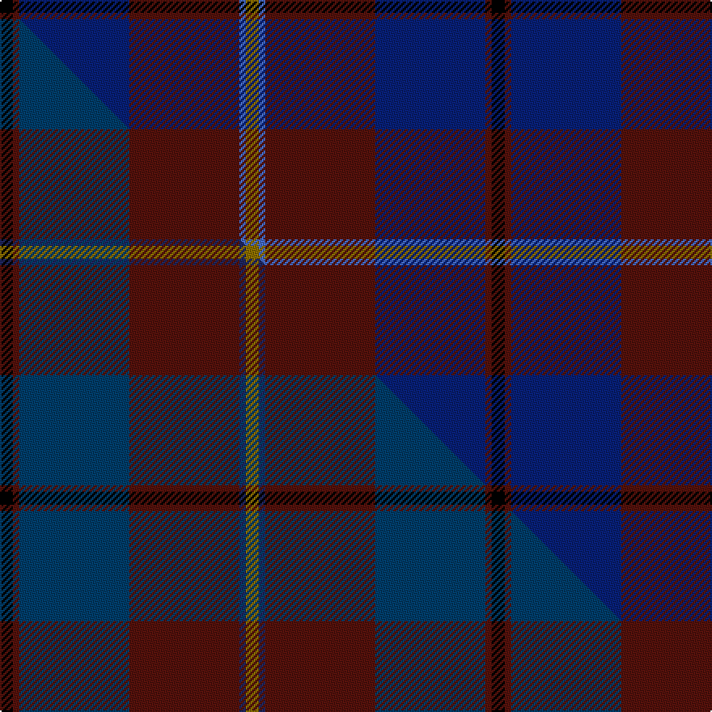

This is one **variant** — a specific cloth: this exact thread count and colourway, with its own
provenance below. It is one weaving of the [sett](/tartans/m/mu/murdoch/) (the scale-free proportion — the
same cloth at any scale or shade), whose colour order is pattern [GBBBBK](/stripes/gbbbbk/).

Part of the [Murdoch](/tartans/m/mu/murdoch/) tartan — the named design grouping this sett with its other cloths.

Sourced from weddslist.  It is a [6 stripe tartan](/stripes/stripes6/).

Original link [http://www.weddslist.com/cgi-bin/tartans/pg.pl?source=sts](http://www.weddslist.com/cgi-bin/tartans/pg.pl?source=sts)

Dataset <small>— provenance for this record, inherited from the source manifest</small>

<dl class="dataset-prov">
<dt>source</dt><dd><a href="/sources/weddslist/">Weddslist</a></dd>
<dt>data captured from</dt><dd><a href="https://github.com/thetartan/tartan-database/blob/master/data/weddslist/data.csv">https://github.com/thetartan/tartan-database/blob/master/data/weddslist/data.csv</a></dd>
<dt>data date</dt><dd>2016-11-17 <small>(dataset default)</small></dd>
<dt>licence</dt><dd><a href="https://creativecommons.org/licenses/by-nc-nd/4.0/">CC BY-NC-ND 4.0</a></dd>
</dl>

Capture chain <small>— the hands this data passed through, oldest first; each capture carries its own licence</small>

<ol class="capture-chain">
<li><a href="https://www.weddslist.com/tartans/">Weddslist</a> <small>the living privately compiled reference</small></li>
<li><a href="https://github.com/thetartan/tartan-database">thetartan/tartan-database</a> <small>2016-2017</small> · <a href="https://creativecommons.org/licenses/by-nc-nd/4.0/">CC BY-NC-ND 4.0</a> <small>Levko Kravets's frozen compilation — the capture we vendored, and where its CC licence text came from</small></li>
<li>this dictionary <small>captured 2026-06-10 · commit 5bf86c7566</small> <small>each re-capture is a git commit to data/sources</small></li>
</ol>

## Thread count
K/8 DR4 DB68 DR68 B4 Y/8

One full sett is **304 threads**.

## Palette
<table><thead><tr><th>Colour</th><th>Shade</th><th>OKLCh</th></tr></thead><tbody><tr><td>DB</td><td><code style="background-color:#082077;">#082077</code> <small style="color:#888">#082077</small></td><td><small style="color:#888">oklch(30.0% 0.149 265.1)</small></td></tr><tr><td>B</td><td><code style="background-color:#466CC8;">#466CC8</code> <small style="color:#888">#466CC8</small></td><td><small style="color:#888">oklch(55.1% 0.149 265.0)</small></td></tr><tr><td>DR</td><td><code style="background-color:#55120C;">#55120C</code> <small style="color:#888">#55120C</small></td><td><small style="color:#888">oklch(30.0% 0.099 29.3)</small></td></tr><tr><td>K</td><td><code style="background-color:#000000;">#000000</code> <small style="color:#888">#000000</small></td><td><small style="color:#888">oklch(0.0% 0.000 0.0)</small></td></tr><tr><td>Y</td><td><code style="background-color:#8B6E00;">#8B6E00</code> <small style="color:#888">#8B6E00</small></td><td><small style="color:#888">oklch(55.1% 0.113 90.4)</small></td></tr></tbody></table>

# Sample pattern

## Compared to the master

This cloth is one sett of its design; the master sett (the exemplar the design is anchored on) is below for comparison.

Its **ΔTartan distance** from the master is **2.21** — the same measure the nearest-tartans table ranks by (0 is identical; a re-scale of the same cloth is near 0, a recolour or a different proportion further).

<figure class="master-compare" style="margin:0">

this sett
master sett ★

<figcaption style="color:#888;font-size:smaller">One weave of this sett against the <a href="/setts/k2dr1dbi17dr17db1y2/">master sett ★</a>, split on the diagonal: a shared proportion runs seamlessly across it with only the shades shifting; a different proportion breaks on it.</figcaption>
</figure>

## Nearest tartan variants

The nearest existing variants by ΔTartan distance, with this cloth at the top so the swatches line up against it.

ΔTartan

Threads

Variant

Sett

—

304

<a href="/variants/s6/k2dr1db17dr17b1y2~x4/">Murdoch</a>

<a href="/ttd/edit/#slug=k5r3k27ki37r5g2y2~x2~ki0604259&amp;base=k2dr1db17dr17b1y2~x4" title="compare in the TTD">2.17</a>

310

<a href="/variants/s7/k5r3k27ki37r5g2y2~x2~ki0604259/">Royal Marines Condor</a>

<a href="/ttd/edit/#slug=k2dr1db17dr17dt1y2~x4~db1404245-dt1204274&amp;base=k2dr1db17dr17b1y2~x4" title="compare in the TTD">2.22</a>

304

<a href="/variants/s6/k2dr1dbi17dr17db1y2~x4~dbi1404245-db1204274/">Murdoch (Geoffrey)</a>

<a href="/ttd/edit/#slug=db30y3o11y3n33r6~x2&amp;base=k2dr1db17dr17b1y2~x4" title="compare in the TTD">2.30</a>

272

<a href="/variants/s6/db30y3o11y3n33r6~x2/">Balfour</a>

<a href="/ttd/edit/#slug=db3dg1dr22k12db28w3~x2~db1405255-k0604259&amp;base=k2dr1db17dr17b1y2~x4" title="compare in the TTD">2.34</a>

264

<a href="/variants/s6/db3dg1dr22k12db28w3~x2~db1405255-k0604259/">Diaspora</a>

<a href="/ttd/edit/#slug=k4dr2lr2dr28db27dr2k2lo2~x2&amp;base=k2dr1db17dr17b1y2~x4" title="compare in the TTD">2.45</a>

264

<a href="/variants/s8/k4dr2lr2dr28db27dr2k2lo2~x2/">Toronto Fire Services (Corporate)</a>

<a href="/ttd/edit/#slug=dp2o1dp10db1n10k1n2~x4&amp;base=k2dr1db17dr17b1y2~x4" title="compare in the TTD">2.48</a>

200

<a href="/variants/s7/dp2o1dp10db1n10k1n2~x4/">Lennox Primary School</a>

<a href="/ttd/edit/#slug=k3g2m3db30dp32w3~x2&amp;base=k2dr1db17dr17b1y2~x4" title="compare in the TTD">2.68</a>

280

<a href="/variants/s6/k3g2m3db30dp32w3~x2/">Pride of Glencoe</a>

<a href="/ttd/edit/#slug=dr32r2g2db30dr1db2ly1~x2&amp;base=k2dr1db17dr17b1y2~x4" title="compare in the TTD">2.69</a>

214

<a href="/variants/s7/dr32r2g2db30dr1db2ly1~x2/">Highland Prince (Fashion)</a>

<a href="/ttd/edit/#slug=k4db4k2db4k2db22dy27y2r3~x2&amp;base=k2dr1db17dr17b1y2~x4" title="compare in the TTD">2.71</a>

266

<a href="/variants/s9/k4db4k2db4k2db22dy27y2r3~x2/">Falkirk (District)</a>

<a href="/ttd/edit/#slug=k8dr4k36db48dr6dg3lo2~x2&amp;base=k2dr1db17dr17b1y2~x4" title="compare in the TTD">2.77</a>

408

<a href="/variants/s7/k8dr4k36db48dr6dg3lo2~x2/">Royal Marines Condor (Military)</a>

## Neighbour map

Every grey dot is one of 13657 variants placed by the first two principal components of the ΔTartan feature space (42% of its variance). Red is this tartan; blue dots are its nearest — click one to open its page. The map is a flat projection of a many-dimensional space — [how to read it](/posts/neighbourhood-maps/).

<svg viewBox="0 0 640 380" role="img" style="max-width:100%;height:auto;border:1px solid #e0e0e0;border-radius:4px;display:block" xmlns="http://www.w3.org/2000/svg"><image href="/nn/cloud.v1.png" width="640" height="380"/><a href="/variants/s7/k5r3k27ki37r5g2y2~x2~ki0604259/"><circle cx="266.2" cy="132.9" r="4" fill="#3465a4"><title>Royal Marines Condor</title></circle></a><a href="/variants/s6/k2dr1dbi17dr17db1y2~x4~dbi1404245-db1204274/"><circle cx="373.4" cy="184.9" r="4" fill="#3465a4"><title>Murdoch (Geoffrey)</title></circle></a><a href="/variants/s6/db30y3o11y3n33r6~x2/"><circle cx="270.2" cy="219.4" r="4" fill="#3465a4"><title>Balfour</title></circle></a><a href="/variants/s6/db3dg1dr22k12db28w3~x2~db1405255-k0604259/"><circle cx="290.1" cy="160.6" r="4" fill="#3465a4"><title>Diaspora</title></circle></a><a href="/variants/s8/k4dr2lr2dr28db27dr2k2lo2~x2/"><circle cx="293.8" cy="142.5" r="4" fill="#3465a4"><title>Toronto Fire Services (Corporate)</title></circle></a><a href="/variants/s7/dp2o1dp10db1n10k1n2~x4/"><circle cx="324.0" cy="193.3" r="4" fill="#3465a4"><title>Lennox Primary School</title></circle></a><a href="/variants/s6/k3g2m3db30dp32w3~x2/"><circle cx="272.4" cy="147.6" r="4" fill="#3465a4"><title>Pride of Glencoe</title></circle></a><a href="/variants/s7/dr32r2g2db30dr1db2ly1~x2/"><circle cx="404.9" cy="139.9" r="4" fill="#3465a4"><title>Highland Prince (Fashion)</title></circle></a><a href="/variants/s9/k4db4k2db4k2db22dy27y2r3~x2/"><circle cx="278.8" cy="153.1" r="4" fill="#3465a4"><title>Falkirk (District)</title></circle></a><a href="/variants/s7/k8dr4k36db48dr6dg3lo2~x2/"><circle cx="288.1" cy="134.1" r="4" fill="#3465a4"><title>Royal Marines Condor (Military)</title></circle></a><circle cx="335.8" cy="169.9" r="5" fill="#c00000"/><text x="320" y="376" text-anchor="middle" font-size="11" fill="#999">ground</text><text x="11" y="190" text-anchor="middle" font-size="11" fill="#999" transform="rotate(-90 11 190)">complexity</text></svg>

ID: /variants/s6/k2dr1db17dr17b1y2~x4/
