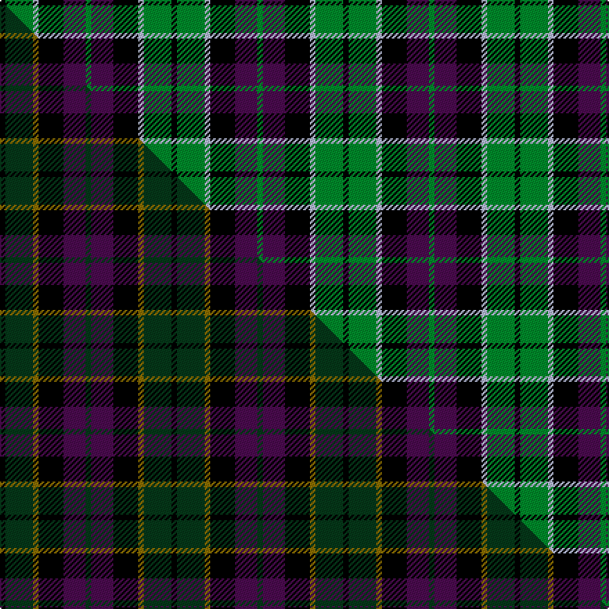

This page is one **sett** — a single exact thread-count. It belongs to the [tartan](/setts/k2g10lb2k9dp8g2/)
(the same proportion at any scale), whose colour order is pattern [GBKWGK](/stripes/gbkwgk/).

Part of the [Lennie](/tartans/lennie/) tartan — the named design grouping this sett with its other cloths.

Sourced from weddslist.  It is a [6 stripe tartan](/stripes/stripes6/).

Original link [http://www.weddslist.com/cgi-bin/tartans/pg.pl?source=sts](http://www.weddslist.com/cgi-bin/tartans/pg.pl?source=sts)

## Provenance

Earliest known date: 1819 Wilson's No 231.

2 attestations — the source records this cloth was collapsed from (oldest owns this page)

<ul>
<li>undated — Lennie (weddslist, <a href="http://www.weddslist.com/cgi-bin/tartans/pg.pl?source=sts">record</a>) </li>
<li>undated — Lennie Family Tartan (house-of-tartan, <a href="http://www.house-of-tartan.scotland.net/house/TartanViewjs.asp?colr=Def&tnam=725">record</a>) </li>
</ul>

Dataset <small>— provenance for this record, inherited from the source manifest</small>

<dl class="dataset-prov">
<dt>source</dt><dd><a href="/sources/weddslist/">Weddslist</a></dd>
<dt>data captured from</dt><dd><a href="https://github.com/thetartan/tartan-database/blob/master/data/weddslist/data.csv">https://github.com/thetartan/tartan-database/blob/master/data/weddslist/data.csv</a></dd>
<dt>data date</dt><dd>2016-11-17 <small>(dataset default)</small></dd>
<dt>licence</dt><dd><a href="https://creativecommons.org/licenses/by-nc-nd/4.0/">CC BY-NC-ND 4.0</a></dd>
</dl>

Capture chain <small>— the hands this data passed through, oldest first; each capture carries its own licence</small>

<ol class="capture-chain">
<li><a href="https://www.weddslist.com/tartans/">Weddslist</a> <small>the living privately compiled reference</small></li>
<li><a href="https://github.com/thetartan/tartan-database">thetartan/tartan-database</a> <small>2016-2017</small> · <a href="https://creativecommons.org/licenses/by-nc-nd/4.0/">CC BY-NC-ND 4.0</a> <small>Levko Kravets's frozen compilation — the capture we vendored, and where its CC licence text came from</small></li>
<li>this dictionary <small>captured 2026-06-10 · commit 5bf86c7566</small> <small>each re-capture is a git commit to data/sources</small></li>
</ol>

## Thread count
K/4 G20 LB4 K18 DP16 G/4

One full sett is **124 threads**.

## Palette
<table><thead><tr><th>Colour</th><th>Shade</th><th>OKLCh</th></tr></thead><tbody><tr><td>LB</td><td><code style="background-color:#B5BBDE;">#B5BBDE</code> <small style="color:#888">#B5BBDE</small></td><td><small style="color:#888">oklch(79.9% 0.050 277.6)</small></td></tr><tr><td>G</td><td><code style="background-color:#008B2A;">#008B2A</code> <small style="color:#888">#008B2A</small></td><td><small style="color:#888">oklch(55.4% 0.170 145.9)</small></td></tr><tr><td>K</td><td><code style="background-color:#000000;">#000000</code> <small style="color:#888">#000000</small></td><td><small style="color:#888">oklch(0.0% 0.000 0.0)</small></td></tr><tr><td>DP</td><td><code style="background-color:#4B0B4F;">#4B0B4F</code> <small style="color:#888">#4B0B4F</small></td><td><small style="color:#888">oklch(30.1% 0.125 325.4)</small></td></tr></tbody></table>

# Sample pattern

## Compared to the master

This cloth is one sett of its design; the master sett (the exemplar the design is anchored on) is below for comparison.

Its **ΔTartan distance** from the master is **0.41** — the same measure the nearest-tartans table ranks by (0 is identical; a re-scale of the same cloth is near 0, a recolour or a different proportion further).

<figure class="master-compare" style="margin:0">

this sett
master sett ★

<figcaption style="color:#888;font-size:smaller">One weave of this sett against the <a href="/setts/k2dg10y2k9dp8dg2/">master sett ★</a>, split on the diagonal: a shared proportion runs seamlessly across it with only the shades shifting; a different proportion breaks on it.</figcaption>
</figure>

## Nearest tartan variants

The nearest existing variants by ΔTartan distance, with this cloth at the top so the swatches line up against it.

ΔTartan

Threads

Variant

Sett

—

124

<a href="/variants/s6/k2g10lb2k9dp8g2~x2/">Lennie</a>

<a href="/ttd/edit/#slug=k3g17w2k18dp17g3~x2&amp;base=k2g10lb2k9dp8g2~x2" title="compare in the TTD">0.84</a>

228

<a href="/variants/s6/k3g17w2k18dp17g3~x2/">Wilson's, No 76</a>

<a href="/ttd/edit/#slug=k3g17y2k18dp17g3~x2&amp;base=k2g10lb2k9dp8g2~x2" title="compare in the TTD">0.84</a>

228

<a href="/variants/s6/k3g17y2k18dp17g3~x2/">Wilson's No.100</a>

<a href="/ttd/edit/#slug=k2g7lb1k6r4g2~x4&amp;base=k2g10lb2k9dp8g2~x2" title="compare in the TTD">1.37</a>

160

<a href="/variants/s6/k2g7lb1k6r4g2~x4/">Walker, James</a>

<a href="/ttd/edit/#slug=k2g8db2k9dp7k2~x2&amp;base=k2g10lb2k9dp8g2~x2" title="compare in the TTD">1.42</a>

112

<a href="/variants/s6/k2g8db2k9dp7k2~x2/">Campbell, Sir Walter Scott</a>

<a href="/ttd/edit/#slug=k3dp9k11lb2g9k3~x2&amp;base=k2g10lb2k9dp8g2~x2" title="compare in the TTD">1.55</a>

136

<a href="/variants/s6/k3dp9k11lb2g9k3~x2/">Scott, Sir Walter</a>

<a href="/ttd/edit/#slug=k4g19k16w2db15g4~x2&amp;base=k2g10lb2k9dp8g2~x2" title="compare in the TTD">1.89</a>

224

<a href="/variants/s6/k4g19k16w2db15g4~x2/">Graham of Montrose</a>

<a href="/ttd/edit/#slug=k4g25k24r3db24g4~x2&amp;base=k2g10lb2k9dp8g2~x2" title="compare in the TTD">1.90</a>

320

<a href="/variants/s6/k4g25k24r3db24g4~x2/">Ferguson of Balquhidder #2</a>

<a href="/ttd/edit/#slug=db4k3db16k14g14r3g3~x2&amp;base=k2g10lb2k9dp8g2~x2" title="compare in the TTD">1.92</a>

214

<a href="/variants/s7/db4k3db16k14g14r3g3~x2/">Inneryne (Personal)</a>

<a href="/ttd/edit/#slug=w2dp10k10g9k3w2~x2&amp;base=k2g10lb2k9dp8g2~x2" title="compare in the TTD">1.93</a>

136

<a href="/variants/s6/w2dp10k10g9k3w2~x2/">MacNeil 2</a>

<a href="/ttd/edit/#slug=k3g14k14g2db14r3&amp;base=k2g10lb2k9dp8g2~x2" title="compare in the TTD">1.96</a>

94

<a href="/variants/s6/k3g14k14g2db14r3/">Morrison</a>

## Neighbour map

Every grey dot is one of 13621 variants placed by the first two principal components of the ΔTartan feature space (42% of its variance). Red is this tartan; blue dots are its nearest — click one to open its page.

<svg viewBox="0 0 640 380" role="img" style="max-width:100%;height:auto;border:1px solid #e0e0e0;border-radius:4px;display:block" xmlns="http://www.w3.org/2000/svg"><image href="/nn/cloud.v1.png" width="640" height="380"/><a href="/variants/s6/k3g17w2k18dp17g3~x2/"><circle cx="145.8" cy="207.4" r="4" fill="#3465a4"><title>Wilson's, No 76</title></circle></a><a href="/variants/s6/k3g17y2k18dp17g3~x2/"><circle cx="153.4" cy="209.4" r="4" fill="#3465a4"><title>Wilson's No.100</title></circle></a><a href="/variants/s6/k2g7lb1k6r4g2~x4/"><circle cx="140.0" cy="224.6" r="4" fill="#3465a4"><title>Walker, James</title></circle></a><a href="/variants/s6/k2g8db2k9dp7k2~x2/"><circle cx="144.7" cy="241.7" r="4" fill="#3465a4"><title>Campbell, Sir Walter Scott</title></circle></a><a href="/variants/s6/k3dp9k11lb2g9k3~x2/"><circle cx="151.3" cy="233.6" r="4" fill="#3465a4"><title>Scott, Sir Walter</title></circle></a><a href="/variants/s6/k4g19k16w2db15g4~x2/"><circle cx="149.5" cy="212.5" r="4" fill="#3465a4"><title>Graham of Montrose</title></circle></a><a href="/variants/s6/k4g25k24r3db24g4~x2/"><circle cx="142.8" cy="212.4" r="4" fill="#3465a4"><title>Ferguson of Balquhidder #2</title></circle></a><a href="/variants/s7/db4k3db16k14g14r3g3~x2/"><circle cx="126.9" cy="228.4" r="4" fill="#3465a4"><title>Inneryne (Personal)</title></circle></a><a href="/variants/s6/w2dp10k10g9k3w2~x2/"><circle cx="98.9" cy="235.9" r="4" fill="#3465a4"><title>MacNeil 2</title></circle></a><a href="/variants/s6/k3g14k14g2db14r3/"><circle cx="126.6" cy="223.6" r="4" fill="#3465a4"><title>Morrison</title></circle></a><circle cx="120.6" cy="238.6" r="5" fill="#c00000"/><text x="320" y="376" text-anchor="middle" font-size="11" fill="#999">ground</text><text x="11" y="190" text-anchor="middle" font-size="11" fill="#999" transform="rotate(-90 11 190)">complexity</text></svg>

ID: /variants/s6/k2g10lb2k9dp8g2~x2/
