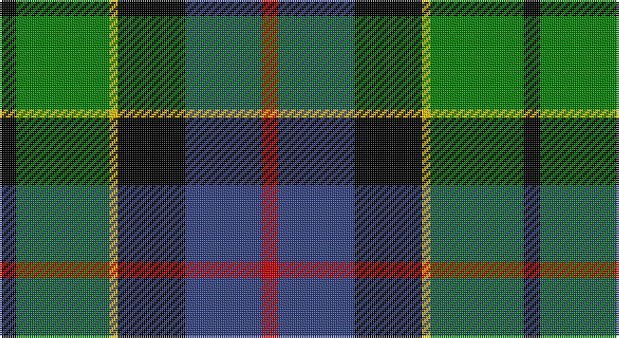

This page is one **sett** — a single exact thread-count. It belongs to the [tartan](/setts/k2g11ly1k8db9r2/)
(the same proportion at any scale), whose colour order is pattern [KGYKBR](/stripes/kgykbr/).

Sourced from weddslist.  It is a [6 stripe tartan](/stripes/stripes6/).

Original link http://www.weddslist.com/cgi-bin/tartans/pg.pl?source=sts

## Provenance

Earliest known date: 1872 (1830) This sett has a close resemblance to the the Leslie tartan in which white replaces yellow. A description of the tartan appears in Jennie Forsyth Jeffrie's 'History of the Forsyth Family' (1918). Clan Chief, Alistair Forsyth, was recognised by Lord Lyon in 1978 - the first for over 300 years.

2 attestations — the source records this cloth was collapsed from (oldest owns this page)

<ul>
<li>undated — Forsyth (weddslist, <a href="http://www.weddslist.com/cgi-bin/tartans/pg.pl?source=sts">record</a>)</li>
<li>undated — Forsyth Clan Tartan (house-of-tartan, <a href="http://www.house-of-tartan.scotland.net/house/TartanViewjs.asp?colr=Def&tnam=1122">record</a>)</li>
</ul>

## Thread count
K/8 G44 Y4 K32 B36 R/8

One full sett is **248 threads**.

## Palette

Palette: <strong>Ingles Buchan</strong> <small style="color:#888">(1 of 5 colours)</small>
<table><thead><tr><th>Colour</th><th>Threads</th><th>Shade</th><th>Base</th><th>OKLCh</th></tr></thead><tbody><tr><td>K/</td><td style="text-align:right;font-variant-numeric:tabular-nums">8</td><td><code style="background-color:#000000;">#000000</code> <small style="color:#888">#000000</small></td><td>K <code style="background-color:#000000;">#000000</code></td><td><small style="color:#888">oklch(0.0% 0.000 0.0)</small></td></tr><tr><td>G</td><td style="text-align:right;font-variant-numeric:tabular-nums">44</td><td><code style="background-color:#008000;">#008000</code> <small style="color:#888">#008000</small></td><td>G <code style="background-color:#006100;">#006100</code></td><td><small style="color:#888">oklch(52.0% 0.177 142.5)</small></td></tr><tr><td>Y</td><td style="text-align:right;font-variant-numeric:tabular-nums">4</td><td><code style="background-color:#F0C000;">#F0C000</code> <small style="color:#888">#F0C000</small></td><td>Y <code style="background-color:#F2BF00;">#F2BF00</code></td><td><small style="color:#888">oklch(82.7% 0.169 90.5)</small></td></tr><tr><td>K</td><td style="text-align:right;font-variant-numeric:tabular-nums">32</td><td><code style="background-color:#000000;">#000000</code> <small style="color:#888">#000000</small></td><td>K <code style="background-color:#000000;">#000000</code></td><td><small style="color:#888">oklch(0.0% 0.000 0.0)</small></td></tr><tr><td>B</td><td style="text-align:right;font-variant-numeric:tabular-nums">36</td><td><code style="background-color:#304080;">#304080</code> <small style="color:#888">#304080</small></td><td>B <code style="background-color:#2A418A;">#2A418A</code></td><td><small style="color:#888">oklch(39.4% 0.109 270.2)</small></td></tr><tr><td>R/</td><td style="text-align:right;font-variant-numeric:tabular-nums">8</td><td><code style="background-color:#C00000;">#C00000</code> <small style="color:#888">#C00000</small></td><td>R <code style="background-color:#CC0000;">#CC0000</code></td><td><small style="color:#888">oklch(50.7% 0.208 29.2)</small></td></tr></tbody></table>

# Sample pattern

## Nearest tartans

The nearest existing variants by ΔTartan distance, with this tartan at the top so the swatches line up against it.

ΔTartan

Tartan

Sett

—

<a href="/ttd/edit/#slug=k2g11ly1k8db9r2~x4">Forsyth</a> <a class="nn-out" href="/variants/s6/k2g11ly1k8db9r2~x4/" title="open its dictionary page">↗</a>

0.41

<a href="/ttd/edit/#slug=k2g11ly1k8b9r2~x4&amp;base=k2g11ly1k8db9r2~x4">Forsyth (1795)</a> <a class="nn-out" href="/variants/s6/k2g11ly1k8b9r2~x4/" title="open its dictionary page">↗</a>

0.42

<a href="/ttd/edit/#slug=k2g12k12r1db12w2~x2&amp;base=k2g11ly1k8db9r2~x4">Russell, or Mitchell or Hunter or Galbraith</a> <a class="nn-out" href="/variants/s6/k2g12k12r1db12w2~x2/" title="open its dictionary page">↗</a>

0.52

<a href="/ttd/edit/#slug=r10db24r4k30g36dbi5&amp;base=k2g11ly1k8db9r2~x4">MacWilliam</a> <a class="nn-out" href="/variants/s6/r10db24r4k30g36dbi5/" title="open its dictionary page">↗</a>

0.54

<a href="/ttd/edit/#slug=w1db8k9g9k1ly1~x4&amp;base=k2g11ly1k8db9r2~x4">MacNeil 4</a> <a class="nn-out" href="/variants/s6/w1db8k9g9k1ly1~x4/" title="open its dictionary page">↗</a>

0.58

<a href="/ttd/edit/#slug=r2db8k8w1g8k1~x2&amp;base=k2g11ly1k8db9r2~x4">Leslie, hunting</a> <a class="nn-out" href="/variants/s6/r2db8k8w1g8k1~x2/" title="open its dictionary page">↗</a>

0.58

<a href="/ttd/edit/#slug=g17ly2k14r2db9r2db10~x2&amp;base=k2g11ly1k8db9r2~x4">MacDonald, (Flora.. )</a> <a class="nn-out" href="/variants/s7/g17ly2k14r2db9r2db10~x2/" title="open its dictionary page">↗</a>

0.59

<a href="/ttd/edit/#slug=r4g16k16db4g3db12ly2~x2&amp;base=k2g11ly1k8db9r2~x4">Junior Chamber International</a> <a class="nn-out" href="/variants/s7/r4g16k16db4g3db12ly2~x2/" title="open its dictionary page">↗</a>

0.67

<a href="/ttd/edit/#slug=r1g14k14r2db14t1~x2&amp;base=k2g11ly1k8db9r2~x4">Wilson's, No 221</a> <a class="nn-out" href="/variants/s6/r1g14k14r2db14t1~x2/" title="open its dictionary page">↗</a>

0.68

<a href="/ttd/edit/#slug=r5g18ly2k14t5k4~x2&amp;base=k2g11ly1k8db9r2~x4">Dahlonega (District)</a> <a class="nn-out" href="/variants/s6/r5g18ly2k14t5k4~x2/" title="open its dictionary page">↗</a>

0.69

<a href="/ttd/edit/#slug=k14w3g42k36db40t10&amp;base=k2g11ly1k8db9r2~x4">New York, Firemen's Pipe Band</a> <a class="nn-out" href="/variants/s6/k14w3g42k36db40t10/" title="open its dictionary page">↗</a>

## Neighbour map

Every grey dot is one of 14360 variants placed by the first two principal components of the ΔTartan feature space (44% of its variance). Red is this tartan; blue dots are its nearest — click one to open its page.

<svg viewBox="0 0 640 380" role="img" style="max-width:100%;height:auto;border:1px solid #e0e0e0;border-radius:4px;display:block" xmlns="http://www.w3.org/2000/svg"><image href="/nn/cloud.v1.png" width="640" height="380"/><a href="/variants/s6/k2g11ly1k8b9r2~x4/"><circle cx="121.0" cy="196.3" r="4" fill="#3465a4"><title>Forsyth (1795)</title></circle></a><a href="/variants/s6/k2g12k12r1db12w2~x2/"><circle cx="136.5" cy="191.5" r="4" fill="#3465a4"><title>Russell, or Mitchell or Hunter or Galbraith</title></circle></a><a href="/variants/s6/r10db24r4k30g36dbi5/"><circle cx="109.4" cy="207.5" r="4" fill="#3465a4"><title>MacWilliam</title></circle></a><a href="/variants/s6/w1db8k9g9k1ly1~x4/"><circle cx="128.9" cy="197.7" r="4" fill="#3465a4"><title>MacNeil 4</title></circle></a><a href="/variants/s6/r2db8k8w1g8k1~x2/"><circle cx="107.5" cy="207.8" r="4" fill="#3465a4"><title>Leslie, hunting</title></circle></a><a href="/variants/s7/g17ly2k14r2db9r2db10~x2/"><circle cx="116.5" cy="200.3" r="4" fill="#3465a4"><title>MacDonald, (Flora.. )</title></circle></a><a href="/variants/s7/r4g16k16db4g3db12ly2~x2/"><circle cx="109.4" cy="202.1" r="4" fill="#3465a4"><title>Junior Chamber International</title></circle></a><a href="/variants/s6/r1g14k14r2db14t1~x2/"><circle cx="141.8" cy="182.8" r="4" fill="#3465a4"><title>Wilson's, No 221</title></circle></a><a href="/variants/s6/r5g18ly2k14t5k4~x2/"><circle cx="140.2" cy="202.0" r="4" fill="#3465a4"><title>Dahlonega (District)</title></circle></a><a href="/variants/s6/k14w3g42k36db40t10/"><circle cx="132.7" cy="199.9" r="4" fill="#3465a4"><title>New York, Firemen's Pipe Band</title></circle></a><circle cx="127.2" cy="198.2" r="5" fill="#c00000"/></svg>

ID: /variants/s6/k2g11ly1k8db9r2~x4/
