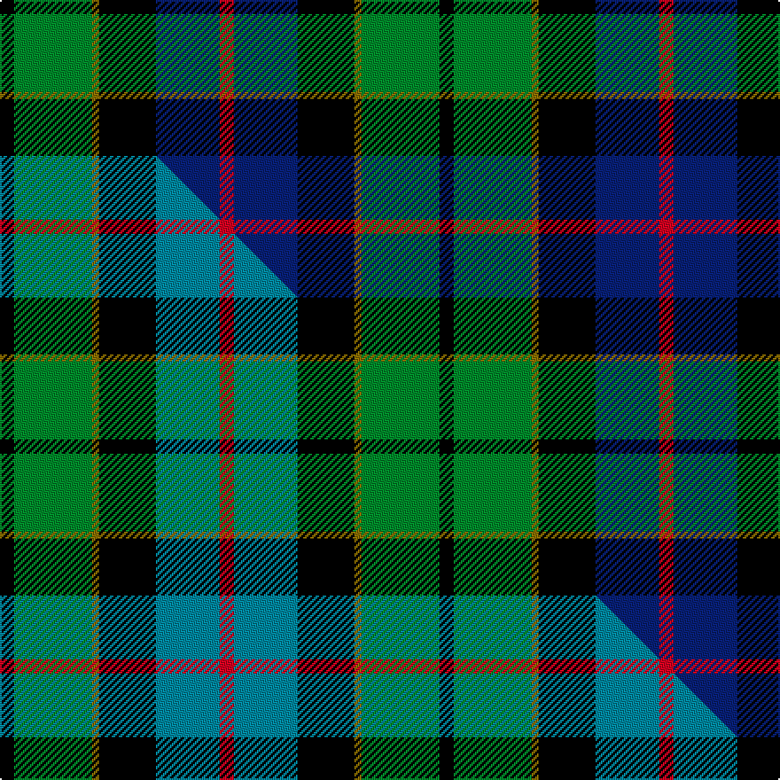

This page is one **sett** — a single exact thread-count. It belongs to the [tartan](/setts/k2g11y1k8db9r2/)
(the same proportion at any scale), whose colour order is pattern [KGGKBR](/stripes/kggkbr/).

Part of the [Forsyth](/tartans/forsyth/) tartan — the named design grouping this sett with its other cloths.

Sourced from weddslist.  It is a [6 stripe tartan](/stripes/stripes6/).

Original link http://www.weddslist.com/cgi-bin/tartans/pg.pl?source=sts

## Provenance

Earliest known date: 1872 (1830) This sett has a close resemblance to the the Leslie tartan in which white replaces yellow. A description of the tartan appears in Jennie Forsyth Jeffrie's 'History of the Forsyth Family' (1918). Clan Chief, Alistair Forsyth, was recognised by Lord Lyon in 1978 - the first for over 300 years.

2 attestations — the source records this cloth was collapsed from (oldest owns this page)

<ul>
<li>undated — Forsyth (weddslist, <a href="http://www.weddslist.com/cgi-bin/tartans/pg.pl?source=sts">record</a>) </li>
<li>undated — Forsyth Clan Tartan (house-of-tartan, <a href="http://www.house-of-tartan.scotland.net/house/TartanViewjs.asp?colr=Def&tnam=1122">record</a>) </li>
</ul>

## Thread count
K/8 G44 Y4 K32 DB36 R/8

One full sett is **248 threads**.

## Palette
<table><thead><tr><th>Colour</th><th>Shade</th><th>OKLCh</th></tr></thead><tbody><tr><td>DB</td><td><code style="background-color:#082077;">#082077</code> <small style="color:#888">#082077</small></td><td><small style="color:#888">oklch(30.0% 0.149 265.1)</small></td></tr><tr><td>G</td><td><code style="background-color:#008B2A;">#008B2A</code> <small style="color:#888">#008B2A</small></td><td><small style="color:#888">oklch(55.4% 0.170 145.9)</small></td></tr><tr><td>K</td><td><code style="background-color:#000000;">#000000</code> <small style="color:#888">#000000</small></td><td><small style="color:#888">oklch(0.0% 0.000 0.0)</small></td></tr><tr><td>R</td><td><code style="background-color:#D60020;">#D60020</code> <small style="color:#888">#D60020</small></td><td><small style="color:#888">oklch(55.2% 0.224 25.5)</small></td></tr><tr><td>Y</td><td><code style="background-color:#8B6E00;">#8B6E00</code> <small style="color:#888">#8B6E00</small></td><td><small style="color:#888">oklch(55.1% 0.113 90.4)</small></td></tr></tbody></table>

# Sample pattern

## Compared to the master

This cloth is one sett of its design; the master sett (the exemplar the design is anchored on) is below for comparison.

Its **ΔTartan distance** from the master is **0.84** — the same measure the nearest-tartans table ranks by (0 is identical; a re-scale of the same cloth is near 0, a recolour or a different proportion further).

<figure class="master-compare" style="margin:0">

this sett
master sett ★

<figcaption style="color:#888;font-size:smaller">One weave of this sett against the <a href="/setts/k2g11y1k8t9r2/">master sett ★</a>, split on the diagonal: a shared proportion runs seamlessly across it with only the shades shifting; a different proportion breaks on it.</figcaption>
</figure>

## Nearest variants

The nearest existing variants by ΔTartan distance, with this cloth at the top so the swatches line up against it.

ΔTartan

Threads

Variant

Sett

—

248

<a href="/variants/s6/k2g11y1k8db9r2~x4/">Forsyth</a>

<a href="/ttd/edit/#slug=k2g11y1k8t9r2~x4&amp;base=k2g11y1k8db9r2~x4" title="compare in the TTD">0.00</a>

248

<a href="/variants/s6/k2g11y1k8t9r2~x4/">Forsyth (1795)</a>

<a href="/ttd/edit/#slug=r2db8k8w1g8k1&amp;base=k2g11y1k8db9r2~x4" title="compare in the TTD">0.63</a>

53

<a href="/variants/s6/r2db8k8w1g8k1/">Leslie Hunting</a>

<a href="/ttd/edit/#slug=r2db8k8w1g8k1~x2&amp;base=k2g11y1k8db9r2~x4" title="compare in the TTD">0.63</a>

106

<a href="/variants/s6/r2db8k8w1g8k1~x2/">Leslie, hunting</a>

<a href="/ttd/edit/#slug=k1g8w1k8db8r1~x4~db1004274&amp;base=k2g11y1k8db9r2~x4" title="compare in the TTD">0.67</a>

208

<a href="/variants/s6/k1g8w1k8db8r1~x4~db1004274/">Syme</a>

<a href="/ttd/edit/#slug=k1g8w1k8db8r1~x4&amp;base=k2g11y1k8db9r2~x4" title="compare in the TTD">0.67</a>

208

<a href="/variants/s6/k1g8w1k8db8r1~x4/">Leslie Hunting</a>

<a href="/ttd/edit/#slug=r3k2g15k10db20y2~x2&amp;base=k2g11y1k8db9r2~x4" title="compare in the TTD">1.01</a>

198

<a href="/variants/s6/r3k2g15k10db20y2~x2/">MacLeod of Assynt</a>

<a href="/ttd/edit/#slug=k4w1g10k10db10r2~x4&amp;base=k2g11y1k8db9r2~x4" title="compare in the TTD">1.02</a>

272

<a href="/variants/s6/k4w1g10k10db10r2~x4/">Rose Hunting</a>

<a href="/ttd/edit/#slug=k4w1g10k10db10r2~x2&amp;base=k2g11y1k8db9r2~x4" title="compare in the TTD">1.02</a>

136

<a href="/variants/s6/k4w1g10k10db10r2~x2/">Rose Hunting</a>

<a href="/ttd/edit/#slug=k4w1g10k10db10r2&amp;base=k2g11y1k8db9r2~x4" title="compare in the TTD">1.02</a>

68

<a href="/variants/s6/k4w1g10k10db10r2/">Rose Hunting</a>

<a href="/ttd/edit/#slug=k2g17k16dr2db17lr2~x2&amp;base=k2g11y1k8db9r2~x4" title="compare in the TTD">1.19</a>

216

<a href="/variants/s6/k2g17k16dr2db17lr2~x2/">Mitchell (Clan)</a>

## Neighbour map

Every grey dot is one of 13620 variants placed by the first two principal components of the ΔTartan feature space (42% of its variance). Red is this tartan; blue dots are its nearest — click one to open its page.

<svg viewBox="0 0 640 380" role="img" style="max-width:100%;height:auto;border:1px solid #e0e0e0;border-radius:4px;display:block" xmlns="http://www.w3.org/2000/svg"><image href="/nn/cloud.v1.png" width="640" height="380"/><a href="/variants/s6/k2g11y1k8t9r2~x4/"><circle cx="113.7" cy="191.4" r="4" fill="#3465a4"><title>Forsyth (1795)</title></circle></a><a href="/variants/s6/r2db8k8w1g8k1/"><circle cx="95.6" cy="198.7" r="4" fill="#3465a4"><title>Leslie Hunting</title></circle></a><a href="/variants/s6/r2db8k8w1g8k1~x2/"><circle cx="95.6" cy="198.7" r="4" fill="#3465a4"><title>Leslie, hunting</title></circle></a><a href="/variants/s6/k1g8w1k8db8r1~x4~db1004274/"><circle cx="111.9" cy="193.4" r="4" fill="#3465a4"><title>Syme</title></circle></a><a href="/variants/s6/k1g8w1k8db8r1~x4/"><circle cx="109.3" cy="193.7" r="4" fill="#3465a4"><title>Leslie Hunting</title></circle></a><a href="/variants/s6/r3k2g15k10db20y2~x2/"><circle cx="146.8" cy="185.9" r="4" fill="#3465a4"><title>MacLeod of Assynt</title></circle></a><a href="/variants/s6/k4w1g10k10db10r2~x4/"><circle cx="120.7" cy="197.5" r="4" fill="#3465a4"><title>Rose Hunting</title></circle></a><a href="/variants/s6/k4w1g10k10db10r2~x2/"><circle cx="120.7" cy="197.5" r="4" fill="#3465a4"><title>Rose Hunting</title></circle></a><a href="/variants/s6/k4w1g10k10db10r2/"><circle cx="120.7" cy="197.5" r="4" fill="#3465a4"><title>Rose Hunting</title></circle></a><a href="/variants/s6/k2g17k16dr2db17lr2~x2/"><circle cx="117.6" cy="194.6" r="4" fill="#3465a4"><title>Mitchell (Clan)</title></circle></a><circle cx="118.8" cy="189.9" r="5" fill="#c00000"/><text x="320" y="376" text-anchor="middle" font-size="11" fill="#999">ground</text><text x="11" y="190" text-anchor="middle" font-size="11" fill="#999" transform="rotate(-90 11 190)">complexity</text></svg>

ID: /variants/s6/k2g11y1k8db9r2~x4/
