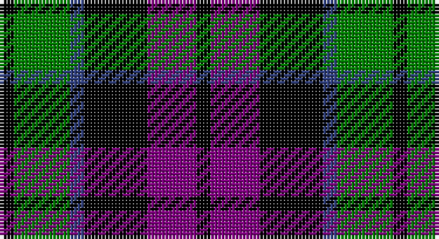

This page is one **sett** — a single exact thread-count. It belongs to the [tartan](/setts/k2g8db2k9p7k2/)
(the same proportion at any scale), whose colour order is pattern [KBKBGK](/stripes/kbkbgk/).

Part of the [Campbell, Sir Walter Scott](/tartans/campbell-sir-walter-scott/) tartan — the named design grouping this sett with its other cloths.

Sourced from weddslist.  It is a [6 stripe tartan](/stripes/stripes6/).

Original link http://www.weddslist.com/cgi-bin/tartans/pg.pl?source=sts

## Thread count
K/4 G16 B4 K18 P14 K/4

One full sett is **112 threads**.

## Palette

Palette: <strong>Ingles Buchan</strong> <small style="color:#888">(1 of 4 colours)</small>
<table><thead><tr><th>Colour</th><th>Threads</th><th>Shade</th><th>Base</th><th>OKLCh</th></tr></thead><tbody><tr><td>K/</td><td style="text-align:right;font-variant-numeric:tabular-nums">4</td><td><code style="background-color:#000000;">#000000</code> <small style="color:#888">#000000</small></td><td>K <code style="background-color:#000000;">#000000</code></td><td><small style="color:#888">oklch(0.0% 0.000 0.0)</small></td></tr><tr><td>G</td><td style="text-align:right;font-variant-numeric:tabular-nums">16</td><td><code style="background-color:#008000;">#008000</code> <small style="color:#888">#008000</small></td><td>G <code style="background-color:#006100;">#006100</code></td><td><small style="color:#888">oklch(52.0% 0.177 142.5)</small></td></tr><tr><td>B</td><td style="text-align:right;font-variant-numeric:tabular-nums">4</td><td><code style="background-color:#304080;">#304080</code> <small style="color:#888">#304080</small></td><td>B <code style="background-color:#2A418A;">#2A418A</code></td><td><small style="color:#888">oklch(39.4% 0.109 270.2)</small></td></tr><tr><td>K</td><td style="text-align:right;font-variant-numeric:tabular-nums">18</td><td><code style="background-color:#000000;">#000000</code> <small style="color:#888">#000000</small></td><td>K <code style="background-color:#000000;">#000000</code></td><td><small style="color:#888">oklch(0.0% 0.000 0.0)</small></td></tr><tr><td>P</td><td style="text-align:right;font-variant-numeric:tabular-nums">14</td><td><code style="background-color:#800080;">#800080</code> <small style="color:#888">#800080</small></td><td>B <code style="background-color:#2A418A;">#2A418A</code></td><td><small style="color:#888">oklch(42.1% 0.193 328.4)</small></td></tr><tr><td>K/</td><td style="text-align:right;font-variant-numeric:tabular-nums">4</td><td><code style="background-color:#000000;">#000000</code> <small style="color:#888">#000000</small></td><td>K <code style="background-color:#000000;">#000000</code></td><td><small style="color:#888">oklch(0.0% 0.000 0.0)</small></td></tr></tbody></table>

# Sample pattern

## Compared to the master

This cloth is one sett of its design; the master sett (the exemplar the design is anchored on) is below for comparison.

<figure style="margin:0"><figcaption style="color:#888;font-size:smaller">this sett</figcaption></figure>
<figure style="margin:0"><figcaption style="color:#888;font-size:smaller"><a href="/setts/k2dg8db2k9dp7k2/">master sett →</a></figcaption></figure>

## Nearest tartans

The nearest existing variants by ΔTartan distance, with this tartan at the top so the swatches line up against it.

ΔTartan

Tartan

Sett

—

<a href="/ttd/edit/#slug=k2g8db2k9p7k2~x2">Campbell, Sir Walter Scott</a> <a class="nn-out" href="/variants/s6/k2g8db2k9p7k2~x2/" title="open its dictionary page">↗</a>

0.43

<a href="/ttd/edit/#slug=k3g9t2k11p9k3~x2&amp;base=k2g8db2k9p7k2~x2">Scott, Sir Walter</a> <a class="nn-out" href="/variants/s6/k3g9t2k11p9k3~x2/" title="open its dictionary page">↗</a>

0.89

<a href="/ttd/edit/#slug=k2g10t2k9p8g2~x2&amp;base=k2g8db2k9p7k2~x2">Lennie</a> <a class="nn-out" href="/variants/s6/k2g10t2k9p8g2~x2/" title="open its dictionary page">↗</a>

1.02

<a href="/ttd/edit/#slug=db1k6db6k6g6k1w1~x2&amp;base=k2g8db2k9p7k2~x2">Forbes Ancient</a> <a class="nn-out" href="/variants/s7/db1k6db6k6g6k1w1~x2/" title="open its dictionary page">↗</a>

1.07

<a href="/ttd/edit/#slug=w2p10k10g9k3w2~x2&amp;base=k2g8db2k9p7k2~x2">MacNeil 2</a> <a class="nn-out" href="/variants/s6/w2p10k10g9k3w2~x2/" title="open its dictionary page">↗</a>

1.11

<a href="/ttd/edit/#slug=dt4g18dt3k17dt18dp4~x2&amp;base=k2g8db2k9p7k2~x2">Scottish Airports</a> <a class="nn-out" href="/variants/s6/dt4g18dt3k17dt18dp4~x2/" title="open its dictionary page">↗</a>

1.13

<a href="/ttd/edit/#slug=k5g20k18db20r5~x2&amp;base=k2g8db2k9p7k2~x2">Denholm (Fashion)</a> <a class="nn-out" href="/variants/s5/k5g20k18db20r5~x2/" title="open its dictionary page">↗</a>

1.15

<a href="/ttd/edit/#slug=k6g6w1g6k6p6k1~x4&amp;base=k2g8db2k9p7k2~x2">Wilson's, No 64 or Abercrombie</a> <a class="nn-out" href="/variants/s7/k6g6w1g6k6p6k1~x4/" title="open its dictionary page">↗</a>

1.16

<a href="/ttd/edit/#slug=k7g7k1g7k7t1p7k1~x4&amp;base=k2g8db2k9p7k2~x2">Wilson's, No 108</a> <a class="nn-out" href="/variants/s8/k7g7k1g7k7t1p7k1~x4/" title="open its dictionary page">↗</a>

1.19

<a href="/ttd/edit/#slug=k6g6ly1g6k6p6k1~x4&amp;base=k2g8db2k9p7k2~x2">Abercrombie, (Wilson's No 64)</a> <a class="nn-out" href="/variants/s7/k6g6ly1g6k6p6k1~x4/" title="open its dictionary page">↗</a>

1.19

<a href="/ttd/edit/#slug=k5lb2dg18k17dp16k3&amp;base=k2g8db2k9p7k2~x2">Melville</a> <a class="nn-out" href="/variants/s6/k5lb2dg18k17dp16k3/" title="open its dictionary page">↗</a>

## Neighbour map

Every grey dot is one of 14360 variants placed by the first two principal components of the ΔTartan feature space (44% of its variance). Red is this tartan; blue dots are its nearest — click one to open its page.

<svg viewBox="0 0 640 380" role="img" style="max-width:100%;height:auto;border:1px solid #e0e0e0;border-radius:4px;display:block" xmlns="http://www.w3.org/2000/svg"><image href="/nn/cloud.v1.png" width="640" height="380"/><a href="/variants/s6/k3g9t2k11p9k3~x2/"><circle cx="168.2" cy="252.6" r="4" fill="#3465a4"><title>Scott, Sir Walter</title></circle></a><a href="/variants/s6/k2g10t2k9p8g2~x2/"><circle cx="126.9" cy="245.7" r="4" fill="#3465a4"><title>Lennie</title></circle></a><a href="/variants/s7/db1k6db6k6g6k1w1~x2/"><circle cx="184.2" cy="242.3" r="4" fill="#3465a4"><title>Forbes Ancient</title></circle></a><a href="/variants/s6/w2p10k10g9k3w2~x2/"><circle cx="106.7" cy="239.6" r="4" fill="#3465a4"><title>MacNeil 2</title></circle></a><a href="/variants/s6/dt4g18dt3k17dt18dp4~x2/"><circle cx="162.3" cy="254.1" r="4" fill="#3465a4"><title>Scottish Airports</title></circle></a><a href="/variants/s5/k5g20k18db20r5~x2/"><circle cx="110.6" cy="286.2" r="4" fill="#3465a4"><title>Denholm (Fashion)</title></circle></a><a href="/variants/s7/k6g6w1g6k6p6k1~x4/"><circle cx="136.4" cy="251.7" r="4" fill="#3465a4"><title>Wilson's, No 64 or Abercrombie</title></circle></a><a href="/variants/s8/k7g7k1g7k7t1p7k1~x4/"><circle cx="163.6" cy="229.8" r="4" fill="#3465a4"><title>Wilson's, No 108</title></circle></a><a href="/variants/s7/k6g6ly1g6k6p6k1~x4/"><circle cx="137.4" cy="252.0" r="4" fill="#3465a4"><title>Abercrombie, (Wilson's No 64)</title></circle></a><a href="/variants/s6/k5lb2dg18k17dp16k3/"><circle cx="187.4" cy="232.9" r="4" fill="#3465a4"><title>Melville</title></circle></a><circle cx="152.0" cy="257.1" r="5" fill="#c00000"/></svg>

ID: /variants/s6/k2g8db2k9p7k2~x2/
