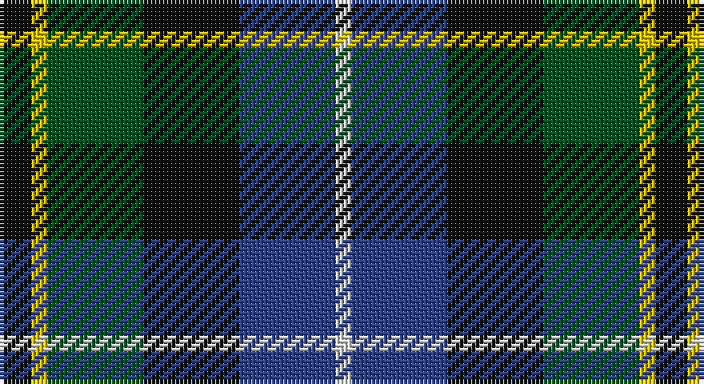

This page is one **sett** — a single exact thread-count. It belongs to the [tartan](/setts/k2ly1dg6k6db6w1/)
(the same proportion at any scale), whose colour order is pattern [KYGKBW](/stripes/kygkbw/).

Part of the [Dyce](/tartans/dyce/) tartan — the named design grouping this sett with its other cloths.

Sourced from register-of-tartans.  It is a [6 stripe tartan](/stripes/stripes6/).

Original link https://www.tartanregister.gov.uk/tartanDetails.aspx?ref=1059

## Also known as

This cloth is also recorded under:

- Dyce #2
- Dyce #3

## Register references

External register numbers recorded for this tartan.

- Scottish Register of Tartans: [1059](https://www.tartanregister.gov.uk/tartanDetails.aspx?ref=1059)
- Scottish Tartans World Register: 1266

## Thread count
K/8 Y4 G24 K24 B24 LN/4

One full sett is **164 threads**.

## Palette

Palette: <strong>Tartan Register</strong>
<table><thead><tr><th>Colour</th><th>Threads</th><th>Shade</th><th>Base</th><th>OKLCh</th></tr></thead><tbody><tr><td>K/</td><td style="text-align:right;font-variant-numeric:tabular-nums">8</td><td><code style="background-color:#101010;">#101010</code> <small style="color:#888">#101010</small></td><td>K <code style="background-color:#000000;">#000000</code></td><td><small style="color:#888">oklch(17.3% 0.000 89.9)</small></td></tr><tr><td>Y</td><td style="text-align:right;font-variant-numeric:tabular-nums">4</td><td><code style="background-color:#E8C000;">#E8C000</code> <small style="color:#888">#E8C000</small></td><td>Y <code style="background-color:#F2BF00;">#F2BF00</code></td><td><small style="color:#888">oklch(81.9% 0.168 93.7)</small></td></tr><tr><td>G</td><td style="text-align:right;font-variant-numeric:tabular-nums">24</td><td><code style="background-color:#005020;">#005020</code> <small style="color:#888">#005020</small></td><td>G <code style="background-color:#006100;">#006100</code></td><td><small style="color:#888">oklch(37.7% 0.105 149.6)</small></td></tr><tr><td>K</td><td style="text-align:right;font-variant-numeric:tabular-nums">24</td><td><code style="background-color:#101010;">#101010</code> <small style="color:#888">#101010</small></td><td>K <code style="background-color:#000000;">#000000</code></td><td><small style="color:#888">oklch(17.3% 0.000 89.9)</small></td></tr><tr><td>B</td><td style="text-align:right;font-variant-numeric:tabular-nums">24</td><td><code style="background-color:#2C4084;">#2C4084</code> <small style="color:#888">#2C4084</small></td><td>B <code style="background-color:#2A418A;">#2A418A</code></td><td><small style="color:#888">oklch(39.4% 0.117 268.3)</small></td></tr><tr><td>LN/</td><td style="text-align:right;font-variant-numeric:tabular-nums">4</td><td><code style="background-color:#E0E0E0;">#E0E0E0</code> <small style="color:#888">#E0E0E0</small></td><td>W <code style="background-color:#F7F7F7;">#F7F7F7</code></td><td><small style="color:#888">oklch(90.7% 0.000 89.9)</small></td></tr></tbody></table>

# Sample pattern

## Compared to the master

This cloth is one sett of its design; the master sett (the exemplar the design is anchored on) is below for comparison.

<figure style="margin:0"><figcaption style="color:#888;font-size:smaller">this sett</figcaption></figure>
<figure style="margin:0"><figcaption style="color:#888;font-size:smaller"><a href="/setts/b9k1b1k1b1k8g8ly1k1ly1g8k8b8w1/">master sett →</a></figcaption></figure>

## Nearest tartans

The nearest existing variants by ΔTartan distance, with this tartan at the top so the swatches line up against it.

ΔTartan

Tartan

Sett

—

<a href="/ttd/edit/#slug=k2ly1dg6k6db6w1~x4">Dyce #3</a> <a class="nn-out" href="/variants/s6/k2ly1dg6k6db6w1~x4/" title="open its dictionary page">↗</a>

0.60

<a href="/ttd/edit/#slug=db1r1db6k6dg6w1~x2&amp;base=k2ly1dg6k6db6w1~x4">Wellington</a> <a class="nn-out" href="/variants/s6/db1r1db6k6dg6w1~x2/" title="open its dictionary page">↗</a>

0.62

<a href="/ttd/edit/#slug=r1db6k3dg6w1~x4&amp;base=k2ly1dg6k6db6w1~x4">Davidson of Tulloch #2</a> <a class="nn-out" href="/variants/s5/r1db6k3dg6w1~x4/" title="open its dictionary page">↗</a>

0.66

<a href="/ttd/edit/#slug=r1db7k7g7w1~x6&amp;base=k2ly1dg6k6db6w1~x4">Davidson of Tulloch (Clan)</a> <a class="nn-out" href="/variants/s5/r1db7k7g7w1~x6/" title="open its dictionary page">↗</a>

0.73

<a href="/variants/s7/k7db11ki3db11dy11g22db3~x2/">Scottish Odyssey Commemorative Tartan</a>

0.73

<a href="/ttd/edit/#slug=t2g6ly1k6db6k1db1~x2&amp;base=k2ly1dg6k6db6w1~x4">Hogarth of Firhill</a> <a class="nn-out" href="/variants/s7/t2g6ly1k6db6k1db1~x2/" title="open its dictionary page">↗</a>

0.75

<a href="/ttd/edit/#slug=t4g14ly2k14db14k2db3~x2&amp;base=k2ly1dg6k6db6w1~x4">Hogarth of Firhill (Clan)</a> <a class="nn-out" href="/variants/s7/t4g14ly2k14db14k2db3~x2/" title="open its dictionary page">↗</a>

0.76

<a href="/ttd/edit/#slug=g16lb3g3k10db12r2db3~x2&amp;base=k2ly1dg6k6db6w1~x4">MacLean, Donald (Personal)</a> <a class="nn-out" href="/variants/s7/g16lb3g3k10db12r2db3~x2/" title="open its dictionary page">↗</a>

0.81

<a href="/ttd/edit/#slug=k1g8w1k8db8r1~x4&amp;base=k2ly1dg6k6db6w1~x4">Leslie Hunting</a> <a class="nn-out" href="/variants/s6/k1g8w1k8db8r1~x4/" title="open its dictionary page">↗</a>

0.82

<a href="/ttd/edit/#slug=r2k1db6k2g6m2~x4&amp;base=k2ly1dg6k6db6w1~x4">MacEachain (Clan)</a> <a class="nn-out" href="/variants/s6/r2k1db6k2g6m2~x4/" title="open its dictionary page">↗</a>

0.83

<a href="/ttd/edit/#slug=k4w1g10k10db10r2~x4&amp;base=k2ly1dg6k6db6w1~x4">Rose Hunting</a> <a class="nn-out" href="/variants/s6/k4w1g10k10db10r2~x4/" title="open its dictionary page">↗</a>

## Neighbour map

Every grey dot is one of 14360 variants placed by the first two principal components of the ΔTartan feature space (44% of its variance). Red is this tartan; blue dots are its nearest — click one to open its page.

<svg viewBox="0 0 640 380" role="img" style="max-width:100%;height:auto;border:1px solid #e0e0e0;border-radius:4px;display:block" xmlns="http://www.w3.org/2000/svg"><image href="/nn/cloud.v1.png" width="640" height="380"/><a href="/variants/s6/db1r1db6k6dg6w1~x2/"><circle cx="142.2" cy="237.6" r="4" fill="#3465a4"><title>Wellington</title></circle></a><a href="/variants/s5/r1db6k3dg6w1~x4/"><circle cx="146.7" cy="248.4" r="4" fill="#3465a4"><title>Davidson of Tulloch #2</title></circle></a><a href="/variants/s5/r1db7k7g7w1~x6/"><circle cx="126.6" cy="242.8" r="4" fill="#3465a4"><title>Davidson of Tulloch (Clan)</title></circle></a><a href="/variants/s7/k7db11ki3db11dy11g22db3~x2/"><circle cx="127.8" cy="225.1" r="4" fill="#3465a4"><title>Scottish Odyssey Commemorative Tartan</title></circle></a><a href="/variants/s7/t2g6ly1k6db6k1db1~x2/"><circle cx="116.2" cy="227.0" r="4" fill="#3465a4"><title>Hogarth of Firhill</title></circle></a><a href="/variants/s7/t4g14ly2k14db14k2db3~x2/"><circle cx="134.9" cy="222.1" r="4" fill="#3465a4"><title>Hogarth of Firhill (Clan)</title></circle></a><a href="/variants/s7/g16lb3g3k10db12r2db3~x2/"><circle cx="164.3" cy="216.4" r="4" fill="#3465a4"><title>MacLean, Donald (Personal)</title></circle></a><a href="/variants/s6/k1g8w1k8db8r1~x4/"><circle cx="160.6" cy="222.5" r="4" fill="#3465a4"><title>Leslie Hunting</title></circle></a><a href="/variants/s6/r2k1db6k2g6m2~x4/"><circle cx="118.6" cy="242.0" r="4" fill="#3465a4"><title>MacEachain (Clan)</title></circle></a><a href="/variants/s6/k4w1g10k10db10r2~x4/"><circle cx="166.4" cy="224.3" r="4" fill="#3465a4"><title>Rose Hunting</title></circle></a><circle cx="135.4" cy="240.4" r="5" fill="#c00000"/></svg>

ID: /variants/s6/k2ly1dg6k6db6w1~x4/
