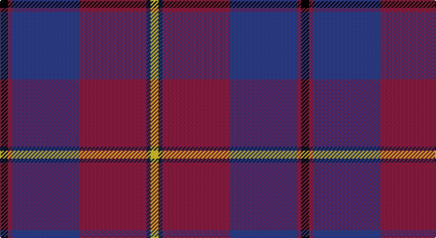

This page is one **sett** — a single exact thread-count. It belongs to the [tartan](/setts/k2m1db17m17dt1ly2/)
(the same proportion at any scale), whose colour order is pattern [KRBRBY](/stripes/krbrby/).

Part of the [Murdoch](/tartans/murdoch/) tartan — the named design grouping this sett with its other cloths.

Sourced from weddslist.  It is a [6 stripe tartan](/stripes/stripes6/).

Original link http://www.weddslist.com/cgi-bin/tartans/pg.pl?source=sts

## Thread count
K/8 DR4 B68 DR68 DB4 Y/8

One full sett is **304 threads**.

## Palette

Palette: <strong>Ingles Buchan</strong> <small style="color:#888">(1 of 5 colours)</small>
<table><thead><tr><th>Colour</th><th>Threads</th><th>Shade</th><th>Base</th><th>OKLCh</th></tr></thead><tbody><tr><td>K/</td><td style="text-align:right;font-variant-numeric:tabular-nums">8</td><td><code style="background-color:#000000;">#000000</code> <small style="color:#888">#000000</small></td><td>K <code style="background-color:#000000;">#000000</code></td><td><small style="color:#888">oklch(0.0% 0.000 0.0)</small></td></tr><tr><td>DR</td><td style="text-align:right;font-variant-numeric:tabular-nums">4</td><td><code style="background-color:#802040;">#802040</code> <small style="color:#888">#802040</small></td><td>R <code style="background-color:#CC0000;">#CC0000</code></td><td><small style="color:#888">oklch(40.8% 0.132 5.2)</small></td></tr><tr><td>B</td><td style="text-align:right;font-variant-numeric:tabular-nums">68</td><td><code style="background-color:#304080;">#304080</code> <small style="color:#888">#304080</small></td><td>B <code style="background-color:#2A418A;">#2A418A</code></td><td><small style="color:#888">oklch(39.4% 0.109 270.2)</small></td></tr><tr><td>DR</td><td style="text-align:right;font-variant-numeric:tabular-nums">68</td><td><code style="background-color:#802040;">#802040</code> <small style="color:#888">#802040</small></td><td>R <code style="background-color:#CC0000;">#CC0000</code></td><td><small style="color:#888">oklch(40.8% 0.132 5.2)</small></td></tr><tr><td>DB</td><td style="text-align:right;font-variant-numeric:tabular-nums">4</td><td><code style="background-color:#102040;">#102040</code> <small style="color:#888">#102040</small></td><td>B <code style="background-color:#2A418A;">#2A418A</code></td><td><small style="color:#888">oklch(24.9% 0.065 262.6)</small></td></tr><tr><td>Y/</td><td style="text-align:right;font-variant-numeric:tabular-nums">8</td><td><code style="background-color:#F0C000;">#F0C000</code> <small style="color:#888">#F0C000</small></td><td>Y <code style="background-color:#F2BF00;">#F2BF00</code></td><td><small style="color:#888">oklch(82.7% 0.169 90.5)</small></td></tr></tbody></table>

# Sample pattern

## Compared to the master

This cloth is one sett of its design; the master sett (the exemplar the design is anchored on) is below for comparison.

<figure style="margin:0"><figcaption style="color:#888;font-size:smaller">this sett</figcaption></figure>
<figure style="margin:0"><figcaption style="color:#888;font-size:smaller"><a href="/setts/k2dr1dt17dr17db1ly2/">master sett →</a></figcaption></figure>

## Nearest tartans

The nearest existing variants by ΔTartan distance, with this tartan at the top so the swatches line up against it.

ΔTartan

Tartan

Sett

—

<a href="/ttd/edit/#slug=k2m1db17m17dt1ly2~x4">Murdoch</a> <a class="nn-out" href="/variants/s6/k2m1db17m17dt1ly2~x4/" title="open its dictionary page">↗</a>

0.77

<a href="/ttd/edit/#slug=k2dr1dt17dr17db1ly2~x4&amp;base=k2m1db17m17dt1ly2~x4">Murdoch (Geoffrey)</a> <a class="nn-out" href="/variants/s6/k2dr1dt17dr17db1ly2~x4/" title="open its dictionary page">↗</a>

0.84

<a href="/ttd/edit/#slug=r30db5r3db33g8k3db8w2~x2&amp;base=k2m1db17m17dt1ly2~x4">St. Margaret Youth Group (Corporate)</a> <a class="nn-out" href="/variants/s8/r30db5r3db33g8k3db8w2~x2/" title="open its dictionary page">↗</a>

0.98

<a href="/ttd/edit/#slug=m5ly2m35g6m2g6db38w4~x2&amp;base=k2m1db17m17dt1ly2~x4">Scotland 2000</a> <a class="nn-out" href="/variants/s8/m5ly2m35g6m2g6db38w4~x2/" title="open its dictionary page">↗</a>

1.14

<a href="/ttd/edit/#slug=o9k16dg10k22dp67ly4&amp;base=k2m1db17m17dt1ly2~x4">Widows Sons Scotland (MRA)</a> <a class="nn-out" href="/variants/s6/o9k16dg10k22dp67ly4/" title="open its dictionary page">↗</a>

1.24

<a href="/ttd/edit/#slug=g2n1r29b29n1lo2~x2&amp;base=k2m1db17m17dt1ly2~x4">Reagan</a> <a class="nn-out" href="/variants/s6/g2n1r29b29n1lo2~x2/" title="open its dictionary page">↗</a>

1.32

<a href="/ttd/edit/#slug=dp22lo10dp6lr18dp50db71k6&amp;base=k2m1db17m17dt1ly2~x4">Charleston Police Department</a> <a class="nn-out" href="/variants/s7/dp22lo10dp6lr18dp50db71k6/" title="open its dictionary page">↗</a>

1.32

<a href="/ttd/edit/#slug=r16db2o6r3k4t2db40t6~x2&amp;base=k2m1db17m17dt1ly2~x4">St. Leonards (Corporate)</a> <a class="nn-out" href="/variants/s8/r16db2o6r3k4t2db40t6~x2/" title="open its dictionary page">↗</a>

1.37

<a href="/ttd/edit/#slug=dp3r3dp34g18lo2g18lb2r3~x2&amp;base=k2m1db17m17dt1ly2~x4">Singh</a> <a class="nn-out" href="/variants/s8/dp3r3dp34g18lo2g18lb2r3~x2/" title="open its dictionary page">↗</a>

1.38

<a href="/ttd/edit/#slug=ri28r1db18ly2g1db18~x2&amp;base=k2m1db17m17dt1ly2~x4">European Judo Union</a> <a class="nn-out" href="/variants/s6/ri28r1db18ly2g1db18~x2/" title="open its dictionary page">↗</a>

1.38

<a href="/ttd/edit/#slug=m4dp1m1dp12k6dt16w1~x2&amp;base=k2m1db17m17dt1ly2~x4">First (Corporate)</a> <a class="nn-out" href="/variants/s7/m4dp1m1dp12k6dt16w1~x2/" title="open its dictionary page">↗</a>

## Neighbour map

Every grey dot is one of 14360 variants placed by the first two principal components of the ΔTartan feature space (44% of its variance). Red is this tartan; blue dots are its nearest — click one to open its page.

<svg viewBox="0 0 640 380" role="img" style="max-width:100%;height:auto;border:1px solid #e0e0e0;border-radius:4px;display:block" xmlns="http://www.w3.org/2000/svg"><image href="/nn/cloud.v1.png" width="640" height="380"/><a href="/variants/s6/k2dr1dt17dr17db1ly2~x4/"><circle cx="327.5" cy="184.0" r="4" fill="#3465a4"><title>Murdoch (Geoffrey)</title></circle></a><a href="/variants/s8/r30db5r3db33g8k3db8w2~x2/"><circle cx="321.4" cy="171.0" r="4" fill="#3465a4"><title>St. Margaret Youth Group (Corporate)</title></circle></a><a href="/variants/s8/m5ly2m35g6m2g6db38w4~x2/"><circle cx="286.9" cy="148.9" r="4" fill="#3465a4"><title>Scotland 2000</title></circle></a><a href="/variants/s6/o9k16dg10k22dp67ly4/"><circle cx="308.9" cy="169.4" r="4" fill="#3465a4"><title>Widows Sons Scotland (MRA)</title></circle></a><a href="/variants/s6/g2n1r29b29n1lo2~x2/"><circle cx="361.9" cy="152.2" r="4" fill="#3465a4"><title>Reagan</title></circle></a><a href="/variants/s7/dp22lo10dp6lr18dp50db71k6/"><circle cx="262.0" cy="200.9" r="4" fill="#3465a4"><title>Charleston Police Department</title></circle></a><a href="/variants/s8/r16db2o6r3k4t2db40t6~x2/"><circle cx="318.2" cy="137.0" r="4" fill="#3465a4"><title>St. Leonards (Corporate)</title></circle></a><a href="/variants/s8/dp3r3dp34g18lo2g18lb2r3~x2/"><circle cx="287.8" cy="155.2" r="4" fill="#3465a4"><title>Singh</title></circle></a><a href="/variants/s6/ri28r1db18ly2g1db18~x2/"><circle cx="364.3" cy="160.9" r="4" fill="#3465a4"><title>European Judo Union</title></circle></a><a href="/variants/s7/m4dp1m1dp12k6dt16w1~x2/"><circle cx="252.3" cy="184.0" r="4" fill="#3465a4"><title>First (Corporate)</title></circle></a><circle cx="313.9" cy="172.4" r="5" fill="#c00000"/></svg>

ID: /variants/s6/k2m1db17m17dt1ly2~x4/
