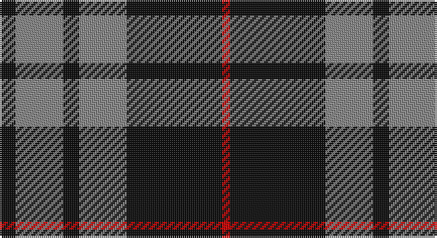

This page is one **sett** — a single exact thread-count. It belongs to the [tartan](/setts/k2o6k2o6k12r1/)
(the same proportion at any scale), whose colour order is pattern [KRKRKR](/stripes/krkrkr/).

Sourced from tartans-authority.  It is a [6 stripe tartan](/stripes/stripes6/).

Original link http://www.tartansauthority.com/tartan-ferret/display/7903/

## Also known as

This cloth is also recorded under:

- MacSween, Black

## Register references

External register numbers recorded for this tartan.

- Scottish Tartans Authority (ITI): 7903

## Thread count
K/8 N24 K8 N24 K48 R/4

One full sett is **220 threads**.

## Palette

Palette: <strong>Tartan Register</strong>
<table><thead><tr><th>Colour</th><th>Threads</th><th>Shade</th><th>Base</th><th>OKLCh</th></tr></thead><tbody><tr><td>K/</td><td style="text-align:right;font-variant-numeric:tabular-nums">8</td><td><code style="background-color:#101010;">#101010</code> <small style="color:#888">#101010</small></td><td>K <code style="background-color:#000000;">#000000</code></td><td><small style="color:#888">oklch(17.3% 0.000 89.9)</small></td></tr><tr><td>N</td><td style="text-align:right;font-variant-numeric:tabular-nums">24</td><td><code style="background-color:#888888;">#888888</code> <small style="color:#888">#888888</small></td><td>R <code style="background-color:#CC0000;">#CC0000</code></td><td><small style="color:#888">oklch(62.7% 0.000 89.9)</small></td></tr><tr><td>K</td><td style="text-align:right;font-variant-numeric:tabular-nums">8</td><td><code style="background-color:#101010;">#101010</code> <small style="color:#888">#101010</small></td><td>K <code style="background-color:#000000;">#000000</code></td><td><small style="color:#888">oklch(17.3% 0.000 89.9)</small></td></tr><tr><td>N</td><td style="text-align:right;font-variant-numeric:tabular-nums">24</td><td><code style="background-color:#888888;">#888888</code> <small style="color:#888">#888888</small></td><td>R <code style="background-color:#CC0000;">#CC0000</code></td><td><small style="color:#888">oklch(62.7% 0.000 89.9)</small></td></tr><tr><td>K</td><td style="text-align:right;font-variant-numeric:tabular-nums">48</td><td><code style="background-color:#101010;">#101010</code> <small style="color:#888">#101010</small></td><td>K <code style="background-color:#000000;">#000000</code></td><td><small style="color:#888">oklch(17.3% 0.000 89.9)</small></td></tr><tr><td>R/</td><td style="text-align:right;font-variant-numeric:tabular-nums">4</td><td><code style="background-color:#C80000;">#C80000</code> <small style="color:#888">#C80000</small></td><td>R <code style="background-color:#CC0000;">#CC0000</code></td><td><small style="color:#888">oklch(52.3% 0.215 29.2)</small></td></tr></tbody></table>

# Sample pattern

## Nearest tartans

The nearest existing variants by ΔTartan distance, with this tartan at the top so the swatches line up against it.

ΔTartan

Tartan

Sett

—

<a href="/ttd/edit/#slug=k2o6k2o6k12r1~x4">MacSween, Black (Personal)</a> <a class="nn-out" href="/variants/s6/k2o6k2o6k12r1~x4/" title="open its dictionary page">↗</a>

0.57

<a href="/ttd/edit/#slug=o58k22o8k17r5k14~x2&amp;base=k2o6k2o6k12r1~x4">Flynn</a> <a class="nn-out" href="/variants/s6/o58k22o8k17r5k14~x2/" title="open its dictionary page">↗</a>

0.94

<a href="/ttd/edit/#slug=k10o1k2o1k4o10ly1o2~x4&amp;base=k2o6k2o6k12r1~x4">West Point Military Academy (Mil.)</a> <a class="nn-out" href="/variants/s8/k10o1k2o1k4o10ly1o2~x4/" title="open its dictionary page">↗</a>

0.98

<a href="/ttd/edit/#slug=k39o3k3o3k14o28r3~x2&amp;base=k2o6k2o6k12r1~x4">Moffat (1984)</a> <a class="nn-out" href="/variants/s7/k39o3k3o3k14o28r3~x2/" title="open its dictionary page">↗</a>

1.03

<a href="/ttd/edit/#slug=y5r3y35k28y4k11y2~x2&amp;base=k2o6k2o6k12r1~x4">Korner-Macpherson (Personal)</a> <a class="nn-out" href="/variants/s7/y5r3y35k28y4k11y2~x2/" title="open its dictionary page">↗</a>

1.17

<a href="/ttd/edit/#slug=r1k10n2lb5k5r1~x4&amp;base=k2o6k2o6k12r1~x4">Callaway (Corporate)</a> <a class="nn-out" href="/variants/s6/r1k10n2lb5k5r1~x4/" title="open its dictionary page">↗</a>

1.18

<a href="/ttd/edit/#slug=k4ly2k13ly1y8y13ly2y4~x2&amp;base=k2o6k2o6k12r1~x4">Bannockbane Grey #3</a> <a class="nn-out" href="/variants/s8/k4ly2k13ly1y8y13ly2y4~x2/" title="open its dictionary page">↗</a>

1.20

<a href="/ttd/edit/#slug=k10t1k2t1k4t10g1t2~x4&amp;base=k2o6k2o6k12r1~x4">Martin's Own</a> <a class="nn-out" href="/variants/s8/k10t1k2t1k4t10g1t2~x4/" title="open its dictionary page">↗</a>

1.23

<a href="/ttd/edit/#slug=k13o1k1o1k4o10ly1o1~x6&amp;base=k2o6k2o6k12r1~x4">West Point</a> <a class="nn-out" href="/variants/s8/k13o1k1o1k4o10ly1o1~x6/" title="open its dictionary page">↗</a>

1.23

<a href="/ttd/edit/#slug=k10o1k2o1k4o10k1o2~x4&amp;base=k2o6k2o6k12r1~x4">Douglas, Grey (Vestiarium Scoticum)</a> <a class="nn-out" href="/variants/s8/k10o1k2o1k4o10k1o2~x4/" title="open its dictionary page">↗</a>

1.26

<a href="/ttd/edit/#slug=k11w1k1w1k4o8r1~x8&amp;base=k2o6k2o6k12r1~x4">Dunfermline Athletic (2008) (Corp)</a> <a class="nn-out" href="/variants/s7/k11w1k1w1k4o8r1~x8/" title="open its dictionary page">↗</a>

## Neighbour map

Every grey dot is one of 14360 variants placed by the first two principal components of the ΔTartan feature space (44% of its variance). Red is this tartan; blue dots are its nearest — click one to open its page.

<svg viewBox="0 0 640 380" role="img" style="max-width:100%;height:auto;border:1px solid #e0e0e0;border-radius:4px;display:block" xmlns="http://www.w3.org/2000/svg"><image href="/nn/cloud.v1.png" width="640" height="380"/><a href="/variants/s6/o58k22o8k17r5k14~x2/"><circle cx="320.6" cy="215.7" r="4" fill="#3465a4"><title>Flynn</title></circle></a><a href="/variants/s8/k10o1k2o1k4o10ly1o2~x4/"><circle cx="309.0" cy="203.1" r="4" fill="#3465a4"><title>West Point Military Academy (Mil.)</title></circle></a><a href="/variants/s7/k39o3k3o3k14o28r3~x2/"><circle cx="372.2" cy="198.8" r="4" fill="#3465a4"><title>Moffat (1984)</title></circle></a><a href="/variants/s7/y5r3y35k28y4k11y2~x2/"><circle cx="346.9" cy="188.6" r="4" fill="#3465a4"><title>Korner-Macpherson (Personal)</title></circle></a><a href="/variants/s6/r1k10n2lb5k5r1~x4/"><circle cx="308.7" cy="209.9" r="4" fill="#3465a4"><title>Callaway (Corporate)</title></circle></a><a href="/variants/s8/k4ly2k13ly1y8y13ly2y4~x2/"><circle cx="290.1" cy="200.8" r="4" fill="#3465a4"><title>Bannockbane Grey #3</title></circle></a><a href="/variants/s8/k10t1k2t1k4t10g1t2~x4/"><circle cx="309.6" cy="209.0" r="4" fill="#3465a4"><title>Martin's Own</title></circle></a><a href="/variants/s8/k13o1k1o1k4o10ly1o1~x6/"><circle cx="350.9" cy="183.3" r="4" fill="#3465a4"><title>West Point</title></circle></a><a href="/variants/s8/k10o1k2o1k4o10k1o2~x4/"><circle cx="352.9" cy="222.3" r="4" fill="#3465a4"><title>Douglas, Grey (Vestiarium Scoticum)</title></circle></a><a href="/variants/s7/k11w1k1w1k4o8r1~x8/"><circle cx="311.1" cy="183.5" r="4" fill="#3465a4"><title>Dunfermline Athletic (2008) (Corp)</title></circle></a><circle cx="327.4" cy="224.9" r="5" fill="#c00000"/></svg>

ID: /variants/s6/k2o6k2o6k12r1~x4/
